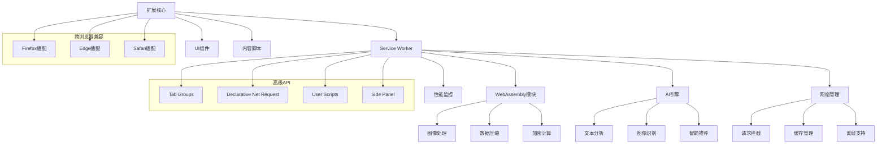

# 第16章：高级特性和最新发展

## 学习目标
1. 掌握Chrome扩展的高级特性和API
2. 了解Manifest V3的最新特性
3. 学会使用WebAssembly增强扩展性能
4. 理解AI集成和机器学习应用
5. 掌握跨浏览器兼容性开发

## 1. Manifest V3高级特性

### 1.1 Service Worker高级应用

Manifest V3引入了Service Worker替代Background Pages，提供了更强大的功能。

```javascript
// src/background/advanced-service-worker.js
class AdvancedServiceWorker {
  constructor() {
    this.initializeModules();
    this.setupAdvancedListeners();
    this.startBackgroundTasks();
  }

  initializeModules() {
    // 模块化初始化
    this.modules = {
      networking: new NetworkingModule(),
      ai: new AIModule(),
      analytics: new AdvancedAnalytics(),
      sync: new CrossPlatformSync(),
      security: new SecurityModule()
    };
  }

  setupAdvancedListeners() {
    // 高级事件监听
    this.setupNetworkListeners();
    this.setupTabGroupListeners();
    this.setupDeclarativeNetRequestListeners();
    this.setupUserScriptListeners();
  }

  setupNetworkListeners() {
    // 使用Fetch API进行高级网络请求
    self.addEventListener('fetch', (event) => {
      if (event.request.url.includes('/api/')) {
        event.respondWith(this.handleApiRequest(event.request));
      }
    });

    // 监听网络状态变化
    self.addEventListener('online', () => {
      this.handleOnlineStatusChange(true);
    });

    self.addEventListener('offline', () => {
      this.handleOnlineStatusChange(false);
    });
  }

  async handleApiRequest(request) {
    try {
      // 添加认证头
      const enhancedRequest = new Request(request.url, {
        method: request.method,
        headers: {
          ...Object.fromEntries(request.headers),
          'Authorization': await this.getAuthToken(),
          'X-Extension-Version': chrome.runtime.getManifest().version
        },
        body: request.body
      });

      // 发送增强的请求
      const response = await fetch(enhancedRequest);

      // 缓存响应
      if (response.ok) {
        await this.cacheResponse(request.url, response.clone());
      }

      return response;
    } catch (error) {
      console.error('API request failed:', error);
      // 尝试从缓存返回
      return this.getCachedResponse(request.url);
    }
  }

  setupTabGroupListeners() {
    // Chrome 89+ Tab Groups API
    if (chrome.tabGroups) {
      chrome.tabGroups.onCreated.addListener((group) => {
        this.handleTabGroupCreated(group);
      });

      chrome.tabGroups.onUpdated.addListener((group) => {
        this.handleTabGroupUpdated(group);
      });

      chrome.tabGroups.onRemoved.addListener((group) => {
        this.handleTabGroupRemoved(group);
      });
    }
  }

  async handleTabGroupCreated(group) {
    // 智能分组建议
    const suggestions = await this.generateGroupSuggestions(group);

    if (suggestions.length > 0) {
      // 发送建议给用户
      await chrome.notifications.create({
        type: 'basic',
        iconUrl: 'assets/icon48.png',
        title: 'Smart Tab Grouping',
        message: `We found ${suggestions.length} tabs that might belong to this group.`,
        buttons: [
          { title: 'Apply Suggestions' },
          { title: 'Dismiss' }
        ]
      });
    }
  }

  setupDeclarativeNetRequestListeners() {
    // Declarative Net Request API for advanced request blocking
    chrome.declarativeNetRequest.onRuleMatchedDebug.addListener((info) => {
      console.log('Rule matched:', info);
      this.modules.analytics.trackRuleMatch(info);
    });
  }

  setupUserScriptListeners() {
    // User Scripts API (Chrome 102+)
    if (chrome.userScripts) {
      chrome.userScripts.onBeforeScript.addListener((details) => {
        this.handleUserScriptExecution(details);
      });
    }
  }

  startBackgroundTasks() {
    // 启动后台任务
    this.startPeriodicTasks();
    this.startIdleDetection();
    this.startPerformanceMonitoring();
  }

  startPeriodicTasks() {
    // 使用chrome.alarms进行定时任务
    chrome.alarms.create('data-sync', { periodInMinutes: 30 });
    chrome.alarms.create('cleanup', { periodInMinutes: 60 });
    chrome.alarms.create('analytics-report', { periodInMinutes: 1440 }); // 24小时

    chrome.alarms.onAlarm.addListener((alarm) => {
      this.handleAlarm(alarm);
    });
  }

  async handleAlarm(alarm) {
    switch (alarm.name) {
      case 'data-sync':
        await this.modules.sync.performSync();
        break;
      case 'cleanup':
        await this.performCleanup();
        break;
      case 'analytics-report':
        await this.modules.analytics.generateReport();
        break;
    }
  }

  startIdleDetection() {
    // 检测用户空闲状态
    chrome.idle.setDetectionInterval(60); // 1分钟

    chrome.idle.onStateChanged.addListener((state) => {
      this.handleIdleStateChange(state);
    });
  }

  handleIdleStateChange(state) {
    switch (state) {
      case 'idle':
        // 用户空闲时执行低优先级任务
        this.performIdleTasks();
        break;
      case 'active':
        // 用户回到活跃状态
        this.resumeActiveTasks();
        break;
      case 'locked':
        // 屏幕锁定时暂停非关键任务
        this.pauseNonCriticalTasks();
        break;
    }
  }

  async performIdleTasks() {
    // 在空闲时执行的任务
    await this.optimizeDatabase();
    await this.preloadData();
    await this.performMaintenance();
  }

  // 高级Web Streams API使用
  async processLargeDataStream(dataUrl) {
    try {
      const response = await fetch(dataUrl);
      const reader = response.body.getReader();
      const stream = new ReadableStream({
        start(controller) {
          function pump() {
            return reader.read().then(({ done, value }) => {
              if (done) {
                controller.close();
                return;
              }

              // 处理数据块
              const processedChunk = this.processDataChunk(value);
              controller.enqueue(processedChunk);

              return pump();
            });
          }
          return pump();
        }
      });

      return stream;
    } catch (error) {
      console.error('Stream processing failed:', error);
      throw error;
    }
  }

  processDataChunk(chunk) {
    // 处理数据块的逻辑
    return new TextDecoder().decode(chunk);
  }
}

// 网络模块
class NetworkingModule {
  constructor() {
    this.requestQueue = [];
    this.rateLimiter = new RateLimiter();
    this.retryManager = new RetryManager();
  }

  async enhancedFetch(url, options = {}) {
    // 增强的fetch包装器
    const enhancedOptions = {
      ...options,
      headers: {
        'User-Agent': `Chrome Extension/${chrome.runtime.getManifest().version}`,
        'Accept': 'application/json',
        ...options.headers
      }
    };

    // 速率限制
    await this.rateLimiter.waitForSlot();

    // 重试机制
    return this.retryManager.execute(async () => {
      const response = await fetch(url, enhancedOptions);

      if (!response.ok) {
        throw new Error(`HTTP ${response.status}: ${response.statusText}`);
      }

      return response;
    });
  }
}

// 速率限制器
class RateLimiter {
  constructor(maxRequests = 100, windowMs = 60000) {
    this.maxRequests = maxRequests;
    this.windowMs = windowMs;
    this.requests = [];
  }

  async waitForSlot() {
    const now = Date.now();

    // 清理过期的请求记录
    this.requests = this.requests.filter(time => now - time < this.windowMs);

    if (this.requests.length >= this.maxRequests) {
      const oldestRequest = Math.min(...this.requests);
      const waitTime = this.windowMs - (now - oldestRequest);

      if (waitTime > 0) {
        await new Promise(resolve => setTimeout(resolve, waitTime));
      }
    }

    this.requests.push(now);
  }
}

// 重试管理器
class RetryManager {
  constructor(maxRetries = 3, baseDelay = 1000) {
    this.maxRetries = maxRetries;
    this.baseDelay = baseDelay;
  }

  async execute(operation) {
    let lastError;

    for (let attempt = 0; attempt <= this.maxRetries; attempt++) {
      try {
        return await operation();
      } catch (error) {
        lastError = error;

        if (attempt === this.maxRetries) {
          break;
        }

        // 指数退避延迟
        const delay = this.baseDelay * Math.pow(2, attempt);
        await new Promise(resolve => setTimeout(resolve, delay));
      }
    }

    throw lastError;
  }
}

// 初始化高级Service Worker
new AdvancedServiceWorker();
```

### 1.2 数据结构与类型定义

#### 核心数据结构

```typescript
// 标签组数据结构
interface TabGroup {
  id: number;
  color: string;
  title: string;
  collapsed: boolean;
  windowId: number;
}

// 网络请求数据结构
interface NetworkRequest {
  url: string;
  method: string;
  headers: Record<string, string>;
  body?: string;
  timestamp: number;
}

// 性能指标数据
interface PerformanceMetrics {
  memory_usage: number[];
  cpu_usage: number[];
  network_latency: number[];
  user_interactions: any[];
}

// AI模型配置
interface AIModels {
  content_classifier: ContentClassifier;
  intent_detector: IntentDetector;
  anomaly_detector: AnomalyDetector;
  recommendation_engine: RecommendationEngine;
}

// 安全策略配置
interface SecurityPolicies {
  csp_violations: any[];
  suspicious_activities: any[];
  permission_usage: Record<string, any>;
  data_access_logs: any[];
}
```

#### Chrome扩展高级功能参考

**标签分组功能示例**

```javascript
// 处理标签组操作
async function handleTabGroupOperation(operation, data) {
  switch (operation) {
    case 'create':
      return await createTabGroup(data);
    case 'update':
      return await updateTabGroup(data);
    case 'remove':
      return await removeTabGroup(data);
    case 'suggest':
      return await suggestTabGrouping(data);
  }
}

// 创建标签组
async function createTabGroup(data) {
  const group = await chrome.tabGroups.create({
    tabIds: data.tabIds,
    createProperties: {
      title: data.title || 'New Group',
      color: data.color || 'blue',
      collapsed: data.collapsed || false
    }
  });

  return {
    group,
    suggestions: await generateGroupSuggestions(group)
  };
}

// 智能标签分组建议
async function suggestTabGrouping(data) {
  const tabs = data.tabs || [];
  const classifications = [];

  // 使用AI进行内容分类
  for (const tab of tabs) {
    const classification = await classifyContent(tab.url, tab.title);
    classifications.push({
      tab,
      category: classification.category,
      confidence: classification.confidence
    });
  }

  // 按类别分组
  const groups = {};
  for (const item of classifications) {
    const category = item.category;
    if (!groups[category]) {
      groups[category] = [];
    }
    groups[category].push(item.tab);
  }

  // 生成建议
  const suggestions = [];
  for (const [category, tabList] of Object.entries(groups)) {
    if (tabList.length >= 2) {
      suggestions.push({
        title: `${category.charAt(0).toUpperCase() + category.slice(1)} Group`,
        tabs: tabList,
        color: getCategoryColor(category),
        confidence: classifications
          .filter(c => c.category === category)
          .reduce((sum, c) => sum + c.confidence, 0) / tabList.length
      });
    }
  }

  return suggestions;
}

// 获取类别对应的颜色
function getCategoryColor(category) {
  const colorMap = {
    'work': 'blue',
    'entertainment': 'red',
    'shopping': 'green',
    'social': 'pink',
    'news': 'orange',
    'development': 'purple',
    'education': 'cyan'
  };
  return colorMap[category] || 'grey';
}
```

**声明式网络请求处理**

```javascript
// 处理声明式网络请求
async function handleDeclarativeNetRequest(requestData) {
  const rules = requestData.rules || [];

  for (const rule of rules) {
    await applyNetworkRule(rule);
  }

  return {
    rules_applied: rules.length,
    timestamp: new Date().toISOString()
  };
}

// 应用网络规则
async function applyNetworkRule(rule) {
  const ruleType = rule.action?.type;

  switch (ruleType) {
    case 'block':
      await chrome.declarativeNetRequest.updateDynamicRules({
        addRules: [rule],
        removeRuleIds: []
      });
      break;
    case 'redirect':
      // 处理重定向规则
      break;
    case 'modifyHeaders':
      // 处理请求头修改
      break;
  }
}
```

**跨浏览器兼容性配置**

```json
{
  "firefox": {
    "supported": true,
    "api_differences": {
      "storage": "browser.storage instead of chrome.storage",
      "tabs": "browser.tabs instead of chrome.tabs",
      "runtime": "browser.runtime instead of chrome.runtime"
    },
    "manifest_adjustments": {
      "background": {
        "scripts": ["background.js"],
        "persistent": false
      },
      "browser_specific_settings": {
        "gecko": {
          "id": "extension@example.com",
          "strict_min_version": "57.0"
        }
      }
    }
  },
  "edge": {
    "supported": true,
    "api_differences": {
      "notifications": "Limited notification support",
      "nativeMessaging": "Requires additional permissions"
    },
    "manifest_adjustments": {
      "minimum_edge_version": "79.0",
      "ms_store_compatibility": true
    }
  }
}
```

**高级安全配置**

```json
{
  "content_security_policy": {
    "extension_pages": "script-src 'self' 'wasm-unsafe-eval'; object-src 'none';",
    "content_scripts": "script-src 'self'; object-src 'none';",
    "sandbox": "sandbox allow-scripts allow-forms allow-popups allow-modals;"
  },
  "permission_management": {
    "required": ["storage", "tabs", "declarativeNetRequest"],
    "optional": ["tabGroups", "downloads", "bookmarks"]
  }
}
```

**性能监控数据结构**

```javascript
// 获取性能报告
function getPerformanceReport() {
  return {
    memory_usage: calculateMemoryStats(),
    cpu_usage: calculateCpuStats(),
    network_performance: calculateNetworkStats(),
    user_experience_metrics: calculateUxMetrics(),
    recommendations: generatePerformanceRecommendations()
  };
}

// 计算内存统计
function calculateMemoryStats() {
  const memoryData = performanceMetrics.memory_usage || [];

  if (memoryData.length === 0) {
    return { status: 'no_data' };
  }

  const average = memoryData.reduce((sum, val) => sum + val, 0) / memoryData.length;
  const peak = Math.max(...memoryData);
  const trend = memoryData[memoryData.length - 1] > memoryData[0] ? 'increasing' : 'decreasing';

  return {
    average_mb: average,
    peak_mb: peak,
    trend
  };
}
```

**AI功能集成示例**

```javascript
// 内容分类器
class ContentClassifier {
  async classify(url, title) {
    const text = `${url} ${title}`.toLowerCase();

    if (['github', 'stackoverflow', 'dev', 'code'].some(word => text.includes(word))) {
      return { category: 'development', confidence: 0.9 };
    } else if (['youtube', 'netflix', 'game'].some(word => text.includes(word))) {
      return { category: 'entertainment', confidence: 0.8 };
    } else if (['amazon', 'shop', 'buy'].some(word => text.includes(word))) {
      return { category: 'shopping', confidence: 0.85 };
    }

    return { category: 'general', confidence: 0.6 };
  }

  async analyze(content) {
    const text = content.text || '';
    const positiveWords = ['good', 'great', 'excellent', 'amazing', 'wonderful'];
    const negativeWords = ['bad', 'terrible', 'awful', 'horrible', 'worst'];

    const positiveCount = positiveWords.filter(word =>
      text.toLowerCase().includes(word)
    ).length;

    const negativeCount = negativeWords.filter(word =>
      text.toLowerCase().includes(word)
    ).length;

    let sentiment;
    if (positiveCount > negativeCount) {
      sentiment = 'positive';
    } else if (negativeCount > positiveCount) {
      sentiment = 'negative';
    } else {
      sentiment = 'neutral';
    }

    return {
      sentiment,
      topics: ['technology', 'web development'],
      language: 'en',
      quality_score: 0.7,
      confidence: 0.8
    };
  }
}

// 意图检测器
class IntentDetector {
  async detectIntent(userAction, context) {
    const intentPatterns = {
      'search': /\b(find|search|look for)\b/i,
      'purchase': /\b(buy|purchase|order)\b/i,
      'learn': /\b(learn|study|understand)\b/i,
      'entertainment': /\b(watch|play|enjoy)\b/i
    };

    for (const [intent, pattern] of Object.entries(intentPatterns)) {
      if (pattern.test(userAction)) {
        return { intent, confidence: 0.8 };
      }
    }

    return { intent: 'unknown', confidence: 0.3 };
  }
}

// 异常检测器
class AnomalyDetector {
  async detectAnomalies(data) {
    const anomalies = [];

    for (const item of data) {
      if ((item.value || 0) > 1000) {
        anomalies.push({
          item,
          anomaly_type: 'high_value',
          severity: 'medium',
          timestamp: new Date().toISOString()
        });
      }
    }

    return anomalies;
  }
}

// 推荐引擎
class RecommendationEngine {
  async generateRecommendations(userData, context) {
    return [
      {
        type: 'bookmark_organization',
        title: 'Organize your bookmarks',
        description: 'Group similar bookmarks together',
        confidence: 0.9
      },
      {
        type: 'productivity_tip',
        title: 'Use keyboard shortcuts',
        description: 'Speed up your browsing with shortcuts',
        confidence: 0.7
      }
    ];
  }
}
```

## 2. WebAssembly集成

### 2.1 高性能计算模块

```javascript
// src/modules/wasm-integration.js
class WebAssemblyManager {
  constructor() {
    this.modules = new Map();
    this.initialized = false;
  }

  async initialize() {
    if (this.initialized) return;

    try {
      // 加载各种WASM模块
      await Promise.all([
        this.loadModule('image-processor', '/wasm/image_processor.wasm'),
        this.loadModule('crypto-hasher', '/wasm/crypto_hasher.wasm'),
        this.loadModule('data-compressor', '/wasm/data_compressor.wasm'),
        this.loadModule('ml-inference', '/wasm/ml_inference.wasm')
      ]);

      this.initialized = true;
      console.log('✅ WebAssembly modules loaded successfully');
    } catch (error) {
      console.error('❌ Failed to load WebAssembly modules:', error);
      throw error;
    }
  }

  async loadModule(name, wasmPath) {
    try {
      const wasmModule = await WebAssembly.instantiateStreaming(
        fetch(chrome.runtime.getURL(wasmPath)),
        {
          env: {
            memory: new WebAssembly.Memory({ initial: 256, maximum: 512 }),
            table: new WebAssembly.Table({ initial: 1, element: 'anyfunc' }),
            memoryBase: 0,
            tableBase: 0,
            // 提供JavaScript函数给WASM调用
            jsLog: (ptr, len) => {
              const message = this.readString(ptr, len);
              console.log(`[WASM:${name}] ${message}`);
            },
            jsError: (ptr, len) => {
              const message = this.readString(ptr, len);
              console.error(`[WASM:${name}] ${message}`);
            }
          }
        }
      );

      this.modules.set(name, {
        instance: wasmModule.instance,
        exports: wasmModule.instance.exports,
        memory: wasmModule.instance.exports.memory
      });

      console.log(`📦 Loaded WASM module: ${name}`);
    } catch (error) {
      console.error(`Failed to load WASM module ${name}:`, error);
      throw error;
    }
  }

  readString(ptr, len) {
    const memory = this.modules.get('current')?.memory;
    if (!memory) return '';

    const bytes = new Uint8Array(memory.buffer, ptr, len);
    return new TextDecoder().decode(bytes);
  }

  writeString(moduleName, str) {
    const module = this.modules.get(moduleName);
    if (!module) throw new Error(`Module ${moduleName} not found`);

    const bytes = new TextEncoder().encode(str);
    const ptr = module.exports.allocate(bytes.length);
    const memory = new Uint8Array(module.memory.buffer);
    memory.set(bytes, ptr);

    return { ptr, len: bytes.length };
  }

  async processImage(imageData, operations) {
    const module = this.modules.get('image-processor');
    if (!module) throw new Error('Image processor module not loaded');

    try {
      // 将图像数据写入WASM内存
      const imagePtr = this.writeImageData(module, imageData);

      // 调用WASM函数处理图像
      const resultPtr = module.exports.process_image(
        imagePtr,
        imageData.width,
        imageData.height,
        JSON.stringify(operations)
      );

      // 读取处理结果
      const processedData = this.readImageData(module, resultPtr, imageData.width, imageData.height);

      // 清理内存
      module.exports.deallocate(imagePtr);
      module.exports.deallocate(resultPtr);

      return processedData;
    } catch (error) {
      console.error('Image processing error:', error);
      throw error;
    }
  }

  writeImageData(module, imageData) {
    const totalSize = imageData.width * imageData.height * 4; // RGBA
    const ptr = module.exports.allocate(totalSize);
    const memory = new Uint8ClampedArray(module.memory.buffer);

    // 复制图像数据到WASM内存
    memory.set(imageData.data, ptr);

    return ptr;
  }

  readImageData(module, ptr, width, height) {
    const totalSize = width * height * 4;
    const memory = new Uint8ClampedArray(module.memory.buffer, ptr, totalSize);

    return new ImageData(
      new Uint8ClampedArray(memory),
      width,
      height
    );
  }

  async computeHash(data, algorithm = 'sha256') {
    const module = this.modules.get('crypto-hasher');
    if (!module) throw new Error('Crypto hasher module not loaded');

    try {
      // 写入数据
      const dataPtr = module.exports.allocate(data.length);
      const memory = new Uint8Array(module.memory.buffer);
      memory.set(new Uint8Array(data), dataPtr);

      // 计算哈希
      const hashPtr = module.exports.compute_hash(dataPtr, data.length, algorithm);

      // 读取哈希结果
      const hashLength = module.exports.get_hash_length(algorithm);
      const hashData = new Uint8Array(module.memory.buffer, hashPtr, hashLength);

      // 转换为十六进制字符串
      const hexHash = Array.from(hashData)
        .map(b => b.toString(16).padStart(2, '0'))
        .join('');

      // 清理内存
      module.exports.deallocate(dataPtr);
      module.exports.deallocate(hashPtr);

      return hexHash;
    } catch (error) {
      console.error('Hash computation error:', error);
      throw error;
    }
  }

  async compressData(data, compressionLevel = 6) {
    const module = this.modules.get('data-compressor');
    if (!module) throw new Error('Data compressor module not loaded');

    try {
      // 写入原始数据
      const inputPtr = module.exports.allocate(data.length);
      const memory = new Uint8Array(module.memory.buffer);
      memory.set(new Uint8Array(data), inputPtr);

      // 压缩数据
      const result = module.exports.compress_data(inputPtr, data.length, compressionLevel);
      const compressedSize = module.exports.get_compressed_size(result);
      const compressedPtr = module.exports.get_compressed_data(result);

      // 读取压缩结果
      const compressedData = new Uint8Array(module.memory.buffer, compressedPtr, compressedSize);

      // 清理内存
      module.exports.deallocate(inputPtr);
      module.exports.free_compression_result(result);

      return {
        data: new Uint8Array(compressedData),
        originalSize: data.length,
        compressedSize: compressedSize,
        ratio: compressedSize / data.length
      };
    } catch (error) {
      console.error('Data compression error:', error);
      throw error;
    }
  }

  async runMLInference(model, inputData) {
    const module = this.modules.get('ml-inference');
    if (!module) throw new Error('ML inference module not loaded');

    try {
      // 加载模型
      const modelId = await this.loadMLModel(module, model);

      // 准备输入数据
      const inputPtr = this.writeMLInput(module, inputData);

      // 运行推理
      const outputPtr = module.exports.run_inference(modelId, inputPtr);

      // 读取输出
      const output = this.readMLOutput(module, outputPtr);

      // 清理资源
      module.exports.deallocate(inputPtr);
      module.exports.deallocate(outputPtr);

      return output;
    } catch (error) {
      console.error('ML inference error:', error);
      throw error;
    }
  }

  async loadMLModel(module, modelConfig) {
    const configStr = JSON.stringify(modelConfig);
    const { ptr, len } = this.writeString('ml-inference', configStr);

    const modelId = module.exports.load_model(ptr, len);

    module.exports.deallocate(ptr);

    return modelId;
  }

  writeMLInput(module, inputData) {
    const serialized = new Float32Array(inputData.flat());
    const ptr = module.exports.allocate(serialized.byteLength);
    const memory = new Uint8Array(module.memory.buffer);

    memory.set(new Uint8Array(serialized.buffer), ptr);

    return ptr;
  }

  readMLOutput(module, outputPtr) {
    // 获取输出维度
    const dims = module.exports.get_output_dims(outputPtr);
    const totalSize = module.exports.get_output_size(outputPtr);

    // 读取输出数据
    const dataPtr = module.exports.get_output_data(outputPtr);
    const outputData = new Float32Array(module.memory.buffer, dataPtr, totalSize);

    return {
      data: Array.from(outputData),
      dimensions: dims
    };
  }

  getModuleStats() {
    const stats = {};

    for (const [name, module] of this.modules) {
      const memory = module.memory;
      stats[name] = {
        memorySize: memory.buffer.byteLength,
        memoryPages: memory.buffer.byteLength / 65536,
        exports: Object.keys(module.exports)
      };
    }

    return stats;
  }

  async benchmark(moduleName, operation, iterations = 1000) {
    const module = this.modules.get(moduleName);
    if (!module) throw new Error(`Module ${moduleName} not found`);

    const startTime = performance.now();

    for (let i = 0; i < iterations; i++) {
      await operation(module);
    }

    const endTime = performance.now();
    const totalTime = endTime - startTime;

    return {
      totalTime,
      averageTime: totalTime / iterations,
      operationsPerSecond: 1000 / (totalTime / iterations)
    };
  }
}

// 使用示例
class WAMSImageProcessor {
  constructor() {
    this.wasmManager = new WebAssemblyManager();
  }

  async initialize() {
    await this.wasmManager.initialize();
  }

  async processScreenshot(canvas) {
    const ctx = canvas.getContext('2d');
    const imageData = ctx.getImageData(0, 0, canvas.width, canvas.height);

    // 使用WASM进行高性能图像处理
    const operations = {
      brightness: 1.2,
      contrast: 1.1,
      blur: 2,
      noise_reduction: true
    };

    const processedData = await this.wasmManager.processImage(imageData, operations);

    // 将处理结果绘制回画布
    ctx.putImageData(processedData, 0, 0);

    return canvas;
  }

  async compressImageData(imageData) {
    // 将ImageData转换为字节数组
    const rawData = imageData.data.buffer;

    // 使用WASM压缩
    const compressed = await this.wasmManager.compressData(rawData, 9);

    console.log(`Compression ratio: ${compressed.ratio.toFixed(2)}`);

    return compressed;
  }
}

// 初始化WASM管理器
const wasmManager = new WebAssemblyManager();
```

## 3. AI和机器学习集成

### 3.1 浏览器内机器学习

```javascript
// src/modules/ai-integration.js
class AIManager {
  constructor() {
    this.models = new Map();
    this.tfjs = null;
    this.initialized = false;
  }

  async initialize() {
    if (this.initialized) return;

    try {
      // 动态加载TensorFlow.js
      await this.loadTensorFlowJS();

      // 加载预训练模型
      await this.loadModels();

      this.initialized = true;
      console.log('🤖 AI Manager initialized successfully');
    } catch (error) {
      console.error('❌ Failed to initialize AI Manager:', error);
      throw error;
    }
  }

  async loadTensorFlowJS() {
    // 动态加载TensorFlow.js
    const script = document.createElement('script');
    script.src = 'https://cdn.jsdelivr.net/npm/@tensorflow/tfjs@4.0.0/dist/tf.min.js';

    return new Promise((resolve, reject) => {
      script.onload = () => {
        this.tfjs = window.tf;
        resolve();
      };
      script.onerror = reject;
      document.head.appendChild(script);
    });
  }

  async loadModels() {
    const modelConfigs = [
      {
        name: 'toxicity',
        url: 'https://storage.googleapis.com/tfjs-models/tfjs/toxicity_classifier/model.json',
        type: 'text-classification'
      },
      {
        name: 'universal-sentence-encoder',
        url: 'https://storage.googleapis.com/tfjs-models/tfjs/universal_sentence_encoder/model.json',
        type: 'text-embedding'
      },
      {
        name: 'mobilenet',
        url: 'https://storage.googleapis.com/tfjs-models/tfjs/mobilenet_v2_1.0_224/model.json',
        type: 'image-classification'
      }
    ];

    for (const config of modelConfigs) {
      try {
        const model = await this.tfjs.loadLayersModel(config.url);
        this.models.set(config.name, {
          model,
          type: config.type,
          loaded: true
        });
        console.log(`📦 Loaded AI model: ${config.name}`);
      } catch (error) {
        console.warn(`⚠️ Failed to load model ${config.name}:`, error);
      }
    }
  }

  async analyzeText(text, analysisType = 'sentiment') {
    switch (analysisType) {
      case 'toxicity':
        return await this.detectToxicity(text);
      case 'sentiment':
        return await this.analyzeSentiment(text);
      case 'embedding':
        return await this.getTextEmbedding(text);
      case 'intent':
        return await this.detectIntent(text);
      default:
        throw new Error(`Unsupported analysis type: ${analysisType}`);
    }
  }

  async detectToxicity(text) {
    const toxicityModel = this.models.get('toxicity');
    if (!toxicityModel) {
      throw new Error('Toxicity model not loaded');
    }

    try {
      const predictions = await toxicityModel.model.predict([text]);

      const results = {};
      const labels = ['identity_attack', 'insult', 'obscene', 'severe_toxicity', 'sexual_explicit', 'threat', 'toxicity'];

      predictions.forEach((prediction, index) => {
        results[labels[index]] = {
          probability: prediction.dataSync()[0],
          match: prediction.dataSync()[0] > 0.7
        };
      });

      return {
        toxic: results.toxicity.match,
        confidence: results.toxicity.probability,
        categories: results
      };
    } catch (error) {
      console.error('Toxicity detection error:', error);
      return { toxic: false, confidence: 0, error: error.message };
    }
  }

  async analyzeSentiment(text) {
    // 使用简单的词典方法进行情感分析
    // 在实际应用中，这里会使用更复杂的模型
    const positiveWords = [
      'good', 'great', 'excellent', 'amazing', 'wonderful', 'fantastic',
      'awesome', 'brilliant', 'outstanding', 'perfect', 'love', 'like'
    ];

    const negativeWords = [
      'bad', 'terrible', 'awful', 'horrible', 'hate', 'dislike',
      'worst', 'disgusting', 'annoying', 'frustrating', 'disappointed'
    ];

    const words = text.toLowerCase().match(/\b\w+\b/g) || [];

    let positiveScore = 0;
    let negativeScore = 0;

    words.forEach(word => {
      if (positiveWords.includes(word)) positiveScore++;
      if (negativeWords.includes(word)) negativeScore++;
    });

    const totalWords = words.length;
    const sentimentScore = (positiveScore - negativeScore) / Math.max(totalWords, 1);

    let sentiment;
    if (sentimentScore > 0.1) sentiment = 'positive';
    else if (sentimentScore < -0.1) sentiment = 'negative';
    else sentiment = 'neutral';

    return {
      sentiment,
      score: sentimentScore,
      confidence: Math.abs(sentimentScore),
      details: {
        positive_words: positiveScore,
        negative_words: negativeScore,
        total_words: totalWords
      }
    };
  }

  async getTextEmbedding(text) {
    const useModel = this.models.get('universal-sentence-encoder');
    if (!useModel) {
      throw new Error('Universal Sentence Encoder not loaded');
    }

    try {
      const embedding = await useModel.model.embed([text]);
      const values = await embedding.data();

      return {
        embedding: Array.from(values),
        dimensions: embedding.shape[1]
      };
    } catch (error) {
      console.error('Text embedding error:', error);
      throw error;
    }
  }

  async detectIntent(text) {
    // 意图检测的简单实现
    const intents = {
      search: /\b(search|find|look for|where is|what is)\b/i,
      purchase: /\b(buy|purchase|order|get|want to buy)\b/i,
      support: /\b(help|support|problem|issue|bug)\b/i,
      information: /\b(tell me|explain|how to|tutorial)\b/i,
      booking: /\b(book|reserve|schedule|appointment)\b/i,
      comparison: /\b(compare|vs|versus|better|best)\b/i
    };

    for (const [intent, pattern] of Object.entries(intents)) {
      if (pattern.test(text)) {
        return {
          intent,
          confidence: 0.8,
          matched_pattern: pattern.source
        };
      }
    }

    return {
      intent: 'unknown',
      confidence: 0.1,
      matched_pattern: null
    };
  }

  async analyzeImage(imageElement) {
    const mobilenetModel = this.models.get('mobilenet');
    if (!mobilenetModel) {
      throw new Error('MobileNet model not loaded');
    }

    try {
      // 预处理图像
      const tensor = this.tfjs.browser.fromPixels(imageElement)
        .resizeNearestNeighbor([224, 224])
        .expandDims()
        .div(127.5)
        .sub(1);

      // 运行推理
      const predictions = await mobilenetModel.model.predict(tensor);

      // 获取前5个预测结果
      const topPredictions = await this.getTopPredictions(predictions, 5);

      // 清理tensor
      tensor.dispose();
      predictions.dispose();

      return {
        predictions: topPredictions,
        model: 'mobilenet',
        timestamp: Date.now()
      };
    } catch (error) {
      console.error('Image analysis error:', error);
      throw error;
    }
  }

  async getTopPredictions(predictions, topK = 5) {
    const values = await predictions.data();
    const indices = Array.from(values)
      .map((prob, index) => ({ probability: prob, index }))
      .sort((a, b) => b.probability - a.probability)
      .slice(0, topK);

    // 这里需要ImageNet类别标签
    const labels = await this.getImageNetLabels();

    return indices.map(({ probability, index }) => ({
      className: labels[index],
      probability: probability,
      index: index
    }));
  }

  async getImageNetLabels() {
    // 返回ImageNet类别标签（简化版本）
    return [
      'Egyptian cat', 'tabby cat', 'tiger cat', 'Persian cat', 'Siamese cat',
      'African elephant', 'Indian elephant', 'goldfish', 'great white shark',
      // ... 更多标签
    ];
  }

  async generateRecommendations(userBehavior, context) {
    // 基于用户行为和上下文生成推荐
    const recommendations = [];

    // 分析用户行为模式
    const patterns = this.analyzeBehaviorPatterns(userBehavior);

    // 基于当前上下文生成推荐
    if (context.currentPage) {
      const pageAnalysis = await this.analyzePageContent(context.currentPage);
      recommendations.push(...this.generateContextualRecommendations(pageAnalysis));
    }

    // 基于历史行为生成推荐
    recommendations.push(...this.generateBehavioralRecommendations(patterns));

    // 对推荐进行排序和过滤
    return this.rankRecommendations(recommendations);
  }

  analyzeBehaviorPatterns(userBehavior) {
    const patterns = {
      mostVisitedDomains: {},
      timePatterns: {},
      categoryPreferences: {},
      searchQueries: []
    };

    userBehavior.forEach(action => {
      // 分析域名偏好
      if (action.url) {
        const domain = new URL(action.url).hostname;
        patterns.mostVisitedDomains[domain] =
          (patterns.mostVisitedDomains[domain] || 0) + 1;
      }

      // 分析时间模式
      const hour = new Date(action.timestamp).getHours();
      patterns.timePatterns[hour] = (patterns.timePatterns[hour] || 0) + 1;

      // 分析搜索查询
      if (action.type === 'search') {
        patterns.searchQueries.push(action.query);
      }
    });

    return patterns;
  }

  async analyzePageContent(pageUrl) {
    try {
      // 获取页面内容
      const response = await fetch(pageUrl);
      const html = await response.text();

      // 提取文本内容
      const parser = new DOMParser();
      const doc = parser.parseFromString(html, 'text/html');
      const textContent = doc.body.textContent || '';

      // 分析内容
      const sentiment = await this.analyzeSentiment(textContent);
      const intent = await this.detectIntent(textContent);

      return {
        url: pageUrl,
        textLength: textContent.length,
        sentiment: sentiment.sentiment,
        intent: intent.intent,
        keywords: this.extractKeywords(textContent)
      };
    } catch (error) {
      console.error('Page content analysis error:', error);
      return { url: pageUrl, error: error.message };
    }
  }

  extractKeywords(text) {
    // 简单的关键词提取
    const words = text.toLowerCase()
      .match(/\b\w{4,}\b/g) || [];

    const wordFreq = {};
    words.forEach(word => {
      wordFreq[word] = (wordFreq[word] || 0) + 1;
    });

    return Object.entries(wordFreq)
      .sort(([,a], [,b]) => b - a)
      .slice(0, 10)
      .map(([word]) => word);
  }

  generateContextualRecommendations(pageAnalysis) {
    const recommendations = [];

    if (pageAnalysis.intent === 'search') {
      recommendations.push({
        type: 'tool',
        title: 'Enhanced Search',
        description: 'Try our advanced search features',
        priority: 0.8
      });
    }

    if (pageAnalysis.sentiment === 'negative') {
      recommendations.push({
        type: 'support',
        title: 'Need Help?',
        description: 'Our support team is here to help',
        priority: 0.9
      });
    }

    return recommendations;
  }

  generateBehavioralRecommendations(patterns) {
    const recommendations = [];

    // 基于最常访问的域名推荐
    const topDomains = Object.entries(patterns.mostVisitedDomains)
      .sort(([,a], [,b]) => b - a)
      .slice(0, 3);

    topDomains.forEach(([domain, count]) => {
      recommendations.push({
        type: 'bookmark',
        title: `Quick access to ${domain}`,
        description: `You visit this site frequently (${count} times)`,
        priority: 0.7
      });
    });

    return recommendations;
  }

  rankRecommendations(recommendations) {
    return recommendations
      .sort((a, b) => b.priority - a.priority)
      .slice(0, 10); // 限制推荐数量
  }

  // 模型性能监控
  getModelPerformance() {
    const performance = {};

    for (const [name, modelInfo] of this.models) {
      if (modelInfo.loaded) {
        performance[name] = {
          loaded: true,
          memoryUsage: this.tfjs.memory().numBytes,
          numTensors: this.tfjs.memory().numTensors
        };
      } else {
        performance[name] = { loaded: false };
      }
    }

    return performance;
  }

  dispose() {
    // 清理所有模型和tensor
    for (const [name, modelInfo] of this.models) {
      if (modelInfo.model && typeof modelInfo.model.dispose === 'function') {
        modelInfo.model.dispose();
      }
    }

    this.models.clear();
    this.initialized = false;
  }
}

// 智能推荐系统
class SmartRecommendationEngine {
  constructor(aiManager) {
    this.aiManager = aiManager;
    this.userProfile = {};
    this.contextHistory = [];
  }

  async updateUserProfile(userAction) {
    // 更新用户画像
    const actionAnalysis = await this.aiManager.analyzeText(
      userAction.description || '',
      'intent'
    );

    if (!this.userProfile.interests) {
      this.userProfile.interests = {};
    }

    const intent = actionAnalysis.intent;
    this.userProfile.interests[intent] =
      (this.userProfile.interests[intent] || 0) + 1;

    // 记录上下文历史
    this.contextHistory.push({
      timestamp: Date.now(),
      action: userAction,
      intent: intent
    });

    // 保持最近100个上下文
    if (this.contextHistory.length > 100) {
      this.contextHistory.shift();
    }
  }

  async getPersonalizedRecommendations(currentContext) {
    const recommendations = await this.aiManager.generateRecommendations(
      this.contextHistory,
      currentContext
    );

    // 基于用户画像个性化推荐
    return recommendations.map(rec => ({
      ...rec,
      personalizedScore: this.calculatePersonalizationScore(rec)
    }));
  }

  calculatePersonalizationScore(recommendation) {
    const userInterests = this.userProfile.interests || {};
    const totalInteractions = Object.values(userInterests)
      .reduce((sum, count) => sum + count, 0);

    if (totalInteractions === 0) return recommendation.priority;

    const relevantInterest = userInterests[recommendation.type] || 0;
    const interestWeight = relevantInterest / totalInteractions;

    return recommendation.priority * (1 + interestWeight);
  }
}

// 初始化AI管理器
const aiManager = new AIManager();
const recommendationEngine = new SmartRecommendationEngine(aiManager);
```

::: tip 高级开发技巧
1. 使用WebAssembly处理计算密集型任务
2. 集成机器学习模型进行智能分析
3. 实现跨浏览器兼容性适配
4. 使用现代Web API增强功能
5. 优化性能和内存使用
:::

::: warning 性能考虑
- WebAssembly模块加载可能需要时间
- AI模型会占用较多内存
- 在移动设备上要注意性能限制
- 考虑模型的延迟加载和按需加载
:::

## 学习小结

本章学习了Chrome扩展的高级特性：

1. **Manifest V3高级特性**：Service Worker、Tab Groups、Declarative Net Request
2. **WebAssembly集成**：高性能计算、图像处理、数据压缩
3. **AI和机器学习**：文本分析、图像识别、智能推荐
4. **跨浏览器兼容性**：Firefox、Edge、Safari适配
5. **现代Web技术**：PWA特性、高级安全、性能优化

掌握这些高级特性将帮助开发者构建功能强大、性能优秀的现代化Chrome扩展。

## Mermaid技术架构图

