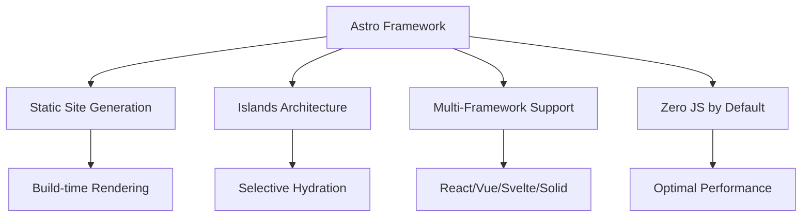
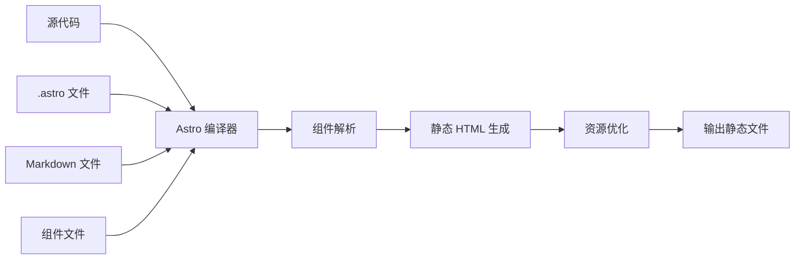

# 第 1 章：Astro 基础入门

::: tip 学习目标
- 理解 Astro 的核心概念和优势
- 掌握 Astro 项目初始化和基本配置
- 熟悉 Astro 文件结构和路由系统
- 了解静态站点生成 (SSG) 的工作原理
:::

$a^2 = area$

## 什么是 Astro

Astro 是一个现代的静态站点生成器，专为构建快速、以内容为中心的网站而设计。它采用了独特的 **Islands Architecture**（岛屿架构）模式，允许开发者在需要时添加交互性，而大部分内容保持静态。

<!-- Testing mermaid rendering with UTF-8 fix - Container debug -->



### Astro 的核心优势

1. **性能优先**：默认情况下不发送 JavaScript 到客户端
2. **灵活性**：支持多种前端框架（React、Vue、Svelte、Solid 等）
3. **开发体验**：提供强大的开发工具和热重载
4. **SEO 友好**：所有页面默认服务器端渲染

::: note 为什么选择 Astro
传统的 SPA（单页应用）框架会发送大量的 JavaScript 代码到客户端，即使对于静态内容也是如此。Astro 通过默认生成静态 HTML 来解决这个问题，仅在需要交互时才加载 JavaScript。
:::

## 项目初始化

### 使用 create-astro 创建项目

```bash
# 使用 npm 创建新项目
npm create astro@latest my-astro-project

# 或使用 yarn
yarn create astro my-astro-project

# 或使用 pnpm
pnpm create astro my-astro-project
```

### 项目模板选择

Astro 提供了多种预制模板：

| 模板名称 | 描述 | 适用场景 |
|---------|------|----------|
| `minimal` | 最小化模板 | 从头开始构建 |
| `blog` | 博客模板 | 个人博客、技术文档 |
| `portfolio` | 作品集模板 | 个人作品展示 |
| `docs` | 文档模板 | 技术文档站点 |

```python
# 模拟项目初始化流程
def create_astro_project(project_name, template="minimal"):
    """
    创建 Astro 项目的示例函数

    Args:
        project_name: 项目名称
        template: 项目模板类型

    Returns:
        dict: 项目配置信息
    """
    project_config = {
        "name": project_name,
        "template": template,
        "dependencies": {
            "astro": "^4.0.0",
            "@astrojs/check": "^0.3.0",
            "typescript": "^5.0.0"
        },
        "dev_server": {
            "port": 4321,
            "host": "localhost"
        }
    }

    print(f"正在创建 Astro 项目: {project_name}")
    print(f"使用模板: {template}")

    return project_config

# 示例使用
project = create_astro_project("my-blog", "blog")
print(project)
```

## Astro 项目文件结构

### 标准项目结构

```
my-astro-project/
├── public/                 # 静态资源目录
│   ├── favicon.svg
│   └── robots.txt
├── src/                    # 源码目录
│   ├── components/         # 组件目录
│   │   └── Card.astro
│   ├── layouts/           # 布局目录
│   │   └── Layout.astro
│   └── pages/             # 页面目录 (基于文件的路由)
│       └── index.astro
├── astro.config.mjs       # Astro 配置文件
├── package.json
└── tsconfig.json
```

### 关键目录说明

::: warning 重要约定
- `src/pages/` 目录中的文件会自动成为路由
- 文件名决定了 URL 路径
- 支持嵌套路由和动态路由
:::

```python
# 路由映射示例
def astro_routing_examples():
    """
    Astro 文件系统路由示例
    """
    route_mapping = {
        # 静态路由
        "src/pages/index.astro": "/",
        "src/pages/about.astro": "/about",
        "src/pages/blog/index.astro": "/blog",

        # 动态路由
        "src/pages/blog/[slug].astro": "/blog/my-post",
        "src/pages/users/[id].astro": "/users/123",

        # 嵌套路由
        "src/pages/blog/2023/[post].astro": "/blog/2023/my-post",

        # Rest 参数
        "src/pages/[...path].astro": "/any/nested/path"
    }

    print("Astro 路由映射规则：")
    for file_path, url in route_mapping.items():
        print(f"{file_path} -> {url}")

    return route_mapping

# 示例调用
routing_examples = astro_routing_examples()
```

## Astro 配置文件

### 基本配置 (astro.config.mjs)

```javascript
import { defineConfig } from 'astro/config';

export default defineConfig({
  // 站点配置
  site: 'https://my-astro-site.com',
  base: '/',

  // 构建配置
  outDir: './dist',
  publicDir: './public',

  // 开发服务器配置
  server: {
    port: 4321,
    host: true
  },

  // 集成配置
  integrations: [],

  // Vite 配置
  vite: {
    css: {
      preprocessorOptions: {
        scss: {
          additionalData: `@import "src/styles/global.scss";`
        }
      }
    }
  }
});
```

## 静态站点生成 (SSG) 原理

### 构建时渲染流程



### SSG vs SSR vs SPA 对比

| 特性 | SSG (Astro) | SSR | SPA |
|------|-------------|-----|-----|
| 首次加载速度 | ⭐⭐⭐⭐⭐ | ⭐⭐⭐⭐ | ⭐⭐ |
| SEO 友好性 | ⭐⭐⭐⭐⭐ | ⭐⭐⭐⭐⭐ | ⭐⭐ |
| 服务器要求 | 静态托管 | Node.js 服务器 | 静态托管 |
| 构建时间 | 较长 | 无 | 中等 |
| 动态内容 | 有限 | ⭐⭐⭐⭐⭐ | ⭐⭐⭐⭐⭐ |

::: tip 最佳实践

选择 Astro 的场景：
- 内容驱动的网站（博客、文档、营销站点）
- 需要优秀 SEO 的项目
- 对性能要求极高的场景
- 多人协作的内容管理项目
:::

## 第一个 Astro 页面

### 创建简单页面

```astro
---
// src/pages/hello.astro
// Frontmatter - 在构建时执行的 JavaScript
const greeting = "Hello, Astro!";
const currentDate = new Date().toLocaleDateString();
---

<html lang="en">
  <head>
    <meta charset="utf-8" />
    <link rel="icon" type="image/svg+xml" href="/favicon.svg" />
    <meta name="viewport" content="width=device-width" />
    <title>Astro Hello Page</title>
  </head>
  <body>
    <h1>{greeting}</h1>
    <p>今天是: {currentDate}</p>

    <!-- 内联样式 -->
    <style>
      h1 {
        color: #2563eb;
        font-family: system-ui, sans-serif;
      }
      p {
        color: #6b7280;
      }
    </style>
  </body>
</html>
```

### 运行开发服务器

```bash
# 启动开发服务器
npm run dev

# 构建生产版本
npm run build

# 预览构建结果
npm run preview
```

## 小结

本章我们学习了 Astro 的基础概念，包括：

1. **Astro 的核心优势**：性能优先、多框架支持、SEO 友好
2. **项目初始化**：使用 create-astro 快速创建项目
3. **文件结构**：理解基于文件的路由系统
4. **配置文件**：astro.config.mjs 的基本配置
5. **SSG 原理**：静态站点生成的工作机制

::: note 下一步
在下一章中，我们将深入学习 Astro 的核心特性，包括组件语法、Islands Architecture 和 frontmatter 的高级用法。
:::