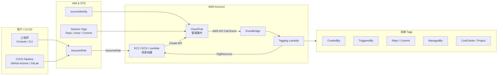

## 方案概览



::: tip 一句话总结
所有资源创建都会被 CloudTrail 记录，系统自动识别"人 / CI"，再由 Lambda 自动补齐标准化 Tag，实现全账户可追溯。
:::

## 背景与问题

### 现状问题

当前 AWS 使用中存在以下管理风险：

| 问题 | 具体表现 |
|------|----------|
| ❌ 资源创建者不可追溯 | 多人共用 IAM Role，无法确认是谁创建了 EC2 / ECS / Lambda |
| ❌ CI/CD 与人工混在一起 | 成本和责任边界模糊 |
| ❌ Tag 不统一或缺失 | 成本分摊困难，审计与安全排查效率低 |

### 业务风险

- **FinOps 风险**：成本无法准确归属
- **运维风险**：出问题时无法快速定位责任人
- **管理风险**：不符合云治理与合规要求

## 目标

任何 AWS 资源，都可以回答以下问题：

1. **谁创建的？**
2. **是人还是 CI/CD？**
3. **由哪个项目 / 仓库触发？**
4. **属于哪个团队 / 成本中心？**

## 方案设计

### 核心思路

利用 AWS 原生审计能力，实现**无侵入、自动化、全覆盖**的资源标记：

```
CloudTrail 记录 → EventBridge 触发 → Lambda 自动打 Tag
```

::: warning 为什么不用"人工要求打 Tag"？

- 人会忘
- CI 很难统一
- 审计无法保证一致性
:::

### 人工 vs CI/CD 的清晰区分

| 场景 | CreatedBy | TriggeredBy |
|------|-----------|-------------|
| 人工 Console / CLI | 具体用户名 | 同 CreatedBy |
| CI/CD Pipeline | github-actions / gitlab-ci | 提交代码的人 |

👉 **责任清晰，成本不背锅**

### 标准化 Tag 体系

```yaml
CreatedBy:    github-actions / jet.wang
TriggeredBy:  jet.wang
ManagedBy:    terraform
Repo:         org/project
Environment:  prod
CostCenter:   research-ai
CreatedAt:    2026-01-08T12:30Z
```

### 覆盖范围

| 资源类型 | 覆盖情况 |
|----------|----------|
| EC2 / EBS / AMI | ✅ |
| ECS / Fargate | ✅ |
| Lambda | ✅ |
| RDS / DynamoDB | ✅ |
| VPC / SG / ELB | ✅ |

> 覆盖 **95% 以上**核心成本与风险资源

## 技术实现

### 自动化链路

:::tabs
@tab IAM AssumeRole
- 强制 `sourceIdentity`
- CI/CD 传 session tags

@tab CloudTrail
- 记录所有资源创建 API

@tab EventBridge
- 实时触发规则

@tab Lambda
- 解析创建者
- 自动补 Tag
:::

## 管理价值

### 💰 成本治理（FinOps）

- 成本可按**团队 / 项目 / CI Pipeline** 精确拆分
- 不再靠人工猜测

### 🔍 审计与安全

- 每个资源都有"责任链"
- 安全事件可快速定位来源

### 🧩 规模化治理

- 不依赖个人习惯
- 新账号、新团队自动生效

## 风险与边界

### 已知边界

| 类型 | 说明 |
|------|------|
| AWS 内部系统资源 | 如临时 ENI 等自动创建的资源 |
| 对象级操作 | S3 PUT / Lambda invoke 等 |

👉 **不影响成本与责任归属，可接受**

## 实施建议

### 实施成本

- 1 个 Lambda
- 1 个 EventBridge Rule
- 1 个 CloudTrail（通常已存在）

### 推进方式

1. 先在**测试账号**启用
2. 验证 Tag 与成本账单
3. 推广到全组织账户

::: tip 总结
这是一个用**极低成本**，换来**长期成本透明、责任清晰和合规能力**的云治理基础设施。
:::

## 下一步

- 老板版一页 PPT 精简版
- 技术实施 checklist 给工程团队
- 和 AWS Control Tower / Organizations 的结合方案
