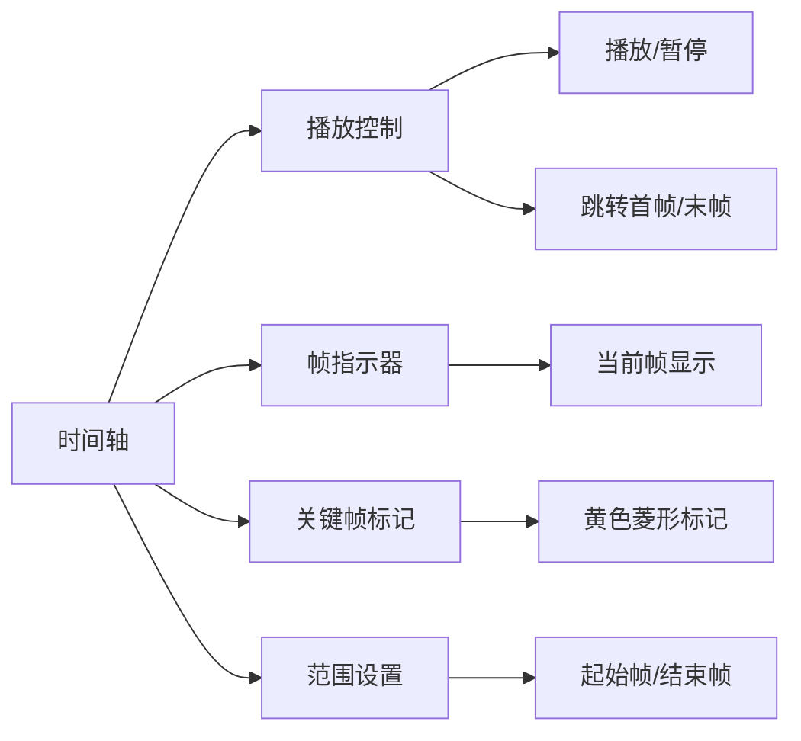

# 第8章：动画基础与关键帧

## 学习目标

1. 理解3D动画的基本原理和概念
2. 掌握Blender动画工具和界面
3. 学会创建和编辑关键帧动画
4. 熟练使用时间轴和动画编辑器
5. 掌握缓动和动画曲线调整
6. 学会制作各种基础动画效果

::: tip 本章重点
动画是让3D模型"活"起来的艺术，本章将带你踏入动画制作的大门，掌握从基础关键帧到复杂动画的制作技能。
:::

## 8.1 动画基础理论

### 8.1.1 动画原理基础

::: note 迪士尼12原则
传统动画的经典原则，至今仍是3D动画的重要指导：
1. **挤压与拉伸**：表现物体的柔软度和重量感
2. **预期**：动作前的准备动作
3. **演出**：清晰表达想法和情绪
4. **连续运动与关键动作**：主要姿态和过渡
5. **跟随与重叠**：不同部位的时间差
6. **缓入缓出**：自然的加速和减速
7. **弧形运动**：符合物理的运动轨迹
8. **次要动作**：支持主要动作的细节
9. **时间掌握**：节奏和速度控制
10. **夸张**：强化表现力
11. **扎实的绘画功底**：造型能力
12. **魅力**：吸引观众的特质
:::

### 8.1.2 帧率与时间

```python
# 常用帧率标准
frame_rates = {
    'film': 24,           # 电影标准
    'pal_tv': 25,         # PAL电视标准
    'ntsc_tv': 29.97,     # NTSC电视标准
    'web_video': 30,      # 网络视频
    'gaming': 60,         # 游戏标准
    'vr': 90,            # VR内容
    'animation_2d': 12    # 2D动画常用
}
```

### 8.1.3 关键帧系统

```python
# 关键帧类型
keyframe_types = {
    'KEYFRAME': '普通关键帧',
    'EXTREME': '极值关键帧',
    'JITTER': '抖动关键帧', 
    'MOVING_HOLD': '移动保持',
    'BREAKDOWN': '中间关键帧'
}
```

## 8.2 Blender动画工作空间

### 8.2.1 动画工作空间布局

::: tip 动画工作空间组成
- **3D视窗**：查看动画效果
- **时间轴**：管理关键帧
- **摄影表**：详细的帧编辑
- **图表编辑器**：动画曲线编辑
- **属性面板**：动画属性设置
:::

### 8.2.2 时间轴界面



### 8.2.3 动画播放控制

| 快捷键 | 功能 | 说明 |
|-------|------|------|
| `空格键` | 播放/暂停 | 切换播放状态 |
| `←` `→` | 上一帧/下一帧 | 单帧浏览 |
| `↑` `↓` | 快进/快退 | 10帧跳跃 |
| `Shift + ←` | 跳到上一关键帧 | 快速定位 |
| `Shift + →` | 跳到下一关键帧 | 快速定位 |
| `Alt + A` | 播放动画 | 全屏播放 |

## 8.3 关键帧动画制作

### 8.3.1 插入关键帧

::: warning 关键帧插入方法
关键帧是动画的基础，记录了对象在特定时间的状态。
:::

```python
# 快捷键插入关键帧
keyframe_shortcuts = {
    'I': '插入关键帧菜单',
    'Shift + I': '删除关键帧菜单',
    'Alt + I': '清除关键帧菜单'
}

# 可插入关键帧的属性
animatable_properties = [
    'Location',      # 位置
    'Rotation',      # 旋转
    'Scale',         # 缩放
    'LocRot',        # 位置+旋转
    'LocScale',      # 位置+缩放
    'RotScale',      # 旋转+缩放
    'LocRotScale',   # 全部变换
    'Custom'         # 自定义属性
]
```

### 8.3.2 关键帧类型管理

```python
# 关键帧颜色编码
keyframe_colors = {
    'KEYFRAME': '黄色 - 普通关键帧',
    'EXTREME': '红色 - 极值关键帧',
    'JITTER': '绿色 - 抖动关键帧',
    'MOVING_HOLD': '暗黄色 - 移动保持',
    'BREAKDOWN': '青色 - 分解关键帧'
}
```

### 8.3.3 自动关键帧设置

```python
# 自动关键帧选项
auto_keyframe_settings = {
    'auto_keying': True,           # 启用自动关键帧
    'auto_keying_mode': 'ADD_REPLACE_KEYS',  # 模式
    'use_keyframe_insert_needed': True,      # 仅在需要时插入
    'use_visual_keying': False,     # 视觉关键帧
    'use_insertkey_xyz_to_rgb': False  # XYZ到RGB
}
```

## 8.4 动画曲线编辑

### 8.4.1 图表编辑器介绍

图表编辑器显示动画属性随时间变化的曲线，是精确控制动画的核心工具。

```python
# F-Curve（功能曲线）属性
fcurve_properties = {
    'data_path': 'location',    # 数据路径
    'array_index': 0,           # 数组索引（X=0, Y=1, Z=2）
    'keyframe_points': [],      # 关键帧点集合
    'interpolation': 'BEZIER',  # 插值类型
    'extrapolation': 'CONSTANT' # 外推类型
}
```

### 8.4.2 插值模式详解

| 插值类型 | 特点 | 适用场景 | 视觉效果 |
|---------|------|---------|---------|
| Constant | 常量，无过渡 | 开关动画 | 阶梯状 |
| Linear | 直线插值 | 匀速运动 | 直线 |
| Bezier | 贝塞尔曲线 | 自然运动 | 平滑曲线 |
| Sine | 正弦插值 | 周期运动 | 正弦波 |
| Quad | 二次方插值 | 加速运动 | 抛物线 |
| Cubic | 三次方插值 | 平滑过渡 | S形曲线 |

### 8.4.3 缓动设置

::: tip 缓动的重要性
缓动使动画更加自然，符合物理世界的运动规律。
:::

```python
# 缓动类型
easing_types = {
    'ease_in': '缓入 - 慢开始',
    'ease_out': '缓出 - 慢结束', 
    'ease_in_out': '缓入缓出 - 慢开始慢结束',
    'back': '回弹 - 超过目标再回来',
    'bounce': '弹跳 - 多次弹跳',
    'elastic': '弹性 - 弹性振荡',
    'expo': '指数 - 指数变化',
    'circ': '圆形 - 圆弧轨迹',
    'quart': '四次方 - 强烈加速/减速'
}
```

### 8.4.4 曲线修改器

```python
# F-Curve修改器
fcurve_modifiers = {
    'GENERATOR': {
        'type': '生成器',
        'use': '数学函数生成动画',
        'example': 'y = a*x + b'
    },
    'NOISE': {
        'type': '噪波',
        'use': '添加随机变化',
        'params': ['scale', 'strength', 'phase', 'offset']
    },
    'CYCLES': {
        'type': '循环',
        'use': '重复动画片段',
        'modes': ['repeat', 'repeat_with_offset', 'reflected']
    },
    'LIMITS': {
        'type': '限制',
        'use': '限制数值范围',
        'params': ['min_x', 'max_x', 'min_y', 'max_y']
    }
}
```

## 8.5 高级动画技术

### 8.5.1 运动路径动画

```python
# 跟随路径设置
follow_path_settings = {
    'target': 'curve_object',     # 目标曲线
    'use_curve_follow': True,     # 跟随曲线方向
    'use_fixed_location': False,  # 固定位置
    'forward_axis': 'FORWARD_Y',  # 前进轴向
    'up_axis': 'UP_Z',           # 向上轴向
    'offset_factor': 0.0         # 偏移因子
}
```

#### 创建运动路径动画步骤
1. 创建贝塞尔曲线作为路径
2. 选择要动画的对象
3. 添加"跟随路径"约束
4. 为曲线的"评估时间"设置关键帧

### 8.5.2 形状关键帧动画

```python
# 形状关键帧（Shape Keys）
shape_keys = {
    'basis': 'Basis',           # 基础形状
    'key_1': 'Smile',           # 微笑
    'key_2': 'Frown',           # 皱眉
    'key_3': 'Surprise',        # 惊讶
    'value_range': (0.0, 1.0),  # 数值范围
    'relative': True            # 相对变形
}
```

### 8.5.3 驱动器动画

::: note 驱动器概念
驱动器允许一个属性的变化驱动另一个属性的变化，创建程序化动画效果。
:::

```python
# 驱动器设置示例
driver_setup = {
    'type': 'SCRIPTED',          # 脚本驱动
    'expression': 'var * 2.0',   # 表达式
    'variables': [
        {
            'name': 'var',
            'type': 'TRANSFORMS',
            'target': 'controller_object',
            'transform_type': 'LOC_X'
        }
    ]
}
```

## 8.6 摄影表详解

### 8.6.1 摄影表界面

摄影表（Dope Sheet）提供了传统动画制作中熟悉的工作方式，以时间轴形式显示关键帧。

```python
# 摄影表模式
dopesheet_modes = {
    'DOPESHEET': '主摄影表',
    'ACTION': '动作编辑器',
    'SHAPEKEY': '形状关键帧编辑器',
    'GPENCIL': '蜡笔动画编辑器',
    'MASK': '遮罩编辑器',
    'CACHEFILE': '缓存文件编辑器'
}
```

### 8.6.2 关键帧操作

| 操作 | 快捷键 | 功能描述 |
|------|-------|---------|
| 选择 | 左键点击 | 选择关键帧 |
| 多选 | Shift + 左键 | 添加到选择 |
| 框选 | B | 方框选择 |
| 移动 | G | 移动关键帧 |
| 复制 | Shift + D | 复制关键帧 |
| 删除 | X 或 Delete | 删除关键帧 |
| 缩放 | S | 时间缩放 |

### 8.6.3 批量编辑技巧

```python
# 批量关键帧操作
batch_keyframe_ops = {
    'select_all': 'A',           # 全选
    'select_none': 'Alt + A',    # 取消选择
    'select_inverse': 'Ctrl + I', # 反选
    'select_linked': 'L',        # 选择相关
    'duplicate': 'Shift + D',    # 复制
    'mirror': 'Ctrl + M',        # 镜像
    'snap': 'Shift + S'          # 吸附
}
```

## 8.7 动画图层与混合

### 8.7.1 NLA编辑器简介

非线性动画（NLA）编辑器允许组合和混合多个动画序列。

```python
# NLA轨道设置
nla_track_settings = {
    'name': 'Walk_Cycle',        # 轨道名称
    'active': True,              # 激活状态
    'lock': False,               # 锁定状态
    'mute': False,               # 静音状态
    'solo': False,               # 独奏状态
    'influence': 1.0             # 影响强度
}
```

### 8.7.2 动画条带操作

```python
# NLA条带属性
nla_strip_properties = {
    'action': 'walk_action',     # 关联动作
    'frame_start': 1,            # 开始帧
    'frame_end': 30,             # 结束帧
    'blend_type': 'REPLACE',     # 混合类型
    'influence': 1.0,            # 影响因子
    'use_auto_blend': True,      # 自动混合
    'blend_in': 5,               # 淡入帧数
    'blend_out': 5               # 淡出帧数
}
```

### 8.7.3 动画混合模式

| 混合模式 | 效果描述 | 适用场景 |
|---------|---------|---------|
| Replace | 替换原动画 | 主要动作 |
| Add | 叠加动画 | 附加效果 |
| Subtract | 减去动画 | 反向动作 |
| Multiply | 乘法混合 | 缩放效果 |

## 8.8 动画约束系统

### 8.8.1 常用动画约束

::: tip 约束的作用
约束可以自动化复杂的动画关系，减少手工关键帧的工作量。
:::

```python
# 变换约束
transform_constraints = {
    'COPY_LOCATION': {
        'name': '复制位置',
        'use': '让对象跟随另一对象的位置',
        'axes': ['X', 'Y', 'Z'],
        'influence': 1.0
    },
    'COPY_ROTATION': {
        'name': '复制旋转',
        'use': '让对象跟随另一对象的旋转',
        'order': 'XYZ'
    },
    'COPY_SCALE': {
        'name': '复制缩放',
        'use': '让对象跟随另一对象的缩放'
    },
    'COPY_TRANSFORMS': {
        'name': '复制变换',
        'use': '复制完整的变换信息'
    }
}
```

### 8.8.2 追踪约束

```python
# 追踪约束设置
tracking_constraints = {
    'TRACK_TO': {
        'target': 'target_object',
        'track_axis': 'TRACK_Y',      # 追踪轴
        'up_axis': 'UP_Z',            # 向上轴
        'use_target_z': False         # 使用目标Z轴
    },
    'LOCKED_TRACK': {
        'target': 'target_object',
        'track_axis': 'TRACK_Y',
        'lock_axis': 'LOCK_Z'         # 锁定轴
    }
}
```

### 8.8.3 关系约束

```python
# 关系约束示例
relationship_constraints = {
    'CHILD_OF': {
        'name': '子级约束',
        'target': 'parent_object',
        'use_location': True,
        'use_rotation': True,
        'use_scale': False
    },
    'FLOOR': {
        'name': '地板约束',
        'target': 'floor_object',
        'floor_location': 'FLOOR_Y',
        'use_rotation': False
    }
}
```

## 8.9 实战动画项目

### 8.9.1 弹球动画

**目标**：创建一个真实的弹球动画

**动画原则应用**：
- 挤压与拉伸：球体接触地面时变形
- 缓入缓出：重力影响下的加速减速
- 弧形运动：抛物线轨迹

```python
# 弹球动画关键帧设置
bouncing_ball_keyframes = {
    'frame_1': {
        'location': (0, 0, 5),
        'scale': (1, 1, 1)
    },
    'frame_12': {  # 接触地面
        'location': (0, 0, 0.5),
        'scale': (1.3, 1.3, 0.7)  # 挤压变形
    },
    'frame_15': {  # 离开地面
        'location': (0, 0, 0.5),
        'scale': (0.8, 0.8, 1.2)  # 拉伸变形
    },
    'frame_24': {  # 最高点
        'location': (0, 0, 3),
        'scale': (1, 1, 1)
    }
}
```

### 8.9.2 钟摆动画

**目标**：创建物理准确的钟摆运动

**技术要点**：
- 使用正弦函数驱动旋转
- 调整摆动幅度和周期
- 添加阻尼效果模拟真实物理

```python
# 钟摆驱动器设置
pendulum_driver = {
    'expression': 'sin(frame * 0.1) * 30',  # 正弦摆动
    'amplitude': 30,      # 摆动幅度（度）
    'frequency': 0.1,     # 摆动频率
    'damping': 0.98      # 阻尼系数
}
```

### 8.9.3 齿轮传动动画

**目标**：创建相互关联的齿轮传动系统

**关键技术**：
- 驱动器建立齿轮比关系
- 精确计算转速比
- 同步多个齿轮运动

```python
# 齿轮传动设置
gear_system = {
    'main_gear': {
        'teeth': 20,
        'rotation_speed': 1.0  # 主齿轮转速
    },
    'secondary_gear': {
        'teeth': 10,
        'rotation_speed': 2.0,  # 转速 = 20/10 = 2倍
        'driver_expression': 'main_gear_rotation * (20/10)'
    }
}
```

## 8.10 动画优化与输出

### 8.10.1 动画性能优化

::: warning 性能考虑
复杂动画会影响播放性能，需要适当优化。
:::

```python
# 性能优化策略
performance_optimization = {
    'keyframe_reduction': '减少不必要的关键帧',
    'simplify_curves': '简化动画曲线',
    'use_proxy_objects': '使用代理对象预览',
    'disable_modifiers': '预览时禁用修改器',
    'reduce_subdivision': '降低细分级别',
    'viewport_shading': '使用简单着色模式'
}
```

### 8.10.2 动画缓存

```python
# 点缓存设置
point_cache_settings = {
    'frame_start': 1,
    'frame_end': 250,
    'step': 1,
    'use_disk_cache': True,
    'use_library_path': False,
    'filepath': '//cache/'
}
```

### 8.10.3 动画导出

```python
# FBX动画导出设置
fbx_animation_export = {
    'use_selection': False,          # 导出全部
    'use_active_collection': False,  # 使用活动集合
    'global_scale': 1.0,            # 全局缩放
    'apply_unit_scale': True,       # 应用单位缩放
    'bake_space_transform': False,  # 烘焙空间变换
    'object_types': {'ARMATURE', 'MESH'},  # 对象类型
    'use_mesh_modifiers': True,     # 使用网格修改器
    'bake_anim': True,              # 烘焙动画
    'bake_anim_use_all_bones': True, # 烘焙所有骨骼
    'bake_anim_use_nla_strips': True, # 烘焙NLA条带
    'bake_anim_step': 1.0,          # 烘焙步长
    'bake_anim_simplify_factor': 1.0 # 简化因子
}
```

## 8.11 快捷键总结

### 8.11.1 动画播放控制

| 快捷键 | 功能 | 备注 |
|-------|------|------|
| `空格键` | 播放/暂停 | 最常用 |
| `←` `→` | 上/下一帧 | 精确浏览 |
| `Shift + ←` `→` | 跳转关键帧 | 快速导航 |
| `Home` | 回到第1帧 | 重置播放 |
| `End` | 跳到最后一帧 | 结束位置 |

### 8.11.2 关键帧操作

| 快捷键 | 功能 | 使用频率 |
|-------|------|---------|
| `I` | 插入关键帧 | 极高 |
| `Shift + I` | 删除关键帧 | 高 |
| `Alt + I` | 清除关键帧 | 中 |
| `Ctrl + D` | 复制关键帧 | 中 |
| `T` | 设置插值类型 | 高 |

### 8.11.3 图表编辑器

| 快捷键 | 功能 | 说明 |
|-------|------|------|
| `G` | 移动控制点 | 调整时间/数值 |
| `S` | 缩放控制点 | 调整斜率 |
| `R` | 旋转控制点 | 调整角度 |
| `H` | 设置控制点类型 | 自动/矢量/对齐 |
| `V` | 设置控制点类型 | 快速设置 |

## 本章小结

本章系统学习了3D动画制作的基础知识：

1. **动画原理**：掌握了传统动画的基本原则和3D动画的特点
2. **关键帧系统**：学会了创建、编辑和管理关键帧
3. **动画曲线**：掌握了使用图表编辑器精确控制动画
4. **高级技术**：了解了路径动画、形状关键帧、驱动器等
5. **约束系统**：学会了使用约束自动化复杂动画关系
6. **实战项目**：通过实际案例提升了动画制作能力

动画制作是一个需要大量实践的技能领域，建议多观察现实世界中的运动规律，并尝试用动画表现出来。在下一章中，我们将学习角色绑定与骨骼系统，为角色动画做准备。

::: tip 继续精进
动画的精髓在于表达情感和故事，技术只是手段。多研究优秀动画作品的动作设计，理解动画背后的情感表达。
:::