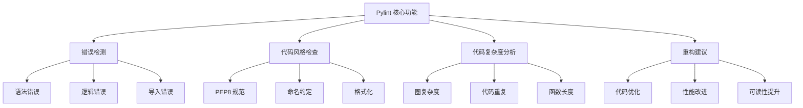

# 第 1 章：Pylint 入门基础

::: tip 学习目标
- 理解 Pylint 的作用和核心概念
- 掌握 Pylint 的安装和基本使用
- 了解代码质量检查的重要性
- 掌握基本的命令行使用方法
:::

### 知识点

#### Pylint 概述

Pylint 是一个 Python 静态代码分析工具，用于：

- **检查编程错误**：语法错误、逻辑错误、运行时错误
- **强制执行编码标准**：PEP8 规范、命名约定
- **检查代码异味**：重复代码、复杂度过高
- **提供重构建议**：代码优化和改进建议

#### Pylint 的核心功能



#### 代码质量的重要性

| 方面 | 重要性 | Pylint 的作用 |
|------|--------|---------------|
| **可维护性** | 代码易于理解和修改 | 检查命名规范、注释完整性 |
| **可靠性** | 减少运行时错误 | 检测潜在错误和异常 |
| **一致性** | 团队编码风格统一 | 强制执行编码标准 |
| **性能** | 代码执行效率 | 发现性能问题和瓶颈 |

### 示例代码

#### 安装和基本使用

```python
# 安装 Pylint
# pip install pylint

# 示例：一个简单的 Python 文件
# sample.py
def calculate_area(radius):
    """计算圆的面积"""
    import math  # 不推荐在函数内导入
    pi = 3.14159  # 应该使用 math.pi
    area = pi * radius * radius
    return area

def main():
    r = 5
    area = calculate_area(r)
    print(f"圆的面积是: {area}")

if __name__ == "__main__":
    main()
```

```bash
# 运行 Pylint 检查
pylint sample.py

# 输出示例：
# ************* Module sample
# sample.py:3:4: C0415: Import outside toplevel (math) (import-outside-toplevel)
# sample.py:4:4: C0103: Constant name "pi" doesn't conform to UPPER_CASE naming style (invalid-name)
# sample.py:1:0: C0114: Missing module docstring (missing-module-docstring)
#
# -----------------------------------
# Your code has been rated at 4.00/10
```

#### 改进后的代码

```python
"""
计算几何图形面积的模块

这个模块包含计算圆形面积的功能。
"""
import math


def calculate_area(radius):
    """
    计算圆的面积

    Args:
        radius (float): 圆的半径

    Returns:
        float: 圆的面积

    Raises:
        ValueError: 当半径为负数时
    """
    if radius < 0:
        raise ValueError("半径不能为负数")

    area = math.pi * radius * radius
    return area


def main():
    """主函数"""
    radius = 5.0
    area = calculate_area(radius)
    print(f"半径为 {radius} 的圆的面积是: {area:.2f}")


if __name__ == "__main__":
    main()
```

```bash
# 改进后的 Pylint 检查
pylint improved_sample.py

# 输出示例：
# -----------------------------------
# Your code has been rated at 10.00/10 (previous run: 4.00/10, +6.00)
```

#### 基本命令行选项

```python
# 常用 Pylint 命令示例

# 1. 基本检查
# pylint myfile.py

# 2. 检查整个包
# pylint mypackage/

# 3. 生成配置文件
# pylint --generate-rcfile > .pylintrc

# 4. 指定输出格式
# pylint --output-format=json myfile.py

# 5. 只显示错误和警告
# pylint --errors-only myfile.py

# 6. 禁用特定检查
# pylint --disable=C0103,C0114 myfile.py

# 7. 显示统计信息
# pylint --reports=yes myfile.py

# 8. 设置最小评分
# pylint --fail-under=8.0 myfile.py
```

#### 消息代码示例

```python
# 演示各种 Pylint 消息的代码示例
# pylint_examples.py

# C0103: invalid-name
variable_name_too_long_and_not_descriptive = "bad naming"
x = 10  # 变量名过短

# C0114: missing-module-docstring
# 缺少模块文档字符串

def function_without_docstring():  # C0116: missing-function-docstring
    pass

class MyClass:  # C0115: missing-class-docstring
    def __init__(self):
        self.value = 10

    def method_with_unused_variable(self):  # W0612: unused-variable
        unused_var = "not used"
        return self.value

# R0903: too-few-public-methods
class EmptyClass:
    pass

# W0613: unused-argument
def function_with_unused_arg(used_arg, unused_arg):
    return used_arg * 2

# E1101: no-member
# someobject.nonexistent_method()  # 会报错

# R0914: too-many-locals
def function_with_many_variables():
    var1 = 1
    var2 = 2
    var3 = 3
    var4 = 4
    var5 = 5
    var6 = 6
    var7 = 7
    var8 = 8
    var9 = 9
    var10 = 10
    var11 = 11
    var12 = 12
    var13 = 13
    var14 = 14
    var15 = 15
    var16 = 16  # 超过默认的15个局部变量限制
    return sum([var1, var2, var3, var4, var5, var6, var7, var8,
                var9, var10, var11, var12, var13, var14, var15, var16])
```

#### 内联禁用消息

```python
# 内联禁用 Pylint 消息的方法

# 禁用单行的特定消息
variable_name = "test"  # pylint: disable=invalid-name

# 禁用多个消息
def short_function():  # pylint: disable=missing-function-docstring,invalid-name
    return True

# 禁用代码块
# pylint: disable=missing-class-docstring,too-few-public-methods
class SimpleClass:
    def __init__(self):
        self.value = 42
# pylint: enable=missing-class-docstring,too-few-public-methods

# 禁用整个文件的特定消息（放在文件开头）
# pylint: disable=missing-module-docstring

# 更具体的禁用方法
def complex_calculation():
    """执行复杂计算"""
    # pylint: disable-next=invalid-name
    x = 10  # 这行会被忽略 invalid-name 检查

    return x * 2
```

#### 评分系统理解

```python
# Pylint 评分系统示例
"""
Pylint 评分计算：
- 基础分：10.0
- 错误(Error): -10 分
- 警告(Warning): -2 分
- 约定(Convention): -1 分
- 重构(Refactor): -5 分
- 致命(Fatal): -10 分

最终分数 = 10.0 - (错误数*10 + 警告数*2 + 约定数*1 + 重构数*5) / 语句总数 * 10
"""

# 示例：低分代码
def bad_function(a,b,c,d,e,f,g,h,i,j):  # 太多参数
    x=a+b  # 缺少空格
    y=c+d
    z=e+f
    if x>10:  # 缺少空格
        if y>20:  # 嵌套过深
            if z>30:
                return True
    return False

# 示例：高分代码
def good_function(first_number, second_number):
    """
    计算两个数字的和

    Args:
        first_number (int): 第一个数字
        second_number (int): 第二个数字

    Returns:
        int: 两个数字的和
    """
    return first_number + second_number


def demonstrate_score_improvement():
    """演示如何提高 Pylint 评分"""
    # 好的实践：
    # 1. 添加文档字符串
    # 2. 使用描述性变量名
    # 3. 遵循 PEP8 格式
    # 4. 避免复杂的嵌套
    # 5. 限制函数参数数量

    result = good_function(10, 20)
    return result
```

#### 输出格式示例

```python
# 不同输出格式的示例

# 1. 默认文本格式
# pylint myfile.py
"""
************* Module myfile
myfile.py:1:0: C0114: Missing module docstring (missing-module-docstring)
myfile.py:3:0: C0116: Missing function or method docstring (missing-function-docstring)
-----------------------------------
Your code has been rated at 5.00/10
"""

# 2. JSON 格式
# pylint --output-format=json myfile.py
"""
[
    {
        "type": "convention",
        "module": "myfile",
        "obj": "",
        "line": 1,
        "column": 0,
        "path": "myfile.py",
        "symbol": "missing-module-docstring",
        "message": "Missing module docstring",
        "message-id": "C0114"
    }
]
"""

# 3. 可读性格式
# pylint --output-format=colorized myfile.py

# 4. 报告格式
# pylint --reports=yes myfile.py
"""
Report
======
15 statements analysed.

Statistics by type
------------------
|type      |number |%      |previous |difference |
|----------|-------|-------|---------|-----------|
|module    |1      |6.67   |1        |=          |
|class     |1      |6.67   |1        |=          |
|method    |2      |13.33  |2        |=          |
|function  |1      |6.67   |1        |=          |
"""
```

::: note Pylint 使用技巧
1. **渐进式改进**：不要试图一次性修复所有问题，优先修复错误和警告
2. **配置文件**：使用 .pylintrc 文件配置项目特定的规则
3. **CI/CD 集成**：将 Pylint 集成到持续集成流程中
4. **团队约定**：团队成员就 Pylint 规则达成一致
5. **定期检查**：定期运行 Pylint 保持代码质量
:::

::: warning 注意事项
1. **不要盲目追求 10 分**：代码质量比评分更重要
2. **合理禁用规则**：某些规则在特定情况下可以禁用
3. **理解消息含义**：不要简单地禁用，要理解为什么会出现这个消息
4. **平衡效率与质量**：在开发效率和代码质量之间找到平衡
:::

### Pylint 安装验证

```python
# 验证 Pylint 安装的脚本
# check_pylint.py
"""检查 Pylint 安装和基本功能"""

import subprocess
import sys


def check_pylint_installation():
    """检查 Pylint 是否正确安装"""
    try:
        result = subprocess.run(
            [sys.executable, '-m', 'pylint', '--version'],
            capture_output=True,
            text=True,
            check=True
        )
        print("✅ Pylint 安装成功！")
        print(f"版本信息：\n{result.stdout}")
        return True
    except subprocess.CalledProcessError:
        print("❌ Pylint 未安装或安装有问题")
        print("请运行：pip install pylint")
        return False
    except FileNotFoundError:
        print("❌ Python 环境有问题")
        return False


def run_sample_check():
    """运行示例代码检查"""
    sample_code = '''
def hello():
    print("Hello, World!")

hello()
'''

    # 创建临时文件
    with open('temp_sample.py', 'w', encoding='utf-8') as f:
        f.write(sample_code)

    try:
        result = subprocess.run(
            [sys.executable, '-m', 'pylint', 'temp_sample.py'],
            capture_output=True,
            text=True
        )
        print("✅ Pylint 基本功能正常！")
        print("示例检查结果：")
        print(result.stdout)
    except Exception as e:
        print(f"❌ Pylint 运行出错：{e}")
    finally:
        # 清理临时文件
        import os
        if os.path.exists('temp_sample.py'):
            os.remove('temp_sample.py')


if __name__ == "__main__":
    if check_pylint_installation():
        run_sample_check()
```

Pylint 是 Python 开发中不可或缺的代码质量工具，掌握其基本使用方法是编写高质量 Python 代码的第一步。