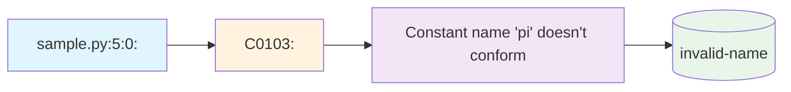

# 第 2 章：消息类型与错误分析

::: tip 学习目标
- 掌握 Pylint 的五种消息类型
- 理解错误、警告、约定等不同级别
- 学习如何解读 Pylint 报告
- 掌握常见问题的识别和修复
:::

### 知识点

#### Pylint 消息类型体系

Pylint 将检查结果分为五种类型，每种类型用不同的字母前缀标识：

| 类型 | 前缀 | 说明 | 严重程度 | 评分影响 |
|------|------|------|----------|----------|
| **Fatal** | F | 致命错误，阻止进一步处理 | 最高 | -10分 |
| **Error** | E | 编程错误，可能导致异常 | 高 | -10分 |
| **Warning** | W | 潜在问题，需要注意 | 中 | -2分 |
| **Convention** | C | 违反编码约定 | 低 | -1分 |
| **Refactor** | R | 代码重构建议 | 中 | -5分 |

#### 消息格式解析

```
文件名:行号:列号: 消息类型代码: 消息描述 (消息名称)
```



### 示例代码

#### Fatal 错误 (F) 示例

```python
# fatal_errors.py - 致命错误示例

# F0001: 语法错误
def broken_syntax()
    return "missing colon"  # 语法错误：缺少冒号

# F0002: 无法导入
import non_existent_module  # 模块不存在

# F0010: 无法解析文件
# 如果文件编码有问题或包含无效字符

# 运行结果：
# fatal_errors.py:4:0: F0001: Error parsing the module: invalid syntax (missing ':'). (syntax-error)
```

#### Error 错误 (E) 示例

```python
# error_examples.py - 错误示例

class MyClass:
    def __init__(self):
        self.value = 10

# E1101: 访问不存在的属性
obj = MyClass()
print(obj.nonexistent_attribute)  # AttributeError

# E1102: 调用不可调用对象
number = 42
result = number()  # TypeError: 'int' object is not callable

# E1111: 赋值给函数调用
def get_value():
    return 10

get_value() = 20  # SyntaxError: can't assign to function call

# E1120: 缺少必需参数
def add_numbers(a, b):
    return a + b

result = add_numbers(5)  # TypeError: missing required argument

# E1121: 参数过多
result = add_numbers(1, 2, 3)  # TypeError: too many arguments

# E0602: 未定义变量
print(undefined_variable)  # NameError

# E0611: 导入不存在的名称
from math import nonexistent_function

# 常见错误修复示例
class FixedClass:
    def __init__(self):
        self.value = 10
        self.valid_attribute = "exists"

obj = FixedClass()
print(obj.valid_attribute)  # 正确访问属性

# 正确的函数调用
result = add_numbers(1, 2)  # 提供正确数量的参数

# 定义变量后使用
defined_variable = "Hello"
print(defined_variable)
```

#### Warning 警告 (W) 示例

```python
# warning_examples.py - 警告示例

import os
import sys
import unused_module  # W0611: 未使用的导入

# W0612: 未使用的变量
def function_with_unused_vars():
    used_var = "I am used"
    unused_var = "I am not used"  # 警告：未使用的变量
    return used_var

# W0613: 未使用的参数
def function_with_unused_args(used_arg, unused_arg):
    return used_arg * 2

# W0622: 重定义内置名称
def len(sequence):  # 警告：重定义了内置函数 len
    return 42

# W0621: 重定义外部作用域变量
global_var = "global"

def function_with_redefined_var():
    global_var = "local"  # 警告：重定义了外部变量
    return global_var

# W0107: 不必要的 pass 语句
def empty_function():
    pass  # 如果函数真的为空，这是不必要的

# W0102: 危险的默认参数
def append_to_list(item, target_list=[]):  # 危险：可变默认参数
    target_list.append(item)
    return target_list

# W0603: 使用全局语句
global_counter = 0

def increment_counter():
    global global_counter  # 警告：使用 global 语句
    global_counter += 1

# 修复示例
def fixed_append_to_list(item, target_list=None):
    """修复危险的默认参数"""
    if target_list is None:
        target_list = []
    target_list.append(item)
    return target_list

def fixed_function_with_unused_args(used_arg, _unused_arg):
    """使用下划线前缀表示未使用的参数"""
    return used_arg * 2

# 移除未使用的导入
# import unused_module  # 删除这行

# 使用未使用的变量
def fixed_function_with_vars():
    used_var = "I am used"
    another_var = "I am also used"
    return f"{used_var} and {another_var}"
```

#### Convention 约定 (C) 示例

```python
# convention_examples.py - 约定示例

# C0114: 缺少模块文档字符串
"""
这是一个演示编码约定的模块

本模块包含各种违反和遵循 Python 编码约定的示例。
"""

# C0103: 命名不符合约定
camelCaseVariable = "should be snake_case"  # 应该用下划线命名
LOWERCASE_CONSTANT = "should be uppercase"  # 常量应该大写
ClassName = "should be PascalCase"  # 类名应该用 PascalCase

# 正确的命名约定
snake_case_variable = "correct naming"
UPPERCASE_CONSTANT = "correct constant"

class ProperClassName:  # 正确的类名
    """正确的类命名示例"""

# C0115: 缺少类文档字符串
class ClassWithoutDocstring:
    def __init__(self):
        self.value = 10

# C0116: 缺少函数文档字符串
def function_without_docstring():
    return True

# 正确的文档字符串示例
class ClassWithDocstring:
    """
    带有文档字符串的类

    这个类演示了正确的文档字符串格式。
    """

    def __init__(self):
        """初始化方法"""
        self.value = 10

    def method_with_docstring(self):
        """
        带有文档字符串的方法

        Returns:
            str: 返回字符串值
        """
        return "method result"

def function_with_docstring(param1, param2):
    """
    带有文档字符串的函数

    Args:
        param1 (str): 第一个参数
        param2 (int): 第二个参数

    Returns:
        str: 格式化后的字符串
    """
    return f"{param1}: {param2}"

# C0200: 不必要的索引循环
items = ["a", "b", "c"]

# 不好的方式
for i in range(len(items)):
    print(f"Item {i}: {items[i]}")

# 好的方式
for i, item in enumerate(items):
    print(f"Item {i}: {item}")

# 或者更简单的方式
for item in items:
    print(f"Item: {item}")

# C0201: 不必要的键遍历
data = {"key1": "value1", "key2": "value2"}

# 不好的方式
for key in data.keys():
    print(f"{key}: {data[key]}")

# 好的方式
for key, value in data.items():
    print(f"{key}: {value}")
```

#### Refactor 重构 (R) 示例

```python
# refactor_examples.py - 重构建议示例

# R0903: 太少的公共方法
class TooFewMethods:
    """只有一个公共方法的类"""
    def __init__(self):
        self._value = 10

    def get_value(self):
        return self._value

# R0913: 太多参数
def function_with_too_many_args(arg1, arg2, arg3, arg4, arg5, arg6, arg7):
    """参数过多的函数"""
    return arg1 + arg2 + arg3 + arg4 + arg5 + arg6 + arg7

# R0914: 太多局部变量
def function_with_too_many_locals():
    """局部变量过多的函数"""
    var1 = 1
    var2 = 2
    var3 = 3
    var4 = 4
    var5 = 5
    var6 = 6
    var7 = 7
    var8 = 8
    var9 = 9
    var10 = 10
    var11 = 11
    var12 = 12
    var13 = 13
    var14 = 14
    var15 = 15
    var16 = 16  # 超过默认限制
    return sum([var1, var2, var3, var4, var5, var6, var7, var8,
                var9, var10, var11, var12, var13, var14, var15, var16])

# R0915: 太多语句
def function_with_too_many_statements():
    """语句过多的函数"""
    result = 0
    result += 1
    result += 2
    result += 3
    result += 4
    result += 5
    result += 6
    result += 7
    result += 8
    result += 9
    result += 10
    result += 11
    result += 12
    result += 13
    result += 14
    result += 15
    result += 16
    result += 17
    result += 18
    result += 19
    result += 20
    result += 21
    result += 22
    result += 23
    result += 24
    result += 25
    result += 26
    result += 27
    result += 28
    result += 29
    result += 30
    result += 31
    result += 32
    result += 33
    result += 34
    result += 35
    result += 36
    result += 37
    result += 38
    result += 39
    result += 40
    result += 41
    result += 42
    result += 43
    result += 44
    result += 45
    result += 46
    result += 47
    result += 48
    result += 49
    result += 50
    result += 51  # 超过默认的50个语句限制
    return result

# 重构后的改进版本

# 使用配置类改进参数过多的问题
class FunctionConfig:
    """函数配置类"""
    def __init__(self, arg1=1, arg2=2, arg3=3, arg4=4, arg5=5, arg6=6, arg7=7):
        self.arg1 = arg1
        self.arg2 = arg2
        self.arg3 = arg3
        self.arg4 = arg4
        self.arg5 = arg5
        self.arg6 = arg6
        self.arg7 = arg7

def improved_function(config: FunctionConfig):
    """改进后的函数，使用配置对象"""
    return (config.arg1 + config.arg2 + config.arg3 + config.arg4 +
            config.arg5 + config.arg6 + config.arg7)

# 拆分大函数
def calculate_sum_1_to_10():
    """计算1到10的和"""
    return sum(range(1, 11))

def calculate_sum_11_to_20():
    """计算11到20的和"""
    return sum(range(11, 21))

def improved_large_calculation():
    """改进后的大计算函数"""
    sum1 = calculate_sum_1_to_10()
    sum2 = calculate_sum_11_to_20()
    return sum1 + sum2

# 使用数据类改进方法过少的类
from dataclasses import dataclass

@dataclass
class ImprovedDataClass:
    """改进后的数据类"""
    value: int = 10

    def get_value(self):
        """获取值"""
        return self.value

    def set_value(self, value):
        """设置值"""
        self.value = value

    def double_value(self):
        """将值翻倍"""
        self.value *= 2

    def is_positive(self):
        """检查值是否为正数"""
        return self.value > 0
```

#### 消息分析和修复策略

```python
# message_analysis.py - 消息分析和修复策略

def analyze_pylint_output():
    """分析 Pylint 输出的策略"""

    # 1. 优先级排序
    priority_order = [
        "Fatal (F) - 立即修复",
        "Error (E) - 高优先级修复",
        "Warning (W) - 中优先级修复",
        "Refactor (R) - 重构改进",
        "Convention (C) - 编码规范"
    ]

    # 2. 常见修复模式
    fix_patterns = {
        "missing-docstring": "添加文档字符串",
        "invalid-name": "修改为符合规范的命名",
        "unused-variable": "删除未使用的变量或使用下划线前缀",
        "unused-import": "删除未使用的导入",
        "too-many-arguments": "使用配置对象或拆分函数",
        "too-many-locals": "提取子函数",
        "line-too-long": "拆分长行",
        "trailing-whitespace": "删除行尾空格"
    }

    return priority_order, fix_patterns

# 批量修复示例
def batch_fix_examples():
    """批量修复常见问题的示例"""

    # 修复前的代码
    def problematic_function(a,b,c,d,e):  # 缺少空格，参数过多
        x=a+b  # 缺少空格
        y=c+d
        z=e
        unused_var="not used"  # 未使用变量
        return x+y+z  # 缺少空格

    # 修复后的代码
    class ParameterConfig:
        """参数配置类"""
        def __init__(self, a, b, c, d, e):
            self.a = a
            self.b = b
            self.c = c
            self.d = d
            self.e = e

    def improved_function(config: ParameterConfig):
        """
        改进后的函数

        Args:
            config (ParameterConfig): 参数配置对象

        Returns:
            int: 计算结果
        """
        x = config.a + config.b
        y = config.c + config.d
        z = config.e
        return x + y + z

# 自动化修复脚本示例
def create_auto_fix_script():
    """创建自动修复脚本的示例"""
    import re

    def fix_spacing_issues(code):
        """修复空格问题"""
        # 修复操作符周围的空格
        code = re.sub(r'(\w)=(\w)', r'\1 = \2', code)
        code = re.sub(r'(\w)\+(\w)', r'\1 + \2', code)
        code = re.sub(r'(\w)-(\w)', r'\1 - \2', code)
        return code

    def add_missing_docstrings(code):
        """添加缺失的文档字符串"""
        # 这是一个简化的示例
        if 'def ' in code and '"""' not in code:
            # 在函数定义后添加基本文档字符串
            return code.replace('def ', 'def ')  # 实际实现会更复杂
        return code

    return fix_spacing_issues, add_missing_docstrings
```

::: note 消息分析技巧
1. **按类型分组**：先处理致命错误和错误，再处理警告和约定
2. **批量修复**：使用编辑器的查找替换功能批量修复相似问题
3. **理解根因**：不要只是禁用消息，要理解为什么会出现这个问题
4. **渐进改进**：大型项目可以逐步改进，不必一次性修复所有问题
5. **自动化工具**：使用 black、isort 等工具自动修复格式问题
:::

::: warning 常见误区
1. **盲目禁用**：不要为了提高评分而盲目禁用有用的检查
2. **过度优化**：不要为了消除所有消息而过度复杂化代码
3. **忽略上下文**：某些规则在特定上下文中可能不适用
4. **机械修复**：要理解消息的含义，而不是机械地修复
:::

### 消息统计分析

```python
# 统计和分析 Pylint 消息的脚本
import re
import json
from collections import defaultdict, Counter

def parse_pylint_output(output):
    """解析 Pylint 输出"""
    messages = []
    pattern = r'(.+):(\d+):(\d+): ([EWCRF]\d+): (.+) \((.+)\)'

    for line in output.split('\n'):
        match = re.match(pattern, line.strip())
        if match:
            file_path, line_num, col_num, msg_id, description, symbol = match.groups()
            messages.append({
                'file': file_path,
                'line': int(line_num),
                'column': int(col_num),
                'id': msg_id,
                'type': msg_id[0],
                'description': description,
                'symbol': symbol
            })

    return messages

def analyze_messages(messages):
    """分析消息统计"""
    type_counts = Counter(msg['type'] for msg in messages)
    symbol_counts = Counter(msg['symbol'] for msg in messages)
    file_counts = Counter(msg['file'] for msg in messages)

    return {
        'total': len(messages),
        'by_type': dict(type_counts),
        'by_symbol': dict(symbol_counts.most_common(10)),
        'by_file': dict(file_counts.most_common(10))
    }

# 示例用法
sample_output = """
sample.py:1:0: C0114: Missing module docstring (missing-module-docstring)
sample.py:3:0: C0116: Missing function or method docstring (missing-function-docstring)
sample.py:3:4: C0103: Constant name "pi" doesn't conform to UPPER_CASE naming style (invalid-name)
sample.py:5:4: W0612: Unused variable 'unused_var' (unused-variable)
"""

messages = parse_pylint_output(sample_output)
stats = analyze_messages(messages)
print(json.dumps(stats, indent=2))
```

理解 Pylint 的消息类型体系是有效使用这个工具的关键，通过系统性地分析和修复不同类型的问题，可以显著提高代码质量。