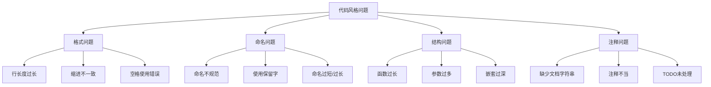

# 第 4 章：代码风格与 PEP8 规范

::: tip 学习目标
- 理解 PEP8 编码规范的重要性
- 掌握 Pylint 对代码风格的检查
- 学习命名约定和格式化规则
- 掌握代码结构和组织规范
:::

### 知识点

#### PEP8 规范概述

PEP8 是 Python 官方的代码风格指南，定义了 Python 代码的编写规范：

- **代码布局**：缩进、行长度、空行
- **命名约定**：变量、函数、类的命名规则
- **注释规范**：注释的编写方式和位置
- **表达式和语句**：运算符周围的空格、换行规则

#### Pylint 代码风格检查分类

| 检查类别 | 前缀 | 主要检查项 |
|----------|------|------------|
| **格式 (FORMAT)** | C01xx | 行长度、缩进、空格 |
| **基础 (BASIC)** | C02xx | 命名约定、文档字符串 |
| **类 (CLASSES)** | C03xx | 类结构、方法定义 |
| **设计 (DESIGN)** | R09xx | 代码结构设计 |

#### 常见代码风格问题



### 示例代码

#### 格式规范检查

```python
# format_examples.py - 格式规范示例

# === 行长度检查 (C0301: line-too-long) ===

# 不好的例子：行过长
def bad_long_line_example():
    very_long_variable_name = "This is a very long string that exceeds the maximum line length and should be broken into multiple lines for better readability"
    return very_long_variable_name

# 好的例子：适当换行
def good_long_line_example():
    very_long_variable_name = (
        "This is a very long string that has been properly "
        "broken into multiple lines for better readability"
    )
    return very_long_variable_name

# 函数调用的换行
# 不好的例子
result = some_function_with_long_name(first_parameter, second_parameter, third_parameter, fourth_parameter, fifth_parameter)

# 好的例子
result = some_function_with_long_name(
    first_parameter,
    second_parameter,
    third_parameter,
    fourth_parameter,
    fifth_parameter
)

# === 缩进检查 (C0326: bad-whitespace) ===

# 不好的例子：缩进不一致
def bad_indentation():
    if True:
      print("2 spaces")  # 错误：应该使用4个空格
        print("4 spaces")  # 正确
          print("6 spaces")  # 错误：过度缩进

# 好的例子：一致的缩进
def good_indentation():
    if True:
        print("Consistent 4 spaces")
        if True:
            print("Nested 8 spaces")

# === 空格使用检查 ===

# 不好的例子：空格使用错误
def bad_spacing():
    x=1+2  # 缺少空格
    y = 3*4  # 缺少空格
    z = func( 5,6 )  # 多余的空格

    # 逗号后缺少空格
    my_list=[1,2,3,4]

    # 冒号使用错误
    my_dict = {'key' : 'value'}

# 好的例子：正确的空格使用
def good_spacing():
    x = 1 + 2  # 运算符周围有空格
    y = 3 * 4  # 运算符周围有空格
    z = func(5, 6)  # 正确的函数调用格式

    # 逗号后有空格
    my_list = [1, 2, 3, 4]

    # 冒号使用正确
    my_dict = {'key': 'value'}

# === 空行规范 (C0303: trailing-whitespace, C0305: trailing-newlines) ===

# 类定义前后的空行
class MyClass:
    """示例类"""

    def method_one(self):
        """第一个方法"""
        pass

    def method_two(self):
        """第二个方法"""
        pass


class AnotherClass:
    """另一个类"""
    pass


# 函数定义前后的空行
def top_level_function():
    """顶级函数"""
    pass


def another_top_level_function():
    """另一个顶级函数"""
    pass

# === 导入格式检查 ===

# 不好的例子：导入顺序混乱
import sys
from mymodule import MyClass
import os
from collections import defaultdict

# 好的例子：正确的导入顺序
import os
import sys

from collections import defaultdict

from mymodule import MyClass
```

#### 命名约定检查

```python
# naming_conventions.py - 命名约定示例

# === 变量命名 (C0103: invalid-name) ===

# 不好的例子：不符合命名规范
camelCaseVariable = "应该使用 snake_case"
SHOULD_BE_CONSTANT = "变量"  # 不是常量却用大写
x = "含义不明的变量名"
very_very_very_long_variable_name_that_is_too_descriptive = "过长"

# 好的例子：符合命名规范
snake_case_variable = "正确的变量命名"
USER_AGENT = "正确的常量命名"
user_count = "有意义的变量名"
temp_file_path = "描述性但不过长的变量名"

# === 函数命名 ===

# 不好的例子
def calculateSum(a, b):  # 应该使用 snake_case
    return a + b

def func():  # 名称不够描述性
    pass

def do_something_very_specific_and_complex_operation():  # 过长
    pass

# 好的例子
def calculate_sum(a, b):
    """计算两个数的和"""
    return a + b

def process_data():
    """处理数据"""
    pass

def validate_user_input():
    """验证用户输入"""
    pass

# === 类命名 ===

# 不好的例子
class myClass:  # 应该使用 PascalCase
    pass

class user_manager:  # 应该使用 PascalCase
    pass

class HTTPSConnectionManager:  # 可以接受的缩写
    pass

# 好的例子
class MyClass:
    """我的类"""
    pass

class UserManager:
    """用户管理器"""
    pass

class DatabaseConnection:
    """数据库连接类"""
    pass

# === 常量命名 ===

# 不好的例子
maxRetries = 3  # 应该全大写
default_timeout = 30  # 常量应该全大写

# 好的例子
MAX_RETRIES = 3
DEFAULT_TIMEOUT = 30
API_BASE_URL = "https://api.example.com"

# === 私有属性和方法命名 ===

class ExampleClass:
    """示例类"""

    def __init__(self):
        self.public_attribute = "公共属性"
        self._protected_attribute = "受保护属性"
        self.__private_attribute = "私有属性"

    def public_method(self):
        """公共方法"""
        return "public"

    def _protected_method(self):
        """受保护方法"""
        return "protected"

    def __private_method(self):
        """私有方法"""
        return "private"

# === 模块和包命名 ===

# 好的模块名示例：
# user_manager.py
# database_connection.py
# api_client.py

# 不好的模块名示例：
# UserManager.py  # 不应该使用 PascalCase
# database-connection.py  # 不应该使用连字符
# apiClient.py  # 不应该使用 camelCase

# === 特殊命名模式 ===

# 循环变量
for i in range(10):  # 单字母变量在循环中可以接受
    print(i)

for index, value in enumerate(['a', 'b', 'c']):  # 更描述性的名称更好
    print(f"{index}: {value}")

# 异常处理
try:
    risky_operation()
except ValueError as e:  # 'e' 是可接受的异常变量名
    print(f"Error: {e}")

except Exception as exc:  # 'exc' 也是可接受的
    print(f"Unexpected error: {exc}")

# 不使用的变量
def function_with_unused_parameter(used_param, _unused_param):
    """使用下划线前缀表示未使用的参数"""
    return used_param * 2

# 临时变量
temp_data = process_raw_data()  # 'temp_' 前缀表示临时变量
temp_file = create_temporary_file()
```

#### 文档字符串规范

```python
# docstring_examples.py - 文档字符串示例

"""
模块级文档字符串

这个模块包含了文档字符串的最佳实践示例。
遵循 PEP 257 和 Google 风格指南。
"""

# === 模块文档字符串 (C0114: missing-module-docstring) ===

# 每个模块都应该有文档字符串

# === 类文档字符串 (C0115: missing-class-docstring) ===

class DocumentedClass:
    """
    一个有良好文档的类

    这个类演示了如何编写清晰、有用的文档字符串。
    它遵循 Google 风格的文档字符串格式。

    Attributes:
        name (str): 实例的名称
        value (int): 实例的数值

    Example:
        创建一个实例并使用它：

        >>> obj = DocumentedClass("example", 42)
        >>> obj.get_description()
        'example: 42'
    """

    def __init__(self, name: str, value: int):
        """
        初始化 DocumentedClass 实例

        Args:
            name (str): 实例的名称
            value (int): 实例的数值

        Raises:
            ValueError: 当 value 为负数时
        """
        if value < 0:
            raise ValueError("Value must be non-negative")

        self.name = name
        self.value = value

    def get_description(self) -> str:
        """
        获取实例的描述

        Returns:
            str: 格式化的描述字符串

        Example:
            >>> obj = DocumentedClass("test", 10)
            >>> obj.get_description()
            'test: 10'
        """
        return f"{self.name}: {self.value}"

    def calculate_square(self) -> int:
        """
        计算 value 的平方

        Returns:
            int: value 的平方值

        Note:
            这个方法不会修改实例的状态
        """
        return self.value ** 2

    @classmethod
    def from_string(cls, data: str) -> 'DocumentedClass':
        """
        从字符串创建实例

        Args:
            data (str): 格式为 "name:value" 的字符串

        Returns:
            DocumentedClass: 新创建的实例

        Raises:
            ValueError: 当字符串格式不正确时

        Example:
            >>> obj = DocumentedClass.from_string("example:42")
            >>> obj.name
            'example'
            >>> obj.value
            42
        """
        try:
            name, value_str = data.split(':')
            value = int(value_str)
            return cls(name.strip(), value)
        except (ValueError, IndexError) as e:
            raise ValueError(f"Invalid format: {data}") from e

    @staticmethod
    def validate_name(name: str) -> bool:
        """
        验证名称是否有效

        Args:
            name (str): 要验证的名称

        Returns:
            bool: 如果名称有效返回 True，否则返回 False

        Note:
            有效的名称必须是非空字符串且只包含字母和数字
        """
        return name.isalnum() and len(name) > 0

# === 函数文档字符串 (C0116: missing-function-docstring) ===

def complex_calculation(
    base: float,
    exponent: int,
    precision: int = 2,
    use_cache: bool = True
) -> float:
    """
    执行复杂的数学计算

    这个函数计算 base 的 exponent 次方，并将结果
    四舍五入到指定的精度。

    Args:
        base (float): 底数
        exponent (int): 指数
        precision (int, optional): 小数精度. Defaults to 2.
        use_cache (bool, optional): 是否使用缓存. Defaults to True.

    Returns:
        float: 计算结果，四舍五入到指定精度

    Raises:
        TypeError: 当参数类型不正确时
        ValueError: 当 precision 为负数时

    Example:
        >>> complex_calculation(2.0, 3)
        8.0
        >>> complex_calculation(2.5, 2, precision=3)
        6.25

    Note:
        这个函数在第一次调用时可能较慢，因为需要初始化缓存
    """
    if not isinstance(base, (int, float)):
        raise TypeError("Base must be a number")

    if not isinstance(exponent, int):
        raise TypeError("Exponent must be an integer")

    if precision < 0:
        raise ValueError("Precision must be non-negative")

    result = base ** exponent
    return round(result, precision)

# === 简短函数的文档字符串 ===

def add(a: int, b: int) -> int:
    """返回两个整数的和"""
    return a + b

def is_even(number: int) -> bool:
    """检查数字是否为偶数"""
    return number % 2 == 0

# === 不好的文档字符串示例 ===

def bad_docstring_example():
    """this function does stuff"""  # 不好：不够描述性，没有大写字母
    pass

def another_bad_example(x, y):
    """
    adds x and y
    """  # 不好：没有参数和返回值说明
    return x + y

class BadClass:
    """a class"""  # 不好：过于简单

    def method(self):
        """does something"""  # 不好：不够具体
        pass

# === 好的文档字符串示例 ===

def good_docstring_example(data: list) -> dict:
    """
    处理数据列表并返回统计信息

    Args:
        data (list): 要处理的数据列表

    Returns:
        dict: 包含统计信息的字典，包含 'count', 'sum', 'average' 键

    Example:
        >>> good_docstring_example([1, 2, 3, 4, 5])
        {'count': 5, 'sum': 15, 'average': 3.0}
    """
    if not data:
        return {'count': 0, 'sum': 0, 'average': 0}

    total = sum(data)
    count = len(data)
    average = total / count

    return {
        'count': count,
        'sum': total,
        'average': average
    }

class GoodClass:
    """
    一个展示良好文档实践的类

    这个类提供了数据处理和分析功能，
    展示了如何编写清晰、有用的文档字符串。

    Attributes:
        data (list): 存储的数据列表
        processed (bool): 数据是否已处理

    Example:
        >>> processor = GoodClass([1, 2, 3])
        >>> processor.process()
        >>> processor.get_result()
        {'processed': True, 'count': 3}
    """

    def __init__(self, data: list):
        """
        初始化数据处理器

        Args:
            data (list): 要处理的初始数据
        """
        self.data = data
        self.processed = False

    def process(self) -> None:
        """
        处理存储的数据

        该方法标记数据为已处理状态。
        在实际应用中，这里会包含复杂的数据处理逻辑。
        """
        # 实际处理逻辑会在这里
        self.processed = True

    def get_result(self) -> dict:
        """
        获取处理结果

        Returns:
            dict: 包含处理状态和数据信息的字典

        Raises:
            RuntimeError: 当数据尚未处理时
        """
        if not self.processed:
            raise RuntimeError("Data must be processed first")

        return {
            'processed': self.processed,
            'count': len(self.data)
        }
```

#### 代码组织和结构规范

```python
# code_organization.py - 代码组织规范示例

"""
代码组织和结构规范示例

这个模块展示了如何组织 Python 代码以符合 PEP8 和 Pylint 的要求。
包括导入组织、类和函数的组织、以及整体代码结构。
"""

# === 导入组织 (符合 PEP8 标准) ===

# 1. 标准库导入
import os
import sys
from pathlib import Path
from typing import Dict, List, Optional, Union

# 2. 第三方库导入
import requests
from flask import Flask

# 3. 本地应用导入
from myapp.models import User
from myapp.utils import format_date

# === 常量定义 ===

MAX_RETRIES = 3
DEFAULT_TIMEOUT = 30
API_VERSION = "v1"

# === 模块级变量 ===

app = Flask(__name__)
_cache = {}  # 私有模块变量

# === 异常类定义 ===

class CustomError(Exception):
    """自定义异常类"""
    pass

class ValidationError(CustomError):
    """验证错误"""
    pass

# === 主要类定义 ===

class DataProcessor:
    """
    数据处理器类

    负责处理和验证输入数据，提供数据转换功能。
    """

    def __init__(self, config: dict):
        """
        初始化数据处理器

        Args:
            config (dict): 配置参数
        """
        self.config = config
        self._processed_count = 0

    def process(self, data: List[dict]) -> List[dict]:
        """
        处理数据列表

        Args:
            data (List[dict]): 要处理的数据

        Returns:
            List[dict]: 处理后的数据
        """
        result = []
        for item in data:
            processed_item = self._process_single_item(item)
            result.append(processed_item)
            self._processed_count += 1

        return result

    def _process_single_item(self, item: dict) -> dict:
        """
        处理单个数据项

        Args:
            item (dict): 单个数据项

        Returns:
            dict: 处理后的数据项
        """
        # 处理逻辑
        return {**item, 'processed': True}

    @property
    def processed_count(self) -> int:
        """获取已处理的项目数量"""
        return self._processed_count

# === 辅助函数 ===

def validate_input(data: dict) -> bool:
    """
    验证输入数据

    Args:
        data (dict): 要验证的数据

    Returns:
        bool: 验证结果
    """
    required_fields = ['name', 'type']
    return all(field in data for field in required_fields)

def format_output(data: dict) -> str:
    """
    格式化输出数据

    Args:
        data (dict): 要格式化的数据

    Returns:
        str: 格式化后的字符串
    """
    return f"{data.get('name', 'Unknown')}: {data.get('type', 'Unknown')}"

# === 主函数 ===

def main():
    """主函数"""
    config = {
        'timeout': DEFAULT_TIMEOUT,
        'retries': MAX_RETRIES
    }

    processor = DataProcessor(config)
    sample_data = [
        {'name': 'item1', 'type': 'A'},
        {'name': 'item2', 'type': 'B'}
    ]

    result = processor.process(sample_data)
    print(f"Processed {len(result)} items")

# === 模块执行入口 ===

if __name__ == "__main__":
    main()
```

::: note 代码风格最佳实践
1. **一致性**：在整个项目中保持一致的代码风格
2. **可读性**：优先考虑代码的可读性而不是简洁性
3. **工具集成**：使用 black、isort 等工具自动化格式化
4. **团队约定**：建立团队编码风格约定并严格执行
5. **渐进改进**：对于大型项目，逐步改进代码风格
:::

::: warning 常见风格问题
1. **过度优化**：不要为了符合规范而过度复杂化代码
2. **工具冲突**：确保不同工具的设置相互兼容
3. **历史代码**：处理遗留代码时要考虑影响范围
4. **性能影响**：某些风格要求可能对性能有轻微影响
:::

代码风格和 PEP8 规范是 Python 开发的基础，良好的代码风格不仅提高可读性，还能减少团队协作中的摩擦。