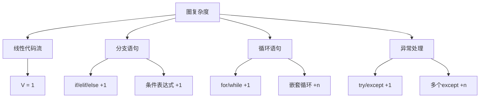

# 第 5 章：代码复杂度分析

::: tip 学习目标
- 理解圈复杂度的概念与计算方法
- 掌握 Pylint 的复杂度检查功能
- 学会分析和降低代码复杂度
- 掌握函数和类的设计原则
:::

### 知识点

#### 圈复杂度基础

圈复杂度是衡量程序复杂性的重要指标：



#### Pylint 复杂度检查类型

| 检查类型 | 消息ID | 默认阈值 | 描述 |
|----------|---------|----------|------|
| **圈复杂度** | R0911 | 12 | 函数/方法的圈复杂度 |
| **函数长度** | R0915 | 50 | 函数中的语句数量 |
| **参数数量** | R0913 | 5 | 函数参数个数 |
| **局部变量** | R0914 | 15 | 函数中局部变量数量 |
| **分支数量** | R0912 | 12 | 函数中分支数量 |
| **嵌套深度** | R0101 | 5 | 代码块嵌套层数 |

### 示例代码

#### 圈复杂度分析与优化

```python
# 高复杂度代码示例（圈复杂度 = 8）
def process_user_data(user_data):  # pylint: disable=too-many-branches
    """处理用户数据 - 高复杂度版本"""
    if not user_data:  # +1
        return None

    if 'email' not in user_data:  # +1
        if 'username' in user_data:  # +1
            email = f"{user_data['username']}@example.com"
        else:
            return None
    else:
        email = user_data['email']

    if '@' not in email:  # +1
        return None

    if user_data.get('age', 0) < 13:  # +1
        return None
    elif user_data.get('age', 0) > 120:  # +1
        return None

    if user_data.get('country') == 'CN':  # +1
        if user_data.get('id_card'):  # +1
            return {
                'email': email,
                'age': user_data['age'],
                'verified': True
            }

    return {
        'email': email,
        'age': user_data.get('age', 0),
        'verified': False
    }

# 复杂度分析：基础复杂度1 + 8个分支 = 9
```

```python
# 优化后的低复杂度代码（圈复杂度 = 4）
def process_user_data_optimized(user_data):
    """处理用户数据 - 优化版本"""
    if not user_data:  # +1
        return None

    email = _extract_email(user_data)
    if not email:  # +1
        return None

    age = user_data.get('age', 0)
    if not _is_valid_age(age):  # +1
        return None

    verified = _check_verification(user_data)

    return {
        'email': email,
        'age': age,
        'verified': verified
    }

def _extract_email(user_data):
    """提取用户邮箱"""
    if 'email' in user_data:
        email = user_data['email']
        return email if '@' in email else None

    if 'username' in user_data:  # +1
        return f"{user_data['username']}@example.com"

    return None

def _is_valid_age(age):
    """检查年龄有效性"""
    return 13 <= age <= 120

def _check_verification(user_data):
    """检查用户验证状态"""
    if user_data.get('country') == 'CN':  # +1
        return bool(user_data.get('id_card'))
    return False

# 主函数复杂度：1 + 3 = 4
# _extract_email复杂度：1 + 1 = 2
# _is_valid_age复杂度：1（没有分支）
# _check_verification复杂度：1 + 1 = 2
```

#### 函数长度优化

```python
# 过长函数示例（50+ 语句）
def generate_report(data):  # pylint: disable=too-many-statements
    """生成报告 - 过长版本"""
    # 数据验证（10行）
    if not data:
        raise ValueError("数据不能为空")
    if not isinstance(data, list):
        raise TypeError("数据必须是列表")
    if len(data) == 0:
        raise ValueError("数据列表不能为空")

    # 数据预处理（15行）
    cleaned_data = []
    for item in data:
        if isinstance(item, dict):
            if 'value' in item and 'category' in item:
                cleaned_item = {
                    'value': float(item['value']),
                    'category': str(item['category']).strip().lower(),
                    'timestamp': item.get('timestamp', 'unknown')
                }
                cleaned_data.append(cleaned_item)

    # 统计计算（20行）
    categories = {}
    total_value = 0
    max_value = float('-inf')
    min_value = float('inf')

    for item in cleaned_data:
        category = item['category']
        value = item['value']

        if category not in categories:
            categories[category] = {
                'count': 0,
                'total': 0,
                'values': []
            }

        categories[category]['count'] += 1
        categories[category]['total'] += value
        categories[category]['values'].append(value)

        total_value += value
        max_value = max(max_value, value)
        min_value = min(min_value, value)

    # 报告生成（15行）
    report = {
        'summary': {
            'total_items': len(cleaned_data),
            'total_value': total_value,
            'average_value': total_value / len(cleaned_data),
            'max_value': max_value,
            'min_value': min_value,
            'categories_count': len(categories)
        },
        'categories': {}
    }

    for category, stats in categories.items():
        report['categories'][category] = {
            'count': stats['count'],
            'total': stats['total'],
            'average': stats['total'] / stats['count'],
            'max': max(stats['values']),
            'min': min(stats['values'])
        }

    return report
```

```python
# 优化后的函数拆分
class ReportGenerator:
    """报告生成器"""

    def generate_report(self, data):
        """生成报告 - 主入口"""
        validated_data = self._validate_data(data)
        cleaned_data = self._preprocess_data(validated_data)
        statistics = self._calculate_statistics(cleaned_data)
        return self._format_report(statistics, cleaned_data)

    def _validate_data(self, data):
        """验证输入数据"""
        if not data:
            raise ValueError("数据不能为空")
        if not isinstance(data, list):
            raise TypeError("数据必须是列表")
        if len(data) == 0:
            raise ValueError("数据列表不能为空")
        return data

    def _preprocess_data(self, data):
        """预处理数据"""
        cleaned_data = []
        for item in data:
            if self._is_valid_item(item):
                cleaned_item = self._clean_item(item)
                cleaned_data.append(cleaned_item)
        return cleaned_data

    def _is_valid_item(self, item):
        """检查数据项是否有效"""
        return (isinstance(item, dict) and
                'value' in item and
                'category' in item)

    def _clean_item(self, item):
        """清理单个数据项"""
        return {
            'value': float(item['value']),
            'category': str(item['category']).strip().lower(),
            'timestamp': item.get('timestamp', 'unknown')
        }

    def _calculate_statistics(self, data):
        """计算统计信息"""
        categories = {}
        basic_stats = self._calculate_basic_stats(data)

        for item in data:
            category = item['category']
            if category not in categories:
                categories[category] = {
                    'count': 0,
                    'total': 0,
                    'values': []
                }

            categories[category]['count'] += 1
            categories[category]['total'] += item['value']
            categories[category]['values'].append(item['value'])

        return {
            'basic': basic_stats,
            'categories': categories
        }

    def _calculate_basic_stats(self, data):
        """计算基础统计信息"""
        values = [item['value'] for item in data]
        return {
            'total_items': len(data),
            'total_value': sum(values),
            'average_value': sum(values) / len(data),
            'max_value': max(values),
            'min_value': min(values)
        }

    def _format_report(self, statistics, data):
        """格式化报告输出"""
        report = {
            'summary': {
                **statistics['basic'],
                'categories_count': len(statistics['categories'])
            },
            'categories': {}
        }

        for category, stats in statistics['categories'].items():
            report['categories'][category] = {
                'count': stats['count'],
                'total': stats['total'],
                'average': stats['total'] / stats['count'],
                'max': max(stats['values']),
                'min': min(stats['values'])
            }

        return report
```

#### 参数数量优化

```python
# 过多参数的函数
def create_user_account(  # pylint: disable=too-many-arguments
    username, email, password, first_name, last_name,
    age, country, phone, address, postal_code,
    newsletter_subscription=True, marketing_emails=False):
    """创建用户账户 - 参数过多版本"""
    # 实现代码...
    pass

# 优化方案1：使用数据类
from dataclasses import dataclass
from typing import Optional

@dataclass
class UserProfile:
    """用户档案信息"""
    username: str
    email: str
    password: str
    first_name: str
    last_name: str
    age: int
    country: str
    phone: Optional[str] = None
    address: Optional[str] = None
    postal_code: Optional[str] = None

@dataclass
class UserPreferences:
    """用户偏好设置"""
    newsletter_subscription: bool = True
    marketing_emails: bool = False

def create_user_account_optimized(
    profile: UserProfile,
    preferences: UserPreferences = None):
    """创建用户账户 - 优化版本"""
    if preferences is None:
        preferences = UserPreferences()

    # 实现代码...
    return {
        'profile': profile,
        'preferences': preferences,
        'status': 'created'
    }

# 使用示例
profile = UserProfile(
    username="johndoe",
    email="john@example.com",
    password="secure_password",
    first_name="John",
    last_name="Doe",
    age=30,
    country="US"
)

preferences = UserPreferences(
    newsletter_subscription=False,
    marketing_emails=True
)

user = create_user_account_optimized(profile, preferences)
```

```python
# 优化方案2：使用配置字典
def create_user_account_dict(user_data: dict, preferences: dict = None):
    """创建用户账户 - 字典参数版本"""
    # 必需字段验证
    required_fields = [
        'username', 'email', 'password', 'first_name',
        'last_name', 'age', 'country'
    ]

    for field in required_fields:
        if field not in user_data:
            raise ValueError(f"缺少必需字段: {field}")

    # 默认偏好设置
    default_preferences = {
        'newsletter_subscription': True,
        'marketing_emails': False
    }

    if preferences:
        default_preferences.update(preferences)

    # 创建账户逻辑
    return {
        'user_data': user_data,
        'preferences': default_preferences,
        'status': 'created'
    }

# 使用示例
user_info = {
    'username': 'johndoe',
    'email': 'john@example.com',
    'password': 'secure_password',
    'first_name': 'John',
    'last_name': 'Doe',
    'age': 30,
    'country': 'US',
    'phone': '+1234567890'
}

user_prefs = {
    'newsletter_subscription': False,
    'marketing_emails': True
}

user = create_user_account_dict(user_info, user_prefs)
```

#### 局部变量数量优化

```python
# 局部变量过多的函数
def calculate_financial_metrics(data):  # pylint: disable=too-many-locals
    """计算财务指标 - 变量过多版本"""
    # 基础数据
    revenue = data['revenue']
    costs = data['costs']
    expenses = data['expenses']
    assets = data['assets']
    liabilities = data['liabilities']

    # 中间计算
    gross_profit = revenue - costs
    net_profit = gross_profit - expenses
    total_equity = assets - liabilities

    # 比率计算
    gross_margin = gross_profit / revenue if revenue > 0 else 0
    net_margin = net_profit / revenue if revenue > 0 else 0
    profit_margin = net_profit / revenue if revenue > 0 else 0

    # ROI相关
    roa = net_profit / assets if assets > 0 else 0
    roe = net_profit / total_equity if total_equity > 0 else 0

    # 流动性指标
    current_ratio = data.get('current_assets', 0) / data.get('current_liabilities', 1)
    quick_ratio = (data.get('current_assets', 0) - data.get('inventory', 0)) / data.get('current_liabilities', 1)

    # 效率指标
    asset_turnover = revenue / assets if assets > 0 else 0
    equity_turnover = revenue / total_equity if total_equity > 0 else 0

    return {
        'profitability': {
            'gross_margin': gross_margin,
            'net_margin': net_margin,
            'profit_margin': profit_margin
        },
        'returns': {
            'roa': roa,
            'roe': roe
        },
        'liquidity': {
            'current_ratio': current_ratio,
            'quick_ratio': quick_ratio
        },
        'efficiency': {
            'asset_turnover': asset_turnover,
            'equity_turnover': equity_turnover
        }
    }
```

```python
# 优化：使用类和方法拆分
class FinancialMetricsCalculator:
    """财务指标计算器"""

    def __init__(self, financial_data):
        """初始化财务数据"""
        self.data = financial_data
        self._validate_data()

    def _validate_data(self):
        """验证财务数据完整性"""
        required_fields = ['revenue', 'costs', 'expenses', 'assets', 'liabilities']
        for field in required_fields:
            if field not in self.data:
                raise ValueError(f"缺少必需的财务数据字段: {field}")

    def calculate_all_metrics(self):
        """计算所有财务指标"""
        return {
            'profitability': self.calculate_profitability(),
            'returns': self.calculate_returns(),
            'liquidity': self.calculate_liquidity(),
            'efficiency': self.calculate_efficiency()
        }

    def calculate_profitability(self):
        """计算盈利能力指标"""
        revenue = self.data['revenue']
        costs = self.data['costs']
        expenses = self.data['expenses']

        gross_profit = revenue - costs
        net_profit = gross_profit - expenses

        return {
            'gross_margin': self._safe_divide(gross_profit, revenue),
            'net_margin': self._safe_divide(net_profit, revenue),
            'profit_margin': self._safe_divide(net_profit, revenue)
        }

    def calculate_returns(self):
        """计算投资回报指标"""
        net_profit = self._get_net_profit()
        assets = self.data['assets']
        equity = self._get_total_equity()

        return {
            'roa': self._safe_divide(net_profit, assets),
            'roe': self._safe_divide(net_profit, equity)
        }

    def calculate_liquidity(self):
        """计算流动性指标"""
        current_assets = self.data.get('current_assets', 0)
        current_liabilities = self.data.get('current_liabilities', 1)
        inventory = self.data.get('inventory', 0)

        return {
            'current_ratio': self._safe_divide(current_assets, current_liabilities),
            'quick_ratio': self._safe_divide(current_assets - inventory, current_liabilities)
        }

    def calculate_efficiency(self):
        """计算效率指标"""
        revenue = self.data['revenue']
        assets = self.data['assets']
        equity = self._get_total_equity()

        return {
            'asset_turnover': self._safe_divide(revenue, assets),
            'equity_turnover': self._safe_divide(revenue, equity)
        }

    def _get_net_profit(self):
        """获取净利润"""
        return self.data['revenue'] - self.data['costs'] - self.data['expenses']

    def _get_total_equity(self):
        """获取总权益"""
        return self.data['assets'] - self.data['liabilities']

    @staticmethod
    def _safe_divide(numerator, denominator):
        """安全除法，避免除零错误"""
        return numerator / denominator if denominator != 0 else 0

# 使用示例
financial_data = {
    'revenue': 1000000,
    'costs': 600000,
    'expenses': 200000,
    'assets': 1500000,
    'liabilities': 800000,
    'current_assets': 500000,
    'current_liabilities': 300000,
    'inventory': 100000
}

calculator = FinancialMetricsCalculator(financial_data)
metrics = calculator.calculate_all_metrics()
```

#### 嵌套深度优化

```python
# 深度嵌套的代码
def process_nested_data(data):  # pylint: disable=too-many-nested-blocks
    """处理嵌套数据 - 深度嵌套版本"""
    results = []

    if data:
        for category in data:
            if 'items' in category:
                for item in category['items']:
                    if 'active' in item and item['active']:
                        if 'price' in item:
                            if item['price'] > 0:
                                if 'discount' in item:
                                    if item['discount'] > 0:
                                        final_price = item['price'] * (1 - item['discount'])
                                        if final_price > 10:
                                            results.append({
                                                'name': item.get('name', 'Unknown'),
                                                'final_price': final_price,
                                                'category': category.get('name', 'Uncategorized')
                                            })

    return results
```

```python
# 优化：减少嵌套深度
def process_nested_data_optimized(data):
    """处理嵌套数据 - 优化版本"""
    if not data:
        return []

    results = []
    for category in data:
        category_results = _process_category(category)
        results.extend(category_results)

    return results

def _process_category(category):
    """处理单个分类"""
    if 'items' not in category:
        return []

    results = []
    for item in category['items']:
        processed_item = _process_item(item, category)
        if processed_item:
            results.append(processed_item)

    return results

def _process_item(item, category):
    """处理单个商品"""
    # 早期返回，减少嵌套
    if not _is_valid_item(item):
        return None

    final_price = _calculate_final_price(item)
    if final_price is None or final_price <= 10:
        return None

    return {
        'name': item.get('name', 'Unknown'),
        'final_price': final_price,
        'category': category.get('name', 'Uncategorized')
    }

def _is_valid_item(item):
    """检查商品是否有效"""
    return (item.get('active', False) and
            'price' in item and
            item['price'] > 0)

def _calculate_final_price(item):
    """计算最终价格"""
    price = item['price']
    discount = item.get('discount', 0)

    if discount <= 0:
        return price

    return price * (1 - discount)
```

#### 配置复杂度阈值

```python
# .pylintrc 配置示例
"""
[DESIGN]
# 最大函数参数数量
max-args = 5

# 最大局部变量数量
max-locals = 15

# 最大返回语句数量
max-returns = 6

# 最大分支数量
max-branches = 12

# 最大语句数量
max-statements = 50

# 最大父类数量
max-parents = 7

# 最大属性数量
max-attributes = 7

# 最小公共方法数量
min-public-methods = 2

# 最大公共方法数量
max-public-methods = 20

# 最大布尔表达式数量
max-bool-expr = 5
"""

# 项目特定配置示例
def configure_complexity_for_project():
    """项目特定的复杂度配置示例"""
    # 对于数据处理项目，可能需要更宽松的配置
    data_processing_config = {
        'max-args': 8,  # 数据处理函数可能需要更多参数
        'max-locals': 20,  # 数据转换可能需要更多局部变量
        'max-statements': 60,  # 数据处理流程可能较长
    }

    # 对于web API项目，更严格的配置
    web_api_config = {
        'max-args': 4,  # API函数应该保持简单
        'max-locals': 10,  # 减少局部变量数量
        'max-statements': 30,  # 保持函数简洁
    }

    # 对于算法实现，可能需要特殊配置
    algorithm_config = {
        'max-branches': 15,  # 算法可能有更多分支
        'max-statements': 80,  # 算法实现可能较长
        'max-bool-expr': 8,  # 复杂条件判断
    }

    return {
        'data_processing': data_processing_config,
        'web_api': web_api_config,
        'algorithm': algorithm_config
    }
```

::: note 复杂度优化策略
1. **函数拆分**：将大函数分解为多个小函数
2. **提取方法**：将重复逻辑提取为独立方法
3. **早期返回**：使用早期返回减少嵌套
4. **数据结构优化**：使用合适的数据结构减少复杂度
5. **设计模式**：应用设计模式简化复杂逻辑
:::

::: warning 注意事项
1. **不要过度拆分**：避免创建过多的微小函数
2. **保持逻辑完整性**：拆分时保持相关逻辑的完整性
3. **考虑可读性**：优化后的代码应该更易理解
4. **权衡性能**：避免过度拆分影响性能
:::

代码复杂度控制是提高代码质量的重要手段，通过合理的重构和设计，可以显著提升代码的可维护性和可读性。