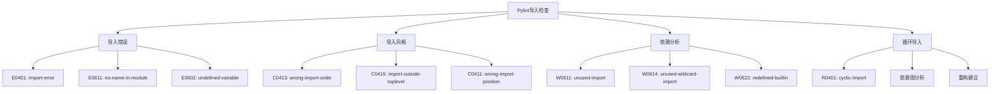

# 第 6 章：导入分析与依赖管理

::: tip 学习目标
- 掌握 Python 导入系统的最佳实践
- 理解 Pylint 的导入检查功能
- 学会分析和优化模块依赖关系
- 掌握循环导入的检测与解决
:::

### 知识点

#### 导入相关检查类型



#### Python 导入优先级

| 优先级 | 导入类型 | 示例 | 说明 |
|--------|----------|------|------|
| **1** | 标准库 | `import os, sys` | Python 内置标准库 |
| **2** | 第三方库 | `import requests, numpy` | 通过 pip 安装的包 |
| **3** | 本地模块 | `from .utils import helper` | 项目内部模块 |

### 示例代码

#### 导入顺序和风格规范

```python
# 错误的导入顺序和风格
import requests  # 第三方库
import os        # 标准库 - 顺序错误
from myproject.utils import helper  # 本地模块
import sys       # 标准库 - 位置错误
from numpy import array  # 第三方库 - 位置错误

def some_function():
    import json  # C0415: import-outside-toplevel
    return json.dumps({})
```

```python
# 正确的导入顺序和风格
"""
模块功能描述

这个模块演示正确的导入风格和顺序。
"""

# 1. 标准库导入
import json
import os
import sys
from pathlib import Path
from typing import Dict, List, Optional

# 2. 第三方库导入
import numpy as np
import pandas as pd
import requests
from flask import Flask, request

# 3. 本地模块导入
from myproject.config import settings
from myproject.database import DatabaseManager
from myproject.utils import helper_function

# 模块级常量
DEFAULT_TIMEOUT = 30
MAX_RETRIES = 3


class ApiClient:
    """API客户端类"""

    def __init__(self):
        self.session = requests.Session()
        self.base_url = settings.API_BASE_URL

    def fetch_data(self) -> Dict:
        """获取数据"""
        # 所有导入都在模块顶部
        response = self.session.get(
            f"{self.base_url}/data",
            timeout=DEFAULT_TIMEOUT
        )
        return response.json()
```

#### 处理导入错误

```python
# 导入错误示例和解决方案

# E0401: import-error - 模块不存在
try:
    import nonexistent_module  # 会触发 import-error
except ImportError:
    nonexistent_module = None

# 更好的处理方式
try:
    import optional_dependency
    HAS_OPTIONAL_DEPENDENCY = True
except ImportError:
    HAS_OPTIONAL_DEPENDENCY = False
    optional_dependency = None

def use_optional_feature():
    """使用可选依赖的功能"""
    if not HAS_OPTIONAL_DEPENDENCY:
        raise ImportError("需要安装 optional_dependency")
    return optional_dependency.some_function()

# E0611: no-name-in-module - 模块中没有指定名称
try:
    from json import nonexistent_function  # 会触发错误
except ImportError:
    def nonexistent_function():
        raise NotImplementedError("函数不可用")

# 正确的导入验证
def safe_import_from_module():
    """安全导入模块成员"""
    import json

    # 检查属性是否存在
    if hasattr(json, 'dumps'):
        return json.dumps
    else:
        raise ImportError("json.dumps 不可用")
```

#### 未使用导入的处理

```python
# W0611: unused-import - 未使用的导入

# 错误示例：导入但未使用
import os           # 未使用
import sys          # 未使用
import json         # 使用了
from typing import List, Dict, Optional  # Optional 未使用

def process_data(data: List[Dict]) -> str:
    """处理数据"""
    return json.dumps(data)

# 修复方案1：移除未使用的导入
import json
from typing import Dict, List

def process_data(data: List[Dict]) -> str:
    """处理数据"""
    return json.dumps(data)

# 修复方案2：对于有条件使用的导入，添加 noqa 注释
import os  # noqa: F401  # 在某些条件下使用
import sys  # pylint: disable=unused-import  # 动态使用

def get_platform_info():
    """获取平台信息"""
    if sys.platform.startswith('win'):
        return os.path.join('C:', 'Windows')
    return '/usr/local'

# 修复方案3：使用 __all__ 控制导出
import logging
import threading
from datetime import datetime

__all__ = ['Logger', 'get_timestamp']  # 明确导出内容

class Logger:
    """日志记录器"""

    def __init__(self):
        self.logger = logging.getLogger(__name__)
        self.lock = threading.Lock()

    def log(self, message: str):
        """记录日志"""
        with self.lock:
            self.logger.info(f"{datetime.now()}: {message}")

def get_timestamp() -> str:
    """获取时间戳"""
    return datetime.now().isoformat()
```

#### 通配符导入的问题

```python
# W0614: unused-wildcard-import - 未使用的通配符导入

# 错误示例：通配符导入
from math import *        # 导入所有，但可能只用部分
from os.path import *     # 污染命名空间
from mymodule import *    # 不清楚导入了什么

def calculate_area(radius):
    """计算圆面积"""
    return pi * radius ** 2  # pi 来自 math.*

# 修复方案1：明确导入需要的内容
import math
from os.path import join, exists
from mymodule import specific_function, SpecificClass

def calculate_area(radius):
    """计算圆面积"""
    return math.pi * radius ** 2

def process_file(filename):
    """处理文件"""
    filepath = join('/tmp', filename)
    if exists(filepath):
        return specific_function(filepath)
    return None

# 修复方案2：使用别名避免冲突
import math as m
import numpy as np
from mymodule import helper as my_helper

def scientific_calculation(data):
    """科学计算"""
    # 清楚地知道函数来源
    result1 = m.sqrt(data)
    result2 = np.sqrt(data)
    result3 = my_helper.process(data)
    return result1, result2, result3

# 修复方案3：受控的通配符导入（仅在模块设计时使用）
# 在 constants.py 中
PI = 3.14159
E = 2.71828
GOLDEN_RATIO = 1.618

__all__ = ['PI', 'E', 'GOLDEN_RATIO']  # 明确导出内容

# 在使用模块中
from constants import *  # 这里是安全的，因为有 __all__ 控制

def calculate_circle_area(radius):
    """计算圆面积"""
    return PI * radius ** 2
```

#### 循环导入检测与解决

```python
# R0401: cyclic-import - 循环导入

# 问题示例：循环导入
# file: models/user.py
from models.order import Order  # 导入 Order

class User:
    """用户模型"""

    def __init__(self, user_id):
        self.user_id = user_id
        self.orders = []

    def add_order(self, order: Order):
        """添加订单"""
        self.orders.append(order)

# file: models/order.py
from models.user import User  # 导入 User - 形成循环

class Order:
    """订单模型"""

    def __init__(self, order_id, user: User):
        self.order_id = order_id
        self.user = user

# 解决方案1：使用类型注解的字符串形式（延迟求值）
# file: models/user.py
from typing import TYPE_CHECKING, List

if TYPE_CHECKING:
    from models.order import Order  # 只在类型检查时导入

class User:
    """用户模型"""

    def __init__(self, user_id: str):
        self.user_id = user_id
        self.orders: List['Order'] = []  # 使用字符串形式的类型注解

    def add_order(self, order: 'Order'):
        """添加订单"""
        self.orders.append(order)

# file: models/order.py
from models.user import User

class Order:
    """订单模型"""

    def __init__(self, order_id: str, user: User):
        self.order_id = order_id
        self.user = user

# 解决方案2：重构为共同的基础模块
# file: models/base.py
from typing import Protocol

class UserProtocol(Protocol):
    """用户协议"""
    user_id: str

class OrderProtocol(Protocol):
    """订单协议"""
    order_id: str
    user: UserProtocol

# file: models/user.py
from typing import List
from models.base import OrderProtocol

class User:
    """用户模型"""

    def __init__(self, user_id: str):
        self.user_id = user_id
        self.orders: List[OrderProtocol] = []

    def add_order(self, order: OrderProtocol):
        """添加订单"""
        self.orders.append(order)

# file: models/order.py
from models.base import UserProtocol

class Order:
    """订单模型"""

    def __init__(self, order_id: str, user: UserProtocol):
        self.order_id = order_id
        self.user = user

# 解决方案3：使用依赖注入
# file: services/user_service.py
class UserService:
    """用户服务"""

    def __init__(self):
        self.users = {}

    def create_user(self, user_id: str):
        """创建用户"""
        from models.user import User
        user = User(user_id)
        self.users[user_id] = user
        return user

    def add_order_to_user(self, user_id: str, order):
        """为用户添加订单"""
        if user_id in self.users:
            self.users[user_id].add_order(order)

# file: services/order_service.py
class OrderService:
    """订单服务"""

    def __init__(self, user_service):
        self.user_service = user_service
        self.orders = {}

    def create_order(self, order_id: str, user_id: str):
        """创建订单"""
        from models.order import Order
        user = self.user_service.users.get(user_id)
        if user:
            order = Order(order_id, user)
            self.orders[order_id] = order
            self.user_service.add_order_to_user(user_id, order)
            return order
        return None
```

#### 相对导入与绝对导入

```python
# 项目结构示例
"""
myproject/
├── __init__.py
├── main.py
├── config/
│   ├── __init__.py
│   └── settings.py
├── utils/
│   ├── __init__.py
│   ├── helpers.py
│   └── validators.py
└── api/
    ├── __init__.py
    ├── views.py
    └── models.py
"""

# 错误的导入方式
# file: api/views.py
import config.settings        # 可能有问题
from utils import helpers     # 可能有问题
import api.models            # 自我引用

# 正确的绝对导入
# file: api/views.py
from myproject.config import settings
from myproject.utils import helpers
from myproject.api import models

class ApiView:
    """API视图类"""

    def __init__(self):
        self.config = settings.get_config()
        self.helper = helpers.ApiHelper()

# 正确的相对导入（在包内部使用）
# file: api/views.py
from ..config import settings      # 相对导入上级包
from ..utils import helpers       # 相对导入同级包
from . import models              # 相对导入同级模块

class ApiView:
    """API视图类"""

    def __init__(self):
        self.config = settings.get_config()
        self.helper = helpers.ApiHelper()
        self.model = models.ApiModel()

# 相对导入的最佳实践
# file: utils/helpers.py
from .validators import validate_email, validate_phone  # 同级模块
from ..config.settings import DEBUG_MODE               # 上级包

class ApiHelper:
    """API助手类"""

    def process_user_input(self, email: str, phone: str):
        """处理用户输入"""
        if DEBUG_MODE:
            print(f"Processing: {email}, {phone}")

        if not validate_email(email):
            raise ValueError("无效的邮箱格式")

        if not validate_phone(phone):
            raise ValueError("无效的电话格式")

        return {'email': email, 'phone': phone}
```

#### 动态导入处理

```python
# 动态导入的正确处理方式

import importlib
from typing import Any, Optional

class PluginManager:
    """插件管理器"""

    def __init__(self):
        self.plugins = {}
        self.loaded_modules = {}

    def load_plugin(self, plugin_name: str, module_path: str) -> Optional[Any]:
        """动态加载插件"""
        try:
            # 使用 importlib 进行动态导入
            module = importlib.import_module(module_path)

            # 验证模块是否有期望的接口
            if not hasattr(module, 'Plugin'):
                raise ImportError(f"{module_path} 没有 Plugin 类")

            plugin_class = getattr(module, 'Plugin')
            plugin_instance = plugin_class()

            # 验证插件接口
            required_methods = ['initialize', 'execute', 'cleanup']
            for method in required_methods:
                if not hasattr(plugin_instance, method):
                    raise ImportError(f"插件缺少必需方法: {method}")

            self.plugins[plugin_name] = plugin_instance
            self.loaded_modules[plugin_name] = module

            return plugin_instance

        except ImportError as e:
            print(f"加载插件失败 {plugin_name}: {e}")
            return None

    def reload_plugin(self, plugin_name: str):
        """重新加载插件"""
        if plugin_name in self.loaded_modules:
            module = self.loaded_modules[plugin_name]
            importlib.reload(module)

            # 重新创建插件实例
            plugin_class = getattr(module, 'Plugin')
            self.plugins[plugin_name] = plugin_class()

# 条件导入的处理
def get_json_encoder():
    """获取JSON编码器"""
    # 优先使用更快的ujson
    try:
        import ujson as json_module
        encoder_type = 'ujson'
    except ImportError:
        try:
            import orjson as json_module
            encoder_type = 'orjson'
        except ImportError:
            import json as json_module
            encoder_type = 'json'

    return json_module, encoder_type

# 版本兼容的导入处理
def import_with_fallback():
    """带降级的导入"""
    try:
        # Python 3.8+
        from functools import cached_property
        PropertyCache = cached_property
    except ImportError:
        # Python < 3.8 的兼容实现
        class PropertyCache:
            def __init__(self, func):
                self.func = func
                self.__doc__ = func.__doc__

            def __get__(self, obj, cls):
                if obj is None:
                    return self
                value = self.func(obj)
                setattr(obj, self.func.__name__, value)
                return value

    return PropertyCache
```

#### 导入优化工具和脚本

```python
# 导入分析和优化工具

import ast
import sys
from pathlib import Path
from typing import Dict, List, Set

class ImportAnalyzer:
    """导入分析器"""

    def __init__(self, project_root: str):
        self.project_root = Path(project_root)
        self.imports_map: Dict[str, Set[str]] = {}
        self.unused_imports: Dict[str, List[str]] = {}

    def analyze_file(self, file_path: Path) -> Dict:
        """分析单个文件的导入"""
        with open(file_path, 'r', encoding='utf-8') as f:
            tree = ast.parse(f.read())

        imports = []
        used_names = set()

        for node in ast.walk(tree):
            if isinstance(node, ast.Import):
                for alias in node.names:
                    imports.append({
                        'type': 'import',
                        'module': alias.name,
                        'alias': alias.asname,
                        'line': node.lineno
                    })

            elif isinstance(node, ast.ImportFrom):
                for alias in node.names:
                    imports.append({
                        'type': 'from_import',
                        'module': node.module,
                        'name': alias.name,
                        'alias': alias.asname,
                        'line': node.lineno
                    })

            elif isinstance(node, ast.Name):
                used_names.add(node.id)

        return {
            'imports': imports,
            'used_names': used_names,
            'file_path': str(file_path)
        }

    def find_unused_imports(self, analysis: Dict) -> List[str]:
        """查找未使用的导入"""
        unused = []
        imports = analysis['imports']
        used_names = analysis['used_names']

        for imp in imports:
            if imp['type'] == 'import':
                name = imp['alias'] or imp['module'].split('.')[0]
                if name not in used_names:
                    unused.append(f"Line {imp['line']}: import {imp['module']}")

            elif imp['type'] == 'from_import':
                name = imp['alias'] or imp['name']
                if name not in used_names and imp['name'] != '*':
                    unused.append(f"Line {imp['line']}: from {imp['module']} import {imp['name']}")

        return unused

    def analyze_project(self) -> Dict:
        """分析整个项目"""
        results = {}

        for py_file in self.project_root.rglob('*.py'):
            if '__pycache__' in str(py_file):
                continue

            try:
                analysis = self.analyze_file(py_file)
                unused = self.find_unused_imports(analysis)

                results[str(py_file)] = {
                    'analysis': analysis,
                    'unused_imports': unused
                }
            except Exception as e:
                print(f"分析文件出错 {py_file}: {e}")

        return results

# 使用示例
def main():
    """主函数"""
    if len(sys.argv) != 2:
        print("用法: python import_analyzer.py <project_path>")
        return

    project_path = sys.argv[1]
    analyzer = ImportAnalyzer(project_path)
    results = analyzer.analyze_project()

    print("=== 导入分析报告 ===")
    for file_path, data in results.items():
        unused = data['unused_imports']
        if unused:
            print(f"\n文件: {file_path}")
            for item in unused:
                print(f"  未使用导入: {item}")

if __name__ == "__main__":
    main()
```

#### 配置导入检查规则

```python
# .pylintrc 中的导入相关配置示例

"""
[IMPORTS]
# 已知的第三方库（用于导入顺序检查）
known-third-party = requests,numpy,pandas,flask,django

# 已知的标准库模块
known-standard-library = os,sys,json,re,math

# 分析导入图
analyse-fallback-blocks = no

# 导入图输出格式
import-graph =

# 外部导入图输出格式
ext-import-graph =

# 内部导入图输出格式
int-import-graph =

# 首选模块的优先顺序
preferred-modules =

# 允许通配符导入的模块
allow-wildcard-with-all = no

# 最小公共模块
init-import = no

# 强制导入顺序
import-order-style = pep8

[MESSAGES CONTROL]
# 禁用特定的导入相关检查
disable =
    import-error,          # 在某些环境下可能需要禁用
    no-name-in-module,     # 动态模块可能需要禁用
    unused-import,         # 在某些情况下可能需要保留
"""

# 项目特定的导入配置
def configure_import_rules():
    """配置项目特定的导入规则"""

    # Web项目配置
    web_project_config = {
        'known-third-party': [
            'flask', 'django', 'fastapi', 'requests',
            'sqlalchemy', 'redis', 'celery'
        ],
        'import-order-style': 'pep8',
        'allow-wildcard-with-all': False
    }

    # 数据科学项目配置
    datascience_config = {
        'known-third-party': [
            'numpy', 'pandas', 'scipy', 'sklearn',
            'matplotlib', 'seaborn', 'jupyter'
        ],
        'allow-wildcard-with-all': True,  # 某些科学计算库可能需要
        'preferred-modules': ['numpy:np', 'pandas:pd']
    }

    # 微服务项目配置
    microservice_config = {
        'known-third-party': [
            'fastapi', 'pydantic', 'uvicorn', 'httpx',
            'docker', 'kubernetes', 'prometheus'
        ],
        'analyse-fallback-blocks': True,
        'import-order-style': 'pep8'
    }

    return {
        'web_project': web_project_config,
        'datascience': datascience_config,
        'microservice': microservice_config
    }
```

::: note 导入最佳实践
1. **遵循 PEP8 导入顺序**：标准库 → 第三方库 → 本地模块
2. **明确导入**：避免使用通配符导入（`from module import *`）
3. **相对导入规范**：在包内使用相对导入，包外使用绝对导入
4. **延迟导入**：仅在必要时使用函数内导入
5. **循环依赖检测**：定期检查和重构循环导入
:::

::: warning 注意事项
1. **性能影响**：过多的导入会影响启动时间
2. **命名空间污染**：避免通配符导入污染命名空间
3. **版本兼容性**：处理好不同版本库的导入兼容
4. **动态导入风险**：谨慎使用动态导入，确保错误处理
:::

良好的导入管理是Python项目可维护性的重要基础，通过Pylint的导入检查可以有效提升代码质量。