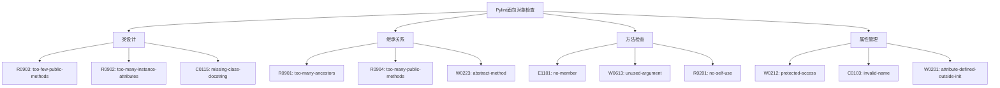

# 第 7 章：类与面向对象检查

::: tip 学习目标
- 掌握 Pylint 的面向对象编程检查功能
- 理解类设计的最佳实践和常见问题
- 学会分析和优化类的结构与继承关系
- 掌握抽象类和接口的正确使用
:::

### 知识点

#### 类相关检查类型



#### 类设计原则

| 原则 | 描述 | Pylint检查 |
|------|------|------------|
| **单一职责** | 类应该只有一个变化的原因 | too-many-public-methods |
| **开闭原则** | 对扩展开放，对修改关闭 | - |
| **里氏替换** | 子类必须能够替换父类 | abstract-method |
| **接口隔离** | 客户端不应依赖不需要的接口 | too-few-public-methods |
| **依赖倒置** | 依赖抽象而不是具体实现 | - |

### 示例代码

#### 类设计问题与优化

```python
# R0903: too-few-public-methods - 公共方法过少
class BadDataContainer:  # pylint: disable=too-few-public-methods
    """错误的数据容器设计"""

    def __init__(self, data):
        self.data = data

    def get_data(self):
        """获取数据"""
        return self.data

# 修复方案1：使用数据类或命名元组
from dataclasses import dataclass
from typing import Any

@dataclass
class DataContainer:
    """数据容器 - 使用数据类"""
    data: Any

    def process_data(self):
        """处理数据"""
        return f"Processed: {self.data}"

    def validate_data(self):
        """验证数据"""
        return self.data is not None

    def serialize_data(self):
        """序列化数据"""
        return str(self.data)

# 修复方案2：添加更多相关方法
class ImprovedDataContainer:
    """改进的数据容器"""

    def __init__(self, data):
        self._data = data
        self._metadata = {}

    def get_data(self):
        """获取数据"""
        return self._data

    def set_data(self, data):
        """设置数据"""
        self._data = data

    def add_metadata(self, key, value):
        """添加元数据"""
        self._metadata[key] = value

    def get_metadata(self, key):
        """获取元数据"""
        return self._metadata.get(key)

    def clear(self):
        """清空数据"""
        self._data = None
        self._metadata.clear()

    def is_empty(self):
        """检查是否为空"""
        return self._data is None

# 修复方案3：考虑是否真的需要类
# 如果只是简单的数据存储，可能不需要类
def create_data_container(data):
    """创建数据容器 - 函数式方法"""
    return {
        'data': data,
        'metadata': {},
        'created_at': __import__('datetime').datetime.now()
    }

def process_container_data(container):
    """处理容器数据"""
    return f"Processed: {container['data']}"
```

```python
# R0902: too-many-instance-attributes - 实例属性过多
class BadUserProfile:  # pylint: disable=too-many-instance-attributes
    """错误的用户配置设计"""

    def __init__(self, user_id, username, email, first_name, last_name,
                 age, phone, address, city, country, postal_code,
                 job_title, company, department, salary, hire_date):
        # 16个属性，超过默认的7个限制
        self.user_id = user_id
        self.username = username
        self.email = email
        self.first_name = first_name
        self.last_name = last_name
        self.age = age
        self.phone = phone
        self.address = address
        self.city = city
        self.country = country
        self.postal_code = postal_code
        self.job_title = job_title
        self.company = company
        self.department = department
        self.salary = salary
        self.hire_date = hire_date

# 修复方案1：使用组合模式
@dataclass
class PersonalInfo:
    """个人信息"""
    first_name: str
    last_name: str
    age: int
    phone: str

@dataclass
class AddressInfo:
    """地址信息"""
    address: str
    city: str
    country: str
    postal_code: str

@dataclass
class EmploymentInfo:
    """就业信息"""
    job_title: str
    company: str
    department: str
    salary: float
    hire_date: str

class UserProfile:
    """用户配置 - 使用组合"""

    def __init__(self, user_id: str, username: str, email: str):
        self.user_id = user_id
        self.username = username
        self.email = email
        self.personal_info: PersonalInfo = None
        self.address_info: AddressInfo = None
        self.employment_info: EmploymentInfo = None

    def set_personal_info(self, personal_info: PersonalInfo):
        """设置个人信息"""
        self.personal_info = personal_info

    def set_address_info(self, address_info: AddressInfo):
        """设置地址信息"""
        self.address_info = address_info

    def set_employment_info(self, employment_info: EmploymentInfo):
        """设置就业信息"""
        self.employment_info = employment_info

    def get_full_name(self):
        """获取全名"""
        if self.personal_info:
            return f"{self.personal_info.first_name} {self.personal_info.last_name}"
        return self.username

    def get_display_address(self):
        """获取显示地址"""
        if self.address_info:
            return f"{self.address_info.city}, {self.address_info.country}"
        return "地址未设置"

# 修复方案2：使用继承和混入
class BaseUser:
    """基础用户类"""

    def __init__(self, user_id: str, username: str, email: str):
        self.user_id = user_id
        self.username = username
        self.email = email

class PersonalInfoMixin:
    """个人信息混入"""

    def __init__(self):
        self._personal_data = {}

    def set_personal_info(self, first_name, last_name, age, phone):
        """设置个人信息"""
        self._personal_data.update({
            'first_name': first_name,
            'last_name': last_name,
            'age': age,
            'phone': phone
        })

    def get_full_name(self):
        """获取全名"""
        return f"{self._personal_data.get('first_name', '')} {self._personal_data.get('last_name', '')}".strip()

class AddressMixin:
    """地址混入"""

    def __init__(self):
        self._address_data = {}

    def set_address(self, address, city, country, postal_code):
        """设置地址"""
        self._address_data.update({
            'address': address,
            'city': city,
            'country': country,
            'postal_code': postal_code
        })

    def get_display_address(self):
        """获取显示地址"""
        city = self._address_data.get('city', '')
        country = self._address_data.get('country', '')
        return f"{city}, {country}" if city and country else "地址未设置"

class ExtendedUserProfile(BaseUser, PersonalInfoMixin, AddressMixin):
    """扩展用户配置"""

    def __init__(self, user_id: str, username: str, email: str):
        BaseUser.__init__(self, user_id, username, email)
        PersonalInfoMixin.__init__(self)
        AddressMixin.__init__(self)
```

#### 继承关系优化

```python
# R0901: too-many-ancestors - 祖先类过多
class Level1:
    """层级1"""
    pass

class Level2(Level1):
    """层级2"""
    pass

class Level3(Level2):
    """层级3"""
    pass

class Level4(Level3):
    """层级4"""
    pass

class Level5(Level4):
    """层级5"""
    pass

class Level6(Level5):
    """层级6"""
    pass

class Level7(Level6):
    """层级7"""
    pass

class BadDeepInheritance(Level7):  # pylint: disable=too-many-ancestors
    """错误的深度继承"""
    pass

# 修复方案1：使用组合替代继承
from abc import ABC, abstractmethod

class Drawable(ABC):
    """可绘制接口"""

    @abstractmethod
    def draw(self):
        """绘制"""
        pass

class Movable(ABC):
    """可移动接口"""

    @abstractmethod
    def move(self, x, y):
        """移动"""
        pass

class Resizable(ABC):
    """可调整大小接口"""

    @abstractmethod
    def resize(self, width, height):
        """调整大小"""
        pass

class Shape:
    """基础形状类"""

    def __init__(self, x=0, y=0):
        self.x = x
        self.y = y

class Rectangle(Shape, Drawable, Movable, Resizable):
    """矩形 - 使用多重继承接口"""

    def __init__(self, x=0, y=0, width=0, height=0):
        super().__init__(x, y)
        self.width = width
        self.height = height

    def draw(self):
        """绘制矩形"""
        return f"Drawing rectangle at ({self.x}, {self.y}) with size {self.width}x{self.height}"

    def move(self, x, y):
        """移动矩形"""
        self.x = x
        self.y = y

    def resize(self, width, height):
        """调整矩形大小"""
        self.width = width
        self.height = height

# 修复方案2：使用组合模式
class RenderEngine:
    """渲染引擎"""

    def render(self, shape):
        """渲染形状"""
        return f"Rendering {shape}"

class AnimationController:
    """动画控制器"""

    def animate_move(self, obj, target_x, target_y):
        """动画移动"""
        return f"Animating move to ({target_x}, {target_y})"

class TransformManager:
    """变换管理器"""

    def apply_transform(self, obj, transform):
        """应用变换"""
        return f"Applying transform: {transform}"

class CompositeShape:
    """组合形状类"""

    def __init__(self, x=0, y=0):
        self.x = x
        self.y = y
        self.render_engine = RenderEngine()
        self.animation_controller = AnimationController()
        self.transform_manager = TransformManager()

    def draw(self):
        """绘制"""
        return self.render_engine.render(self)

    def move(self, x, y):
        """移动"""
        return self.animation_controller.animate_move(self, x, y)

    def resize(self, width, height):
        """调整大小"""
        transform = f"scale({width}, {height})"
        return self.transform_manager.apply_transform(self, transform)
```

#### 方法和属性检查

```python
# R0201: no-self-use - 方法不使用self
class BadMathUtils:
    """错误的数学工具类"""

    def __init__(self, precision=2):
        self.precision = precision

    def add_numbers(self, a, b):  # pylint: disable=no-self-use
        """加法 - 没有使用self"""
        return a + b

    def multiply_numbers(self, a, b):  # pylint: disable=no-self-use
        """乘法 - 没有使用self"""
        return a * b

    def format_number(self, number):
        """格式化数字 - 正确使用self"""
        return round(number, self.precision)

# 修复方案1：将静态方法声明为静态方法
class MathUtils:
    """数学工具类"""

    def __init__(self, precision=2):
        self.precision = precision

    @staticmethod
    def add_numbers(a, b):
        """加法 - 静态方法"""
        return a + b

    @staticmethod
    def multiply_numbers(a, b):
        """乘法 - 静态方法"""
        return a * b

    def format_number(self, number):
        """格式化数字 - 实例方法"""
        return round(number, self.precision)

    @classmethod
    def create_with_precision(cls, precision):
        """创建指定精度的实例 - 类方法"""
        return cls(precision)

# 修复方案2：重构为模块级函数
def add_numbers(a, b):
    """加法函数"""
    return a + b

def multiply_numbers(a, b):
    """乘法函数"""
    return a * b

class NumberFormatter:
    """数字格式化器"""

    def __init__(self, precision=2):
        self.precision = precision

    def format_number(self, number):
        """格式化数字"""
        return round(number, self.precision)

# W0212: protected-access - 访问保护成员
class BadAccessExample:
    """错误的访问示例"""

    def __init__(self):
        self._protected_value = 10
        self.__private_value = 20

    def get_value(self):
        """获取值"""
        return self._protected_value

class BadClient:
    """错误的客户端"""

    def __init__(self):
        self.example = BadAccessExample()

    def bad_access(self):
        """错误的访问方式"""
        return self.example._protected_value  # pylint: disable=protected-access

# 修复方案：提供公共接口
class GoodAccessExample:
    """正确的访问示例"""

    def __init__(self):
        self._protected_value = 10
        self.__private_value = 20

    def get_value(self):
        """获取值 - 公共接口"""
        return self._protected_value

    def set_value(self, value):
        """设置值 - 公共接口"""
        if self._validate_value(value):
            self._protected_value = value

    def _validate_value(self, value):
        """验证值 - 受保护方法"""
        return isinstance(value, (int, float)) and value >= 0

    @property
    def value(self):
        """值属性"""
        return self._protected_value

    @value.setter
    def value(self, value):
        """设置值属性"""
        self.set_value(value)

class GoodClient:
    """正确的客户端"""

    def __init__(self):
        self.example = GoodAccessExample()

    def good_access(self):
        """正确的访问方式"""
        return self.example.get_value()  # 使用公共接口

    def good_property_access(self):
        """正确的属性访问"""
        return self.example.value  # 使用属性
```

#### 抽象类和接口设计

```python
# W0223: abstract-method - 抽象方法未实现
from abc import ABC, abstractmethod
from typing import Protocol

# 错误示例：抽象方法未实现
class BadAnimal(ABC):
    """错误的动物类"""

    @abstractmethod
    def make_sound(self):
        """发出声音"""
        pass

    @abstractmethod
    def move(self):
        """移动"""
        pass

class BadDog(BadAnimal):  # pylint: disable=abstract-method
    """错误的狗类 - 未实现所有抽象方法"""

    def make_sound(self):
        """发出声音"""
        return "Woof!"

    # 缺少 move 方法的实现

# 正确示例：完整实现抽象方法
class Animal(ABC):
    """动物抽象类"""

    def __init__(self, name: str):
        self.name = name

    @abstractmethod
    def make_sound(self):
        """发出声音"""
        pass

    @abstractmethod
    def move(self):
        """移动"""
        pass

    def introduce(self):
        """自我介绍 - 具体方法"""
        return f"I am {self.name}"

class Dog(Animal):
    """狗类 - 完整实现"""

    def make_sound(self):
        """发出声音"""
        return "Woof!"

    def move(self):
        """移动"""
        return "Running on four legs"

class Bird(Animal):
    """鸟类 - 完整实现"""

    def make_sound(self):
        """发出声音"""
        return "Tweet!"

    def move(self):
        """移动"""
        return "Flying with wings"

# 使用Protocol进行类型检查
class Drawable(Protocol):
    """可绘制协议"""

    def draw(self) -> str:
        """绘制"""
        ...

    def get_bounds(self) -> tuple:
        """获取边界"""
        ...

class Circle:
    """圆形 - 实现Drawable协议"""

    def __init__(self, radius: float):
        self.radius = radius

    def draw(self) -> str:
        """绘制圆形"""
        return f"Drawing circle with radius {self.radius}"

    def get_bounds(self) -> tuple:
        """获取边界"""
        return (0, 0, self.radius * 2, self.radius * 2)

class Square:
    """正方形 - 实现Drawable协议"""

    def __init__(self, side: float):
        self.side = side

    def draw(self) -> str:
        """绘制正方形"""
        return f"Drawing square with side {self.side}"

    def get_bounds(self) -> tuple:
        """获取边界"""
        return (0, 0, self.side, self.side)

def render_shape(shape: Drawable) -> str:
    """渲染形状"""
    bounds = shape.get_bounds()
    drawing = shape.draw()
    return f"{drawing} at bounds {bounds}"
```

#### 属性和描述符

```python
# W0201: attribute-defined-outside-init - 在__init__外定义属性
class BadAttributeExample:
    """错误的属性示例"""

    def __init__(self, name):
        self.name = name
        # 缺少 age 属性的初始化

    def set_age(self, age):
        """设置年龄"""
        self.age = age  # pylint: disable=attribute-defined-outside-init

    def get_info(self):
        """获取信息"""
        # 这里可能会出现 AttributeError
        return f"{self.name} is {self.age} years old"

# 修复方案1：在__init__中初始化所有属性
class GoodAttributeExample:
    """正确的属性示例"""

    def __init__(self, name, age=None):
        self.name = name
        self.age = age

    def set_age(self, age):
        """设置年龄"""
        self.age = age

    def get_info(self):
        """获取信息"""
        if self.age is not None:
            return f"{self.name} is {self.age} years old"
        return f"{self.name} (age unknown)"

# 修复方案2：使用属性装饰器
class PropertyExample:
    """属性装饰器示例"""

    def __init__(self, name):
        self.name = name
        self._age = None

    @property
    def age(self):
        """年龄属性"""
        return self._age

    @age.setter
    def age(self, value):
        """设置年龄"""
        if value is not None and value < 0:
            raise ValueError("年龄不能为负数")
        self._age = value

    @property
    def info(self):
        """信息属性"""
        if self.age is not None:
            return f"{self.name} is {self.age} years old"
        return f"{self.name} (age unknown)"

# 使用描述符进行高级属性管理
class ValidatedAttribute:
    """验证属性描述符"""

    def __init__(self, name, validator=None):
        self.name = name
        self.validator = validator

    def __get__(self, obj, objtype=None):
        if obj is None:
            return self
        return getattr(obj, f"_{self.name}", None)

    def __set__(self, obj, value):
        if self.validator and not self.validator(value):
            raise ValueError(f"Invalid value for {self.name}: {value}")
        setattr(obj, f"_{self.name}", value)

def positive_number(value):
    """正数验证器"""
    return isinstance(value, (int, float)) and value > 0

def non_empty_string(value):
    """非空字符串验证器"""
    return isinstance(value, str) and len(value.strip()) > 0

class Person:
    """人员类 - 使用描述符"""

    name = ValidatedAttribute("name", non_empty_string)
    age = ValidatedAttribute("age", positive_number)

    def __init__(self, name, age):
        self.name = name
        self.age = age

    def __str__(self):
        return f"Person(name='{self.name}', age={self.age})"
```

#### 类的高级特性

```python
# 元类和类装饰器
class SingletonMeta(type):
    """单例元类"""

    _instances = {}

    def __call__(cls, *args, **kwargs):
        if cls not in cls._instances:
            cls._instances[cls] = super().__call__(*args, **kwargs)
        return cls._instances[cls]

class DatabaseConnection(metaclass=SingletonMeta):
    """数据库连接 - 单例模式"""

    def __init__(self):
        self.connection_string = "database://localhost:5432"
        self.is_connected = False

    def connect(self):
        """连接数据库"""
        if not self.is_connected:
            print(f"Connecting to {self.connection_string}")
            self.is_connected = True

    def disconnect(self):
        """断开连接"""
        if self.is_connected:
            print("Disconnecting from database")
            self.is_connected = False

# 类装饰器
def add_repr(cls):
    """添加__repr__方法的装饰器"""

    def __repr__(self):
        class_name = self.__class__.__name__
        attrs = ", ".join(f"{k}={v!r}" for k, v in self.__dict__.items())
        return f"{class_name}({attrs})"

    cls.__repr__ = __repr__
    return cls

@add_repr
class Product:
    """产品类"""

    def __init__(self, name, price):
        self.name = name
        self.price = price

# 上下文管理器
class FileManager:
    """文件管理器"""

    def __init__(self, filename, mode='r'):
        self.filename = filename
        self.mode = mode
        self.file = None

    def __enter__(self):
        """进入上下文"""
        self.file = open(self.filename, self.mode)
        return self.file

    def __exit__(self, exc_type, exc_val, exc_tb):
        """退出上下文"""
        if self.file:
            self.file.close()

    def __str__(self):
        return f"FileManager({self.filename}, {self.mode})"

# 使用示例
def demonstrate_advanced_features():
    """演示高级特性"""

    # 单例模式
    db1 = DatabaseConnection()
    db2 = DatabaseConnection()
    print(f"Same instance: {db1 is db2}")  # True

    # 类装饰器
    product = Product("Laptop", 999.99)
    print(product)  # Product(name='Laptop', price=999.99)

    # 上下文管理器
    with FileManager('test.txt', 'w') as f:
        f.write("Hello, World!")
```

::: note 面向对象设计原则
1. **单一职责原则**：每个类应该只有一个变化的理由
2. **开放封闭原则**：对扩展开放，对修改封闭
3. **组合优于继承**：优先使用组合而不是继承
4. **接口隔离原则**：使用小而专一的接口
5. **依赖倒置原则**：依赖抽象而不是具体实现
:::

::: warning 注意事项
1. **避免深度继承**：继承层次不宜过深
2. **控制类的复杂度**：限制类的属性和方法数量
3. **正确使用访问控制**：合理使用公共、保护和私有成员
4. **实现所有抽象方法**：确保抽象类的完整实现
:::

良好的面向对象设计是构建可维护、可扩展软件系统的基础，Pylint的检查有助于发现和修正设计问题。