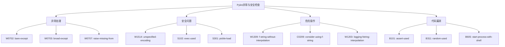

# 第 8 章：异常处理与安全检查

::: tip 学习目标
- 掌握 Pylint 的异常处理检查功能
- 理解安全相关的代码检查规则
- 学会编写健壮的异常处理代码
- 掌握安全编程的最佳实践
:::

### 知识点

#### 异常处理检查类型



#### 异常处理最佳实践

| 原则 | 说明 | Pylint检查 |
|------|------|------------|
| **具体捕获** | 捕获具体的异常类型 | broad-except |
| **异常链** | 保留原始异常信息 | raise-missing-from |
| **资源清理** | 确保资源正确释放 | - |
| **日志记录** | 记录异常详细信息 | - |

### 示例代码

#### 异常处理问题与优化

```python
# W0702: bare-except - 裸露的except语句
def bad_exception_handling():
    """错误的异常处理示例"""
    try:
        result = 10 / 0
        return result
    except:  # pylint: disable=bare-except
        # 捕获所有异常，包括SystemExit、KeyboardInterrupt等
        print("Something went wrong")
        return None

# 修复方案1：捕获具体异常
def good_exception_handling():
    """正确的异常处理示例"""
    try:
        result = 10 / 0
        return result
    except ZeroDivisionError as e:
        print(f"Division by zero error: {e}")
        return None
    except Exception as e:
        print(f"Unexpected error: {e}")
        return None

# W0703: broad-except - 过于宽泛的异常捕获
def bad_broad_exception():
    """过于宽泛的异常捕获"""
    try:
        # 多种可能的异常
        with open('file.txt', 'r') as f:
            data = f.read()

        number = int(data)
        result = 100 / number
        return result
    except Exception as e:  # pylint: disable=broad-except
        # 捕获所有Exception，无法区分不同类型的错误
        print(f"Error: {e}")
        return None

# 修复方案：分别处理不同类型的异常
def good_specific_exception():
    """具体的异常处理"""
    try:
        with open('file.txt', 'r', encoding='utf-8') as f:
            data = f.read().strip()

        number = int(data)
        result = 100 / number
        return result

    except FileNotFoundError:
        print("File not found: file.txt")
        return None

    except PermissionError:
        print("Permission denied to read file.txt")
        return None

    except ValueError as e:
        print(f"Invalid number format in file: {e}")
        return None

    except ZeroDivisionError:
        print("Cannot divide by zero")
        return None

    except Exception as e:
        # 只作为最后的保障
        print(f"Unexpected error: {e}")
        return None

# W0707: raise-missing-from - 重新抛出异常时缺少from子句
def bad_reraise():
    """错误的重新抛出异常"""
    try:
        with open('config.json', 'r') as f:
            import json
            config = json.load(f)
        return config
    except (FileNotFoundError, json.JSONDecodeError):
        # 丢失了原始异常信息
        raise ValueError("Configuration file is invalid")  # pylint: disable=raise-missing-from

# 修复方案：使用raise...from保留异常链
def good_reraise():
    """正确的重新抛出异常"""
    try:
        with open('config.json', 'r', encoding='utf-8') as f:
            import json
            config = json.load(f)
        return config
    except FileNotFoundError as e:
        raise ValueError("Configuration file not found") from e
    except json.JSONDecodeError as e:
        raise ValueError("Configuration file format is invalid") from e

# 自定义异常类的使用
class ConfigurationError(Exception):
    """配置错误异常"""

    def __init__(self, message, config_file=None, line_number=None):
        super().__init__(message)
        self.config_file = config_file
        self.line_number = line_number

    def __str__(self):
        base_msg = super().__str__()
        if self.config_file:
            base_msg += f" in file '{self.config_file}'"
        if self.line_number:
            base_msg += f" at line {self.line_number}"
        return base_msg

def parse_config_file(filename):
    """解析配置文件"""
    try:
        with open(filename, 'r', encoding='utf-8') as f:
            import json
            config = json.load(f)

        # 验证必需的配置项
        required_keys = ['database_url', 'api_key', 'debug']
        missing_keys = [key for key in required_keys if key not in config]

        if missing_keys:
            raise ConfigurationError(
                f"Missing required configuration keys: {missing_keys}",
                config_file=filename
            )

        return config

    except FileNotFoundError as e:
        raise ConfigurationError(
            "Configuration file not found",
            config_file=filename
        ) from e

    except json.JSONDecodeError as e:
        raise ConfigurationError(
            "Invalid JSON format in configuration file",
            config_file=filename,
            line_number=e.lineno
        ) from e
```

#### 文件和编码安全

```python
# W1514: unspecified-encoding - 未指定编码
def bad_file_handling():
    """错误的文件处理 - 未指定编码"""
    # 系统默认编码可能导致跨平台问题
    with open('data.txt', 'r') as f:  # pylint: disable=unspecified-encoding
        content = f.read()
    return content

# 修复方案：明确指定编码
def good_file_handling():
    """正确的文件处理 - 明确指定编码"""
    try:
        with open('data.txt', 'r', encoding='utf-8') as f:
            content = f.read()
        return content
    except UnicodeDecodeError as e:
        print(f"Encoding error: {e}")
        # 尝试其他编码
        try:
            with open('data.txt', 'r', encoding='gbk') as f:
                content = f.read()
            return content
        except UnicodeDecodeError:
            # 使用错误处理策略
            with open('data.txt', 'r', encoding='utf-8', errors='replace') as f:
                content = f.read()
            return content

# 安全的文件处理类
class SafeFileHandler:
    """安全的文件处理器"""

    def __init__(self, default_encoding='utf-8'):
        self.default_encoding = default_encoding
        self.fallback_encodings = ['utf-8', 'gbk', 'latin1']

    def read_file(self, filename, encoding=None):
        """安全读取文件"""
        encodings_to_try = [encoding] if encoding else self.fallback_encodings

        for enc in encodings_to_try:
            if enc is None:
                continue
            try:
                with open(filename, 'r', encoding=enc) as f:
                    return f.read(), enc
            except UnicodeDecodeError:
                continue
            except FileNotFoundError as e:
                raise FileNotFoundError(f"File not found: {filename}") from e

        # 最后尝试用替换策略
        try:
            with open(filename, 'r', encoding='utf-8', errors='replace') as f:
                content = f.read()
                return content, 'utf-8-replaced'
        except Exception as e:
            raise IOError(f"Unable to read file {filename}") from e

    def write_file(self, filename, content, encoding=None):
        """安全写入文件"""
        enc = encoding or self.default_encoding
        try:
            with open(filename, 'w', encoding=enc) as f:
                f.write(content)
        except UnicodeEncodeError as e:
            # 使用错误处理策略
            with open(filename, 'w', encoding=enc, errors='replace') as f:
                f.write(content)
            print(f"Warning: Some characters were replaced due to encoding issues: {e}")
```

#### 危险函数使用检查

```python
# S102: exec-used - 使用exec函数
def bad_dynamic_execution():
    """错误的动态执行代码"""
    user_input = "print('Hello, World!')"
    exec(user_input)  # pylint: disable=exec-used
    # 安全风险：可能执行恶意代码

# 修复方案1：使用安全的替代方案
import ast

def safe_dynamic_execution():
    """安全的动态执行"""
    user_input = "1 + 2 * 3"

    try:
        # 解析为AST
        tree = ast.parse(user_input, mode='eval')

        # 检查是否只包含安全的节点
        safe_nodes = (ast.Expression, ast.Constant, ast.Name, ast.Load,
                     ast.BinOp, ast.Add, ast.Sub, ast.Mult, ast.Div)

        for node in ast.walk(tree):
            if not isinstance(node, safe_nodes):
                raise ValueError(f"Unsafe operation: {type(node).__name__}")

        # 安全执行
        result = eval(compile(tree, '<string>', 'eval'))
        return result

    except (SyntaxError, ValueError) as e:
        print(f"Invalid or unsafe expression: {e}")
        return None

# 修复方案2：使用配置文件替代动态代码
import json
from typing import Dict, Any

class SafeConfigProcessor:
    """安全的配置处理器"""

    def __init__(self):
        self.allowed_operations = {
            'add': lambda a, b: a + b,
            'multiply': lambda a, b: a * b,
            'format': lambda template, **kwargs: template.format(**kwargs)
        }

    def process_config(self, config: Dict[str, Any]) -> Any:
        """处理配置文件"""
        operation = config.get('operation')
        if operation not in self.allowed_operations:
            raise ValueError(f"Unsupported operation: {operation}")

        func = self.allowed_operations[operation]
        args = config.get('args', [])
        kwargs = config.get('kwargs', {})

        try:
            return func(*args, **kwargs)
        except Exception as e:
            raise ValueError(f"Error executing operation {operation}: {e}") from e

# S301: pickle-load - 使用pickle.load
import pickle

def bad_pickle_usage():
    """错误的pickle使用"""
    with open('data.pkl', 'rb') as f:
        data = pickle.load(f)  # pylint: disable=pickle-load
    return data

# 修复方案：使用安全的序列化格式
import json
from dataclasses import dataclass, asdict
from typing import Union, Dict, List

@dataclass
class SafeData:
    """安全的数据类"""
    name: str
    value: Union[int, float, str]
    metadata: Dict[str, str]

class SafeSerializer:
    """安全的序列化器"""

    @staticmethod
    def serialize_to_json(data: Union[Dict, List, SafeData], filename: str):
        """序列化到JSON文件"""
        if isinstance(data, SafeData):
            data = asdict(data)

        with open(filename, 'w', encoding='utf-8') as f:
            json.dump(data, f, ensure_ascii=False, indent=2)

    @staticmethod
    def deserialize_from_json(filename: str) -> Union[Dict, List]:
        """从JSON文件反序列化"""
        with open(filename, 'r', encoding='utf-8') as f:
            data = json.load(f)
        return data

    @staticmethod
    def create_safe_data(data_dict: Dict) -> SafeData:
        """创建安全数据对象"""
        return SafeData(
            name=str(data_dict.get('name', '')),
            value=data_dict.get('value', 0),
            metadata=data_dict.get('metadata', {})
        )
```

#### 安全的进程执行

```python
# B605: start-process-with-shell - 使用shell启动进程
import subprocess

def bad_subprocess_usage():
    """错误的子进程使用"""
    user_input = "ls -la"
    # 安全风险：shell注入
    result = subprocess.run(user_input, shell=True, capture_output=True, text=True)
    return result.stdout

# 修复方案：使用安全的进程执行
import shlex
from typing import List, Optional

class SafeProcessExecutor:
    """安全的进程执行器"""

    def __init__(self):
        self.allowed_commands = {
            'ls': ['ls'],
            'cat': ['cat'],
            'echo': ['echo'],
            'grep': ['grep'],
            'find': ['find']
        }

    def execute_command(self, command: str, args: List[str] = None) -> Optional[str]:
        """安全执行命令"""
        if command not in self.allowed_commands:
            raise ValueError(f"Command not allowed: {command}")

        cmd_list = self.allowed_commands[command].copy()

        if args:
            # 验证参数安全性
            safe_args = []
            for arg in args:
                # 移除危险字符
                safe_arg = self._sanitize_argument(arg)
                safe_args.append(safe_arg)
            cmd_list.extend(safe_args)

        try:
            result = subprocess.run(
                cmd_list,
                shell=False,  # 不使用shell
                capture_output=True,
                text=True,
                timeout=30,  # 设置超时
                check=True
            )
            return result.stdout
        except subprocess.CalledProcessError as e:
            print(f"Command failed: {e}")
            return None
        except subprocess.TimeoutExpired:
            print("Command timed out")
            return None

    def _sanitize_argument(self, arg: str) -> str:
        """清理参数"""
        # 移除危险字符
        dangerous_chars = [';', '&', '|', '`', '$', '(', ')', '<', '>', '\\']
        safe_arg = arg
        for char in dangerous_chars:
            safe_arg = safe_arg.replace(char, '')
        return safe_arg

    def execute_safe_shell_command(self, command_line: str) -> Optional[str]:
        """安全执行shell命令"""
        try:
            # 使用shlex安全解析命令行
            args = shlex.split(command_line)
            if not args:
                return None

            command = args[0]
            cmd_args = args[1:] if len(args) > 1 else []

            return self.execute_command(command, cmd_args)
        except ValueError as e:
            print(f"Invalid command line: {e}")
            return None
```

#### 日志记录安全

```python
# W1203: logging-fstring-interpolation - 日志中使用f-string
import logging

def bad_logging_practice():
    """错误的日志记录实践"""
    user_id = 12345
    action = "login"

    # 问题：f-string在日志级别不匹配时仍会执行
    logging.debug(f"User {user_id} performed {action}")  # pylint: disable=logging-fstring-interpolation

# 修复方案：使用日志格式化
def good_logging_practice():
    """正确的日志记录实践"""
    user_id = 12345
    action = "login"

    # 正确：只有在日志级别匹配时才进行格式化
    logging.debug("User %s performed %s", user_id, action)

# 安全的日志记录器
class SecurityLogger:
    """安全日志记录器"""

    def __init__(self, name: str):
        self.logger = logging.getLogger(name)
        self.setup_logger()

    def setup_logger(self):
        """设置日志记录器"""
        if not self.logger.handlers:
            handler = logging.StreamHandler()
            formatter = logging.Formatter(
                '%(asctime)s - %(name)s - %(levelname)s - %(message)s'
            )
            handler.setFormatter(formatter)
            self.logger.addHandler(handler)
            self.logger.setLevel(logging.INFO)

    def log_user_action(self, user_id: str, action: str, details: dict = None):
        """记录用户操作"""
        # 清理敏感信息
        safe_details = self._sanitize_log_data(details) if details else {}

        self.logger.info(
            "User action: user_id=%s, action=%s, details=%s",
            self._sanitize_user_id(user_id),
            action,
            safe_details
        )

    def log_security_event(self, event_type: str, source_ip: str, details: dict = None):
        """记录安全事件"""
        safe_details = self._sanitize_log_data(details) if details else {}

        self.logger.warning(
            "Security event: type=%s, source_ip=%s, details=%s",
            event_type,
            source_ip,
            safe_details
        )

    def _sanitize_user_id(self, user_id: str) -> str:
        """清理用户ID（脱敏）"""
        if len(user_id) > 4:
            return user_id[:2] + '*' * (len(user_id) - 4) + user_id[-2:]
        return '*' * len(user_id)

    def _sanitize_log_data(self, data: dict) -> dict:
        """清理日志数据"""
        sensitive_keys = ['password', 'token', 'secret', 'api_key', 'credit_card']
        safe_data = {}

        for key, value in data.items():
            if any(sensitive in key.lower() for sensitive in sensitive_keys):
                safe_data[key] = '[REDACTED]'
            else:
                safe_data[key] = str(value)[:100]  # 限制长度

        return safe_data
```

#### 随机数和密码学安全

```python
# B311: random-used - 使用不安全的随机数
import random

def bad_random_usage():
    """不安全的随机数使用"""
    # 不适用于安全相关的用途
    token = random.randint(100000, 999999)  # pylint: disable=random-used
    return str(token)

# 修复方案：使用加密安全的随机数
import secrets
import string
import hashlib
import os

class SecureRandomGenerator:
    """安全随机数生成器"""

    @staticmethod
    def generate_token(length: int = 32) -> str:
        """生成安全的随机令牌"""
        return secrets.token_urlsafe(length)

    @staticmethod
    def generate_password(length: int = 12) -> str:
        """生成安全的随机密码"""
        alphabet = string.ascii_letters + string.digits + "!@#$%^&*"
        password = ''.join(secrets.choice(alphabet) for _ in range(length))
        return password

    @staticmethod
    def generate_session_id() -> str:
        """生成会话ID"""
        random_data = secrets.token_bytes(32)
        timestamp = str(__import__('time').time()).encode()
        combined = random_data + timestamp
        return hashlib.sha256(combined).hexdigest()

    @staticmethod
    def generate_csrf_token() -> str:
        """生成CSRF令牌"""
        return secrets.token_hex(32)

    @staticmethod
    def generate_otp(length: int = 6) -> str:
        """生成一次性密码"""
        digits = string.digits
        return ''.join(secrets.choice(digits) for _ in range(length))

# 密码哈希和验证
import bcrypt

class PasswordManager:
    """密码管理器"""

    @staticmethod
    def hash_password(password: str) -> str:
        """哈希密码"""
        # 使用bcrypt进行安全哈希
        salt = bcrypt.gensalt(rounds=12)
        hashed = bcrypt.hashpw(password.encode('utf-8'), salt)
        return hashed.decode('utf-8')

    @staticmethod
    def verify_password(password: str, hashed: str) -> bool:
        """验证密码"""
        try:
            return bcrypt.checkpw(
                password.encode('utf-8'),
                hashed.encode('utf-8')
            )
        except Exception:
            return False

    @staticmethod
    def is_strong_password(password: str) -> tuple[bool, list[str]]:
        """检查密码强度"""
        issues = []

        if len(password) < 8:
            issues.append("密码长度至少8位")

        if not any(c.islower() for c in password):
            issues.append("需要包含小写字母")

        if not any(c.isupper() for c in password):
            issues.append("需要包含大写字母")

        if not any(c.isdigit() for c in password):
            issues.append("需要包含数字")

        if not any(c in "!@#$%^&*()_+-=[]{}|;:,.<>?" for c in password):
            issues.append("需要包含特殊字符")

        return len(issues) == 0, issues
```

#### 输入验证和清理

```python
import re
from html import escape
from urllib.parse import quote

class InputValidator:
    """输入验证器"""

    @staticmethod
    def validate_email(email: str) -> bool:
        """验证邮箱格式"""
        pattern = r'^[a-zA-Z0-9._%+-]+@[a-zA-Z0-9.-]+\.[a-zA-Z]{2,}$'
        return bool(re.match(pattern, email))

    @staticmethod
    def validate_phone(phone: str) -> bool:
        """验证电话号码"""
        # 简单的电话号码验证
        pattern = r'^\+?[1-9]\d{1,14}$'
        cleaned_phone = re.sub(r'[^\d+]', '', phone)
        return bool(re.match(pattern, cleaned_phone))

    @staticmethod
    def sanitize_html(text: str) -> str:
        """清理HTML内容"""
        return escape(text)

    @staticmethod
    def sanitize_sql_like(text: str) -> str:
        """清理SQL LIKE查询"""
        # 转义SQL LIKE通配符
        text = text.replace('\\', '\\\\')
        text = text.replace('%', '\\%')
        text = text.replace('_', '\\_')
        return text

    @staticmethod
    def validate_filename(filename: str) -> tuple[bool, str]:
        """验证文件名安全性"""
        if not filename:
            return False, "文件名不能为空"

        # 检查危险字符
        dangerous_chars = ['/', '\\', '..', '<', '>', ':', '"', '|', '?', '*']
        for char in dangerous_chars:
            if char in filename:
                return False, f"文件名包含危险字符: {char}"

        # 检查长度
        if len(filename) > 255:
            return False, "文件名过长"

        # 检查保留名称（Windows）
        reserved_names = [
            'CON', 'PRN', 'AUX', 'NUL', 'COM1', 'COM2', 'COM3', 'COM4',
            'COM5', 'COM6', 'COM7', 'COM8', 'COM9', 'LPT1', 'LPT2',
            'LPT3', 'LPT4', 'LPT5', 'LPT6', 'LPT7', 'LPT8', 'LPT9'
        ]
        name_without_ext = filename.split('.')[0].upper()
        if name_without_ext in reserved_names:
            return False, f"文件名使用了保留名称: {name_without_ext}"

        return True, "文件名有效"

    @staticmethod
    def clean_user_input(text: str, max_length: int = 1000) -> str:
        """清理用户输入"""
        if not isinstance(text, str):
            return ""

        # 移除控制字符
        text = ''.join(char for char in text if ord(char) >= 32 or char in '\n\r\t')

        # 限制长度
        if len(text) > max_length:
            text = text[:max_length]

        # 移除首尾空白
        text = text.strip()

        return text
```

::: note 异常处理最佳实践
1. **具体捕获**：捕获具体的异常类型而不是使用裸露的except
2. **异常链**：使用raise...from保留原始异常信息
3. **资源管理**：使用try-finally或上下文管理器确保资源释放
4. **日志记录**：适当记录异常信息用于调试和监控
5. **失败策略**：为不同类型的异常提供合适的恢复策略
:::

::: warning 安全注意事项
1. **输入验证**：严格验证所有外部输入
2. **编码安全**：明确指定文件编码避免跨平台问题
3. **进程执行**：避免使用shell=True，谨慎处理用户输入
4. **随机数安全**：使用加密安全的随机数生成器
5. **敏感信息**：避免在日志中记录敏感信息
:::

异常处理和安全检查是构建健壮、安全应用程序的重要基础，Pylint的相关检查有助于发现潜在的安全风险和代码缺陷。