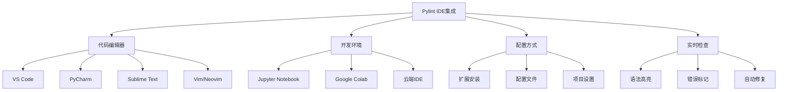
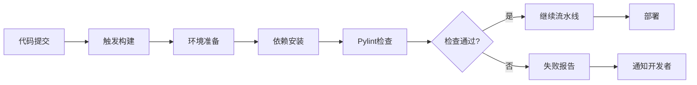

# 第 9 章：与 IDE 和 CI/CD 集成

::: tip 学习目标
- 掌握在各种 IDE 中集成 Pylint
- 学会配置 CI/CD 流水线中的 Pylint 检查
- 理解如何在团队开发中统一代码质量标准
- 掌握自动化代码质量监控和报告
:::

### 知识点

#### IDE 集成概览



#### CI/CD 集成流程



### 示例代码

#### VS Code 集成配置

```json
// .vscode/settings.json
{
    "python.linting.enabled": true,
    "python.linting.pylintEnabled": true,
    "python.linting.pylintPath": "pylint",
    "python.linting.pylintArgs": [
        "--rcfile=.pylintrc",
        "--reports=no",
        "--score=no",
        "--msg-template={path}:{line}:{column}:{category}:{msg_id}:{msg}",
        "--output-format=json"
    ],
    "python.linting.lintOnSave": true,
    "python.linting.maxNumberOfProblems": 100,
    "python.formatting.provider": "black",
    "python.formatting.blackArgs": [
        "--line-length=88"
    ],
    "editor.formatOnSave": true,
    "editor.codeActionsOnSave": {
        "source.organizeImports": true
    },
    "files.associations": {
        ".pylintrc": "ini"
    }
}
```

```json
// .vscode/extensions.json - 推荐扩展
{
    "recommendations": [
        "ms-python.python",
        "ms-python.pylint",
        "ms-python.black-formatter",
        "ms-python.isort",
        "ms-python.flake8",
        "charliermarsh.ruff"
    ]
}
```

```json
// .vscode/tasks.json - 自定义任务
{
    "version": "2.0.0",
    "tasks": [
        {
            "label": "Pylint: Check Current File",
            "type": "shell",
            "command": "pylint",
            "args": ["${file}"],
            "group": {
                "kind": "test",
                "isDefault": true
            },
            "presentation": {
                "echo": true,
                "reveal": "always",
                "focus": false,
                "panel": "shared"
            },
            "problemMatcher": {
                "owner": "pylint",
                "fileLocation": ["relative", "${workspaceFolder}"],
                "pattern": {
                    "regexp": "^(.+?):(\\d+):(\\d+):\\s+(\\w+):\\s+(.+?)\\s+\\((.+?)\\)$",
                    "file": 1,
                    "line": 2,
                    "column": 3,
                    "severity": 4,
                    "message": 5,
                    "code": 6
                }
            }
        },
        {
            "label": "Pylint: Check All Python Files",
            "type": "shell",
            "command": "pylint",
            "args": ["**/*.py"],
            "group": "test",
            "presentation": {
                "echo": true,
                "reveal": "always",
                "focus": false,
                "panel": "shared"
            }
        },
        {
            "label": "Code Quality: Full Check",
            "type": "shell",
            "command": "python",
            "args": ["-m", "scripts.code_quality"],
            "group": "test",
            "presentation": {
                "echo": true,
                "reveal": "always",
                "focus": false,
                "panel": "shared"
            }
        }
    ]
}
```

#### PyCharm 集成配置

```python
# PyCharm 外部工具配置脚本
# scripts/pycharm_pylint.py
"""
PyCharm Pylint 集成脚本

在 PyCharm 中配置外部工具：
1. File > Settings > Tools > External Tools
2. 添加新工具，设置以下参数：
   - Name: Pylint
   - Program: python
   - Arguments: -m scripts.pycharm_pylint $FilePath$
   - Working directory: $ProjectFileDir$
"""

import sys
import subprocess
import json
from pathlib import Path

def run_pylint_for_pycharm(file_path):
    """为 PyCharm 运行 Pylint"""

    try:
        # 运行 Pylint 并获取 JSON 输出
        result = subprocess.run(
            ['pylint', '--output-format=json', file_path],
            capture_output=True,
            text=True,
            cwd=Path(__file__).parent.parent
        )

        # 解析 JSON 输出
        if result.stdout:
            messages = json.loads(result.stdout)

            # 格式化输出为 PyCharm 可理解的格式
            for msg in messages:
                print(f"{msg['path']}:{msg['line']}:{msg['column']}: "
                      f"{msg['type'][0].upper()}{msg['message-id']}: "
                      f"{msg['message']} ({msg['symbol']})")

        # 输出评分
        if result.stderr:
            for line in result.stderr.split('\n'):
                if 'Your code has been rated' in line:
                    print(line)

    except json.JSONDecodeError:
        print("Pylint output is not valid JSON")
    except Exception as e:
        print(f"Error running Pylint: {e}")

if __name__ == "__main__":
    if len(sys.argv) != 2:
        print("Usage: python pycharm_pylint.py <file_path>")
        sys.exit(1)

    run_pylint_for_pycharm(sys.argv[1])
```

```xml
<!-- PyCharm 项目配置 - .idea/pylint.xml -->
<application>
  <component name="PylintConfigService">
    <option name="pylintPath" value="pylint" />
    <option name="pylintArguments" value="--rcfile=.pylintrc --reports=no" />
    <option name="scanBeforeCheckIn" value="true" />
    <option name="scanOnTheFly" value="true" />
  </component>
</application>
```

#### CI/CD 集成 - GitHub Actions

```yaml
# .github/workflows/code-quality.yml
name: Code Quality Check

on:
  push:
    branches: [ main, develop ]
  pull_request:
    branches: [ main ]

jobs:
  code-quality:
    runs-on: ubuntu-latest
    strategy:
      matrix:
        python-version: [3.8, 3.9, "3.10", "3.11"]

    steps:
    - uses: actions/checkout@v4

    - name: Set up Python ${{ matrix.python-version }}
      uses: actions/setup-python@v4
      with:
        python-version: ${{ matrix.python-version }}

    - name: Cache pip dependencies
      uses: actions/cache@v3
      with:
        path: ~/.cache/pip
        key: ${{ runner.os }}-pip-${{ hashFiles('**/requirements*.txt') }}
        restore-keys: |
          ${{ runner.os }}-pip-

    - name: Install dependencies
      run: |
        python -m pip install --upgrade pip
        pip install -r requirements.txt
        pip install -r requirements-dev.txt

    - name: Run Pylint
      run: |
        pylint --rcfile=.pylintrc --output-format=json --reports=yes src/ > pylint-report.json || true
        pylint --rcfile=.pylintrc --fail-under=8.0 src/

    - name: Generate Pylint Badge
      run: |
        python scripts/generate_pylint_badge.py

    - name: Upload Pylint Report
      uses: actions/upload-artifact@v3
      with:
        name: pylint-report-${{ matrix.python-version }}
        path: pylint-report.json

    - name: Comment PR with Pylint Results
      if: github.event_name == 'pull_request'
      uses: actions/github-script@v6
      with:
        script: |
          const fs = require('fs');
          const pylintReport = JSON.parse(fs.readFileSync('pylint-report.json', 'utf8'));

          const errors = pylintReport.filter(msg => msg.type === 'error').length;
          const warnings = pylintReport.filter(msg => msg.type === 'warning').length;
          const conventions = pylintReport.filter(msg => msg.type === 'convention').length;

          const comment = `## Pylint Report

          - 🔴 Errors: ${errors}
          - ⚠️ Warnings: ${warnings}
          - 📝 Conventions: ${conventions}

          ${pylintReport.length > 0 ? '### Issues Found:' : '✅ No issues found!'}

          ${pylintReport.slice(0, 10).map(msg =>
            `- \`${msg.path}:${msg.line}\` - ${msg.message} (${msg.symbol})`
          ).join('\n')}

          ${pylintReport.length > 10 ? `\n... and ${pylintReport.length - 10} more issues.` : ''}
          `;

          github.rest.issues.createComment({
            issue_number: context.issue.number,
            owner: context.repo.owner,
            repo: context.repo.repo,
            body: comment
          });
```

#### GitLab CI 集成

```yaml
# .gitlab-ci.yml
stages:
  - setup
  - quality
  - test
  - deploy

variables:
  PIP_CACHE_DIR: "$CI_PROJECT_DIR/.cache/pip"
  PYLINT_MIN_SCORE: "8.0"

cache:
  paths:
    - .cache/pip/
    - venv/

before_script:
  - python -m venv venv
  - source venv/bin/activate
  - pip install --upgrade pip
  - pip install -r requirements.txt
  - pip install -r requirements-dev.txt

code_quality:
  stage: quality
  script:
    - echo "Running Pylint analysis..."
    - pylint --rcfile=.pylintrc --output-format=json --reports=yes src/ > pylint-report.json || true
    - python scripts/parse_pylint_results.py
    - pylint --rcfile=.pylintrc --fail-under=$PYLINT_MIN_SCORE src/
  artifacts:
    reports:
      junit: pylint-junit.xml
    paths:
      - pylint-report.json
      - pylint-report.html
    expire_in: 1 week
  coverage: '/Your code has been rated at (\d+\.\d+)\/10/'

pylint_mr_widget:
  stage: quality
  script:
    - pylint --rcfile=.pylintrc --output-format=json src/ > pylint-results.json || true
    - python scripts/gitlab_mr_comment.py
  only:
    - merge_requests
  artifacts:
    paths:
      - pylint-results.json
```

#### Jenkins 集成

```groovy
// Jenkinsfile
pipeline {
    agent any

    environment {
        PYLINT_MIN_SCORE = '8.0'
        PYTHON_VERSION = '3.10'
    }

    stages {
        stage('Setup') {
            steps {
                sh '''
                    python${PYTHON_VERSION} -m venv venv
                    . venv/bin/activate
                    pip install --upgrade pip
                    pip install -r requirements.txt
                    pip install -r requirements-dev.txt
                '''
            }
        }

        stage('Code Quality') {
            steps {
                sh '''
                    . venv/bin/activate

                    # Run Pylint with JSON output
                    pylint --rcfile=.pylintrc \
                           --output-format=json \
                           --reports=yes \
                           src/ > pylint-report.json || true

                    # Generate HTML report
                    python scripts/generate_pylint_html.py

                    # Check if score meets minimum requirement
                    pylint --rcfile=.pylintrc \
                           --fail-under=${PYLINT_MIN_SCORE} \
                           src/
                '''
            }
            post {
                always {
                    // Publish Pylint results
                    publishHTML([
                        allowMissing: false,
                        alwaysLinkToLastBuild: true,
                        keepAll: true,
                        reportDir: '.',
                        reportFiles: 'pylint-report.html',
                        reportName: 'Pylint Report'
                    ])

                    // Archive artifacts
                    archiveArtifacts artifacts: 'pylint-report.json, pylint-report.html'

                    // Record issues
                    recordIssues(
                        enabledForFailure: true,
                        tools: [pyLint(pattern: 'pylint-report.json')]
                    )
                }
            }
        }

        stage('Quality Gate') {
            steps {
                script {
                    def pylintScore = sh(
                        script: ". venv/bin/activate && pylint --rcfile=.pylintrc src/ | grep 'rated at' | awk '{print \$7}' | cut -d'/' -f1",
                        returnStdout: true
                    ).trim() as Double

                    echo "Pylint Score: ${pylintScore}"

                    if (pylintScore < PYLINT_MIN_SCORE as Double) {
                        error("Code quality gate failed. Score: ${pylintScore}, Required: ${PYLINT_MIN_SCORE}")
                    }
                }
            }
        }
    }

    post {
        always {
            // Clean up
            sh 'rm -rf venv'
        }
        failure {
            // Send notification on failure
            emailext (
                subject: "Build Failed: ${env.JOB_NAME} - ${env.BUILD_NUMBER}",
                body: "Code quality check failed. Please check the Pylint report.",
                to: "${env.CHANGE_AUTHOR_EMAIL}"
            )
        }
    }
}
```

#### 质量监控脚本

```python
# scripts/code_quality.py
"""
代码质量监控脚本

综合运行多种代码质量检查工具。
"""

import json
import subprocess
import sys
from pathlib import Path
from typing import Dict, List, Any
import argparse

class CodeQualityChecker:
    """代码质量检查器"""

    def __init__(self, project_root: str, config_file: str = '.pylintrc'):
        self.project_root = Path(project_root)
        self.config_file = config_file
        self.results = {}

    def run_pylint(self, source_dirs: List[str]) -> Dict[str, Any]:
        """运行 Pylint 检查"""
        print("🔍 Running Pylint analysis...")

        try:
            cmd = [
                'pylint',
                f'--rcfile={self.config_file}',
                '--output-format=json',
                '--reports=yes'
            ] + source_dirs

            result = subprocess.run(
                cmd,
                capture_output=True,
                text=True,
                cwd=self.project_root
            )

            # 解析 JSON 输出
            messages = []
            if result.stdout:
                try:
                    messages = json.loads(result.stdout)
                except json.JSONDecodeError:
                    print("Warning: Could not parse Pylint JSON output")

            # 提取评分
            score = 0.0
            for line in result.stderr.split('\n'):
                if 'Your code has been rated at' in line:
                    try:
                        score = float(line.split()[6].split('/')[0])
                    except (IndexError, ValueError):
                        pass

            return {
                'score': score,
                'messages': messages,
                'total_issues': len(messages),
                'errors': len([m for m in messages if m.get('type') == 'error']),
                'warnings': len([m for m in messages if m.get('type') == 'warning']),
                'conventions': len([m for m in messages if m.get('type') == 'convention']),
                'refactors': len([m for m in messages if m.get('type') == 'refactor'])
            }

        except Exception as e:
            print(f"Error running Pylint: {e}")
            return {'error': str(e)}

    def run_flake8(self, source_dirs: List[str]) -> Dict[str, Any]:
        """运行 Flake8 检查"""
        print("🔍 Running Flake8 analysis...")

        try:
            cmd = ['flake8', '--format=json'] + source_dirs

            result = subprocess.run(
                cmd,
                capture_output=True,
                text=True,
                cwd=self.project_root
            )

            messages = []
            if result.stdout:
                # Flake8 doesn't have native JSON output, parse line by line
                for line in result.stdout.strip().split('\n'):
                    if line:
                        parts = line.split(':', 4)
                        if len(parts) >= 4:
                            messages.append({
                                'path': parts[0],
                                'line': int(parts[1]),
                                'column': int(parts[2]),
                                'message': parts[3].strip()
                            })

            return {
                'total_issues': len(messages),
                'messages': messages
            }

        except Exception as e:
            print(f"Error running Flake8: {e}")
            return {'error': str(e)}

    def run_mypy(self, source_dirs: List[str]) -> Dict[str, Any]:
        """运行 MyPy 类型检查"""
        print("🔍 Running MyPy type checking...")

        try:
            cmd = ['mypy', '--json-report', 'mypy-report'] + source_dirs

            result = subprocess.run(
                cmd,
                capture_output=True,
                text=True,
                cwd=self.project_root
            )

            # MyPy 输出类型检查结果到 stderr
            messages = []
            if result.stdout:
                for line in result.stdout.strip().split('\n'):
                    if line and ':' in line:
                        messages.append(line)

            return {
                'total_issues': len(messages),
                'messages': messages
            }

        except Exception as e:
            print(f"Error running MyPy: {e}")
            return {'error': str(e)}

    def generate_report(self) -> str:
        """生成综合报告"""
        report = "# Code Quality Report\n\n"

        if 'pylint' in self.results:
            pylint_data = self.results['pylint']
            if 'error' not in pylint_data:
                report += f"## Pylint Results\n"
                report += f"- **Score**: {pylint_data['score']:.2f}/10.00\n"
                report += f"- **Total Issues**: {pylint_data['total_issues']}\n"
                report += f"  - Errors: {pylint_data['errors']}\n"
                report += f"  - Warnings: {pylint_data['warnings']}\n"
                report += f"  - Conventions: {pylint_data['conventions']}\n"
                report += f"  - Refactors: {pylint_data['refactors']}\n\n"

        if 'flake8' in self.results:
            flake8_data = self.results['flake8']
            if 'error' not in flake8_data:
                report += f"## Flake8 Results\n"
                report += f"- **Total Issues**: {flake8_data['total_issues']}\n\n"

        if 'mypy' in self.results:
            mypy_data = self.results['mypy']
            if 'error' not in mypy_data:
                report += f"## MyPy Results\n"
                report += f"- **Total Issues**: {mypy_data['total_issues']}\n\n"

        return report

    def run_all_checks(self, source_dirs: List[str]) -> Dict[str, Any]:
        """运行所有代码质量检查"""
        print("🚀 Starting comprehensive code quality analysis...\n")

        # 运行 Pylint
        self.results['pylint'] = self.run_pylint(source_dirs)

        # 运行 Flake8
        self.results['flake8'] = self.run_flake8(source_dirs)

        # 运行 MyPy
        self.results['mypy'] = self.run_mypy(source_dirs)

        # 生成报告
        report = self.generate_report()

        # 保存报告
        with open(self.project_root / 'code-quality-report.md', 'w') as f:
            f.write(report)

        # 保存 JSON 结果
        with open(self.project_root / 'code-quality-results.json', 'w') as f:
            json.dump(self.results, f, indent=2)

        print("✅ Code quality analysis complete!")
        print(f"📊 Report saved to: code-quality-report.md")

        return self.results

def main():
    """主函数"""
    parser = argparse.ArgumentParser(description='Run comprehensive code quality checks')
    parser.add_argument('--source-dirs', nargs='+', default=['src'],
                       help='Source directories to check')
    parser.add_argument('--config', default='.pylintrc',
                       help='Pylint configuration file')
    parser.add_argument('--min-score', type=float, default=8.0,
                       help='Minimum required Pylint score')

    args = parser.parse_args()

    checker = CodeQualityChecker('.', args.config)
    results = checker.run_all_checks(args.source_dirs)

    # 检查是否满足最低质量要求
    pylint_score = results.get('pylint', {}).get('score', 0)

    if pylint_score < args.min_score:
        print(f"❌ Quality gate failed! Score: {pylint_score:.2f}, Required: {args.min_score}")
        sys.exit(1)
    else:
        print(f"✅ Quality gate passed! Score: {pylint_score:.2f}")

if __name__ == "__main__":
    main()
```

#### 预提交钩子配置

```yaml
# .pre-commit-config.yaml
repos:
  - repo: https://github.com/pre-commit/pre-commit-hooks
    rev: v4.4.0
    hooks:
      - id: trailing-whitespace
      - id: end-of-file-fixer
      - id: check-yaml
      - id: check-added-large-files
      - id: check-merge-conflict

  - repo: https://github.com/psf/black
    rev: 23.1.0
    hooks:
      - id: black
        language_version: python3

  - repo: https://github.com/pycqa/isort
    rev: 5.12.0
    hooks:
      - id: isort
        args: ["--profile", "black"]

  - repo: https://github.com/pycqa/flake8
    rev: 6.0.0
    hooks:
      - id: flake8
        additional_dependencies: [flake8-docstrings]

  - repo: local
    hooks:
      - id: pylint
        name: pylint
        entry: pylint
        language: system
        types: [python]
        args: [
          "--rcfile=.pylintrc",
          "--fail-under=8.0",
          "--reports=no"
        ]
```

```bash
# scripts/setup-pre-commit.sh
#!/bin/bash
# 设置预提交钩子

echo "🔧 Setting up pre-commit hooks..."

# 安装 pre-commit
pip install pre-commit

# 安装钩子
pre-commit install

# 运行所有文件的检查
pre-commit run --all-files

echo "✅ Pre-commit hooks installed successfully!"
echo "💡 Hooks will run automatically on each commit."
```

::: note IDE 集成最佳实践
1. **统一配置**：团队成员使用相同的 Pylint 配置文件
2. **实时检查**：启用保存时自动检查功能
3. **快捷操作**：配置快捷键执行常用的代码质量检查
4. **问题导航**：利用 IDE 的问题面板快速定位和修复问题
5. **自动修复**：启用支持的自动修复功能
:::

::: warning 注意事项
1. **性能影响**：大型项目中可能需要调整实时检查的范围
2. **配置冲突**：确保 IDE 配置与项目配置保持一致
3. **版本兼容**：注意 Pylint 版本与 IDE 扩展的兼容性
4. **CI/CD 一致性**：确保本地检查与 CI/CD 流水线的检查标准一致
:::

通过与 IDE 和 CI/CD 的深度集成，可以实现代码质量的自动化监控和持续改进，提升团队开发效率和代码质量。