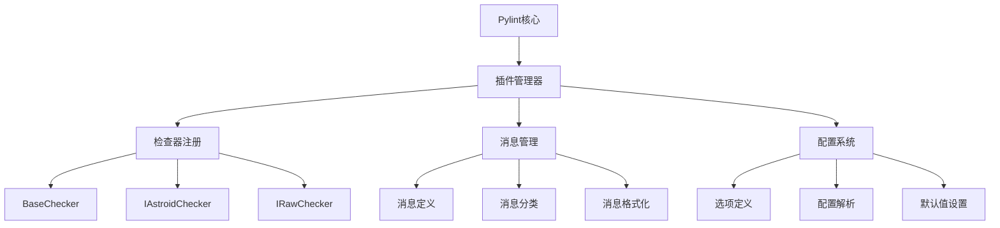

# 第 10 章：插件开发与扩展

::: tip 学习目标
- 掌握 Pylint 插件开发的基本原理
- 学会创建自定义检查器和规则
- 理解 Pylint 的 AST 分析机制
- 掌握插件的测试、打包和分发
:::

### 知识点

#### Pylint 插件架构



#### 检查器类型

| 检查器类型 | 接口 | 用途 | 示例 |
|------------|------|------|------|
| **AST检查器** | IAstroidChecker | 分析抽象语法树 | 检查函数复杂度 |
| **原始检查器** | IRawChecker | 分析原始代码文本 | 检查代码格式 |
| **令牌检查器** | ITokenChecker | 分析词法令牌 | 检查标识符命名 |

### 示例代码

#### 基础插件结构

```python
# pylint_custom_plugin.py
"""
自定义 Pylint 插件示例

这个插件演示如何创建自定义检查器。
"""

from typing import TYPE_CHECKING, Optional
from astroid import nodes
from pylint.checkers import BaseChecker
from pylint.interfaces import IAstroidChecker

if TYPE_CHECKING:
    from pylint.lint import PyLinter

class CustomChecker(BaseChecker):
    """自定义检查器基类"""

    # 检查器接口
    __implements__ = IAstroidChecker

    # 插件名称
    name = 'custom'

    # 优先级（数字越小优先级越高）
    priority = -1

    # 消息定义
    msgs = {
        'C9001': (
            'Function name should be more descriptive than "%s"',
            'non-descriptive-function-name',
            'Function names should be descriptive and meaningful.'
        ),
        'W9001': (
            'Function "%s" has too many print statements (%d)',
            'too-many-prints',
            'Functions should not have excessive print statements.'
        ),
        'E9001': (
            'Dangerous eval() usage detected',
            'dangerous-eval-usage',
            'Using eval() can be dangerous and should be avoided.'
        ),
    }

    # 配置选项
    options = (
        ('max-print-statements', {
            'default': 3,
            'type': 'int',
            'help': 'Maximum allowed print statements in a function'
        }),
        ('min-function-name-length', {
            'default': 3,
            'type': 'int',
            'help': 'Minimum length for function names'
        }),
        ('descriptive-words', {
            'default': ['get', 'set', 'create', 'update', 'delete', 'process'],
            'type': 'csv',
            'help': 'List of words considered descriptive for function names'
        }),
    )

    def visit_functiondef(self, node: nodes.FunctionDef) -> None:
        """检查函数定义"""
        self._check_function_name(node)
        self._check_print_statements(node)

    def visit_call(self, node: nodes.Call) -> None:
        """检查函数调用"""
        self._check_eval_usage(node)

    def _check_function_name(self, node: nodes.FunctionDef) -> None:
        """检查函数名称是否描述性足够"""
        func_name = node.name

        # 跳过特殊方法
        if func_name.startswith('__') and func_name.endswith('__'):
            return

        # 检查长度
        min_length = self.config.min_function_name_length
        if len(func_name) < min_length:
            self.add_message(
                'non-descriptive-function-name',
                node=node,
                args=(func_name,)
            )
            return

        # 检查是否包含描述性词汇
        descriptive_words = self.config.descriptive_words
        func_lower = func_name.lower()

        has_descriptive_word = any(
            word in func_lower for word in descriptive_words
        )

        # 如果函数名过短且不包含描述性词汇
        if len(func_name) <= 5 and not has_descriptive_word:
            self.add_message(
                'non-descriptive-function-name',
                node=node,
                args=(func_name,)
            )

    def _check_print_statements(self, node: nodes.FunctionDef) -> None:
        """检查函数中的 print 语句数量"""
        print_count = 0

        for child in node.nodes_of_class(nodes.Call):
            if (isinstance(child.func, nodes.Name) and
                child.func.name == 'print'):
                print_count += 1

        max_prints = self.config.max_print_statements
        if print_count > max_prints:
            self.add_message(
                'too-many-prints',
                node=node,
                args=(node.name, print_count)
            )

    def _check_eval_usage(self, node: nodes.Call) -> None:
        """检查危险的 eval() 使用"""
        if (isinstance(node.func, nodes.Name) and
            node.func.name == 'eval'):
            self.add_message(
                'dangerous-eval-usage',
                node=node
            )

def register(linter: 'PyLinter') -> None:
    """注册插件到 Pylint"""
    linter.register_checker(CustomChecker(linter))
```

#### 高级检查器示例

```python
# advanced_checker.py
"""
高级自定义检查器示例

演示更复杂的代码分析功能。
"""

import re
from typing import Set, Dict, List
from astroid import nodes
from pylint.checkers import BaseChecker
from pylint.interfaces import IAstroidChecker

class SecurityChecker(BaseChecker):
    """安全相关的检查器"""

    __implements__ = IAstroidChecker
    name = 'security'
    priority = -1

    msgs = {
        'S9001': (
            'Hardcoded password detected: "%s"',
            'hardcoded-password',
            'Passwords should not be hardcoded in source code.'
        ),
        'S9002': (
            'SQL injection risk in query: "%s"',
            'sql-injection-risk',
            'String formatting in SQL queries can lead to injection attacks.'
        ),
        'S9003': (
            'Insecure random usage detected',
            'insecure-random',
            'Use secrets module for cryptographic purposes.'
        ),
        'S9004': (
            'Shell injection risk in subprocess call',
            'shell-injection-risk',
            'Using shell=True with user input can be dangerous.'
        ),
    }

    options = (
        ('password-patterns', {
            'default': ['password', 'passwd', 'pwd', 'secret', 'token'],
            'type': 'csv',
            'help': 'Patterns that might indicate hardcoded passwords'
        }),
    )

    def __init__(self, linter):
        super().__init__(linter)
        self.hardcoded_strings: Set[str] = set()
        self.sql_patterns = [
            re.compile(r'SELECT\s+.*\s+FROM', re.IGNORECASE),
            re.compile(r'INSERT\s+INTO', re.IGNORECASE),
            re.compile(r'UPDATE\s+.*\s+SET', re.IGNORECASE),
            re.compile(r'DELETE\s+FROM', re.IGNORECASE),
        ]

    def visit_assign(self, node: nodes.Assign) -> None:
        """检查赋值语句"""
        self._check_hardcoded_passwords(node)

    def visit_call(self, node: nodes.Call) -> None:
        """检查函数调用"""
        self._check_sql_injection(node)
        self._check_insecure_random(node)
        self._check_shell_injection(node)

    def _check_hardcoded_passwords(self, node: nodes.Assign) -> None:
        """检查硬编码密码"""
        for target in node.targets:
            if isinstance(target, nodes.AssignName):
                var_name = target.name.lower()
                password_patterns = self.config.password_patterns

                if any(pattern in var_name for pattern in password_patterns):
                    if isinstance(node.value, nodes.Const):
                        value = str(node.value.value)
                        if len(value) > 3:  # 忽略太短的值
                            self.add_message(
                                'hardcoded-password',
                                node=node,
                                args=(value[:20] + '...' if len(value) > 20 else value,)
                            )

    def _check_sql_injection(self, node: nodes.Call) -> None:
        """检查 SQL 注入风险"""
        # 检查常见的数据库执行方法
        dangerous_methods = ['execute', 'executemany', 'query']

        if (isinstance(node.func, nodes.Attribute) and
            node.func.attrname in dangerous_methods):

            for arg in node.args:
                if isinstance(arg, nodes.BinOp):
                    # 检查字符串拼接
                    if self._contains_sql_keywords(arg):
                        self.add_message(
                            'sql-injection-risk',
                            node=node,
                            args=(arg.as_string()[:50] + '...',)
                        )

                elif isinstance(arg, nodes.Call):
                    # 检查字符串格式化
                    if (isinstance(arg.func, nodes.Attribute) and
                        arg.func.attrname == 'format'):
                        if self._contains_sql_keywords(arg.func.expr):
                            self.add_message(
                                'sql-injection-risk',
                                node=node,
                                args=(arg.as_string()[:50] + '...',)
                            )

    def _contains_sql_keywords(self, node) -> bool:
        """检查节点是否包含 SQL 关键字"""
        if isinstance(node, nodes.Const) and isinstance(node.value, str):
            return any(pattern.search(node.value) for pattern in self.sql_patterns)
        return False

    def _check_insecure_random(self, node: nodes.Call) -> None:
        """检查不安全的随机数使用"""
        if isinstance(node.func, nodes.Attribute):
            if (node.func.attrname in ['random', 'randint', 'choice'] and
                isinstance(node.func.expr, nodes.Name) and
                node.func.expr.name == 'random'):

                # 检查是否在安全相关的上下文中使用
                if self._is_security_context(node):
                    self.add_message('insecure-random', node=node)

    def _is_security_context(self, node) -> bool:
        """判断是否在安全相关的上下文中"""
        # 简单的启发式检查
        parent = node.parent
        while parent:
            if isinstance(parent, nodes.FunctionDef):
                func_name = parent.name.lower()
                security_keywords = [
                    'password', 'token', 'secret', 'key', 'auth',
                    'session', 'csrf', 'nonce', 'salt'
                ]
                if any(keyword in func_name for keyword in security_keywords):
                    return True
            parent = parent.parent
        return False

    def _check_shell_injection(self, node: nodes.Call) -> None:
        """检查 shell 注入风险"""
        if (isinstance(node.func, nodes.Attribute) and
            node.func.attrname in ['run', 'call', 'check_output']):

            # 检查是否使用了 shell=True
            for keyword in node.keywords:
                if (keyword.arg == 'shell' and
                    isinstance(keyword.value, nodes.Const) and
                    keyword.value.value is True):
                    self.add_message('shell-injection-risk', node=node)

class PerformanceChecker(BaseChecker):
    """性能相关的检查器"""

    __implements__ = IAstroidChecker
    name = 'performance'
    priority = -1

    msgs = {
        'P9001': (
            'Inefficient string concatenation in loop',
            'inefficient-string-concat',
            'Use list.join() instead of += for string concatenation in loops.'
        ),
        'P9002': (
            'List comprehension can be used instead of loop',
            'loop-to-comprehension',
            'List comprehensions are generally more efficient than equivalent loops.'
        ),
        'P9003': (
            'Consider using enumerate() instead of manual indexing',
            'manual-indexing',
            'enumerate() is more pythonic and often more efficient.'
        ),
    }

    def visit_for(self, node: nodes.For) -> None:
        """检查 for 循环"""
        self._check_string_concatenation(node)
        self._check_list_creation(node)
        self._check_manual_indexing(node)

    def _check_string_concatenation(self, node: nodes.For) -> None:
        """检查循环中的字符串拼接"""
        for child in node.body:
            if isinstance(child, nodes.AugAssign):
                if (child.op == '+=' and
                    self._is_string_type(child.target)):
                    self.add_message('inefficient-string-concat', node=child)

    def _check_list_creation(self, node: nodes.For) -> None:
        """检查可以用列表推导式的循环"""
        if (len(node.body) == 1 and
            isinstance(node.body[0], nodes.Expr) and
            isinstance(node.body[0].value, nodes.Call)):

            call = node.body[0].value
            if (isinstance(call.func, nodes.Attribute) and
                call.func.attrname == 'append'):
                self.add_message('loop-to-comprehension', node=node)

    def _check_manual_indexing(self, node: nodes.For) -> None:
        """检查手动索引"""
        if isinstance(node.iter, nodes.Call):
            if (isinstance(node.iter.func, nodes.Name) and
                node.iter.func.name == 'range'):

                # 检查是否在循环体中使用了索引来访问序列
                for child in node.nodes_of_class(nodes.Subscript):
                    if (isinstance(child.slice, nodes.Name) and
                        child.slice.name == node.target.name):
                        self.add_message('manual-indexing', node=node)
                        break

    def _is_string_type(self, node) -> bool:
        """判断节点是否是字符串类型"""
        # 简化的类型推断
        if isinstance(node, nodes.Name):
            return True  # 需要更复杂的类型推断逻辑
        return False

def register(linter):
    """注册所有检查器"""
    linter.register_checker(SecurityChecker(linter))
    linter.register_checker(PerformanceChecker(linter))
```

#### 原始文本检查器

```python
# raw_checker.py
"""
原始文本检查器示例

分析源代码的原始文本而不是 AST。
"""

import re
from typing import List, Tuple
from pylint.checkers import BaseRawFileChecker
from pylint.interfaces import IRawChecker

class CodeStyleRawChecker(BaseRawFileChecker):
    """代码风格原始检查器"""

    __implements__ = IRawChecker
    name = 'code-style-raw'
    priority = -1

    msgs = {
        'R9001': (
            'Line too long (%d/%d characters)',
            'line-too-long-custom',
            'Lines should not exceed the specified length limit.'
        ),
        'R9002': (
            'Trailing whitespace detected',
            'trailing-whitespace-custom',
            'Lines should not have trailing whitespace.'
        ),
        'R9003': (
            'TODO comment found: "%s"',
            'todo-comment',
            'TODO comments should be tracked and resolved.'
        ),
        'R9004': (
            'Inconsistent indentation detected',
            'inconsistent-indentation',
            'Use consistent indentation (spaces or tabs, not mixed).'
        ),
        'R9005': (
            'Missing blank line after class/function definition',
            'missing-blank-line',
            'Add blank lines for better readability.'
        ),
    }

    options = (
        ('max-line-length-custom', {
            'default': 88,
            'type': 'int',
            'help': 'Maximum allowed line length'
        }),
        ('track-todos', {
            'default': True,
            'type': 'yn',
            'help': 'Whether to report TODO comments'
        }),
    )

    def process_module(self, node):
        """处理模块的原始文本"""
        with open(node.file, 'r', encoding='utf-8') as f:
            lines = f.readlines()

        self._check_line_length(lines)
        self._check_trailing_whitespace(lines)
        self._check_todo_comments(lines)
        self._check_indentation(lines)
        self._check_blank_lines(lines)

    def _check_line_length(self, lines: List[str]) -> None:
        """检查行长度"""
        max_length = self.config.max_line_length_custom

        for line_num, line in enumerate(lines, 1):
            # 移除换行符
            line_content = line.rstrip('\n\r')
            if len(line_content) > max_length:
                self.add_message(
                    'line-too-long-custom',
                    line=line_num,
                    args=(len(line_content), max_length)
                )

    def _check_trailing_whitespace(self, lines: List[str]) -> None:
        """检查行尾空白"""
        for line_num, line in enumerate(lines, 1):
            # 检查是否有行尾空白（不包括换行符）
            line_content = line.rstrip('\n\r')
            if line_content != line_content.rstrip():
                self.add_message('trailing-whitespace-custom', line=line_num)

    def _check_todo_comments(self, lines: List[str]) -> None:
        """检查 TODO 注释"""
        if not self.config.track_todos:
            return

        todo_pattern = re.compile(r'#.*?TODO:?\s*(.+)', re.IGNORECASE)

        for line_num, line in enumerate(lines, 1):
            match = todo_pattern.search(line)
            if match:
                todo_text = match.group(1).strip()
                self.add_message(
                    'todo-comment',
                    line=line_num,
                    args=(todo_text[:50] + '...' if len(todo_text) > 50 else todo_text,)
                )

    def _check_indentation(self, lines: List[str]) -> None:
        """检查缩进一致性"""
        has_spaces = False
        has_tabs = False

        for line_num, line in enumerate(lines, 1):
            if line.strip():  # 跳过空行
                # 检查行首的空白字符
                leading_whitespace = line[:len(line) - len(line.lstrip())]

                if ' ' in leading_whitespace:
                    has_spaces = True
                if '\t' in leading_whitespace:
                    has_tabs = True

                # 如果同时有空格和制表符
                if has_spaces and has_tabs:
                    self.add_message('inconsistent-indentation', line=line_num)
                    return

    def _check_blank_lines(self, lines: List[str]) -> None:
        """检查空行规范"""
        for line_num, line in enumerate(lines):
            if line_num == 0:
                continue

            current_line = line.strip()
            previous_line = lines[line_num - 1].strip()

            # 检查类或函数定义后是否有空行
            if (self._is_class_or_function_def(previous_line) and
                current_line and
                not self._is_docstring_start(current_line)):

                # 检查下一行是否为空（如果存在的话）
                if (line_num + 1 < len(lines) and
                    lines[line_num + 1].strip()):
                    self.add_message('missing-blank-line', line=line_num)

    def _is_class_or_function_def(self, line: str) -> bool:
        """检查是否是类或函数定义"""
        return (line.startswith('def ') or
                line.startswith('class ') or
                line.startswith('async def '))

    def _is_docstring_start(self, line: str) -> bool:
        """检查是否是文档字符串的开始"""
        return line.startswith('"""') or line.startswith("'''")

def register(linter):
    """注册检查器"""
    linter.register_checker(CodeStyleRawChecker(linter))
```

#### 插件测试框架

```python
# test_custom_plugin.py
"""
自定义插件的测试框架
"""

import tempfile
import textwrap
from pathlib import Path
from pylint.lint import PyLinter
from pylint.reporters.text import TextReporter
from pylint.testutils import CheckerTestCase, MessageTest
import io

class TestCustomChecker(CheckerTestCase):
    """自定义检查器测试类"""

    CHECKER_CLASS = None  # 子类需要设置

    def test_function_name_too_short(self):
        """测试函数名过短的检查"""
        code = textwrap.dedent("""
        def a():
            pass

        def b(x, y):
            return x + y
        """)

        with self.assertAddsMessages(
            MessageTest(
                msg_id='non-descriptive-function-name',
                line=1
            ),
            MessageTest(
                msg_id='non-descriptive-function-name',
                line=4
            )
        ):
            self.checker.check_code(code)

    def test_too_many_prints(self):
        """测试过多print语句的检查"""
        code = textwrap.dedent("""
        def debug_function():
            print("Debug 1")
            print("Debug 2")
            print("Debug 3")
            print("Debug 4")  # 超过默认限制
        """)

        with self.assertAddsMessages(
            MessageTest(
                msg_id='too-many-prints',
                line=1
            )
        ):
            self.checker.check_code(code)

    def test_eval_usage(self):
        """测试eval使用的检查"""
        code = textwrap.dedent("""
        def dangerous_function():
            user_input = "1 + 1"
            result = eval(user_input)
            return result
        """)

        with self.assertAddsMessages(
            MessageTest(
                msg_id='dangerous-eval-usage',
                line=3
            )
        ):
            self.checker.check_code(code)

class PluginTester:
    """插件测试工具"""

    def __init__(self, plugin_module):
        self.plugin_module = plugin_module
        self.linter = PyLinter()
        self.plugin_module.register(self.linter)

    def test_code(self, code: str, expected_messages: List[str] = None) -> Dict:
        """测试代码并返回结果"""
        with tempfile.NamedTemporaryFile(mode='w', suffix='.py', delete=False) as f:
            f.write(code)
            f.flush()

            # 设置报告器
            output = io.StringIO()
            reporter = TextReporter(output)
            self.linter.set_reporter(reporter)

            # 运行检查
            self.linter.check([f.name])

            # 获取结果
            messages = output.getvalue()
            score = self.linter.stats['global_note']

            # 清理临时文件
            Path(f.name).unlink()

        return {
            'messages': messages,
            'score': score,
            'message_count': len(self.linter.stats['by_msg'])
        }

    def run_test_suite(self) -> None:
        """运行测试套件"""
        test_cases = [
            {
                'name': 'Short function name',
                'code': 'def a(): pass',
                'expected_msg_ids': ['non-descriptive-function-name']
            },
            {
                'name': 'Many prints',
                'code': '''
def test():
    print(1)
    print(2)
    print(3)
    print(4)
''',
                'expected_msg_ids': ['too-many-prints']
            },
            {
                'name': 'Eval usage',
                'code': 'result = eval("1+1")',
                'expected_msg_ids': ['dangerous-eval-usage']
            }
        ]

        for test_case in test_cases:
            print(f"Running test: {test_case['name']}")
            result = self.test_code(test_case['code'])

            # 简单的验证
            for expected_id in test_case['expected_msg_ids']:
                if expected_id in result['messages']:
                    print(f"  ✅ Found expected message: {expected_id}")
                else:
                    print(f"  ❌ Missing expected message: {expected_id}")

            print(f"  Score: {result['score']:.2f}")
            print()

# 使用示例
def test_plugin():
    """测试插件的主函数"""
    import pylint_custom_plugin

    tester = PluginTester(pylint_custom_plugin)
    tester.run_test_suite()

if __name__ == "__main__":
    test_plugin()
```

#### 插件打包和分发

```python
# setup.py
"""
插件打包配置
"""

from setuptools import setup, find_packages

setup(
    name='pylint-custom-plugin',
    version='1.0.0',
    description='Custom Pylint plugin with additional checks',
    long_description=open('README.md').read(),
    long_description_content_type='text/markdown',
    author='Your Name',
    author_email='your.email@example.com',
    url='https://github.com/yourusername/pylint-custom-plugin',
    packages=find_packages(),
    python_requires='>=3.8',
    install_requires=[
        'pylint>=2.15.0',
        'astroid>=2.12.0',
    ],
    extras_require={
        'dev': [
            'pytest>=7.0.0',
            'pytest-cov>=4.0.0',
            'black>=22.0.0',
            'isort>=5.10.0',
        ]
    },
    entry_points={
        'pylint.plugins': [
            'custom = pylint_custom_plugin',
            'security = advanced_checker:SecurityChecker',
            'performance = advanced_checker:PerformanceChecker',
            'raw-style = raw_checker',
        ]
    },
    classifiers=[
        'Development Status :: 4 - Beta',
        'Intended Audience :: Developers',
        'License :: OSI Approved :: MIT License',
        'Programming Language :: Python :: 3',
        'Programming Language :: Python :: 3.8',
        'Programming Language :: Python :: 3.9',
        'Programming Language :: Python :: 3.10',
        'Programming Language :: Python :: 3.11',
        'Topic :: Software Development :: Quality Assurance',
    ],
    keywords='pylint plugin code quality analysis',
)
```

```toml
# pyproject.toml
[build-system]
requires = ["setuptools>=61.0", "wheel"]
build-backend = "setuptools.build_meta"

[project]
name = "pylint-custom-plugin"
version = "1.0.0"
description = "Custom Pylint plugin with additional checks"
readme = "README.md"
requires-python = ">=3.8"
license = {text = "MIT"}
authors = [
    {name = "Your Name", email = "your.email@example.com"}
]
classifiers = [
    "Development Status :: 4 - Beta",
    "Intended Audience :: Developers",
    "License :: OSI Approved :: MIT License",
    "Programming Language :: Python :: 3",
    "Topic :: Software Development :: Quality Assurance",
]
dependencies = [
    "pylint>=2.15.0",
    "astroid>=2.12.0",
]

[project.optional-dependencies]
dev = [
    "pytest>=7.0.0",
    "pytest-cov>=4.0.0",
    "black>=22.0.0",
    "isort>=5.10.0",
]

[project.urls]
Homepage = "https://github.com/yourusername/pylint-custom-plugin"
Repository = "https://github.com/yourusername/pylint-custom-plugin"
Issues = "https://github.com/yourusername/pylint-custom-plugin/issues"

[project.entry-points."pylint.plugins"]
custom = "pylint_custom_plugin"
security = "advanced_checker:SecurityChecker"
performance = "advanced_checker:PerformanceChecker"
raw-style = "raw_checker"

[tool.black]
line-length = 88
target-version = ['py38']

[tool.isort]
profile = "black"
line_length = 88

[tool.pytest.ini_options]
testpaths = ["tests"]
python_files = ["test_*.py"]
python_classes = ["Test*"]
python_functions = ["test_*"]
```

#### 插件使用配置

```ini
# .pylintrc - 使用自定义插件的配置
[MASTER]
# 加载插件
load-plugins = pylint_custom_plugin,
               advanced_checker,
               raw_checker

[MESSAGES CONTROL]
# 启用自定义消息
enable = non-descriptive-function-name,
         too-many-prints,
         dangerous-eval-usage,
         hardcoded-password,
         sql-injection-risk,
         insecure-random,
         shell-injection-risk,
         inefficient-string-concat,
         loop-to-comprehension,
         manual-indexing,
         line-too-long-custom,
         trailing-whitespace-custom,
         todo-comment,
         inconsistent-indentation,
         missing-blank-line

[CUSTOM]
# 自定义插件配置
max-print-statements = 2
min-function-name-length = 4
descriptive-words = get,set,create,update,delete,process,handle,manage

[SECURITY]
# 安全检查配置
password-patterns = password,passwd,pwd,secret,token,key

[CODE-STYLE-RAW]
# 原始文本检查配置
max-line-length-custom = 100
track-todos = yes
```

::: note 插件开发最佳实践
1. **清晰的消息定义**：提供清晰、有用的错误消息和修复建议
2. **配置选项**：为检查器提供可配置的选项
3. **性能考虑**：避免在检查器中进行昂贵的操作
4. **测试覆盖**：为所有检查规则编写完整的测试
5. **文档完善**：提供详细的插件使用文档
:::

::: warning 注意事项
1. **AST 理解**：需要深入理解 Astroid AST 结构
2. **版本兼容性**：确保插件与不同版本的 Pylint 兼容
3. **错误处理**：妥善处理异常情况，避免插件崩溃
4. **内存管理**：注意避免内存泄漏，特别是在处理大型代码库时
:::

通过开发自定义 Pylint 插件，可以扩展代码质量检查的范围，满足特定项目或团队的需求，提供更精准的代码分析功能。