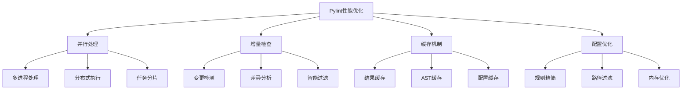

# 第 11 章：性能优化与大型项目应用

::: tip 学习目标
- 掌握 Pylint 在大型项目中的性能优化技巧
- 学会配置分布式和并行检查
- 理解增量检查和缓存机制
- 掌握大规模代码库的质量管理策略
:::

### 知识点

#### 性能优化策略



#### 大型项目挑战

| 挑战 | 描述 | 解决方案 |
|------|------|----------|
| **执行时间长** | 大代码库检查耗时 | 并行处理、增量检查 |
| **内存消耗高** | AST占用大量内存 | 分片处理、内存限制 |
| **配置复杂** | 多团队不同需求 | 分层配置、继承机制 |
| **结果管理** | 大量检查结果难以处理 | 结果聚合、优先级分类 |

### 示例代码

#### 并行处理配置

```python
# parallel_pylint.py
"""
并行 Pylint 执行器

支持多进程和分布式执行的 Pylint 包装器。
"""

import os
import multiprocessing
import subprocess
import json
import time
from pathlib import Path
from typing import List, Dict, Any, Optional
from concurrent.futures import ProcessPoolExecutor, as_completed
import argparse

class ParallelPylintRunner:
    """并行 Pylint 运行器"""

    def __init__(self, project_root: str, config_file: str = '.pylintrc'):
        self.project_root = Path(project_root)
        self.config_file = config_file
        self.max_workers = min(multiprocessing.cpu_count(), 8)

    def discover_python_files(self, directories: List[str] = None,
                            exclude_patterns: List[str] = None) -> List[Path]:
        """发现 Python 文件"""
        if directories is None:
            directories = ['.']

        if exclude_patterns is None:
            exclude_patterns = [
                '__pycache__',
                '.git',
                '.venv',
                'venv',
                '.tox',
                'build',
                'dist',
                '*.egg-info'
            ]

        python_files = []
        for directory in directories:
            dir_path = self.project_root / directory

            if not dir_path.exists():
                continue

            for py_file in dir_path.rglob('*.py'):
                # 检查是否应该排除
                should_exclude = any(
                    pattern in str(py_file) for pattern in exclude_patterns
                )
                if not should_exclude:
                    python_files.append(py_file)

        return python_files

    def create_file_chunks(self, files: List[Path],
                          chunk_size: Optional[int] = None) -> List[List[Path]]:
        """将文件分组为处理块"""
        if chunk_size is None:
            # 根据工作进程数和文件数量动态计算块大小
            chunk_size = max(1, len(files) // (self.max_workers * 2))

        chunks = []
        for i in range(0, len(files), chunk_size):
            chunk = files[i:i + chunk_size]
            chunks.append(chunk)

        return chunks

    def run_pylint_on_chunk(self, files: List[Path]) -> Dict[str, Any]:
        """在文件块上运行 Pylint"""
        start_time = time.time()

        # 构建命令
        cmd = [
            'pylint',
            f'--rcfile={self.config_file}',
            '--output-format=json',
            '--reports=no',
            '--score=no'
        ] + [str(f) for f in files]

        try:
            result = subprocess.run(
                cmd,
                capture_output=True,
                text=True,
                cwd=self.project_root,
                timeout=300  # 5分钟超时
            )

            # 解析结果
            messages = []
            if result.stdout:
                try:
                    messages = json.loads(result.stdout)
                except json.JSONDecodeError:
                    # 如果JSON解析失败，尝试逐行解析
                    for line in result.stdout.split('\n'):
                        if line.strip():
                            try:
                                msg = json.loads(line)
                                messages.append(msg)
                            except json.JSONDecodeError:
                                continue

            execution_time = time.time() - start_time

            return {
                'files': [str(f) for f in files],
                'messages': messages,
                'execution_time': execution_time,
                'return_code': result.returncode,
                'stderr': result.stderr
            }

        except subprocess.TimeoutExpired:
            return {
                'files': [str(f) for f in files],
                'messages': [],
                'execution_time': time.time() - start_time,
                'return_code': -1,
                'stderr': 'Timeout expired',
                'error': 'timeout'
            }
        except Exception as e:
            return {
                'files': [str(f) for f in files],
                'messages': [],
                'execution_time': time.time() - start_time,
                'return_code': -1,
                'stderr': str(e),
                'error': str(e)
            }

    def run_parallel(self, directories: List[str] = None,
                    exclude_patterns: List[str] = None,
                    max_workers: Optional[int] = None) -> Dict[str, Any]:
        """并行运行 Pylint"""
        if max_workers:
            self.max_workers = max_workers

        print(f"🔍 Discovering Python files...")
        files = self.discover_python_files(directories, exclude_patterns)
        print(f"📁 Found {len(files)} Python files")

        if not files:
            return {
                'total_files': 0,
                'total_messages': 0,
                'execution_time': 0,
                'chunks': []
            }

        print(f"📦 Creating file chunks...")
        chunks = self.create_file_chunks(files)
        print(f"🔄 Processing {len(chunks)} chunks with {self.max_workers} workers")

        start_time = time.time()
        chunk_results = []

        with ProcessPoolExecutor(max_workers=self.max_workers) as executor:
            # 提交任务
            future_to_chunk = {
                executor.submit(self.run_pylint_on_chunk, chunk): i
                for i, chunk in enumerate(chunks)
            }

            # 收集结果
            for future in as_completed(future_to_chunk):
                chunk_index = future_to_chunk[future]
                try:
                    result = future.result()
                    chunk_results.append(result)
                    print(f"✅ Completed chunk {chunk_index + 1}/{len(chunks)} "
                          f"({len(result['messages'])} messages, "
                          f"{result['execution_time']:.2f}s)")
                except Exception as e:
                    print(f"❌ Error in chunk {chunk_index + 1}: {e}")
                    chunk_results.append({
                        'files': [str(f) for f in chunks[chunk_index]],
                        'messages': [],
                        'execution_time': 0,
                        'return_code': -1,
                        'error': str(e)
                    })

        total_time = time.time() - start_time

        # 聚合结果
        all_messages = []
        for result in chunk_results:
            all_messages.extend(result['messages'])

        summary = {
            'total_files': len(files),
            'total_messages': len(all_messages),
            'execution_time': total_time,
            'chunks': len(chunks),
            'chunk_results': chunk_results,
            'messages': all_messages
        }

        print(f"🎉 Analysis complete! {len(all_messages)} total messages in {total_time:.2f}s")
        return summary

    def save_results(self, results: Dict[str, Any], output_file: str):
        """保存结果到文件"""
        with open(output_file, 'w', encoding='utf-8') as f:
            json.dump(results, f, indent=2, ensure_ascii=False)

        print(f"💾 Results saved to {output_file}")

def main():
    """主函数"""
    parser = argparse.ArgumentParser(description='Parallel Pylint Runner')
    parser.add_argument('--directories', nargs='+', default=['.'],
                       help='Directories to analyze')
    parser.add_argument('--exclude', nargs='+',
                       help='Patterns to exclude')
    parser.add_argument('--config', default='.pylintrc',
                       help='Pylint configuration file')
    parser.add_argument('--workers', type=int,
                       help='Number of worker processes')
    parser.add_argument('--output', default='pylint-parallel-results.json',
                       help='Output file for results')

    args = parser.parse_args()

    runner = ParallelPylintRunner('.', args.config)
    results = runner.run_parallel(
        directories=args.directories,
        exclude_patterns=args.exclude,
        max_workers=args.workers
    )

    runner.save_results(results, args.output)

if __name__ == "__main__":
    main()
```

#### 增量检查实现

```python
# incremental_pylint.py
"""
增量 Pylint 检查器

只检查变更的文件，提高大型项目的检查效率。
"""

import json
import subprocess
import hashlib
import pickle
from pathlib import Path
from typing import Dict, List, Set, Optional, Any
from datetime import datetime
import os

class IncrementalPylintChecker:
    """增量 Pylint 检查器"""

    def __init__(self, project_root: str, cache_dir: str = '.pylint_cache'):
        self.project_root = Path(project_root)
        self.cache_dir = Path(cache_dir)
        self.cache_dir.mkdir(exist_ok=True)

        # 缓存文件路径
        self.file_hashes_cache = self.cache_dir / 'file_hashes.json'
        self.results_cache = self.cache_dir / 'results.pickle'
        self.config_cache = self.cache_dir / 'config_hash.txt'

    def calculate_file_hash(self, file_path: Path) -> str:
        """计算文件的哈希值"""
        try:
            with open(file_path, 'rb') as f:
                content = f.read()
            return hashlib.md5(content).hexdigest()
        except Exception:
            return ''

    def get_config_hash(self, config_file: str) -> str:
        """获取配置文件的哈希值"""
        config_path = self.project_root / config_file
        if config_path.exists():
            return self.calculate_file_hash(config_path)
        return ''

    def load_file_hashes(self) -> Dict[str, str]:
        """加载文件哈希缓存"""
        if self.file_hashes_cache.exists():
            try:
                with open(self.file_hashes_cache, 'r') as f:
                    return json.load(f)
            except Exception:
                return {}
        return {}

    def save_file_hashes(self, hashes: Dict[str, str]):
        """保存文件哈希缓存"""
        with open(self.file_hashes_cache, 'w') as f:
            json.dump(hashes, f, indent=2)

    def load_results_cache(self) -> Dict[str, List[Dict]]:
        """加载结果缓存"""
        if self.results_cache.exists():
            try:
                with open(self.results_cache, 'rb') as f:
                    return pickle.load(f)
            except Exception:
                return {}
        return {}

    def save_results_cache(self, results: Dict[str, List[Dict]]):
        """保存结果缓存"""
        with open(self.results_cache, 'wb') as f:
            pickle.dump(results, f)

    def get_changed_files(self, files: List[Path],
                         config_file: str = '.pylintrc') -> Set[Path]:
        """获取变更的文件"""
        # 检查配置文件是否变更
        current_config_hash = self.get_config_hash(config_file)
        cached_config_hash = ''

        if self.config_cache.exists():
            try:
                with open(self.config_cache, 'r') as f:
                    cached_config_hash = f.read().strip()
            except Exception:
                pass

        config_changed = current_config_hash != cached_config_hash

        if config_changed:
            print("📝 Configuration changed, checking all files")
            # 保存新的配置哈希
            with open(self.config_cache, 'w') as f:
                f.write(current_config_hash)
            return set(files)

        # 加载文件哈希缓存
        cached_hashes = self.load_file_hashes()
        changed_files = set()

        print("🔍 Checking for changed files...")
        for file_path in files:
            relative_path = str(file_path.relative_to(self.project_root))
            current_hash = self.calculate_file_hash(file_path)

            if (relative_path not in cached_hashes or
                cached_hashes[relative_path] != current_hash):
                changed_files.add(file_path)

        print(f"📊 Found {len(changed_files)} changed files out of {len(files)} total")
        return changed_files

    def update_file_hashes(self, files: List[Path]):
        """更新文件哈希缓存"""
        cached_hashes = self.load_file_hashes()

        for file_path in files:
            relative_path = str(file_path.relative_to(self.project_root))
            cached_hashes[relative_path] = self.calculate_file_hash(file_path)

        self.save_file_hashes(cached_hashes)

    def run_pylint_on_files(self, files: List[Path],
                           config_file: str = '.pylintrc') -> Dict[str, List[Dict]]:
        """在指定文件上运行 Pylint"""
        if not files:
            return {}

        print(f"🔧 Running Pylint on {len(files)} files...")

        cmd = [
            'pylint',
            f'--rcfile={config_file}',
            '--output-format=json',
            '--reports=no',
            '--score=no'
        ] + [str(f) for f in files]

        try:
            result = subprocess.run(
                cmd,
                capture_output=True,
                text=True,
                cwd=self.project_root
            )

            messages = []
            if result.stdout:
                try:
                    messages = json.loads(result.stdout)
                except json.JSONDecodeError:
                    # 处理解析错误
                    print("⚠️  Warning: Could not parse Pylint output as JSON")

            # 按文件组织结果
            results_by_file = {}
            for msg in messages:
                file_path = msg['path']
                if file_path not in results_by_file:
                    results_by_file[file_path] = []
                results_by_file[file_path].append(msg)

            return results_by_file

        except Exception as e:
            print(f"❌ Error running Pylint: {e}")
            return {}

    def run_incremental_check(self, directories: List[str] = None,
                            config_file: str = '.pylintrc') -> Dict[str, Any]:
        """运行增量检查"""
        if directories is None:
            directories = ['.']

        # 发现所有 Python 文件
        all_files = []
        for directory in directories:
            dir_path = self.project_root / directory
            if dir_path.exists():
                all_files.extend(dir_path.rglob('*.py'))

        # 过滤掉不需要检查的文件
        filtered_files = [
            f for f in all_files
            if not any(exclude in str(f) for exclude in [
                '__pycache__', '.git', '.venv', 'venv', '.tox'
            ])
        ]

        print(f"📁 Found {len(filtered_files)} Python files")

        # 获取变更的文件
        changed_files = self.get_changed_files(filtered_files, config_file)

        if not changed_files:
            print("✅ No files changed, using cached results")
            cached_results = self.load_results_cache()
            all_messages = []
            for file_messages in cached_results.values():
                all_messages.extend(file_messages)

            return {
                'total_files': len(filtered_files),
                'changed_files': 0,
                'cached_files': len(filtered_files),
                'total_messages': len(all_messages),
                'messages': all_messages,
                'incremental': True
            }

        # 运行 Pylint 检查变更的文件
        new_results = self.run_pylint_on_files(list(changed_files), config_file)

        # 加载缓存的结果
        cached_results = self.load_results_cache()

        # 更新结果缓存
        for file_path, messages in new_results.items():
            cached_results[file_path] = messages

        # 移除已删除文件的结果
        existing_files = {str(f.relative_to(self.project_root)) for f in filtered_files}
        cached_results = {
            k: v for k, v in cached_results.items()
            if k in existing_files
        }

        # 保存更新的缓存
        self.save_results_cache(cached_results)
        self.update_file_hashes(filtered_files)

        # 聚合所有结果
        all_messages = []
        for file_messages in cached_results.values():
            all_messages.extend(file_messages)

        return {
            'total_files': len(filtered_files),
            'changed_files': len(changed_files),
            'cached_files': len(filtered_files) - len(changed_files),
            'total_messages': len(all_messages),
            'messages': all_messages,
            'incremental': True
        }

    def clear_cache(self):
        """清除所有缓存"""
        cache_files = [
            self.file_hashes_cache,
            self.results_cache,
            self.config_cache
        ]

        for cache_file in cache_files:
            if cache_file.exists():
                cache_file.unlink()

        print("🗑️  Cache cleared")

    def get_cache_stats(self) -> Dict[str, Any]:
        """获取缓存统计信息"""
        stats = {
            'cache_dir': str(self.cache_dir),
            'cache_size': 0,
            'files': {}
        }

        cache_files = [
            ('file_hashes', self.file_hashes_cache),
            ('results', self.results_cache),
            ('config', self.config_cache)
        ]

        for name, path in cache_files:
            if path.exists():
                size = path.stat().st_size
                stats['cache_size'] += size
                stats['files'][name] = {
                    'path': str(path),
                    'size': size,
                    'exists': True,
                    'modified': datetime.fromtimestamp(path.stat().st_mtime).isoformat()
                }
            else:
                stats['files'][name] = {
                    'path': str(path),
                    'size': 0,
                    'exists': False
                }

        return stats
```

#### 分布式执行框架

```python
# distributed_pylint.py
"""
分布式 Pylint 执行框架

支持在多台机器上分布式执行 Pylint 检查。
"""

import json
import time
import asyncio
import aiohttp
from pathlib import Path
from typing import List, Dict, Any, Optional
from dataclasses import dataclass, asdict
import hashlib

@dataclass
class WorkerNode:
    """工作节点信息"""
    host: str
    port: int
    max_tasks: int = 4
    current_tasks: int = 0
    last_heartbeat: float = 0
    available: bool = True

@dataclass
class AnalysisTask:
    """分析任务"""
    task_id: str
    files: List[str]
    config: Dict[str, Any]
    status: str = 'pending'  # pending, running, completed, failed
    assigned_worker: Optional[str] = None
    result: Optional[Dict[str, Any]] = None
    created_at: float = 0
    started_at: Optional[float] = None
    completed_at: Optional[float] = None

class DistributedPylintMaster:
    """分布式 Pylint 主节点"""

    def __init__(self, master_port: int = 8888):
        self.master_port = master_port
        self.workers: Dict[str, WorkerNode] = {}
        self.tasks: Dict[str, AnalysisTask] = {}
        self.task_queue: List[str] = []

    def register_worker(self, host: str, port: int, max_tasks: int = 4):
        """注册工作节点"""
        worker_id = f"{host}:{port}"
        self.workers[worker_id] = WorkerNode(
            host=host,
            port=port,
            max_tasks=max_tasks,
            last_heartbeat=time.time()
        )
        print(f"📡 Registered worker: {worker_id}")

    def create_tasks(self, files: List[Path], chunk_size: int = 10,
                    config: Dict[str, Any] = None) -> List[str]:
        """创建分析任务"""
        if config is None:
            config = {'rcfile': '.pylintrc'}

        tasks = []
        for i in range(0, len(files), chunk_size):
            chunk = files[i:i + chunk_size]
            task_id = hashlib.md5(
                f"{time.time()}_{i}".encode()
            ).hexdigest()[:8]

            task = AnalysisTask(
                task_id=task_id,
                files=[str(f) for f in chunk],
                config=config,
                created_at=time.time()
            )

            self.tasks[task_id] = task
            self.task_queue.append(task_id)
            tasks.append(task_id)

        print(f"📋 Created {len(tasks)} tasks for {len(files)} files")
        return tasks

    async def assign_tasks(self):
        """分配任务给可用的工作节点"""
        while self.task_queue:
            # 查找可用的工作节点
            available_workers = [
                (worker_id, worker) for worker_id, worker in self.workers.items()
                if worker.available and worker.current_tasks < worker.max_tasks
            ]

            if not available_workers:
                await asyncio.sleep(1)
                continue

            # 分配任务
            for worker_id, worker in available_workers:
                if not self.task_queue:
                    break

                task_id = self.task_queue.pop(0)
                task = self.tasks[task_id]

                try:
                    # 发送任务到工作节点
                    await self.send_task_to_worker(worker_id, task)
                    task.status = 'running'
                    task.assigned_worker = worker_id
                    task.started_at = time.time()
                    worker.current_tasks += 1

                    print(f"🚀 Assigned task {task_id} to worker {worker_id}")

                except Exception as e:
                    print(f"❌ Failed to assign task {task_id} to {worker_id}: {e}")
                    # 将任务重新加入队列
                    self.task_queue.append(task_id)

            await asyncio.sleep(0.1)

    async def send_task_to_worker(self, worker_id: str, task: AnalysisTask):
        """发送任务到工作节点"""
        worker = self.workers[worker_id]
        url = f"http://{worker.host}:{worker.port}/analyze"

        async with aiohttp.ClientSession() as session:
            async with session.post(url, json=asdict(task)) as response:
                if response.status != 200:
                    raise Exception(f"Worker returned status {response.status}")

    async def collect_results(self):
        """收集工作节点的结果"""
        while True:
            for worker_id, worker in self.workers.items():
                try:
                    url = f"http://{worker.host}:{worker.port}/results"
                    async with aiohttp.ClientSession() as session:
                        async with session.get(url) as response:
                            if response.status == 200:
                                results = await response.json()
                                await self.process_worker_results(worker_id, results)
                except Exception as e:
                    print(f"⚠️  Error collecting results from {worker_id}: {e}")

            await asyncio.sleep(2)

    async def process_worker_results(self, worker_id: str, results: List[Dict]):
        """处理工作节点返回的结果"""
        worker = self.workers[worker_id]

        for result in results:
            task_id = result['task_id']
            if task_id in self.tasks:
                task = self.tasks[task_id]
                task.status = result['status']
                task.result = result.get('result')
                task.completed_at = time.time()

                if task.status == 'completed':
                    worker.current_tasks = max(0, worker.current_tasks - 1)
                    print(f"✅ Task {task_id} completed by {worker_id}")
                elif task.status == 'failed':
                    worker.current_tasks = max(0, worker.current_tasks - 1)
                    print(f"❌ Task {task_id} failed on {worker_id}")

    async def start_coordination(self, files: List[Path], chunk_size: int = 10):
        """开始协调分布式执行"""
        # 创建任务
        task_ids = self.create_tasks(files, chunk_size)

        # 启动任务分配和结果收集
        await asyncio.gather(
            self.assign_tasks(),
            self.collect_results()
        )

    def get_execution_summary(self) -> Dict[str, Any]:
        """获取执行摘要"""
        total_tasks = len(self.tasks)
        completed_tasks = sum(1 for t in self.tasks.values() if t.status == 'completed')
        failed_tasks = sum(1 for t in self.tasks.values() if t.status == 'failed')
        running_tasks = sum(1 for t in self.tasks.values() if t.status == 'running')

        all_messages = []
        for task in self.tasks.values():
            if task.result and 'messages' in task.result:
                all_messages.extend(task.result['messages'])

        return {
            'total_tasks': total_tasks,
            'completed_tasks': completed_tasks,
            'failed_tasks': failed_tasks,
            'running_tasks': running_tasks,
            'total_messages': len(all_messages),
            'messages': all_messages,
            'workers': len(self.workers),
            'active_workers': sum(1 for w in self.workers.values() if w.available)
        }

class DistributedPylintWorker:
    """分布式 Pylint 工作节点"""

    def __init__(self, worker_port: int = 8889, max_concurrent: int = 4):
        self.worker_port = worker_port
        self.max_concurrent = max_concurrent
        self.current_tasks: Dict[str, AnalysisTask] = {}
        self.completed_results: List[Dict] = []

    async def handle_analyze_request(self, request):
        """处理分析请求"""
        try:
            task_data = await request.json()
            task = AnalysisTask(**task_data)

            if len(self.current_tasks) >= self.max_concurrent:
                return aiohttp.web.Response(
                    status=503,
                    text="Worker at capacity"
                )

            # 启动分析任务
            asyncio.create_task(self.execute_analysis(task))

            return aiohttp.web.Response(status=200, text="Task accepted")

        except Exception as e:
            return aiohttp.web.Response(
                status=400,
                text=f"Error processing request: {e}"
            )

    async def execute_analysis(self, task: AnalysisTask):
        """执行分析任务"""
        self.current_tasks[task.task_id] = task

        try:
            # 运行 Pylint
            import subprocess
            cmd = [
                'pylint',
                f'--rcfile={task.config.get("rcfile", ".pylintrc")}',
                '--output-format=json',
                '--reports=no',
                '--score=no'
            ] + task.files

            result = subprocess.run(
                cmd,
                capture_output=True,
                text=True,
                timeout=300
            )

            messages = []
            if result.stdout:
                try:
                    messages = json.loads(result.stdout)
                except json.JSONDecodeError:
                    pass

            # 记录结果
            task_result = {
                'task_id': task.task_id,
                'status': 'completed',
                'result': {
                    'messages': messages,
                    'return_code': result.returncode,
                    'execution_time': time.time() - task.started_at
                }
            }

        except Exception as e:
            task_result = {
                'task_id': task.task_id,
                'status': 'failed',
                'result': {
                    'error': str(e),
                    'execution_time': time.time() - task.started_at
                }
            }

        finally:
            # 清理任务
            if task.task_id in self.current_tasks:
                del self.current_tasks[task.task_id]

            # 添加到完成结果
            self.completed_results.append(task_result)

    async def handle_results_request(self, request):
        """处理结果请求"""
        results = self.completed_results.copy()
        self.completed_results.clear()  # 清空已发送的结果

        return aiohttp.web.json_response(results)

    async def start_worker(self):
        """启动工作节点"""
        app = aiohttp.web.Application()
        app.router.add_post('/analyze', self.handle_analyze_request)
        app.router.add_get('/results', self.handle_results_request)

        runner = aiohttp.web.AppRunner(app)
        await runner.setup()

        site = aiohttp.web.TCPSite(runner, '0.0.0.0', self.worker_port)
        await site.start()

        print(f"🔧 Worker started on port {self.worker_port}")
```

#### 内存优化和性能监控

```python
# performance_monitor.py
"""
Pylint 性能监控和内存优化

监控 Pylint 执行的性能指标并提供优化建议。
"""

import psutil
import time
import json
from pathlib import Path
from typing import Dict, List, Any, Optional
from dataclasses import dataclass, asdict
import threading
import gc

@dataclass
class PerformanceMetrics:
    """性能指标"""
    timestamp: float
    cpu_percent: float
    memory_mb: float
    memory_percent: float
    io_read_mb: float
    io_write_mb: float
    files_processed: int
    messages_found: int

class PylintPerformanceMonitor:
    """Pylint 性能监控器"""

    def __init__(self, sampling_interval: float = 1.0):
        self.sampling_interval = sampling_interval
        self.metrics: List[PerformanceMetrics] = []
        self.monitoring = False
        self.monitor_thread: Optional[threading.Thread] = None
        self.process = psutil.Process()

        # 初始IO计数器
        self.initial_io = self.process.io_counters()

    def start_monitoring(self):
        """开始监控"""
        if self.monitoring:
            return

        self.monitoring = True
        self.monitor_thread = threading.Thread(target=self._monitor_loop)
        self.monitor_thread.daemon = True
        self.monitor_thread.start()
        print("📊 Performance monitoring started")

    def stop_monitoring(self):
        """停止监控"""
        self.monitoring = False
        if self.monitor_thread:
            self.monitor_thread.join()
        print("📊 Performance monitoring stopped")

    def _monitor_loop(self):
        """监控循环"""
        while self.monitoring:
            try:
                # 收集系统指标
                cpu_percent = self.process.cpu_percent()
                memory_info = self.process.memory_info()
                memory_mb = memory_info.rss / 1024 / 1024
                memory_percent = self.process.memory_percent()

                # IO 指标
                current_io = self.process.io_counters()
                io_read_mb = (current_io.read_bytes - self.initial_io.read_bytes) / 1024 / 1024
                io_write_mb = (current_io.write_bytes - self.initial_io.write_bytes) / 1024 / 1024

                metrics = PerformanceMetrics(
                    timestamp=time.time(),
                    cpu_percent=cpu_percent,
                    memory_mb=memory_mb,
                    memory_percent=memory_percent,
                    io_read_mb=io_read_mb,
                    io_write_mb=io_write_mb,
                    files_processed=0,  # 需要从外部更新
                    messages_found=0   # 需要从外部更新
                )

                self.metrics.append(metrics)

                # 限制指标历史长度
                if len(self.metrics) > 1000:
                    self.metrics = self.metrics[-1000:]

            except Exception as e:
                print(f"Error collecting metrics: {e}")

            time.sleep(self.sampling_interval)

    def update_progress(self, files_processed: int, messages_found: int):
        """更新处理进度"""
        if self.metrics:
            self.metrics[-1].files_processed = files_processed
            self.metrics[-1].messages_found = messages_found

    def get_current_metrics(self) -> Optional[PerformanceMetrics]:
        """获取当前指标"""
        return self.metrics[-1] if self.metrics else None

    def get_peak_metrics(self) -> Dict[str, float]:
        """获取峰值指标"""
        if not self.metrics:
            return {}

        return {
            'peak_cpu_percent': max(m.cpu_percent for m in self.metrics),
            'peak_memory_mb': max(m.memory_mb for m in self.metrics),
            'peak_memory_percent': max(m.memory_percent for m in self.metrics),
            'total_io_read_mb': max(m.io_read_mb for m in self.metrics),
            'total_io_write_mb': max(m.io_write_mb for m in self.metrics),
        }

    def get_performance_summary(self) -> Dict[str, Any]:
        """获取性能摘要"""
        if not self.metrics:
            return {}

        duration = self.metrics[-1].timestamp - self.metrics[0].timestamp
        avg_cpu = sum(m.cpu_percent for m in self.metrics) / len(self.metrics)
        avg_memory = sum(m.memory_mb for m in self.metrics) / len(self.metrics)

        peak_metrics = self.get_peak_metrics()

        return {
            'duration_seconds': duration,
            'sample_count': len(self.metrics),
            'average_cpu_percent': avg_cpu,
            'average_memory_mb': avg_memory,
            'peak_metrics': peak_metrics,
            'final_files_processed': self.metrics[-1].files_processed,
            'final_messages_found': self.metrics[-1].messages_found,
        }

    def save_metrics(self, output_file: str):
        """保存指标到文件"""
        data = {
            'sampling_interval': self.sampling_interval,
            'metrics': [asdict(m) for m in self.metrics],
            'summary': self.get_performance_summary()
        }

        with open(output_file, 'w') as f:
            json.dump(data, f, indent=2)

    def generate_recommendations(self) -> List[str]:
        """生成性能优化建议"""
        if not self.metrics:
            return ["No metrics available for analysis"]

        recommendations = []
        peak_metrics = self.get_peak_metrics()

        # 内存使用建议
        if peak_metrics.get('peak_memory_mb', 0) > 1000:
            recommendations.append(
                "高内存使用：考虑减少并行进程数量或启用分片处理"
            )

        if peak_metrics.get('peak_memory_percent', 0) > 80:
            recommendations.append(
                "内存使用率过高：建议增加系统内存或优化代码检查范围"
            )

        # CPU 使用建议
        avg_cpu = sum(m.cpu_percent for m in self.metrics) / len(self.metrics)
        if avg_cpu < 30:
            recommendations.append(
                "CPU使用率较低：可以增加并行进程数量以提高效率"
            )

        # IO 使用建议
        if peak_metrics.get('total_io_read_mb', 0) > 500:
            recommendations.append(
                "高IO读取：考虑使用SSD存储或启用文件缓存"
            )

        # 处理效率建议
        if self.metrics:
            duration = self.metrics[-1].timestamp - self.metrics[0].timestamp
            files_per_second = self.metrics[-1].files_processed / duration

            if files_per_second < 1:
                recommendations.append(
                    "处理速度较慢：考虑禁用部分检查规则或使用增量检查"
                )

        if not recommendations:
            recommendations.append("性能表现良好，无需特殊优化")

        return recommendations

class MemoryOptimizer:
    """内存优化器"""

    @staticmethod
    def force_garbage_collection():
        """强制垃圾回收"""
        gc.collect()

    @staticmethod
    def get_memory_usage() -> Dict[str, float]:
        """获取内存使用情况"""
        process = psutil.Process()
        memory_info = process.memory_info()

        return {
            'rss_mb': memory_info.rss / 1024 / 1024,
            'vms_mb': memory_info.vms / 1024 / 1024,
            'percent': process.memory_percent(),
            'available_mb': psutil.virtual_memory().available / 1024 / 1024
        }

    @staticmethod
    def check_memory_pressure() -> bool:
        """检查内存压力"""
        memory = psutil.virtual_memory()
        return memory.percent > 80

    @staticmethod
    def optimize_for_large_codebase():
        """为大型代码库优化"""
        # 调整垃圾回收阈值
        import gc
        gc.set_threshold(700, 10, 10)

        # 强制垃圾回收
        gc.collect()

        print("🔧 Memory optimization applied for large codebase")
```

::: note 性能优化最佳实践
1. **并行处理**：利用多核CPU并行检查文件
2. **增量检查**：只检查变更的文件，避免重复分析
3. **缓存机制**：缓存分析结果和文件哈希
4. **分片处理**：将大型代码库分片处理，控制内存使用
5. **规则优化**：禁用不必要的检查规则，专注核心质量问题
:::

::: warning 注意事项
1. **资源限制**：监控CPU和内存使用，避免系统过载
2. **网络延迟**：分布式执行时要考虑网络传输开销
3. **缓存一致性**：确保缓存与代码变更保持一致
4. **错误恢复**：实现任务失败的重试和恢复机制
:::

通过性能优化和分布式技术，可以显著提升Pylint在大型项目中的执行效率，实现大规模代码质量管理。