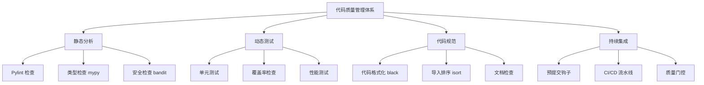

# 第 12 章：实战项目与最佳实践

::: tip 学习目标
- 设计完整的代码质量检查方案
- 实现团队级别的代码规范管理
- 掌握 Pylint 与其他工具的结合使用
- 总结 Pylint 使用的最佳实践
:::

### 知识点

#### 代码质量管理体系

一个完整的代码质量管理体系应该包括：



#### Pylint 在开发流程中的位置

| 开发阶段 | Pylint 作用 | 工具集成 |
|----------|-------------|----------|
| **编码阶段** | 实时代码检查 | IDE 集成 |
| **提交前** | 代码质量验证 | pre-commit hooks |
| **代码审查** | 自动化规范检查 | GitHub Actions |
| **集成测试** | 质量门控 | CI/CD 流水线 |
| **发布前** | 最终质量检查 | 自动化脚本 |

### 示例代码

#### 完整的项目质量检查方案

```python
# quality_management.py - 代码质量管理系统

import os
import sys
import json
import subprocess
import datetime
from pathlib import Path
from typing import Dict, List, Tuple, Optional
from dataclasses import dataclass, asdict

@dataclass
class QualityMetrics:
    """代码质量指标"""
    pylint_score: float
    coverage_percentage: float
    test_count: int
    line_count: int
    complexity_score: float
    security_issues: int
    timestamp: str

@dataclass
class QualityConfig:
    """质量配置"""
    min_pylint_score: float = 8.0
    min_coverage: float = 80.0
    max_complexity: float = 10.0
    enable_security_check: bool = True
    fail_on_error: bool = True

class CodeQualityManager:
    """代码质量管理器"""

    def __init__(self, project_root: str, config: QualityConfig = None):
        self.project_root = Path(project_root)
        self.config = config or QualityConfig()
        self.results = {}

    def run_pylint_check(self) -> Tuple[bool, Dict]:
        """运行 Pylint 检查"""
        print("🔍 运行 Pylint 检查...")

        try:
            result = subprocess.run(
                ['pylint', '--output-format=json', '--reports=yes', 'src/'],
                cwd=self.project_root,
                capture_output=True,
                text=True
            )

            if result.stdout:
                # 解析 JSON 输出
                issues = json.loads(result.stdout) if result.stdout.strip() else []

                # 提取评分
                score = self._extract_pylint_score(result.stderr)

                pylint_result = {
                    'score': score,
                    'issues': issues,
                    'total_issues': len(issues),
                    'error_count': len([i for i in issues if i['type'] == 'error']),
                    'warning_count': len([i for i in issues if i['type'] == 'warning']),
                    'convention_count': len([i for i in issues if i['type'] == 'convention']),
                    'refactor_count': len([i for i in issues if i['type'] == 'refactor']),
                    'passed': score >= self.config.min_pylint_score
                }

                self.results['pylint'] = pylint_result
                return pylint_result['passed'], pylint_result

            else:
                return False, {'error': 'Pylint 运行失败', 'stderr': result.stderr}

        except Exception as e:
            return False, {'error': f'Pylint 检查异常: {str(e)}'}

    def run_coverage_check(self) -> Tuple[bool, Dict]:
        """运行覆盖率检查"""
        print("📊 运行覆盖率检查...")

        try:
            # 运行测试并生成覆盖率报告
            subprocess.run(['pytest', '--cov=src', '--cov-report=json'],
                         cwd=self.project_root, check=True)

            # 读取覆盖率报告
            coverage_file = self.project_root / 'coverage.json'
            if coverage_file.exists():
                with open(coverage_file) as f:
                    coverage_data = json.load(f)

                total_coverage = coverage_data['totals']['percent_covered']
                coverage_result = {
                    'percentage': total_coverage,
                    'lines_covered': coverage_data['totals']['covered_lines'],
                    'lines_total': coverage_data['totals']['num_statements'],
                    'passed': total_coverage >= self.config.min_coverage
                }

                self.results['coverage'] = coverage_result
                return coverage_result['passed'], coverage_result

            else:
                return False, {'error': '覆盖率报告文件不存在'}

        except Exception as e:
            return False, {'error': f'覆盖率检查异常: {str(e)}'}

    def run_security_check(self) -> Tuple[bool, Dict]:
        """运行安全检查"""
        if not self.config.enable_security_check:
            return True, {'skipped': True}

        print("🔒 运行安全检查...")

        try:
            result = subprocess.run(
                ['bandit', '-r', 'src/', '-f', 'json'],
                cwd=self.project_root,
                capture_output=True,
                text=True
            )

            if result.stdout:
                security_data = json.loads(result.stdout)
                security_result = {
                    'high_severity': len([r for r in security_data['results']
                                        if r['issue_severity'] == 'HIGH']),
                    'medium_severity': len([r for r in security_data['results']
                                          if r['issue_severity'] == 'MEDIUM']),
                    'low_severity': len([r for r in security_data['results']
                                       if r['issue_severity'] == 'LOW']),
                    'total_issues': len(security_data['results']),
                    'passed': len([r for r in security_data['results']
                                 if r['issue_severity'] == 'HIGH']) == 0
                }

                self.results['security'] = security_result
                return security_result['passed'], security_result

        except subprocess.CalledProcessError:
            # Bandit 可能没有安装或者发现了严重的安全问题
            return False, {'error': 'Security check failed'}
        except Exception as e:
            return False, {'error': f'安全检查异常: {str(e)}'}

    def run_complexity_check(self) -> Tuple[bool, Dict]:
        """运行复杂度检查"""
        print("🧮 运行复杂度检查...")

        try:
            result = subprocess.run(
                ['radon', 'cc', 'src/', '--json'],
                cwd=self.project_root,
                capture_output=True,
                text=True
            )

            if result.stdout:
                complexity_data = json.loads(result.stdout)

                # 计算平均复杂度
                all_complexities = []
                for file_data in complexity_data.values():
                    for item in file_data:
                        if 'complexity' in item:
                            all_complexities.append(item['complexity'])

                avg_complexity = sum(all_complexities) / len(all_complexities) if all_complexities else 0
                max_complexity = max(all_complexities) if all_complexities else 0

                complexity_result = {
                    'average_complexity': avg_complexity,
                    'max_complexity': max_complexity,
                    'high_complexity_count': len([c for c in all_complexities if c > 10]),
                    'passed': avg_complexity <= self.config.max_complexity
                }

                self.results['complexity'] = complexity_result
                return complexity_result['passed'], complexity_result

        except Exception as e:
            return False, {'error': f'复杂度检查异常: {str(e)}'}

    def generate_quality_report(self) -> Dict:
        """生成质量报告"""
        print("📋 生成质量报告...")

        report = {
            'project': str(self.project_root),
            'timestamp': datetime.datetime.now().isoformat(),
            'config': asdict(self.config),
            'results': self.results,
            'summary': self._generate_summary()
        }

        # 保存报告
        report_file = self.project_root / 'quality_report.json'
        with open(report_file, 'w') as f:
            json.dump(report, f, indent=2)

        return report

    def run_full_check(self) -> bool:
        """运行完整的质量检查"""
        print("🚀 开始完整的代码质量检查...")

        checks = [
            ('Pylint', self.run_pylint_check),
            ('Coverage', self.run_coverage_check),
            ('Security', self.run_security_check),
            ('Complexity', self.run_complexity_check)
        ]

        all_passed = True
        failed_checks = []

        for check_name, check_func in checks:
            try:
                passed, result = check_func()
                if not passed:
                    all_passed = False
                    failed_checks.append(check_name)
                    if self.config.fail_on_error:
                        print(f"❌ {check_name} 检查失败: {result}")
                    else:
                        print(f"⚠️  {check_name} 检查未通过: {result}")
                else:
                    print(f"✅ {check_name} 检查通过")

            except Exception as e:
                print(f"💥 {check_name} 检查出错: {str(e)}")
                all_passed = False
                failed_checks.append(check_name)

        # 生成报告
        self.generate_quality_report()

        # 输出总结
        if all_passed:
            print("\n🎉 所有质量检查都通过了！")
        else:
            print(f"\n⚠️  以下检查未通过: {', '.join(failed_checks)}")

        return all_passed

    def _extract_pylint_score(self, stderr_output: str) -> float:
        """从 Pylint stderr 输出中提取评分"""
        for line in stderr_output.split('\n'):
            if 'rated at' in line:
                try:
                    score_str = line.split('rated at ')[1].split('/')[0]
                    return float(score_str)
                except (IndexError, ValueError):
                    continue
        return 0.0

    def _generate_summary(self) -> Dict:
        """生成检查结果摘要"""
        summary = {
            'total_checks': len(self.results),
            'passed_checks': 0,
            'failed_checks': 0,
            'overall_status': 'unknown'
        }

        for check_result in self.results.values():
            if check_result.get('passed', False):
                summary['passed_checks'] += 1
            else:
                summary['failed_checks'] += 1

        summary['overall_status'] = 'passed' if summary['failed_checks'] == 0 else 'failed'
        return summary

# 团队级别的质量管理
class TeamQualityStandards:
    """团队质量标准管理"""

    def __init__(self):
        self.standards = {
            'pylint_score': 8.5,
            'coverage_threshold': 85.0,
            'max_complexity': 8.0,
            'security_tolerance': 'medium',
            'quality_gates': {
                'development': {'pylint_score': 7.0, 'coverage': 70.0},
                'staging': {'pylint_score': 8.0, 'coverage': 80.0},
                'production': {'pylint_score': 9.0, 'coverage': 90.0}
            }
        }

    def get_environment_config(self, environment: str) -> QualityConfig:
        """获取特定环境的质量配置"""
        env_standards = self.standards['quality_gates'].get(environment, {})

        return QualityConfig(
            min_pylint_score=env_standards.get('pylint_score', self.standards['pylint_score']),
            min_coverage=env_standards.get('coverage', self.standards['coverage_threshold']),
            max_complexity=self.standards['max_complexity'],
            enable_security_check=True,
            fail_on_error=environment == 'production'
        )

    def validate_team_compliance(self, project_path: str, environment: str = 'development') -> bool:
        """验证项目是否符合团队标准"""
        config = self.get_environment_config(environment)
        quality_manager = CodeQualityManager(project_path, config)

        return quality_manager.run_full_check()

# 工具链集成示例
def setup_development_tools():
    """设置开发工具链"""

    # 1. 创建 pre-commit 配置
    precommit_config = """
repos:
  - repo: https://github.com/psf/black
    rev: 22.3.0
    hooks:
      - id: black
  - repo: https://github.com/pycqa/isort
    rev: 5.10.1
    hooks:
      - id: isort
  - repo: local
    hooks:
      - id: pylint
        name: pylint
        entry: pylint
        language: system
        types: [python]
        args: [--fail-under=8.0]
  - repo: https://github.com/PyCQA/bandit
    rev: 1.7.4
    hooks:
      - id: bandit
        args: [-r, src/]
"""

    # 2. 创建 GitHub Actions 工作流
    github_workflow = """
name: Code Quality Check

on: [push, pull_request]

jobs:
  quality-check:
    runs-on: ubuntu-latest

    steps:
    - uses: actions/checkout@v3

    - name: Set up Python
      uses: actions/setup-python@v4
      with:
        python-version: '3.9'

    - name: Install dependencies
      run: |
        pip install -r requirements.txt
        pip install pylint pytest-cov bandit radon

    - name: Run quality checks
      run: |
        python -m quality_management

    - name: Upload quality report
      uses: actions/upload-artifact@v3
      with:
        name: quality-report
        path: quality_report.json
"""

    # 3. 创建 Makefile
    makefile_content = """
.PHONY: lint test coverage security complexity quality

lint:
\tpylint src/

test:
\tpytest tests/

coverage:
\tpytest --cov=src --cov-report=html --cov-report=term

security:
\tbandit -r src/

complexity:
\tradon cc src/

quality: lint test coverage security complexity
\t@echo "All quality checks completed"

fix:
\tblack src/ tests/
\tisort src/ tests/

install-dev:
\tpip install -r requirements-dev.txt
\tpre-commit install
"""

    return precommit_config, github_workflow, makefile_content

# 实战项目示例
class ProjectQualityBootstrap:
    """项目质量引导程序"""

    def __init__(self, project_path: str):
        self.project_path = Path(project_path)

    def bootstrap_quality_system(self):
        """引导项目质量系统"""
        print("🏗️  设置项目质量系统...")

        # 1. 创建 .pylintrc
        self._create_pylintrc()

        # 2. 创建质量检查脚本
        self._create_quality_script()

        # 3. 设置 pre-commit
        self._setup_precommit()

        # 4. 创建 CI 配置
        self._create_ci_config()

        # 5. 生成文档
        self._generate_documentation()

        print("✅ 项目质量系统设置完成！")

    def _create_pylintrc(self):
        """创建 .pylintrc 配置文件"""
        pylintrc_content = """
[MASTER]
jobs=0
persistent=yes

[MESSAGES CONTROL]
disable=missing-module-docstring,
        too-few-public-methods

[FORMAT]
max-line-length=88

[DESIGN]
max-args=5
max-locals=15
min-public-methods=1

[BASIC]
good-names=i,j,k,ex,Run,_,df,ax,fig
argument-naming-style=snake_case
class-naming-style=PascalCase
function-naming-style=snake_case
"""

        with open(self.project_path / '.pylintrc', 'w') as f:
            f.write(pylintrc_content)

    def _create_quality_script(self):
        """创建质量检查脚本"""
        script_content = '''#!/usr/bin/env python3
"""项目质量检查脚本"""

from quality_management import CodeQualityManager, QualityConfig

def main():
    config = QualityConfig(
        min_pylint_score=8.0,
        min_coverage=80.0,
        max_complexity=10.0
    )

    manager = CodeQualityManager('.', config)
    success = manager.run_full_check()

    return 0 if success else 1

if __name__ == '__main__':
    exit(main())
'''

        script_file = self.project_path / 'check_quality.py'
        with open(script_file, 'w') as f:
            f.write(script_content)

        # 使脚本可执行
        script_file.chmod(0o755)

    def _setup_precommit(self):
        """设置 pre-commit"""
        precommit_config, _, _ = setup_development_tools()

        with open(self.project_path / '.pre-commit-config.yaml', 'w') as f:
            f.write(precommit_config)

    def _create_ci_config(self):
        """创建 CI 配置"""
        _, github_workflow, makefile = setup_development_tools()

        # 创建 GitHub Actions 目录和文件
        github_dir = self.project_path / '.github' / 'workflows'
        github_dir.mkdir(parents=True, exist_ok=True)

        with open(github_dir / 'quality.yml', 'w') as f:
            f.write(github_workflow)

        # 创建 Makefile
        with open(self.project_path / 'Makefile', 'w') as f:
            f.write(makefile)

    def _generate_documentation(self):
        """生成质量标准文档"""
        doc_content = """# 代码质量标准

## 质量指标

- **Pylint 评分**: >= 8.0
- **测试覆盖率**: >= 80%
- **圈复杂度**: <= 10
- **安全检查**: 无高危问题

## 工具链

1. **Pylint**: 代码质量检查
2. **pytest**: 单元测试
3. **coverage**: 覆盖率检查
4. **bandit**: 安全检查
5. **black**: 代码格式化
6. **isort**: 导入排序

## 使用方法

```bash
# 运行完整质量检查
make quality

# 运行单项检查
make lint
make test
make coverage
make security

# 修复格式问题
make fix

# 安装开发依赖
make install-dev
```

## CI/CD 集成

项目已配置 GitHub Actions 自动运行质量检查。每次 push 和 pull request 都会触发检查。

## Pre-commit Hooks

已配置 pre-commit hooks，在提交前自动运行格式化和基本检查。
"""

        with open(self.project_path / 'QUALITY.md', 'w') as f:
            f.write(doc_content)

# 使用示例
def main():
    """主函数示例"""
    import argparse

    parser = argparse.ArgumentParser(description='代码质量管理工具')
    parser.add_argument('--project-path', default='.', help='项目路径')
    parser.add_argument('--environment', default='development',
                       choices=['development', 'staging', 'production'],
                       help='环境类型')
    parser.add_argument('--bootstrap', action='store_true', help='引导项目质量系统')

    args = parser.parse_args()

    if args.bootstrap:
        bootstrap = ProjectQualityBootstrap(args.project_path)
        bootstrap.bootstrap_quality_system()
    else:
        # 运行质量检查
        team_standards = TeamQualityStandards()
        success = team_standards.validate_team_compliance(
            args.project_path,
            args.environment
        )

        if success:
            print("🎉 项目质量检查通过！")
            return 0
        else:
            print("❌ 项目质量检查未通过")
            return 1

if __name__ == '__main__':
    sys.exit(main())
```

::: note 最佳实践总结
1. **渐进式改进**：不要一次性引入所有规则，逐步提高标准
2. **工具集成**：将 Pylint 与其他工具（black、isort、mypy）结合使用
3. **环境区分**：为不同环境设置不同的质量标准
4. **自动化**：通过 CI/CD 和 pre-commit hooks 自动执行检查
5. **团队协作**：建立团队共识，定期审查和更新质量标准
:::

::: warning 实施注意事项
1. **变更管理**：大型项目引入 Pylint 时要考虑变更影响
2. **性能考虑**：大型代码库的检查可能很慢，考虑增量检查
3. **例外处理**：为遗留代码设置合理的例外策略
4. **培训支持**：为团队成员提供 Pylint 使用培训
:::

通过系统化的实战项目经验，可以建立一套完整的代码质量保证体系，确保项目的长期可维护性和团队开发效率。