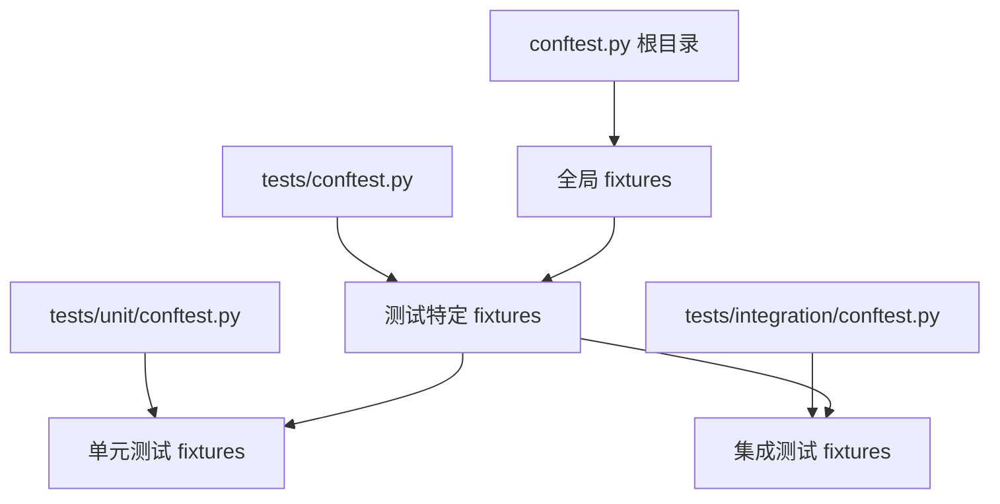

# 第 3 章：Fixture 机制详解

::: tip 学习目标
- 理解 fixture 的概念和作用
- 掌握 fixture 的定义和使用
- 学习 fixture 的作用域管理
- 掌握内置 fixture 的使用
:::

### 知识点

#### Fixture 概念

Fixture 是 pytest 的核心特性之一，提供了一种优雅的方式来：

- **数据准备**：为测试提供预设的数据
- **资源管理**：管理测试所需的资源（数据库连接、临时文件等）
- **环境设置**：设置测试环境和清理工作
- **依赖注入**：将依赖项注入到测试函数中

#### Fixture 作用域

| 作用域 | 说明 | 生命周期 |
|--------|------|----------|
| `function` | 函数级别（默认） | 每个测试函数执行一次 |
| `class` | 类级别 | 每个测试类执行一次 |
| `module` | 模块级别 | 每个测试模块执行一次 |
| `package` | 包级别 | 每个测试包执行一次 |
| `session` | 会话级别 | 整个测试会话执行一次 |

#### Fixture 装饰器参数

```python
@pytest.fixture(
    scope="function",    # 作用域
    autouse=False,       # 是否自动使用
    name=None,           # 自定义名称
    params=None,         # 参数化
    ids=None            # 参数标识
)
```

### 示例代码

#### 基本 Fixture 使用

```python
# test_fixture_basic.py
import pytest

@pytest.fixture
def sample_data():
    """提供测试数据的 fixture"""
    return {
        "name": "Alice",
        "age": 30,
        "email": "alice@example.com"
    }

@pytest.fixture
def sample_list():
    """提供列表数据的 fixture"""
    return [1, 2, 3, 4, 5]

def test_user_data(sample_data):
    """使用 sample_data fixture 的测试"""
    assert sample_data["name"] == "Alice"
    assert sample_data["age"] == 30
    assert "email" in sample_data

def test_list_operations(sample_list):
    """使用 sample_list fixture 的测试"""
    assert len(sample_list) == 5
    assert sum(sample_list) == 15
    assert max(sample_list) == 5

def test_multiple_fixtures(sample_data, sample_list):
    """同时使用多个 fixture"""
    assert len(sample_data) == 3
    assert len(sample_list) == 5
```

#### Fixture 作用域示例

```python
# test_fixture_scope.py
import pytest

# 全局计数器，用于演示
execution_count = {"function": 0, "class": 0, "module": 0, "session": 0}

@pytest.fixture(scope="function")
def function_fixture():
    """函数级别 fixture"""
    execution_count["function"] += 1
    print(f"\nFunction fixture executed: {execution_count['function']}")
    return f"function_data_{execution_count['function']}"

@pytest.fixture(scope="class")
def class_fixture():
    """类级别 fixture"""
    execution_count["class"] += 1
    print(f"\nClass fixture executed: {execution_count['class']}")
    return f"class_data_{execution_count['class']}"

@pytest.fixture(scope="module")
def module_fixture():
    """模块级别 fixture"""
    execution_count["module"] += 1
    print(f"\nModule fixture executed: {execution_count['module']}")
    return f"module_data_{execution_count['module']}"

@pytest.fixture(scope="session")
def session_fixture():
    """会话级别 fixture"""
    execution_count["session"] += 1
    print(f"\nSession fixture executed: {execution_count['session']}")
    return f"session_data_{execution_count['session']}"

class TestScopeDemo:
    def test_first(self, function_fixture, class_fixture, module_fixture, session_fixture):
        """第一个测试"""
        assert "function_data" in function_fixture
        assert "class_data" in class_fixture
        assert "module_data" in module_fixture
        assert "session_data" in session_fixture

    def test_second(self, function_fixture, class_fixture, module_fixture, session_fixture):
        """第二个测试"""
        # function_fixture 会重新创建
        # class_fixture 会复用
        assert "function_data" in function_fixture
        assert "class_data" in class_fixture

def test_outside_class(function_fixture, module_fixture, session_fixture):
    """类外的测试"""
    assert "function_data" in function_fixture
    assert "module_data" in module_fixture
    assert "session_data" in session_fixture
```

#### 数据库连接 Fixture 示例

```python
# test_database_fixture.py
import pytest
import sqlite3
import tempfile
import os

@pytest.fixture(scope="module")
def database_connection():
    """数据库连接 fixture"""
    # 创建临时数据库文件
    db_fd, db_path = tempfile.mkstemp(suffix=".db")

    # 创建连接
    conn = sqlite3.connect(db_path)

    # 设置数据库模式
    conn.execute('''
        CREATE TABLE users (
            id INTEGER PRIMARY KEY,
            name TEXT NOT NULL,
            email TEXT NOT NULL
        )
    ''')

    # 插入测试数据
    conn.execute("INSERT INTO users (name, email) VALUES (?, ?)",
                 ("Alice", "alice@example.com"))
    conn.execute("INSERT INTO users (name, email) VALUES (?, ?)",
                 ("Bob", "bob@example.com"))
    conn.commit()

    yield conn  # 提供连接给测试

    # 清理：关闭连接并删除文件
    conn.close()
    os.close(db_fd)
    os.unlink(db_path)

def test_user_count(database_connection):
    """测试用户数量"""
    cursor = database_connection.execute("SELECT COUNT(*) FROM users")
    count = cursor.fetchone()[0]
    assert count == 2

def test_user_names(database_connection):
    """测试用户名称"""
    cursor = database_connection.execute("SELECT name FROM users ORDER BY name")
    names = [row[0] for row in cursor.fetchall()]
    assert names == ["Alice", "Bob"]

def test_insert_user(database_connection):
    """测试插入新用户"""
    database_connection.execute(
        "INSERT INTO users (name, email) VALUES (?, ?)",
        ("Charlie", "charlie@example.com")
    )
    database_connection.commit()

    cursor = database_connection.execute("SELECT COUNT(*) FROM users")
    count = cursor.fetchone()[0]
    assert count == 3
```

#### 文件系统 Fixture

```python
# test_filesystem_fixture.py
import pytest
import tempfile
import os
from pathlib import Path

@pytest.fixture
def temp_dir():
    """临时目录 fixture"""
    with tempfile.TemporaryDirectory() as tmp_dir:
        yield Path(tmp_dir)

@pytest.fixture
def sample_file(temp_dir):
    """样本文件 fixture"""
    file_path = temp_dir / "sample.txt"
    content = "Hello, World!\nThis is a test file.\n"

    with open(file_path, "w") as f:
        f.write(content)

    return file_path

def test_file_exists(sample_file):
    """测试文件是否存在"""
    assert sample_file.exists()
    assert sample_file.is_file()

def test_file_content(sample_file):
    """测试文件内容"""
    content = sample_file.read_text()
    assert "Hello, World!" in content
    assert content.count("\n") == 2

def test_file_operations(temp_dir):
    """测试文件操作"""
    # 创建文件
    test_file = temp_dir / "test.txt"
    test_file.write_text("Test content")

    # 验证文件
    assert test_file.exists()
    assert test_file.read_text() == "Test content"

    # 创建子目录
    sub_dir = temp_dir / "subdir"
    sub_dir.mkdir()
    assert sub_dir.is_dir()
```

#### Fixture 依赖和组合

```python
# test_fixture_dependency.py
import pytest

@pytest.fixture
def base_config():
    """基础配置 fixture"""
    return {
        "debug": True,
        "host": "localhost"
    }

@pytest.fixture
def database_config(base_config):
    """数据库配置 fixture（依赖 base_config）"""
    config = base_config.copy()
    config.update({
        "database": {
            "host": "db.localhost",
            "port": 5432,
            "name": "testdb"
        }
    })
    return config

@pytest.fixture
def api_client(database_config):
    """API 客户端 fixture（依赖 database_config）"""
    class MockAPIClient:
        def __init__(self, config):
            self.config = config
            self.connected = True

        def get_status(self):
            return "connected" if self.connected else "disconnected"

        def get_database_info(self):
            return self.config["database"]

    return MockAPIClient(database_config)

def test_config_chain(base_config, database_config, api_client):
    """测试 fixture 依赖链"""
    # 基础配置
    assert base_config["debug"] is True

    # 数据库配置继承基础配置
    assert database_config["debug"] is True
    assert "database" in database_config

    # API 客户端使用数据库配置
    assert api_client.get_status() == "connected"
    assert api_client.get_database_info()["host"] == "db.localhost"
```

#### 参数化 Fixture

```python
# test_parametrized_fixture.py
import pytest

@pytest.fixture(params=["sqlite", "postgresql", "mysql"])
def database_type(request):
    """参数化的数据库类型 fixture"""
    return request.param

@pytest.fixture(params=[
    {"name": "Alice", "age": 30},
    {"name": "Bob", "age": 25},
    {"name": "Charlie", "age": 35}
])
def user_data(request):
    """参数化的用户数据 fixture"""
    return request.param

def test_database_connection(database_type):
    """测试不同数据库类型的连接"""
    # 这个测试会针对每种数据库类型运行一次
    assert database_type in ["sqlite", "postgresql", "mysql"]
    print(f"Testing with {database_type} database")

def test_user_validation(user_data):
    """测试不同用户数据的验证"""
    # 这个测试会针对每个用户数据运行一次
    assert "name" in user_data
    assert "age" in user_data
    assert isinstance(user_data["age"], int)
    assert user_data["age"] > 0
```

#### 自动使用 Fixture

```python
# test_autouse_fixture.py
import pytest
import logging

# 配置日志
logging.basicConfig(level=logging.INFO)
logger = logging.getLogger(__name__)

@pytest.fixture(autouse=True)
def log_test_info(request):
    """自动使用的日志 fixture"""
    test_name = request.node.name
    logger.info(f"Starting test: {test_name}")

    yield  # 测试执行

    logger.info(f"Finished test: {test_name}")

@pytest.fixture(autouse=True, scope="class")
def setup_test_class(request):
    """自动使用的类级别 fixture"""
    if request.cls:
        logger.info(f"Setting up test class: {request.cls.__name__}")
        yield
        logger.info(f"Tearing down test class: {request.cls.__name__}")
    else:
        yield

def test_simple_operation():
    """简单测试"""
    result = 2 + 2
    assert result == 4

class TestCalculations:
    def test_addition(self):
        """测试加法"""
        assert 1 + 1 == 2

    def test_multiplication(self):
        """测试乘法"""
        assert 3 * 4 == 12
```

#### 内置 Fixture

```python
# test_builtin_fixtures.py
import pytest

def test_tmp_path_fixture(tmp_path):
    """测试 tmp_path 内置 fixture"""
    # tmp_path 提供临时目录路径
    assert tmp_path.is_dir()

    # 创建临时文件
    temp_file = tmp_path / "test.txt"
    temp_file.write_text("Hello, temporary file!")

    assert temp_file.exists()
    assert temp_file.read_text() == "Hello, temporary file!"

def test_tmpdir_fixture(tmpdir):
    """测试 tmpdir 内置 fixture（旧版本）"""
    # tmpdir 也提供临时目录，但返回 py.path.local 对象
    temp_file = tmpdir.join("test.txt")
    temp_file.write("Hello from tmpdir!")

    assert temp_file.exists()
    assert temp_file.read() == "Hello from tmpdir!"

def test_capsys_fixture(capsys):
    """测试 capsys 内置 fixture"""
    # capsys 捕获标准输出和错误
    print("Hello, stdout!")
    print("Hello, stderr!", file=__import__('sys').stderr)

    captured = capsys.readouterr()
    assert "Hello, stdout!" in captured.out
    assert "Hello, stderr!" in captured.err

def test_monkeypatch_fixture(monkeypatch):
    """测试 monkeypatch 内置 fixture"""
    import os

    # 临时设置环境变量
    monkeypatch.setenv("TEST_VAR", "test_value")
    assert os.getenv("TEST_VAR") == "test_value"

    # 临时修改属性
    original_value = getattr(os, 'name', None)
    monkeypatch.setattr(os, 'name', 'test_os')
    assert os.name == 'test_os'

    # fixture 结束后会自动恢复

def test_request_fixture(request):
    """测试 request 内置 fixture"""
    # request 提供测试请求的信息
    assert request.node.name == "test_request_fixture"
    assert hasattr(request, 'config')
    assert hasattr(request, 'module')
```

### Fixture 最佳实践

#### conftest.py 文件

```python
# conftest.py - 项目根目录或测试目录
import pytest

@pytest.fixture(scope="session")
def app_config():
    """应用配置 - 会话级别"""
    return {
        "api_url": "https://api.example.com",
        "timeout": 30,
        "retries": 3
    }

@pytest.fixture
def mock_user():
    """模拟用户数据"""
    return {
        "id": 1,
        "username": "testuser",
        "email": "test@example.com",
        "roles": ["user"]
    }

@pytest.fixture
def admin_user():
    """管理员用户"""
    return {
        "id": 2,
        "username": "admin",
        "email": "admin@example.com",
        "roles": ["admin", "user"]
    }
```

#### Fixture 组织结构



::: note Fixture 使用技巧
1. **合理选择作用域**：根据资源的生命周期选择合适的作用域
2. **使用 yield 进行清理**：在 yield 后编写清理代码
3. **避免过度复杂**：Fixture 应该简单、专注于单一职责
4. **使用 conftest.py**：将共享的 fixture 放在 conftest.py 中
5. **文档化 fixture**：为复杂的 fixture 编写清晰的文档字符串
:::

::: warning 常见陷阱
1. **作用域混淆**：注意不同作用域的生命周期
2. **循环依赖**：避免 fixture 之间的循环依赖
3. **状态污染**：确保 fixture 不会影响其他测试
4. **资源泄漏**：使用 yield 确保资源得到正确清理
:::

### Fixture vs Setup/Teardown 对比

| 特性 | Fixture | Setup/Teardown |
|------|---------|----------------|
| 代码复用 | 优秀 | 一般 |
| 依赖注入 | 支持 | 不支持 |
| 作用域控制 | 灵活 | 有限 |
| 参数化 | 支持 | 不支持 |
| 错误处理 | 优秀 | 一般 |
| 可读性 | 高 | 中等 |

Fixture 机制是 pytest 的一大亮点，掌握了 fixture 就掌握了 pytest 测试的精髓，能够编写更加灵活、可维护的测试代码。