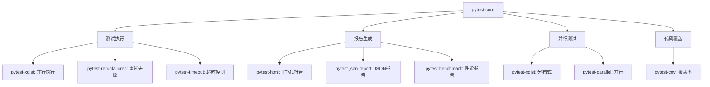

# 第 9 章：插件系统与扩展

::: tip 学习目标
- 了解 pytest 插件生态系统
- 掌握常用插件的使用方法
- 学习自定义插件的开发
- 理解钩子函数的使用
:::

### 知识点

#### Pytest 插件架构

pytest 采用插件化架构，通过钩子（Hook）机制实现扩展：

- **核心框架**：提供基础测试执行能力
- **插件系统**：通过钩子扩展功能
- **第三方插件**：丰富的生态系统
- **自定义插件**：满足特定需求

#### 插件类型

| 类型 | 说明 | 示例 |
|------|------|------|
| **内置插件** | pytest 核心功能 | parametrize, fixtures |
| **官方插件** | pytest 团队维护 | pytest-xdist, pytest-cov |
| **第三方插件** | 社区贡献 | pytest-django, pytest-mock |
| **本地插件** | 项目特定 | conftest.py 中的钩子 |

#### 常用插件生态



### 示例代码

#### 常用插件安装和使用

```python
# requirements-test.txt - 常用插件清单
pytest>=7.0.0
pytest-cov>=4.0.0          # 代码覆盖率
pytest-html>=3.1.0         # HTML 报告
pytest-json-report>=1.5.0  # JSON 报告
pytest-mock>=3.10.0        # Mock 集成
pytest-xdist>=3.2.0        # 并行执行
pytest-benchmark>=4.0.0    # 性能测试
pytest-timeout>=2.1.0      # 超时控制
pytest-rerunfailures>=11.0 # 失败重试
pytest-django>=4.5.0       # Django 集成
pytest-asyncio>=0.21.0     # 异步测试
pytest-freezegun>=0.4.0    # 时间 mock
pytest-env>=0.8.0          # 环境变量
pytest-randomly>=3.12.0    # 随机化测试
pytest-sugar>=0.9.0        # 美化输出
```

#### pytest-xdist 并行测试

```python
# test_parallel_execution.py
import pytest
import time
import threading

# 计算密集型任务
def fibonacci(n):
    """计算斐波那契数列"""
    if n <= 1:
        return n
    return fibonacci(n-1) + fibonacci(n-2)

def prime_check(n):
    """检查素数"""
    if n < 2:
        return False
    for i in range(2, int(n**0.5) + 1):
        if n % i == 0:
            return False
    return True

class TestParallelExecution:
    """并行执行测试示例"""

    @pytest.mark.parametrize("n", [20, 21, 22, 23, 24])
    def test_fibonacci_computation(self, n):
        """斐波那契计算测试"""
        start_time = time.time()
        result = fibonacci(n)
        duration = time.time() - start_time

        assert result > 0
        print(f"Thread {threading.current_thread().name}: fib({n}) = {result}, time: {duration:.3f}s")

    @pytest.mark.parametrize("n", [97, 101, 103, 107, 109])
    def test_prime_numbers(self, n):
        """素数测试"""
        assert prime_check(n) is True
        print(f"Thread {threading.current_thread().name}: {n} is prime")

    @pytest.mark.parametrize("n", [95, 99, 100, 102, 104])
    def test_composite_numbers(self, n):
        """合数测试"""
        assert prime_check(n) is False
        print(f"Thread {threading.current_thread().name}: {n} is composite")

# 并行执行命令
"""
# 自动检测 CPU 核心数并行执行
pytest -n auto

# 指定进程数并行执行
pytest -n 4

# 按测试文件分发
pytest -n 4 --dist=loadfile

# 按测试方法分发
pytest -n 4 --dist=loadscope

# 查看分发信息
pytest -n 4 -v --tb=short
"""
```

#### pytest-benchmark 性能测试

```python
# test_performance_benchmark.py
import pytest
import time
import random

# 被测试的算法
def bubble_sort(arr):
    """冒泡排序"""
    n = len(arr)
    for i in range(n):
        for j in range(0, n - i - 1):
            if arr[j] > arr[j + 1]:
                arr[j], arr[j + 1] = arr[j + 1], arr[j]
    return arr

def quick_sort(arr):
    """快速排序"""
    if len(arr) <= 1:
        return arr
    pivot = arr[len(arr) // 2]
    left = [x for x in arr if x < pivot]
    middle = [x for x in arr if x == pivot]
    right = [x for x in arr if x > pivot]
    return quick_sort(left) + middle + quick_sort(right)

def binary_search(arr, target):
    """二分查找"""
    left, right = 0, len(arr) - 1
    while left <= right:
        mid = (left + right) // 2
        if arr[mid] == target:
            return mid
        elif arr[mid] < target:
            left = mid + 1
        else:
            right = mid - 1
    return -1

class TestPerformanceBenchmark:
    """性能基准测试"""

    @pytest.fixture
    def small_dataset(self):
        """小数据集"""
        return [random.randint(1, 100) for _ in range(10)]

    @pytest.fixture
    def medium_dataset(self):
        """中等数据集"""
        return [random.randint(1, 1000) for _ in range(100)]

    @pytest.fixture
    def large_dataset(self):
        """大数据集"""
        return [random.randint(1, 10000) for _ in range(1000)]

    def test_bubble_sort_small(self, benchmark, small_dataset):
        """冒泡排序小数据集性能测试"""
        result = benchmark(bubble_sort, small_dataset.copy())
        assert result == sorted(small_dataset)

    def test_quick_sort_small(self, benchmark, small_dataset):
        """快速排序小数据集性能测试"""
        result = benchmark(quick_sort, small_dataset.copy())
        assert result == sorted(small_dataset)

    def test_bubble_sort_medium(self, benchmark, medium_dataset):
        """冒泡排序中等数据集性能测试"""
        result = benchmark(bubble_sort, medium_dataset.copy())
        assert result == sorted(medium_dataset)

    def test_quick_sort_medium(self, benchmark, medium_dataset):
        """快速排序中等数据集性能测试"""
        result = benchmark(quick_sort, medium_dataset.copy())
        assert result == sorted(medium_dataset)

    @pytest.mark.slow
    def test_quick_sort_large(self, benchmark, large_dataset):
        """快速排序大数据集性能测试"""
        result = benchmark(quick_sort, large_dataset.copy())
        assert result == sorted(large_dataset)

    def test_binary_search_performance(self, benchmark):
        """二分查找性能测试"""
        arr = list(range(1000))
        target = 500

        result = benchmark(binary_search, arr, target)
        assert result == 500

    def test_benchmark_with_setup(self, benchmark):
        """带设置的基准测试"""
        def setup():
            return [random.randint(1, 100) for _ in range(50)]

        def sorting_algorithm(data):
            return sorted(data)

        result = benchmark.pedantic(
            sorting_algorithm,
            setup=setup,
            rounds=10,
            iterations=5
        )
        assert len(result) == 50

# 运行性能测试命令
"""
# 运行性能测试
pytest --benchmark-only

# 生成性能报告
pytest --benchmark-only --benchmark-html=benchmark_report.html

# 比较性能基准
pytest --benchmark-only --benchmark-compare=previous_benchmark.json

# 保存基准数据
pytest --benchmark-only --benchmark-save=baseline

# 设置性能阈值
pytest --benchmark-only --benchmark-max-time=2.0
"""
```

#### pytest-timeout 超时控制

```python
# test_timeout_control.py
import pytest
import time
import threading
from concurrent.futures import ThreadPoolExecutor

class TestTimeoutControl:
    """超时控制测试"""

    @pytest.mark.timeout(5)
    def test_fast_operation(self):
        """快速操作测试"""
        time.sleep(1)
        assert True

    @pytest.mark.timeout(2)
    def test_timeout_failure(self):
        """超时失败测试"""
        time.sleep(3)  # 超过 2 秒限制
        assert True

    @pytest.mark.timeout(10, method="thread")
    def test_thread_timeout(self):
        """线程超时测试"""
        def worker():
            time.sleep(5)
            return "completed"

        with ThreadPoolExecutor() as executor:
            future = executor.submit(worker)
            result = future.result()
            assert result == "completed"

    @pytest.mark.timeout(3, method="signal")
    def test_signal_timeout(self):
        """信号超时测试（仅 Unix）"""
        time.sleep(1)
        assert True

    def test_no_timeout(self):
        """无超时限制测试"""
        time.sleep(2)
        assert True

# pytest.ini 中的全局超时配置
"""
[tool:pytest]
timeout = 300
timeout_method = thread
addopts = --timeout=60
"""
```

#### pytest-rerunfailures 失败重试

```python
# test_retry_failures.py
import pytest
import random
import time

class TestRetryFailures:
    """失败重试测试"""

    @pytest.mark.flaky(reruns=3)
    def test_flaky_network_operation(self):
        """不稳定的网络操作"""
        # 模拟 70% 成功率的网络请求
        success_rate = 0.7
        if random.random() < success_rate:
            assert True
        else:
            pytest.fail("网络请求失败")

    @pytest.mark.flaky(reruns=2, reruns_delay=1)
    def test_with_retry_delay(self):
        """带延迟的重试测试"""
        # 模拟需要时间恢复的服务
        current_time = time.time()
        if int(current_time) % 3 == 0:
            assert True
        else:
            pytest.fail("服务暂时不可用")

    @pytest.mark.flaky(reruns=5, condition=lambda: random.random() < 0.3)
    def test_conditional_retry(self):
        """条件性重试测试"""
        # 只有满足条件时才重试
        if random.random() < 0.8:
            assert True
        else:
            pytest.fail("随机失败")

# 运行重试测试命令
"""
# 为所有失败测试启用重试
pytest --reruns 3

# 带延迟的重试
pytest --reruns 3 --reruns-delay 2

# 只对特定标记的测试重试
pytest -m flaky --reruns 2
"""
```

#### 自定义插件开发

```python
# conftest.py - 项目级自定义插件
import pytest
import logging
import time
from datetime import datetime
from pathlib import Path

# 插件配置
class TestMetrics:
    """测试指标收集"""
    def __init__(self):
        self.start_time = None
        self.test_results = {}
        self.slow_tests = []

    def start_session(self):
        self.start_time = time.time()

    def record_test(self, nodeid, duration, outcome):
        self.test_results[nodeid] = {
            'duration': duration,
            'outcome': outcome,
            'timestamp': datetime.now().isoformat()
        }

        if duration > 1.0:  # 记录慢速测试
            self.slow_tests.append({
                'nodeid': nodeid,
                'duration': duration
            })

# 全局指标实例
test_metrics = TestMetrics()

def pytest_configure(config):
    """插件配置钩子"""
    # 注册自定义标记
    config.addinivalue_line(
        "markers", "performance: 性能相关测试"
    )
    config.addinivalue_line(
        "markers", "flaky: 不稳定的测试"
    )

    # 设置日志
    logging.basicConfig(
        level=logging.INFO,
        format='%(asctime)s - %(name)s - %(levelname)s - %(message)s'
    )

def pytest_sessionstart(session):
    """测试会话开始钩子"""
    test_metrics.start_session()
    logger = logging.getLogger(__name__)
    logger.info("🚀 测试会话开始")
    logger.info(f"发现 {len(session.items)} 个测试")

def pytest_sessionfinish(session, exitstatus):
    """测试会话结束钩子"""
    logger = logging.getLogger(__name__)
    total_time = time.time() - test_metrics.start_time

    logger.info("📊 测试会话结束")
    logger.info(f"总耗时: {total_time:.2f} 秒")
    logger.info(f"测试总数: {len(test_metrics.test_results)}")

    # 分析结果
    passed = sum(1 for r in test_metrics.test_results.values() if r['outcome'] == 'passed')
    failed = sum(1 for r in test_metrics.test_results.values() if r['outcome'] == 'failed')
    skipped = sum(1 for r in test_metrics.test_results.values() if r['outcome'] == 'skipped')

    logger.info(f"通过: {passed}, 失败: {failed}, 跳过: {skipped}")

    # 报告慢速测试
    if test_metrics.slow_tests:
        logger.warning("🐌 发现慢速测试:")
        for slow_test in sorted(test_metrics.slow_tests, key=lambda x: x['duration'], reverse=True)[:5]:
            logger.warning(f"  {slow_test['nodeid']}: {slow_test['duration']:.2f}s")

    # 生成指标报告
    generate_metrics_report()

@pytest.hookimpl(hookwrapper=True)
def pytest_runtest_makereport(item, call):
    """生成测试报告钩子"""
    outcome = yield
    report = outcome.get_result()

    if report.when == "call":
        test_metrics.record_test(
            item.nodeid,
            report.duration,
            report.outcome
        )

def pytest_runtest_setup(item):
    """测试设置钩子"""
    # 检查性能测试标记
    if item.get_closest_marker("performance"):
        # 可以设置特殊的性能测试环境
        logging.getLogger(__name__).info(f"⚡ 准备性能测试: {item.name}")

def pytest_runtest_teardown(item, nextitem):
    """测试清理钩子"""
    # 检查是否有特殊清理需求
    if item.get_closest_marker("flaky"):
        logging.getLogger(__name__).info(f"🔄 不稳定测试完成: {item.name}")

def pytest_collection_modifyitems(config, items):
    """修改测试收集钩子"""
    # 根据标记对测试进行排序
    performance_tests = []
    regular_tests = []

    for item in items:
        if item.get_closest_marker("performance"):
            performance_tests.append(item)
        else:
            regular_tests.append(item)

    # 先运行常规测试，后运行性能测试
    items[:] = regular_tests + performance_tests

def generate_metrics_report():
    """生成指标报告"""
    report_path = Path("test_metrics.json")

    import json
    metrics_data = {
        'session_start': test_metrics.start_time,
        'test_results': test_metrics.test_results,
        'slow_tests': test_metrics.slow_tests,
        'summary': {
            'total_tests': len(test_metrics.test_results),
            'total_duration': time.time() - test_metrics.start_time,
            'slow_test_count': len(test_metrics.slow_tests)
        }
    }

    with open(report_path, 'w') as f:
        json.dump(metrics_data, f, indent=2)

    logging.getLogger(__name__).info(f"📄 指标报告已生成: {report_path}")

# 自定义 fixture
@pytest.fixture
def performance_monitor():
    """性能监控 fixture"""
    start_memory = get_memory_usage()
    start_time = time.time()

    yield

    end_time = time.time()
    end_memory = get_memory_usage()

    duration = end_time - start_time
    memory_diff = end_memory - start_memory

    if duration > 0.5:
        logging.getLogger(__name__).warning(
            f"⚠️  测试耗时较长: {duration:.2f}s"
        )

    if memory_diff > 10:  # 10MB
        logging.getLogger(__name__).warning(
            f"⚠️  内存使用增长: {memory_diff:.2f}MB"
        )

def get_memory_usage():
    """获取内存使用量（简化版）"""
    try:
        import psutil
        process = psutil.Process()
        return process.memory_info().rss / 1024 / 1024  # MB
    except ImportError:
        return 0

# 命令行选项扩展
def pytest_addoption(parser):
    """添加命令行选项"""
    parser.addoption(
        "--performance-threshold",
        action="store",
        type=float,
        default=1.0,
        help="性能测试时间阈值（秒）"
    )

    parser.addoption(
        "--generate-report",
        action="store_true",
        help="生成详细的测试报告"
    )

# 自定义标记实现
def pytest_configure(config):
    """自定义标记配置"""
    # 性能阈值配置
    threshold = config.getoption("--performance-threshold")
    config.performance_threshold = threshold

def pytest_runtest_call(pyfuncitem):
    """测试调用钩子"""
    if pyfuncitem.get_closest_marker("performance"):
        threshold = pyfuncitem.config.performance_threshold
        start_time = time.time()

        # 这里可以添加性能监控逻辑

        yield

        duration = time.time() - start_time
        if duration > threshold:
            logging.getLogger(__name__).warning(
                f"⚠️  性能测试超过阈值: {duration:.2f}s > {threshold}s"
            )
```

#### 发布自定义插件

```python
# setup.py - 插件打包配置
from setuptools import setup, find_packages

setup(
    name="pytest-custom-metrics",
    version="1.0.0",
    description="自定义 pytest 指标收集插件",
    long_description=open("README.md").read(),
    long_description_content_type="text/markdown",
    author="Your Name",
    author_email="your.email@example.com",
    url="https://github.com/yourname/pytest-custom-metrics",
    packages=find_packages(),
    classifiers=[
        "Development Status :: 4 - Beta",
        "Framework :: Pytest",
        "Intended Audience :: Developers",
        "License :: OSI Approved :: MIT License",
        "Operating System :: OS Independent",
        "Programming Language :: Python",
        "Programming Language :: Python :: 3",
        "Programming Language :: Python :: 3.8",
        "Programming Language :: Python :: 3.9",
        "Programming Language :: Python :: 3.10",
        "Programming Language :: Python :: 3.11",
        "Topic :: Software Development :: Quality Assurance",
        "Topic :: Software Development :: Testing",
        "Topic :: Utilities",
    ],
    python_requires=">=3.8",
    install_requires=[
        "pytest>=6.0.0",
    ],
    entry_points={
        "pytest11": [
            "custom_metrics = pytest_custom_metrics.plugin",
        ],
    },
)

# pyproject.toml - 现代打包配置
"""
[build-system]
requires = ["setuptools>=61.0", "wheel"]
build-backend = "setuptools.build_meta"

[project]
name = "pytest-custom-metrics"
version = "1.0.0"
description = "自定义 pytest 指标收集插件"
readme = "README.md"
requires-python = ">=3.8"
dependencies = [
    "pytest>=6.0.0",
]

[project.entry-points.pytest11]
custom_metrics = "pytest_custom_metrics.plugin"
"""
```

::: note 插件开发最佳实践
1. **明确目标**：插件应该解决具体的测试问题
2. **钩子选择**：选择合适的钩子函数实现功能
3. **兼容性**：确保插件与不同版本的 pytest 兼容
4. **文档完善**：提供清晰的使用文档和示例
5. **测试覆盖**：为插件本身编写测试
:::

::: warning 注意事项
1. **性能影响**：插件可能影响测试执行性能
2. **插件冲突**：不同插件之间可能存在冲突
3. **维护成本**：自定义插件需要持续维护
4. **版本依赖**：注意 pytest 版本升级的兼容性
:::

pytest 的插件系统为测试提供了无限的扩展可能性，合理使用插件可以大大提高测试效率和质量。