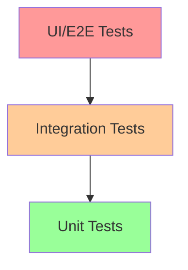

# 第 12 章：实战项目与最佳实践

::: tip 学习目标
- 设计完整的测试项目结构
- 实现端到端的测试解决方案
- 掌握测试驱动开发（TDD）实践
- 总结 pytest 使用的最佳实践
:::

### 知识点

#### 项目测试架构

一个完整的测试项目应该包含：

- **清晰的目录结构**：分离不同类型的测试
- **配置管理**：统一的配置文件和环境管理
- **工具集成**：与 CI/CD、代码覆盖率、静态分析工具的集成
- **文档和规范**：测试编写指南和规范

#### 测试金字塔



- **单元测试（70%）**：快速、独立、大量
- **集成测试（20%）**：中等速度、测试组件交互
- **端到端测试（10%）**：慢速、测试完整流程

### 示例代码

#### 完整项目结构

```
project/
├── src/
│   ├── __init__.py
│   ├── models/
│   │   ├── __init__.py
│   │   ├── user.py
│   │   └── product.py
│   ├── services/
│   │   ├── __init__.py
│   │   ├── auth_service.py
│   │   └── product_service.py
│   ├── utils/
│   │   ├── __init__.py
│   │   └── helpers.py
│   └── main.py
├── tests/
│   ├── __init__.py
│   ├── conftest.py
│   ├── unit/
│   │   ├── __init__.py
│   │   ├── test_models/
│   │   ├── test_services/
│   │   └── test_utils/
│   ├── integration/
│   │   ├── __init__.py
│   │   └── test_api/
│   ├── e2e/
│   │   ├── __init__.py
│   │   └── test_workflows/
│   └── fixtures/
│       ├── __init__.py
│       └── data/
├── pytest.ini
├── requirements.txt
├── requirements-test.txt
└── README.md
```

#### 实战项目：用户管理系统

```python
# src/models/user.py
from dataclasses import dataclass
from typing import Optional
import hashlib
import re

@dataclass
class User:
    """用户模型"""
    username: str
    email: str
    password_hash: str
    id: Optional[int] = None
    is_active: bool = True

    def __post_init__(self):
        self.validate()

    def validate(self):
        """验证用户数据"""
        if not self.username or len(self.username) < 3:
            raise ValueError("用户名至少3个字符")

        if not re.match(r'^[a-zA-Z0-9_]+$', self.username):
            raise ValueError("用户名只能包含字母、数字和下划线")

        if not self.email or '@' not in self.email:
            raise ValueError("无效的邮箱地址")

    @classmethod
    def create(cls, username: str, email: str, password: str):
        """创建新用户"""
        if len(password) < 6:
            raise ValueError("密码至少6个字符")

        password_hash = hashlib.sha256(password.encode()).hexdigest()
        return cls(username=username, email=email, password_hash=password_hash)

    def check_password(self, password: str) -> bool:
        """验证密码"""
        return self.password_hash == hashlib.sha256(password.encode()).hexdigest()
```

```python
# src/services/user_service.py
from typing import List, Optional
from ..models.user import User

class UserRepository:
    """用户数据仓库（模拟）"""
    def __init__(self):
        self._users = {}
        self._next_id = 1

    def save(self, user: User) -> User:
        """保存用户"""
        if user.id is None:
            user.id = self._next_id
            self._next_id += 1
        self._users[user.id] = user
        return user

    def find_by_id(self, user_id: int) -> Optional[User]:
        """根据ID查找用户"""
        return self._users.get(user_id)

    def find_by_username(self, username: str) -> Optional[User]:
        """根据用户名查找用户"""
        for user in self._users.values():
            if user.username == username:
                return user
        return None

    def find_all(self) -> List[User]:
        """查找所有用户"""
        return list(self._users.values())

    def delete(self, user_id: int) -> bool:
        """删除用户"""
        if user_id in self._users:
            del self._users[user_id]
            return True
        return False

class UserService:
    """用户服务"""
    def __init__(self, repository: UserRepository):
        self.repository = repository

    def register_user(self, username: str, email: str, password: str) -> User:
        """注册新用户"""
        # 检查用户名是否已存在
        existing_user = self.repository.find_by_username(username)
        if existing_user:
            raise ValueError(f"用户名 '{username}' 已存在")

        # 创建并保存用户
        user = User.create(username, email, password)
        return self.repository.save(user)

    def authenticate(self, username: str, password: str) -> Optional[User]:
        """用户认证"""
        user = self.repository.find_by_username(username)
        if user and user.is_active and user.check_password(password):
            return user
        return None

    def get_user(self, user_id: int) -> Optional[User]:
        """获取用户"""
        return self.repository.find_by_id(user_id)

    def update_user(self, user_id: int, **kwargs) -> Optional[User]:
        """更新用户信息"""
        user = self.repository.find_by_id(user_id)
        if not user:
            return None

        # 更新允许的字段
        if 'email' in kwargs:
            user.email = kwargs['email']
            user.validate()  # 重新验证

        return self.repository.save(user)

    def deactivate_user(self, user_id: int) -> bool:
        """停用用户"""
        user = self.repository.find_by_id(user_id)
        if user:
            user.is_active = False
            self.repository.save(user)
            return True
        return False
```

#### 完整的测试套件

```python
# tests/conftest.py
import pytest
from src.models.user import User
from src.services.user_service import UserRepository, UserService

@pytest.fixture
def user_repository():
    """用户仓库 fixture"""
    return UserRepository()

@pytest.fixture
def user_service(user_repository):
    """用户服务 fixture"""
    return UserService(user_repository)

@pytest.fixture
def sample_user():
    """样本用户 fixture"""
    return User.create("testuser", "test@example.com", "password123")

@pytest.fixture
def registered_user(user_service):
    """已注册用户 fixture"""
    return user_service.register_user("john_doe", "john@example.com", "securepass")

@pytest.fixture
def multiple_users(user_service):
    """多个用户 fixture"""
    users = []
    for i in range(3):
        user = user_service.register_user(
            f"user{i}",
            f"user{i}@example.com",
            f"password{i}"
        )
        users.append(user)
    return users
```

```python
# tests/unit/test_models/test_user.py
import pytest
from src.models.user import User

class TestUserModel:
    """用户模型测试"""

    def test_user_creation(self):
        """测试用户创建"""
        user = User.create("testuser", "test@example.com", "password123")

        assert user.username == "testuser"
        assert user.email == "test@example.com"
        assert user.password_hash is not None
        assert user.is_active is True
        assert user.id is None

    def test_user_validation_success(self):
        """测试用户验证成功"""
        # 这些都应该成功
        valid_users = [
            ("abc", "test@example.com", "password"),
            ("user123", "user@domain.com", "123456"),
            ("test_user", "test@test.co.uk", "longpassword")
        ]

        for username, email, password in valid_users:
            user = User.create(username, email, password)
            assert user.username == username

    @pytest.mark.parametrize("username,email,password,expected_error", [
        ("ab", "test@example.com", "password", "用户名至少3个字符"),
        ("", "test@example.com", "password", "用户名至少3个字符"),
        ("test user", "test@example.com", "password", "用户名只能包含字母、数字和下划线"),
        ("test@user", "test@example.com", "password", "用户名只能包含字母、数字和下划线"),
        ("testuser", "invalid-email", "password", "无效的邮箱地址"),
        ("testuser", "", "password", "无效的邮箱地址"),
        ("testuser", "test@example.com", "123", "密码至少6个字符"),
        ("testuser", "test@example.com", "", "密码至少6个字符"),
    ])
    def test_user_validation_failure(self, username, email, password, expected_error):
        """测试用户验证失败"""
        with pytest.raises(ValueError, match=expected_error):
            User.create(username, email, password)

    def test_password_verification(self):
        """测试密码验证"""
        user = User.create("testuser", "test@example.com", "password123")

        assert user.check_password("password123") is True
        assert user.check_password("wrongpassword") is False
        assert user.check_password("") is False

    def test_user_dataclass_features(self):
        """测试数据类特性"""
        user1 = User.create("testuser", "test@example.com", "password123")
        user2 = User.create("testuser", "test@example.com", "password123")

        # 测试相等性（相同的数据应该相等）
        assert user1 == user2

        # 测试字符串表示
        assert "testuser" in str(user1)
        assert "test@example.com" in str(user1)
```

```python
# tests/unit/test_services/test_user_service.py
import pytest
from src.models.user import User
from src.services.user_service import UserService, UserRepository

class TestUserRepository:
    """用户仓库测试"""

    def test_save_and_find_user(self, user_repository, sample_user):
        """测试保存和查找用户"""
        # 保存用户
        saved_user = user_repository.save(sample_user)
        assert saved_user.id is not None

        # 根据 ID 查找
        found_user = user_repository.find_by_id(saved_user.id)
        assert found_user == saved_user

        # 根据用户名查找
        found_by_username = user_repository.find_by_username(sample_user.username)
        assert found_by_username == saved_user

    def test_find_nonexistent_user(self, user_repository):
        """测试查找不存在的用户"""
        assert user_repository.find_by_id(999) is None
        assert user_repository.find_by_username("nonexistent") is None

    def test_delete_user(self, user_repository, sample_user):
        """测试删除用户"""
        saved_user = user_repository.save(sample_user)
        user_id = saved_user.id

        # 删除用户
        assert user_repository.delete(user_id) is True
        assert user_repository.find_by_id(user_id) is None

        # 再次删除应该返回 False
        assert user_repository.delete(user_id) is False

class TestUserService:
    """用户服务测试"""

    def test_register_user_success(self, user_service):
        """测试成功注册用户"""
        user = user_service.register_user("newuser", "new@example.com", "password123")

        assert user.id is not None
        assert user.username == "newuser"
        assert user.email == "new@example.com"
        assert user.is_active is True

    def test_register_duplicate_username(self, user_service, registered_user):
        """测试注册重复用户名"""
        with pytest.raises(ValueError, match="用户名 'john_doe' 已存在"):
            user_service.register_user("john_doe", "another@example.com", "password")

    def test_authenticate_success(self, user_service, registered_user):
        """测试成功认证"""
        user = user_service.authenticate("john_doe", "securepass")
        assert user is not None
        assert user.username == "john_doe"

    def test_authenticate_failure(self, user_service, registered_user):
        """测试认证失败"""
        # 错误密码
        assert user_service.authenticate("john_doe", "wrongpass") is None

        # 不存在的用户
        assert user_service.authenticate("nonexistent", "anypass") is None

    def test_authenticate_inactive_user(self, user_service, registered_user):
        """测试认证停用用户"""
        # 停用用户
        user_service.deactivate_user(registered_user.id)

        # 尝试认证停用用户
        assert user_service.authenticate("john_doe", "securepass") is None

    def test_update_user(self, user_service, registered_user):
        """测试更新用户"""
        updated_user = user_service.update_user(
            registered_user.id,
            email="newemail@example.com"
        )

        assert updated_user is not None
        assert updated_user.email == "newemail@example.com"

    def test_update_nonexistent_user(self, user_service):
        """测试更新不存在的用户"""
        result = user_service.update_user(999, email="test@example.com")
        assert result is None

    def test_deactivate_user(self, user_service, registered_user):
        """测试停用用户"""
        assert user_service.deactivate_user(registered_user.id) is True

        # 验证用户已停用
        user = user_service.get_user(registered_user.id)
        assert user.is_active is False

    def test_deactivate_nonexistent_user(self, user_service):
        """测试停用不存在的用户"""
        assert user_service.deactivate_user(999) is False
```

#### 集成测试示例

```python
# tests/integration/test_user_workflow.py
import pytest
from src.services.user_service import UserRepository, UserService

class TestUserWorkflow:
    """用户工作流集成测试"""

    @pytest.fixture
    def clean_service(self):
        """每个测试使用全新的服务"""
        repository = UserRepository()
        return UserService(repository)

    def test_complete_user_lifecycle(self, clean_service):
        """测试完整的用户生命周期"""
        service = clean_service

        # 1. 注册用户
        user = service.register_user("lifecycleuser", "lifecycle@example.com", "password123")
        assert user.id is not None
        original_id = user.id

        # 2. 认证用户
        authenticated = service.authenticate("lifecycleuser", "password123")
        assert authenticated is not None
        assert authenticated.id == original_id

        # 3. 更新用户信息
        updated = service.update_user(original_id, email="updated@example.com")
        assert updated.email == "updated@example.com"

        # 4. 验证更新后的认证仍然有效
        auth_after_update = service.authenticate("lifecycleuser", "password123")
        assert auth_after_update is not None
        assert auth_after_update.email == "updated@example.com"

        # 5. 停用用户
        assert service.deactivate_user(original_id) is True

        # 6. 验证停用用户无法认证
        auth_after_deactivate = service.authenticate("lifecycleuser", "password123")
        assert auth_after_deactivate is None

        # 7. 验证可以获取停用用户的信息
        deactivated_user = service.get_user(original_id)
        assert deactivated_user is not None
        assert deactivated_user.is_active is False

    def test_multiple_users_interaction(self, clean_service):
        """测试多用户交互"""
        service = clean_service

        # 注册多个用户
        users = []
        for i in range(3):
            user = service.register_user(f"user{i}", f"user{i}@example.com", f"pass{i}")
            users.append(user)

        # 验证所有用户都可以独立认证
        for i, user in enumerate(users):
            authenticated = service.authenticate(f"user{i}", f"pass{i}")
            assert authenticated is not None
            assert authenticated.id == user.id

        # 验证用户间认证隔离
        assert service.authenticate("user0", "pass1") is None
        assert service.authenticate("user1", "pass0") is None

        # 停用一个用户不影响其他用户
        service.deactivate_user(users[0].id)
        assert service.authenticate("user0", "pass0") is None
        assert service.authenticate("user1", "pass1") is not None
        assert service.authenticate("user2", "pass2") is not None

    def test_edge_cases_workflow(self, clean_service):
        """测试边界情况工作流"""
        service = clean_service

        # 尝试认证不存在的用户
        assert service.authenticate("nonexistent", "anypass") is None

        # 注册用户后立即尝试重复注册
        service.register_user("edgeuser", "edge@example.com", "password")

        with pytest.raises(ValueError):
            service.register_user("edgeuser", "different@example.com", "password")

        # 更新不存在的用户
        assert service.update_user(999, email="test@example.com") is None

        # 停用不存在的用户
        assert service.deactivate_user(999) is False
```

### 测试驱动开发（TDD）实践

#### TDD 红绿重构循环

```python
# 示例：TDD 开发密码强度验证功能

# 1. 红色阶段：编写失败的测试
def test_password_strength_weak():
    """测试弱密码"""
    from src.utils.password_validator import PasswordValidator

    validator = PasswordValidator()
    assert validator.check_strength("123") == "weak"

# 2. 绿色阶段：编写最简单的实现
# src/utils/password_validator.py
class PasswordValidator:
    def check_strength(self, password):
        return "weak"  # 最简实现

# 3. 重构阶段：改进实现
class PasswordValidator:
    def check_strength(self, password):
        if len(password) < 6:
            return "weak"
        elif len(password) < 10:
            return "medium"
        else:
            return "strong"

# 4. 添加更多测试
@pytest.mark.parametrize("password,expected", [
    ("123", "weak"),
    ("12345", "weak"),
    ("password", "medium"),
    ("verylongpassword", "strong"),
    ("P@ssw0rd123", "strong")
])
def test_password_strength_levels(password, expected):
    validator = PasswordValidator()
    assert validator.check_strength(password) == expected
```

### 最佳实践总结

#### 项目组织最佳实践

1. **目录结构清晰**
   ```
   tests/
   ├── unit/           # 单元测试
   ├── integration/    # 集成测试
   ├── e2e/           # 端到端测试
   ├── fixtures/      # 测试数据
   └── conftest.py    # 共享配置
   ```

2. **配置文件标准化**
   ```ini
   # pytest.ini
   [tool:pytest]
   testpaths = tests
   python_files = test_*.py *_test.py
   python_functions = test_*
   python_classes = Test*
   addopts = -v --tb=short --strict-markers
   markers =
       unit: 单元测试
       integration: 集成测试
       slow: 慢速测试
   ```

3. **依赖管理**
   ```txt
   # requirements-test.txt
   pytest>=7.0.0
   pytest-cov>=4.0.0
   pytest-mock>=3.0.0
   pytest-xdist>=3.0.0
   pytest-html>=3.0.0
   ```

#### 代码质量保证

```python
# .pre-commit-config.yaml
repos:
  - repo: https://github.com/psf/black
    rev: 22.3.0
    hooks:
      - id: black
  - repo: https://github.com/pycqa/flake8
    rev: 4.0.1
    hooks:
      - id: flake8
  - repo: local
    hooks:
      - id: pytest-check
        name: pytest-check
        entry: pytest
        language: system
        pass_filenames: false
        always_run: true
```

#### CI/CD 集成示例

```yaml
# .github/workflows/test.yml
name: Tests

on: [push, pull_request]

jobs:
  test:
    runs-on: ubuntu-latest
    strategy:
      matrix:
        python-version: [3.8, 3.9, "3.10", "3.11"]

    steps:
    - uses: actions/checkout@v3

    - name: Set up Python ${{ matrix.python-version }}
      uses: actions/setup-python@v4
      with:
        python-version: ${{ matrix.python-version }}

    - name: Install dependencies
      run: |
        python -m pip install --upgrade pip
        pip install -r requirements.txt
        pip install -r requirements-test.txt

    - name: Run tests
      run: |
        pytest --cov=src --cov-report=xml --cov-report=html

    - name: Upload coverage to Codecov
      uses: codecov/codecov-action@v3
```

::: note 最佳实践要点
1. **测试金字塔**：70% 单元测试，20% 集成测试，10% E2E 测试
2. **快速反馈**：单元测试应该在几秒内完成
3. **独立性**：每个测试都应该能够独立运行
4. **可读性**：测试代码应该像文档一样易读
5. **维护性**：定期重构和更新测试代码
:::

::: warning 常见陷阱
1. **过度测试**：不要为了覆盖率而编写无意义的测试
2. **脆弱测试**：避免测试过于依赖实现细节
3. **慢速测试**：不要让测试套件变得过慢
4. **测试污染**：确保测试之间不会相互影响
:::

通过遵循这些最佳实践，可以构建一个健壮、可维护、高效的测试套件，为项目的长期成功奠定坚实基础。