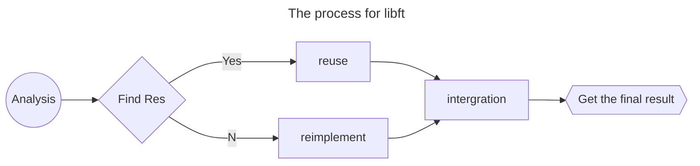

# The libft Project

This is the first project during cursus period. I will record all my processes for doing this project.
## The flowchar for processing



## All the functions
### Part1 ([libc functions](https://man7.org/linux/man-pages/man3/isspace.3.html))
|function name | ft_name |piscine project | External Function | 
| ---  | --- | --- | --- |
|isalpha| ft_isalpha | C02/ex02 | None |
|isdigit| ft_isdigit | C02/ex03 | None |
|isalnum| ft_isalnum | - | None |
|isascii| ft_isascii |     | None |
|isprint| ft_isprint | C02/ex06 | None |
|strlen | ft_strlen  | C04/ex00 | None |
|memset | ft_memset  | - | None |
|bzero  | ft_bzero   | - | None |
|memcpy | ft_memcpy  | - | None |
|memmove| ft_memmove | - | None |
|strlcpy| ft_strlcpy | C02/ex10 | None |
|strlcat| ft_strlcat | C03/ex02 | None |
|toupper| ft_toupper | C02/ex05 | None |
|tolower| ft_tolower | C02/ex04 | None |
|strchr | ft_strchr  | - | None |
|strrchr| ft_strrchr | - | None |
|strncmp| ft_strncmp | C03/ex01 | None |
|memchr | ft_memchr  | - | None |
|memcmp | ft_memcmp  | - | None |
|strnstr| ft_strnstr | - | None |
|atoi   | ft_atoi    | C04/ex03 | None |
|calloc | ft_calloc  | - | malloc |
|strdup | ft_strdup  | C07/ex00 | malloc |


### Part2 (Additional functions)
|ft_name | prototype| 
| --- | --- |
| ft_substr  | char *ft_substr(char const *s, unsigned int start, size_t len); | 
| ft_strjoin | char *ft_strjoin(char const *s1, char const *s2); |
| ft_strtrim | char *ft_strtrim(char const *s1, char const *set); |
| ft_split   | char **ft_split(char const *s, char c); |
| ft_itoa    | char *ft_itoa(int n); |
| ft_strmapi | char *ft_strmapi(char const *s, char (*f)(unsigned int, char)); |
| ft_striteri   | void ft_striteri(char *s, void (*f)(unsigned int, char*)); |
| ft_putchar_fd | void ft_putchar_fd(char c, int fd); |
| ft_putstr_fd  | void ft_putstr_fd(char *s, int fd); |
| ft_putendl_fd | void ft_putendl_fd(char *s, int fd); |
| ft_putnbr_fd  | void ft_putnbr_fd(int n, int fd); |


### Part3 (Additional functions)
Functions to manipulate memory and strings is very useful. But you will soon discover
that manipulating lists is even more useful.
You have to use the following structure to represent a node of your list. Add its declaration to your `libft.h` file:
The members of the t_list struct are:
- content: The data contained in the node.
  `void *` allows to store any kind of data.
  `next`: The address of the next node, or NULL if the next node is the last one.

In your Makefile, add a make **bonus rule** to add the bonus functions to your libft.a.
```c
typedef struct s_list
{
    void *content;
    struct s_list *next;
}
```

|ft_name | prototype| 
| --- | --- |
| ft_lstnew | t_list *ft_lstnew(void *content); | 
| ft_lstadd_front | void ft_lstadd_front(t_list **lst, t_list *new); |
| ft_lstsize | int ft_lstsize(t_list *lst); |
| ft_lstlast | t_list *ft_lstlast(t_list *lst); |  |
| ft_lstadd_back | void ft_lstadd_back(t_list **lst, t_list *new); |
| ft_lstdelone | void ft_lstdelone(t_list *lst, void (*del)(void*)); |
| ft_lstclear | void ft_lstclear(t_list **lst, void (*del)(void*)); |
| ft_lstiter | void ft_lstiter(t_list *lst, void (*f)(void *)); |
| ft_lstmap | t_list *ft_lstmap(t_list *lst, void *(*f)(void *), void (*del)(void *)); |


## Other key requirements
| Requriement | Desc|
| -- | :-- |
| **Program name** | libft.a |
| **Turn in files** | Makefile, libft.h, ft_*.c |
| **Makefile** | NAME, all, clean, fclean, re |
| **Description** | Write your own library: a collection of functions that will be a useful tool for your cursus. |

- All heap allocated memory space must be properly freed when necessary. No leaks will be tolerated.
- If the subject requires it, you must submit a `Makefile` which will compile your source files to the required output with the flags `-Wall, -Wextra` and `-Werror`, use `cc`, and your `Makefile` must **not relink**.
- Your Makefile must at least contain the rules $(NAME), all, clean, fclean and
re.
- To turn in bonuses to your project, you must include a rule `bonus` to your Makefile, which will add all the various headers, librairies or functions that are forbidden on the main part of the project. Bonuses must be in a different `file _bonus.{c/h}` if the subject does not specify anything else. Mandatory and bonus part evaluation is done separately.
- If your project allows you to use your `libft`, you must copy its sources and its associated Makefile in a libft folder with its associated Makefile. Your project’s Makefile must compile the library by using its Makefile, then compile the project.
- Your `libft.a` has to be created at the **root of your repository**.
- You must use the command `ar` to create your library. Using the libtool command is forbidden.
- Turning in unused files is forbidden
- Place all your files at the <span style="color:orange">root of your repository</span>.
- Declaring global variables is forbidden.


## Implementation

There are three parts for the projects, the three parts will be split into three modules.
- **libft.h** : contains all functions
- **ft_part1.c** : implement all functions in part 1
- **ft_part2.c** : implement all functions in part 2
- **ft_bonus.c** : implement all functions in bonus part


