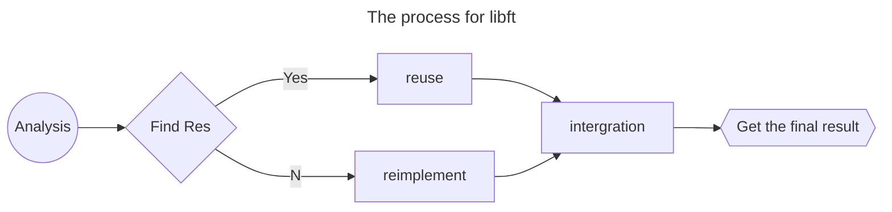

# The libft Project

This is the first project during cursus period. I will record all my processes for doing this project.

<PDF url="/data/42adelaide/libft.pdf" ratio="1.4" />


## The flowchar for processing



## All the functions
### Part1 ([libc functions](https://man7.org/linux/man-pages/man3/isspace.3.html))
|function name | ft_name |piscine project | External Function | file | prototype | desc |
| ---  | --- | --- | ---  | --- | :--- | :-- | 
|isalpha| ft_isalpha | C02/ex02 | None | ft_ctype.c | int isalpha(int c); | test whether the ascii code is for alphabet |
|isdigit| ft_isdigit | C02/ex03 | None | ft_ctype.c | int isdigit(int c); | test whether the ascii code is for digit |
|isalnum| ft_isalnum | - | None | ft_ctype.c | int isalnum(int c); | equals to (isalpha() or isdigit ()) |
|isascii| ft_isascii |     | None | ft_ctype.c | int isascii(int c) | test whether the code is an ascii code |
|isprint| ft_isprint | C02/ex06 | None | ft_ctype.c | int isprint(int c); | test whether the character is printable|
|strlen | ft_strlen  | C04/ex00 | None | ft_string_1.c | size_t strlen(const char *s) | test the length of string s <string.h>|
|memset | ft_memset  | - | None | ft_string_1.c | void *memset(void *b, int c, size_t len);| writes len bytes of value c(converted to an unsigned char to the string b) <string.h>|
|bzero  | ft_bzero   | - | None | ft_string_1.c | void bzero(void *s, size_t n);| writes n zeroed bytes to the string s. <strings.h>|
|memcpy | ft_memcpy  | - | None | ft_string_1.c | void *memcpy(void *restrict dst, const void *restrict src, size_t n)| copy n bytes from src to dst|
|memmove| ft_memmove | - | None | ft_string_1.c | void *memmove(void *dst, const void *src, size_t len);| copy len bytes from string src to dst.|
|strlcpy| ft_strlcpy | C02/ex10 | None | ft_string_2.c | size_t strlcpy(char * restrict dst, const char * restrict src, size_t dstsize);| copy up to dstsize-1 characters from src to dst, NUL-terminateing the result if dstsize is not 0.|
|strlcat| ft_strlcat | C03/ex02 | None | ft_string_2.c | size_t strlcpy(char * restrict dst, const char * restrict src, size_t dstsize);| append src to the end of dst.|
|toupper| ft_toupper | C02/ex05 | None | ft_string_2.c | int toupper(int c);| convert lower case to upper case|
|tolower| ft_tolower | C02/ex04 | None | ft_string_2.c | int tolower(int c);| convert upper case to lower case|
|strchr | ft_strchr  | - | None | ft_string_2.c | char *strchr(const char *s, int c);| locate the first occurrence of c(convert to a char)|
|strrchr| ft_strrchr | - | None | ft_string_3.c | char *strchr(const char *s, int c);| locate the last occurrence of c(conver to a char)|
|strncmp| ft_strncmp | C03/ex01 | None | ft_string_3.c | int strncmp(const char *s1, const char *s2, size_t n| compare the two strings at most lenght of n|
|memchr | ft_memchr  | - | None | ft_string_3.c | void *memchr(const void *s, int c, size_t n);| locates the first occurrence of c(convert to an unsigned char)|
|memcmp | ft_memcmp  | - | None | ft_string_3.c | int memcmp(const void *s1, const void *s2, size_t n);| compares types string s1 aganst byte s2, return the difference if different|
|strnstr| ft_strnstr | - | None | ft_string_3.c | char *strnstr(const char *haystack, const char *needle, size_t len);| find the first occurrence of the null-terminated string needle|
|atoi   | ft_atoi    | C04/ex03 | None | ft_stdlib.c | int atoi(const char *str);| <stdlib.h>|
|calloc | ft_calloc  | - | malloc | ft_stdlib.c | void calloc(size_t count, size_t size);| contiguously alocates enough space for count objects that  are size bytes of memory each|
|strdup | ft_strdup  | C07/ex00 | malloc | ft_stdlib.c | char *strdup(const char *s1);| allocates sufficient memory for a copy of string s1|


### Part2 (Additional functions)
|ft_name | prototype| 
| --- | --- |
| ft_substr  | char *ft_substr(char const *s, unsigned int start, size_t len); | 
| ft_strjoin | char *ft_strjoin(char const *s1, char const *s2); |
| ft_strtrim | char *ft_strtrim(char const *s1, char const *set); |
| ft_split   | char **ft_split(char const *s, char c); |
| ft_itoa    | char *ft_itoa(int n); |
| ft_strmapi | char *ft_strmapi(char const *s, char (*f)(unsigned int, char)); |
| ft_striteri   | void ft_striteri(char *s, void (*f)(unsigned int, char*)); |
| ft_putchar_fd | void ft_putchar_fd(char c, int fd); |
| ft_putstr_fd  | void ft_putstr_fd(char *s, int fd); |
| ft_putendl_fd | void ft_putendl_fd(char *s, int fd); |
| ft_putnbr_fd  | void ft_putnbr_fd(int n, int fd); |


### Part3 (Additional functions)
Functions to manipulate memory and strings is very useful. But you will soon discover
that manipulating lists is even more useful.
You have to use the following structure to represent a node of your list. Add its declaration to your `libft.h` file:
The members of the t_list struct are:
- content: The data contained in the node.
  `void *` allows to store any kind of data.
  `next`: The address of the next node, or NULL if the next node is the last one.

In your Makefile, add a make **bonus rule** to add the bonus functions to your libft.a.
```c
typedef struct s_list
{
    void *content;
    struct s_list *next;
}
```

|ft_name | prototype| 
| --- | --- |
| ft_lstnew | t_list *ft_lstnew(void *content); | 
| ft_lstadd_front | void ft_lstadd_front(t_list **lst, t_list *new); |
| ft_lstsize | int ft_lstsize(t_list *lst); |
| ft_lstlast | t_list *ft_lstlast(t_list *lst); |  |
| ft_lstadd_back | void ft_lstadd_back(t_list **lst, t_list *new); |
| ft_lstdelone | void ft_lstdelone(t_list *lst, void (*del)(void*)); |
| ft_lstclear | void ft_lstclear(t_list **lst, void (*del)(void*)); |
| ft_lstiter | void ft_lstiter(t_list *lst, void (*f)(void *)); |
| ft_lstmap | t_list *ft_lstmap(t_list *lst, void *(*f)(void *), void (*del)(void *)); |


## Other key requirements
| Requriement | Desc|
| -- | :-- |
| **Program name** | libft.a |
| **Turn in files** | Makefile, libft.h, ft_*.c |
| **Makefile** | NAME, all, clean, fclean, re |
| **Description** | Write your own library: a collection of functions that will be a useful tool for your cursus. |

- All heap allocated memory space must be properly freed when necessary. No leaks will be tolerated.
- If the subject requires it, you must submit a `Makefile` which will compile your source files to the required output with the flags `-Wall, -Wextra` and `-Werror`, use `cc`, and your `Makefile` must **not relink**.
- Your Makefile must at least contain the rules $(NAME), all, clean, fclean and
re.
- To turn in bonuses to your project, you must include a rule `bonus` to your Makefile, which will add all the various headers, librairies or functions that are forbidden on the main part of the project. Bonuses must be in a different `file _bonus.{c/h}` if the subject does not specify anything else. Mandatory and bonus part evaluation is done separately.
- If your project allows you to use your `libft`, you must copy its sources and its associated Makefile in a libft folder with its associated Makefile. Your project’s Makefile must compile the library by using its Makefile, then compile the project.
- Your `libft.a` has to be created at the **root of your repository**.
- You must use the command `ar` to create your library. Using the libtool command is forbidden.
- Turning in unused files is forbidden
- Place all your files at the <span style="color:orange">root of your repository</span>.
- Declaring global variables is forbidden.


## Implementation

There are three parts for the projects, the three parts will be split into three modules.
- **libft.h** : contains all functions
- **ft_part1.c** : implement all functions in part 1
  - All the functions for this part come from three parts, which are 
    - ctype, string and stdlib
    - there are five functions come from ctype
    - there are fifteen functions come from string*
    - there are three functions come from stdlib
    - so all the functions will be splited into 4 c files, where are `ft_ctype.c`, `ft_string_1.c`, `ft_string_2.c`, `ft_string_3.c` and `ft_stdlib.c`
- **ft_part2.c** : implement all functions in part 2
- **ft_bonus.c** : implement all functions in bonus part

### code:ft_ctype.c
::: code-tabs#ft_ctype.c
@tab ft_isalpha
```cpp
int	ft_isalpha(int c)
{
	unsigned char	ch;

	ch = (unsigned char)c;
	if ((ch >= 'A' && ch <= 'Z') || (ch >= 'a' && ch <= 'z'))
		return (1);
	return (0);
}
```
@tab ft_isdigit
```cpp
int	ft_isdigit(int c)
{
	unsigned char	ch;

	ch = (unsigned char)c;
	if (ch >= '0' && ch <= '9')
		return (1);
	return (0);
}
```

@tab ft_isalnum
```cpp
int	ft_isalnum(int c)
{
	return (ft_isalpha(c) || ft_isdigit(c));
}
```
@tab ft_isascii
```cpp
int	ft_isascii(int c)
{
	if (c >= 0 && c <= 127)
	{
		return (1);
	}
	return (0);
}
```
@tab ft_isprint
```cpp
int	ft_isprint(int c)
{
	if (c > 31 && c < 127)
	{
		return (1);
	}
	return (0);
}
```
:::

### code:ft_string_1.c
::: code-tabs#ft_string_1.c
@tab ft_strlen
```cpp
size_t	ft_strlen(const char *s)
{
	size_t	rc;

	rc = 0;
	while (*(s ++) != 0)
		rc ++;
	return (rc);
}
```
@tab ft_memset
```cpp

void	*ft_memset(void *b, int c, size_t len)
{
	size_t			idx;
	unsigned char	*dst;

	if (len <= 0)
		return (b);
	dst = (unsigned char *)b;
	idx = 0;
	while (idx < len)
		*(dst + (idx ++)) = (unsigned char)c;
	return (b);
}

```

@tab ft_bzero
```cpp
void	ft_bzero(void *s, size_t n)
{
	size_t	idx;
	char	*dst;

	if (n <= 0)
		return ;
	ft_memset(s, 0, n);
}

```
@tab ft_memcpy
```cpp
void	*ft_memcpy(void *restrict dst, const void *restrict src, size_t n)
{
	size_t			idx;
	unsigned char	*udst;
	unsigned char	*usrc;

	udst = (unsigned char *)dst;
	usrc = (unsigned char *)src;
	idx = 0;
	while (idx < n)
	{
		*(udst + idx) = *(usrc + idx);
		idx ++;
	}
	return (dst);
}

```
@tab ft_memmove
```cpp
void	*ft_memmove(void *dst, const void *src, size_t len)
{
	size_t			idx;
	size_t			step;
	unsigned char	*cdst;
	unsigned char	*csrc;

	cdst = (unsigned char *)dst;
	csrc = (unsigned char *)src;
	idx = 0;
	step = 1;
	if (cdst > csrc)
	{
		step = -1;
		idx = len -1;
	}
	while (idx < len && idx >= 0)
	{
		*(cdst + idx) = *(csrc + idx);
		idx += step;
	}
	return (dst);
}
```
:::

### code:ft_string_2.c
::: code-tabs#ft_string_2.c
@tab ft_strlcpy
```cpp
size_t	ft_strlcpy(char *restrict dst, const char *restrict src, size_t dstsize)
{
	size_t	idx;
	size_t	src_len;

	if (dstsize <= 0)
		return (0);
	idx = 0;
	src_len = ft_strlen(src);
	while (idx < dstsize -1)
	{
		if (idx <= src_len)
			*(dst + idx) = *(src + idx);
		else
			*(dst + idx) = 0;
		idx ++;
	}
	*(dst + idx) = 0;
	return (ft_strlen(src));
}

```
@tab ft_strlcat
```cpp
size_t	ft_strlcat(
		char *restrict dst,
		const char *restrict src,
		size_t dstsize)
{
	size_t	dstr_size;
	size_t	src_size;
	size_t	ret;

	dstr_size = ft_strlen(dst);
	src_size = ft_strlen(src);

	if (dstsize <= dstr_size)
		ret = (src_size + dstsize);
	else
	{
		ft_memcpy(dst + dstr_size, src, dstsize-dstr_size);
		*(dst + dstsize - 1) = 0;
		ret = (src_size + dstr_size);
	}
	return (ret);
}

```

@tab ft_toupper
```cpp
int	ft_toupper(int c)
{
	if (c >= 'a' && c <= 'z')
		return (c - 32);
	return (c);
}
```
@tab ft_tolower
```cpp

int	ft_tolower(int c)
{
	if (c >= 'A' && c <= 'Z')
		return (c + 32);
	return (c);
}
```
@tab ft_strchr
```cpp

char	*ft_strchr(const char *s, int c)
{
	char	ele;
	char	*rc;

	ele = (char)c;
	rc = (char *)s;
	while (*s)
	{
		if (*rc == c)
			return (rc);
		rc ++;
	}
	return (NULL);
}
```
:::


### code:ft_string_3.c
::: code-tabs#ft_string_3.c
@tab ft_strlen
```cpp
char	*ft_strrchr(const char *s, int c)
{
	char	ele;
	char	*rc;

	rc = NULL;
	ele = (char) c;
	while (*s)
	{
		if (*s == c)
			rc = (char *)s;
		s ++;
	}
	return (rc);
}
```
@tab ft_memset
```cpp

int	ft_strncmp(const char *s1, const char*s2, size_t n)
{
	size_t	idx;

	idx = 0;
	while (*s1 && *s2 && idx < n)
	{
		if (*(s1 + idx) != *(s2 + idx))
			break ;
		idx ++;
	}
	if (idx == n)
		idx --;
	return (*(s1 + idx) - *(s2 + idx));
}

```

@tab ft_bzero
```cpp
void	*ft_memchr(const void *s, int c, size_t n)
{
	unsigned char	*src;
	size_t			idx;

	idx = 0;
	src = (unsigned char *) s;
	while (idx < n)
	{
		if (*(src + idx) == c)
			return (src + idx);
		idx ++;
	}
	return (NULL);
}

```
@tab ft_memcpy
```cpp
int	ft_memcmp(const void *s1, const void *s2, size_t n)
{
	unsigned char	*us1;
	unsigned char	*us2;
	size_t			idx;

	us1 = (unsigned char *)s1;
	us2 = (unsigned char *)s2;
	idx = 0;
	while (idx < n)
	{
		if (*(us1 + idx) != *(us2 + idx))
			return (*(us1 + idx) - *(us2 + idx));
		idx ++;
	}
	return (0);
}

```
@tab ft_memmove
```cpp
char	*ft_strnstr(const char *haystack, const char *needle, size_t len)
{
	const char	*src;
	size_t		len_needle;
	size_t		idx;

	src = haystack;
	len_needle = ft_strlen(needle);
	idx = 0;
	if (len < len_needle)
		return (NULL);
	while (*(src + idx) && idx <= (len - len_needle))
	{
		if (0 == strncmp(src + idx, needle, len_needle))
			return ((char *)(src + idx));
		idx ++;
	}
	return (NULL);
}
```
:::


### code:ft_stdlib.c
::: code-tabs#ft_stdlib.c
@tab ft_atoi
```cpp
int	ft_atoi(char *str)
{
	int	ret;
	int	factor;

	ret = 0;
	factor = 1;
	while ('\t' == *str || ' ' == *str || '\n' == *str
		|| '\v' == *str || '\f' == *str || '\r' == *str)
		str ++;
	if ('-' == *str || '+' == *str)
	{
		if ('-' == *str)
			factor = -factor;
		str ++;
	}
	while ('\0' != *str)
	{
		if ('0' <= *str && '9' >= *str)
		{
			ret = (ret * 10 + (*str - '0'));
		}
		else
			break ;
		str ++;
	}
	return (ret * factor);
}

```
@tab ft_calloc
```cpp
void	*ft_calloc(size_t count, size_t size)
{
	return (malloc(count * size));
}
```

@tab ft_strdup
```cpp
char	*ft_strdup(const char *s1)
{
	int		i;
	char	*ret;

	if (NULL == s1)
		return (NULL);
	i = 0;
	while (*(s1 + i))
		i ++;
	ret = malloc(i + 1);
	i = 0;
	while (*(s1 + i))
	{
		*(ret + i) = *(s1 + i);
		i ++;
	}
	*(ret + i) = '\0';
	return (ret);
}
```
:::


### Part1 test code
:::details
```cpp
#include "libft.h"
#include <stdio.h>
#include <ctype.h>
#include <stdlib.h>
#include <string.h>

void	output_ret(char *name, int rc)
{
	if (rc)
		printf("%s passed\n", name);
	else
		printf("%s failed\n", name);
}

void	test_ctype(char *name, int (*a)(int), int (*b)(int))
{
	int	rc;
	
	rc = 1;
	for (int i=-128; i< 128; i++)
		rc &= (a(i) == b(i));
	output_ret(name, rc);
}

//int		ft_isalpha(int c);
void	test_isalpha()
{
	test_ctype("isalpha", ft_isalpha, isalpha);
}

//int		ft_isdigit(int c);
void	test_isdigit()
{
	test_ctype("isdigit", ft_isdigit, isdigit);
}
//int		ft_isalnum(int c);
void	test_isalnum()
{
	test_ctype("isalnum", ft_isalnum, isalnum);
}
//int		ft_isascii(int c);
void	test_isascii()
{
	test_ctype("isascii", ft_isascii, isascii);
}
//int		ft_isprint(int c);
void	test_isprint()
{
	test_ctype("isprint", ft_isprint, isprint);
}


//size_t	ft_strlen(const char *s);
void	test_strlen()
{
	int	rc;
	
	rc = 1;
	rc &= (strlen("") == ft_strlen(""));
	rc &= (strlen("i") == ft_strlen("i"));
	rc &= (strlen("abc") == ft_strlen("abc"));
	rc &= (strlen("abcd") == ft_strlen("abcd"));
	output_ret("strlen", rc);
}
//void	*ft_memset(void *b, int c, size_t len);
void test_memset()
{
	char b[100];
	char a[100];
	int	rc;

	//printf("memset a[49]:%d a[50]:%d a[51]:%d \n", a[49], a[50], a[51]);
	//printf("memset b[49]:%d b[50]:%d b[51]:%d \n", b[49], b[50], b[51]);
	rc = 1;
	ft_memset(a, 0, 100);
	memset(b, 0, 100);
	rc &= (ft_strlen(a) == ft_strlen(b));
	//printf("memset a[49]:%d a[50]:%d a[51]:%d \n", a[49], a[50], a[51]);
	//printf("memset b[49]:%d b[50]:%d b[51]:%d \n", b[49], b[50], b[51]);
	
	ft_memset(a, 'A', 50);
	memset(b, 'A', 50);
	//printf("memset a[49]:%d a[50]:%d a[51]:%d \n", a[49], a[50], a[51]);
	//printf("memset b[49]:%d b[50]:%d b[51]:%d \n", b[49], b[50], b[51]);
	rc &= (ft_strlen(a) == ft_strlen(b));
	output_ret("memset", rc);
}
//void	ft_bzero(void *s, size_t n);
void	test_bzero()
{
	char a[100];
	char b[100];

	int rc;

	rc = 1;

	ft_memset(a, 'A', 10);
	ft_memset(b, 'A', 10);
	for (int i = 0; i< 10; i++)
		rc &= (a[i] == b[i]);
	
	bzero(a, 2);
	ft_bzero(b, 2);
	for (int i = 0; i< 2; i++)
		rc &= (a[i] == b[i]);

	//printf("%d %d %d\n", a[0], a[1], a[2]);
	//printf("%d %d %d\n", b[0], b[1], b[2]);

	output_ret("bzero", rc);
}
//void	*ft_memcpy(void *restrict dst, const void *restrict src, size_t n);
void	test_memcpy()
{
	int rc;
	char a[100];
	char c[100];
	char b[100] = "I'm the world";

	ft_memset(a, 0, 100);
	ft_memset(c, 0, 100);
	rc = 1;

	int count = 10;
	ft_memcpy(a, b, count);
	ft_memcpy(c, b, count);
	for (int i = 0; i<count; i++)
		rc &= (a[i] == c[i]);
	output_ret("memcpy", rc);
}
//void	*ft_memmove(void *dst, const void *src, size_t len);
void	test_memmove()
{
	char a[100] = "0123456789";

	memmove(a + 2, a, 5);
	//memmove(a, a + 3, 5);
	printf("%s   %s\n", a, a + 3);
}

//size_t	ft_strlcpy(
//			char *restrict dst,
//			const char *restrict src,
//			size_t dstsize);
void	test_strlcpy()
{
	printf("----------strlcpy-----------\n");
	char a[100] = "I'm the world!";
	char b[100];

	ft_memset(b, 'A', 100);
	int ret = ft_strlcpy(b, a, 20);
	printf("%s %d\n", b, ret);

	ft_memset(b, 'A', 100);
	ret = strlcpy(b, a, 20);
	printf("%s %d\n", b, ret);
	printf("----------end: strlcpy-----------\n");
}
//size_t	ft_strlcat(
//			char *restrict dst,
//			const char *restrict src,
//			size_t dstsize);
int test(size_t dstsize)
{
	char a[100] = "0123456789abd";
	char c[100] = "0123456789abd";
	char b[100] = "0123456789abcde";

	int ret = 1;
	ft_memset(a + ft_strlen(a), 0, 100 - ft_strlen(a));
	ft_memset(b + ft_strlen(b), 0, 100 - ft_strlen(b));
	int size   =    strlcat(a, b, dstsize);
	int sizeft = ft_strlcat(c, b, dstsize);

	ret = (size == sizeft);
	//printf("dstsize: %ld   cat: %d  ft_cat:%d  \n", dstsize, size, sizeft);
	ret &= (0 == memcmp(a, c, size));
	return (ret);
}
void	test_strlcat()
{
	int rc = 1;
	for (int i = 0; i<100; i+= 5){
		rc &= test(i);
	}
	output_ret("strlcat", rc);
}
//int		ft_toupper(int c);
void	test_toupper()
{
	int rc = 1;
	for (int i = 0; i< 128; i++)
		rc &= (ft_toupper(i) == toupper(i));
	output_ret("toupper", rc);
}
//int		ft_tolower(int c);
void	test_tolower()
{
	int rc = 1;
	for (int i = 0; i< 128; i++)
		rc &= (ft_tolower(i) == tolower(i));
	output_ret("tolower", rc);
}
//char	*ft_strchr(const char *s, int c);;
void	test_strchr()
{
	int rc = 1;
	char str[] = "abcdefghi";

	for (char a = 'A'; a <= 'z'; a++)
		rc &= (ft_strchr(str, a) == strchr(str, a));
	output_ret("strchr", rc);
}
//char	*ft_strrchr(const char *s, int c);;
void	test_strrchr()
{
	int rc = 1;
	char str[] = "abcdefghi";

	for (char a = 'A'; a <= 'z'; a++)
		rc &= (ft_strrchr(str, a) == strrchr(str, a));
	output_ret("strrchr", rc);
}
//int		ft_strncmp(const char *s1, const char*s2, size_t n);
int ncmp(const char *s1, const char* s2, size_t n)
{
	int ret1 = ft_strncmp(s1, s2, n);
	int ret2 =    strncmp(s1, s2, n);
	//printf("size: %ld   ft_ret:%d  ret:%d  s1:%s  s2:%s\n", n, ret1, ret2, s1, s2);
	return (ret1 == ret2);
}
void	test_strncmp()
{	
	int rc = 1;
	rc &= ncmp("", "", 1);
	rc &= ncmp("abc", "abc", 0);
	rc &= ncmp("abc", "abc", 3);
	rc &= ncmp("ab", "abc", 2);
	rc &= ncmp("ab", "abc", 3);
	rc &= ncmp("ab", "cd", 1);
	//rc &= (ft_strncmp("", "", 1) == strncmp("", "", 1));
	//rc &= (ft_strncmp("abc", "abc", 0) == strncmp("abc", "abc", 0));
	//rc &= (ft_strncmp("ab", "abc", 2) == strncmp("ab", "abc", 2));
	//rc &= (ft_strncmp("ab", "abc", 3) == strncmp("ab", "abc", 3));
	//rc &= (ft_strncmp("ab", "cd", 1) == strncmp("ab", "cd", 1));
	output_ret("strcmp", rc);
}
//void	*ft_memchr(const void *s, int c, size_t n);
void	test_memchr()
{
	int rc = 1;
	unsigned char ret[] = {1,2,3,4,5,6,-1};
	for (int i = 0; i<128; i++)
	{
		rc &= (ft_memchr((void *)ret, i, 7) == memchr((void *) ret, i, 7));
		//ft_memchr((void*)ret, i, 7);
	}
	output_ret("memchr", rc);
}
//int		ft_memcmp(const void *s1, const void *s2, size_t n);
void		test_memcmp()
{
	int rc = 1;
	unsigned char ret[] = {1,2,3,4,5,6,-1};
	unsigned char ret1[] = {1,2,3,7,5,6,-1};
	for (int i = 0; i<7; i++)
	{
		rc &= (ft_memcmp((void *)ret, ret1, 7) == memcmp((void *) ret, ret1, 7));
	}
	output_ret("memcmp", rc);
}
//char	*ft_strnstr(const char *haystack, const char *needle, size_t len);
void	test_strnstr()
{
	int rc = 1;
	char stack[] = "12345678900";
	char substr[] = "89";

	for (int i = 1; i < 11; i++)
	{
		char * ret1 = ft_strnstr(stack, substr, i);
		char * ret2 = strnstr(stack, substr, i);
		printf("stack: %s substr:%s  len:%d    ft_ret:%s   ret:%s\n", stack, substr, i, ret1, ret2);
		rc &= ( ret1 == ret2);
	}
	output_ret("strnstr", rc);
}

//int		ft_atoi(char *str);
int	t_atoi(char *s1)
{
	int ftret = ft_atoi(s1);
	int ret = atoi(s1);

	//printf("%s   fret:%d   ret:%d\n", s1, ftret, ret);
	return (ftret == ret);
}
void	test_atoi()
{
	int	rc;

	rc = 1;
	rc &= t_atoi("-1");
	rc &= t_atoi("\t\f -1");
	rc &= t_atoi("--1");
	rc &= t_atoi("1000");
	rc &= t_atoi("-1000");
	rc &= t_atoi("+1");
	rc &= t_atoi("+11");
	rc &= t_atoi("+ 1");
	output_ret("atoi", rc);
}


//void	*ft_calloc(size_t count, size_t size);
void	test_calloc()
{
	char *s = ft_calloc(10, 10);
	char *d = calloc(10, 10);

	ft_memset(s, 0, 100);
	ft_memset(d, 0, 100);

	ft_memset(s, 'A', 99);
	ft_memset(d, 'A', 99);

	output_ret("calloc", 0 == ft_memcmp(s, d, 100));
}
//char	*ft_strdup(const char *s1);
int	t_strdup(char *str)
{
	return (0 == ft_memcmp(ft_strdup(str), strdup(str), ft_strlen(str)));
}
void	test_strdup()
{
	int ret = 1;
	ret &= t_strdup("");
	ret &= t_strdup("a");
	ret &= t_strdup("1234");
	ret &= t_strdup("aibdfse");
	ret &= t_strdup("afasefs");
	ret &= t_strdup("asfeefef");
	output_ret("strdup", ret);
}

int main(void)
{
	test_isalpha();
	test_isdigit();
	test_isalnum();
	test_isascii();
	test_isprint();
	test_strlen();
	test_memset();
	test_bzero();
	test_memcpy();
	test_memmove();
	test_strlcpy();
	test_strlcat();
	test_toupper();
	test_tolower();
	test_strrchr();
	test_strncmp();
	test_memchr();
	test_memcmp();
	test_strnstr();
	test_atoi();
	test_calloc();
	test_strdup();
}

```
:::