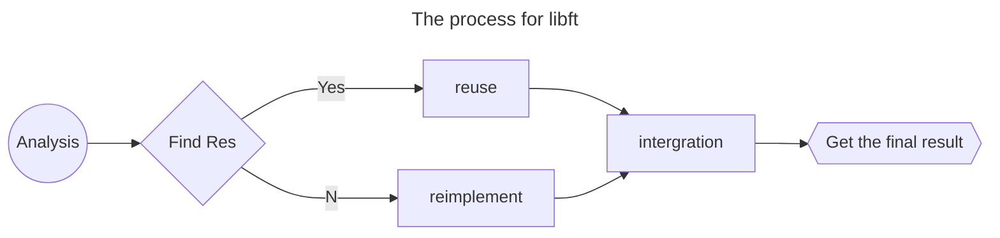

# The libft Project

This is the first project during cursus period. I will record all my processes for doing this project.

<PDF url="/data/42adelaide/libft.pdf" ratio=0.7/>


## The flowchar for processing



## All the functions
### Part1 ([libc functions](https://man7.org/linux/man-pages/man3/isspace.3.html))
|function name | ft_name |piscine project | External Function | file | prototype | desc |
| ---  | --- | --- | ---  | --- | :--- | :-- | 
|isalpha| ft_isalpha | C02/ex02 | None | ft_ctype.c | int isalpha(int c); | test whether the ascii code is for alphabet |
|isdigit| ft_isdigit | C02/ex03 | None | ft_ctype.c | int isdigit(int c); | test whether the ascii code is for digit |
|isalnum| ft_isalnum | - | None | ft_ctype.c | int isalnum(int c); | equals to (isalpha() or isdigit ()) |
|isascii| ft_isascii |     | None | ft_ctype.c | int isascii(int c) | test whether the code is an ascii code |
|isprint| ft_isprint | C02/ex06 | None | ft_ctype.c | int isprint(int c); | test whether the character is printable|
|strlen | ft_strlen  | C04/ex00 | None | ft_string_1.c | size_t strlen(const char *s) | test the length of string s <string.h>|
|memset | ft_memset  | - | None | ft_string_1.c | void *memset(void *b, int c, size_t len);| writes len bytes of value c(converted to an unsigned char to the string b) <string.h>|
|bzero  | ft_bzero   | - | None | ft_string_1.c | void bzero(void *s, size_t n);| writes n zeroed bytes to the string s. <strings.h>|
|memcpy | ft_memcpy  | - | None | ft_string_1.c | void *memcpy(void *restrict dst, const void *restrict src, size_t n)| copy n bytes from src to dst|
|memmove| ft_memmove | - | None | ft_string_1.c | void *memmove(void *dst, const void *src, size_t len);| copy len bytes from string src to dst.|
|strlcpy| ft_strlcpy | C02/ex10 | None | ft_string_2.c | size_t strlcpy(char * restrict dst, const char * restrict src, size_t dstsize);| copy up to dstsize-1 characters from src to dst, NUL-terminateing the result if dstsize is not 0.|
|strlcat| ft_strlcat | C03/ex02 | None | ft_string_2.c | size_t strlcpy(char * restrict dst, const char * restrict src, size_t dstsize);| append src to the end of dst.|
|toupper| ft_toupper | C02/ex05 | None | ft_string_2.c | int toupper(int c);| convert lower case to upper case|
|tolower| ft_tolower | C02/ex04 | None | ft_string_2.c | int tolower(int c);| convert upper case to lower case|
|strchr | ft_strchr  | - | None | ft_string_2.c | char *strchr(const char *s, int c);| locate the first occurrence of c(convert to a char)|
|strrchr| ft_strrchr | - | None | ft_string_3.c | char *strchr(const char *s, int c);| locate the last occurrence of c(conver to a char)|
|strncmp| ft_strncmp | C03/ex01 | None | ft_string_3.c | int strncmp(const char *s1, const char *s2, size_t n| compare the two strings at most lenght of n|
|memchr | ft_memchr  | - | None | ft_string_3.c | void *memchr(const void *s, int c, size_t n);| locates the first occurrence of c(convert to an unsigned char)|
|memcmp | ft_memcmp  | - | None | ft_string_3.c | int memcmp(const void *s1, const void *s2, size_t n);| compares types string s1 aganst byte s2, return the difference if different|
|strnstr| ft_strnstr | - | None | ft_string_3.c | char *strnstr(const char *haystack, const char *needle, size_t len);| find the first occurrence of the null-terminated string needle|
|atoi   | ft_atoi    | C04/ex03 | None | ft_stdlib.c | int atoi(const char *str);| <stdlib.h>|
|calloc | ft_calloc  | - | malloc | ft_stdlib.c | void calloc(size_t count, size_t size);| contiguously alocates enough space for count objects that  are size bytes of memory each|
|strdup | ft_strdup  | C07/ex00 | malloc | ft_stdlib.c | char *strdup(const char *s1);| allocates sufficient memory for a copy of string s1|


### Part2 (Additional functions)
|ft_name | prototype| 
| --- | --- |
| ft_substr  | char *ft_substr(char const *s, unsigned int start, size_t len); | 
| ft_strjoin | char *ft_strjoin(char const *s1, char const *s2); |
| ft_strtrim | char *ft_strtrim(char const *s1, char const *set); |
| ft_split   | char **ft_split(char const *s, char c); |
| ft_itoa    | char *ft_itoa(int n); |
| ft_strmapi | char *ft_strmapi(char const *s, char (*f)(unsigned int, char)); |
| ft_striteri   | void ft_striteri(char *s, void (*f)(unsigned int, char*)); |
| ft_putchar_fd | void ft_putchar_fd(char c, int fd); |
| ft_putstr_fd  | void ft_putstr_fd(char *s, int fd); |
| ft_putendl_fd | void ft_putendl_fd(char *s, int fd); |
| ft_putnbr_fd  | void ft_putnbr_fd(int n, int fd); |


### Part3 (Additional functions)
Functions to manipulate memory and strings is very useful. But you will soon discover
that manipulating lists is even more useful.
You have to use the following structure to represent a node of your list. Add its declaration to your `libft.h` file:
The members of the t_list struct are:
- content: The data contained in the node.
  `void *` allows to store any kind of data.
  `next`: The address of the next node, or NULL if the next node is the last one.

In your Makefile, add a make **bonus rule** to add the bonus functions to your libft.a.
```c
typedef struct s_list
{
    void *content;
    struct s_list *next;
}
```

|ft_name | prototype| 
| --- | --- |
| ft_lstnew | t_list *ft_lstnew(void *content); | 
| ft_lstadd_front | void ft_lstadd_front(t_list **lst, t_list *new); |
| ft_lstsize | int ft_lstsize(t_list *lst); |
| ft_lstlast | t_list *ft_lstlast(t_list *lst); |  |
| ft_lstadd_back | void ft_lstadd_back(t_list **lst, t_list *new); |
| ft_lstdelone | void ft_lstdelone(t_list *lst, void (*del)(void*)); |
| ft_lstclear | void ft_lstclear(t_list **lst, void (*del)(void*)); |
| ft_lstiter | void ft_lstiter(t_list *lst, void (*f)(void *)); |
| ft_lstmap | t_list *ft_lstmap(t_list *lst, void *(*f)(void *), void (*del)(void *)); |


## Other key requirements
| Requriement | Desc|
| -- | :-- |
| **Program name** | libft.a |
| **Turn in files** | Makefile, libft.h, ft_*.c |
| **Makefile** | NAME, all, clean, fclean, re |
| **Description** | Write your own library: a collection of functions that will be a useful tool for your cursus. |

- All heap allocated memory space must be properly freed when necessary. No leaks will be tolerated.
- If the subject requires it, you must submit a `Makefile` which will compile your source files to the required output with the flags `-Wall, -Wextra` and `-Werror`, use `cc`, and your `Makefile` must **not relink**.
- Your Makefile must at least contain the rules $(NAME), all, clean, fclean and
re.
- To turn in bonuses to your project, you must include a rule `bonus` to your Makefile, which will add all the various headers, librairies or functions that are forbidden on the main part of the project. Bonuses must be in a different `file _bonus.{c/h}` if the subject does not specify anything else. Mandatory and bonus part evaluation is done separately.
- If your project allows you to use your `libft`, you must copy its sources and its associated Makefile in a libft folder with its associated Makefile. Your project’s Makefile must compile the library by using its Makefile, then compile the project.
- Your `libft.a` has to be created at the **root of your repository**.
- You must use the command `ar` to create your library. Using the libtool command is forbidden.
- Turning in unused files is forbidden
- Place all your files at the <span style="color:orange">root of your repository</span>.
- Declaring global variables is forbidden.


## Implementation

There are three parts for the projects, the three parts will be split into three modules.
- **libft.h** : contains all functions
- **ft_part1.c** : implement all functions in part 1
  - All the functions for this part come from three parts, which are 
    - ctype, string and stdlib
    - there are five functions come from ctype
    - there are fifteen functions come from string*
    - there are three functions come from stdlib
    - so all the functions will be splited into 4 c files, where are `ft_ctype.c`, `ft_string_1.c`, `ft_string_2.c`, `ft_string_3.c` and `ft_stdlib.c`
- **ft_part2.c** : implement all functions in part 2
- **ft_bonus.c** : implement all functions in bonus part


