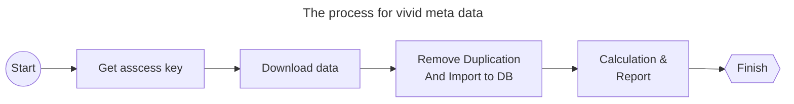
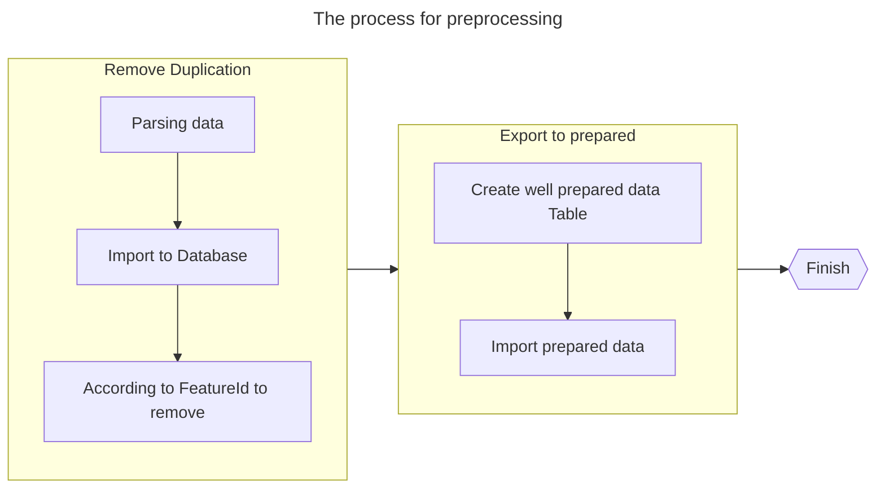

[Connection Pool for Postgresql using python](https://pynative.com/psycopg2-python-postgresql-connection-pooling/#:~:text=PostgreSQL%20connection%20Pool%20is%20nothing,application%20while%20working%20with%20PostgreSQL.)
## The whole process



## Get the Key
Details refer to your own account

## Download data

### Analysis
Using WFS client for viewing the layers first. Details refer the picture below


According to the picture above, there are 9 layers totally. The meaning for each layers is listed below.

| layer | Meaning |
| -- | -- |
| BasicFeature | - |
| CollectedContent | - |
| FinishedFeature | - |
| ImageInMosaicFeature | - |
| Maxar Catalog Mosaic Products | The big data zone|
| Maxar Catalog Mosaic Seamlines | vivid masic line, classed by product line, producing line version etc.|
| Maxar Catalog Mosaic Tiles | The block related with vivid product.(irrelevant) |
| StandardFeature | - |
| TileMatrixFeature | - |

According to our needs, all the data related with Mosaic need to be downloaded and analysied.

### Download

#### Crawler code
The data is released via WFS service. A web crawler will be implemented for retriving the data. 

Because of the whole world data is too large to download at the same time. The world need to be splited into several blocks, then we should download the data from according the area of each block.
::: code-tabs
@tab dg_downloader
``` python
import requests as req
import random
import datetime as dt
import sys
import math
import threading
import time
import json
import sys
import os
import gzip
sys.path.append('.')
from tile_util import *
from thread_util import *

class dg_downloader:
    def __init__(self, connectid, type_name, version='2.0.0', format='application%2Fjson'):
        self.base_url = 'https://securewatch.digitalglobe.com'
        self.tile_obj = tile_util()
        self.__connectid__ = connectid
        self.__type_name__ = type_name
        self.__version__   = version
        self.__format__    = format
        
        # 模板参数说明
        # @param connectId the connect id
        # @param type_name layername
        # @param lat_min   the minimum latitude
        # @param lng_min   the minimum longtitude
        # @param lat_max   the maximum latitude
        # @param lng_max   the minimum longtitude
        # @param version   the ogc service version (such as：2.0.0)
        # @param format    the output format，(such as：application/json)
        self.wfs_template = self.base_url + '/catalogservice/wfsaccess?CONNECTID={connectId}&SERVICE=WFS&REQUEST=GetFeature&VERSION={version}&TYPENAMES={type_name}&TYPENAME={type_name}&STARTINDEX=0&COUNT=1000000&SRSNAME=urn:ogc:def:crs:EPSG::4326&BBOX={lat_min},{lng_min},{lat_max},{lng_max},urn:ogc:def:crs:EPSG::4326&outputFormat={format}'

    def __del__(self):
        pass
        
    def downlaod(self, base_tile, target_level, filename):
        '''
        @param base_tile    The base tile()
        @param target_level
        @param filename
        The data is retrived from server block by block. The base_tile will determine a big blog for downloading, the target_level define which level will continue split the base_tile.

        '''
        self._base_tile_ = base_tile
        sub_tiles = self.tile_obj.getWMTSSubTile(base_tile, target_level)
        output_file = {
            'log': open(f'{filename}.geojson', 'w'),
            'locker': threading.Lock()
        }
        
        th_pool = thread_util(10)
        
        for sub_tile in sub_tiles:
            lng_min, lng_max, lat_min, lat_max  = self.tile_obj.getBoundingBox(sub_tile)
            version   = self.__version__
            format    = self.__format__
            type_name = self.__type_name__
            connectId = self.__connectid__
            
            url = eval(f'f"{self.wfs_template}"')
            req_param = sub_tile
            print(url)
            th_pool.process(self.thread_req, (url, req_param, output_file), req_param)
        th_pool.wait()
        with output_file['locker']:
            output_file['log'].close()
        
    def thread_req(self, url, req_param, output_file):
        ret = self.getRespInfo(url, req_param)
        with output_file['locker']:
            output_file['log'].write(f'{ret}\n')
        
    def getRespInfo(self, url, req_param):
        resp = None
        rc = None
        try:
            headers= {}
            resp = req.get(url, headers = headers)
        except Exception as e:
            pass
        finally:
            if resp:
                resp_code = resp.status_code
                if 200 == resp_code:
                    #print(resp.text)
                    content = resp.text
                    #content = gzip.decompress(resp.content).decode()
                    rc = f'{req_param}|{content}'
                resp.close()
        return rc
```
@tab tile_util
``` python
import math

'''
The code of quad
-------
3  |  2
-------
0  |  1
-------
The first layer of the earth will be split into 
| 0 | 1 |


---------------------------------------------------
The code of WMTS will start from the left-top corner.
The zero layer will split into

| 0-0-0 | 0-1-0 |

The first layer 
| 1-0-0 | 1-1-0 | 1-2-0 | 1-3-0 |
---------------------------------
| 1-0-1 | 1-1-1 | 1-2-1 | 1-3-1 |
'''
class tile_util:
    def __getGeojsonTemplate__(self, name):
        return {
            "type": "FeatureCollection",
            "name": name,
            "crs": {
                "type": "name",
                "properties": {
                    "name": "urn:ogc:def:crs:OGC:1.3:CRS84"
                }
            },
            "features": []
        }
    
    def Quad2WMTS(self, quad):
        tilew = 360/(2**len(quad))
        centerx = 0
        centery = 0
        for i in range(len(quad)):
            tilew = 360/(2**(i+1))
            if i == 0:
                if quad[i] == '0':
                    centerx = -90
                    centery = 0
                else:
                    centerx = 90
                    centery = 0
            else:
                if quad[i] == '0':
                    centerx -= tilew/2
                    centery -= tilew/2
                if quad[i] == '1':
                    centerx += tilew/2
                    centery -= tilew/2
                if quad[i] == '2':
                    centerx += tilew/2
                    centery += tilew/2
                if quad[i] == '3':
                    centerx -= tilew/2
                    centery += tilew/2
        wmtsl = len(quad)-1
        wmts_tilew = 180/(2**wmtsl)
        #print(centerx, centery, wmts_tilew)
        tilex = math.floor((centerx+180)/wmts_tilew)
        tiley = math.floor(-(centery-90)/wmts_tilew)
        return wmtsl, tilex, tiley
    
    # Get the sub block list of quad until the specified level
    def getWMTSSubTile(self, quad, level):
        rc = list()
        if len(quad) < level-1:
            rc.extend(self.getWMTSSubTile(quad+'0', level))
            rc.extend(self.getWMTSSubTile(quad+'1', level))
            rc.extend(self.getWMTSSubTile(quad+'2', level))
            rc.extend(self.getWMTSSubTile(quad+'3', level))
            return rc
        else:
            return [quad + '0', quad + '1', quad + '2', quad + '3', ]
    
    # Get the quad number on specified level according to latitude and longtitude.
    def getTileQuad(self, lng, lat, level):
        minx = -180
        maxx = 180
        miny = -90
        maxy = 90
        
        centerx = 0
        centery = 0
        tilew = 180
        ret = ''
        for l in range(level):
            if l <= 0:
                if lng <= 0:
                    centerx = -90
                    centery = 0
                    ret += '0'
                else:
                    centerx = 90
                    centery = 0
                    ret += '1'
            else:
                if lng < centerx and lat < centery:
                    ret += '0'
                    centerx -= tilew/2
                    centery -= tilew/2
                elif lng > centerx and lat < centery:
                    ret += '1'
                    centerx += tilew/2
                    centery -= tilew/2
                elif lng > centerx and lat > centery:
                    ret += '2'
                    centerx += tilew/2
                    centery += tilew/2
                else:
                    ret += '3'
                    centerx -= tilew/2
                    centery += tilew/2
            tilew /= 2
        return ret
    
    def getBoundingBox(self, quad):
        '''
        Get the bounding box of quad block
        '''
        l, x, y = self.Quad2WMTS(quad)
        tilew  = 180/(2**l)
        maxx = x*tilew + tilew - 180
        minx = x*tilew + 0 -180
        maxy = 90 - (y*tilew + 0)
        miny = 90 - (y*tilew + tilew)
        return minx, maxx, miny, maxy 
    
    def getGeojson(self, quad, targetLevel = None):
        '''
        Get the geojson of quad if the targetLevel is not specified.
        Get the geojson for all sub block until targetLevel regard as quad as a base block
        '''
        rc = None
        if targetLevel:
            rc = self.__getGeojsonTemplate__(f'{quad}-{targetLevel}')
            subs = self.getWMTSSubTile(quad, targetLevel)
            for i in subs:
                rc['features'].append(self.__getFeatureJson__(i))
        else:
            rc = self.__getGeojsonTemplate__(f'{quad}')
            rc['features'].append(self.__getFeatureJson__(quad))
        return rc
    
    def __getFeatureJson__(self, quad):
        '''
        Get the geojson of quad
        '''
        ret = {
                "type": "Feature",
                "properties": dict(),
                "geometry": {
                    "type": "Polygon",
                    "coordinates": list()
                }
            }
        minx, maxx, miny, maxy  = self.getBoundingBox(quad)
        ret['geometry']['coordinates'].append( [[minx, miny], [minx, maxy], [maxx, maxy], [maxx, miny], [minx, miny]])
        ret['properties']['quad'] = quad
        ret['properties']['wmts'] = self.Quad2WMTS(quad)
        return ret
```

@tab thread_util
``` python
import threading

class thread_util:
    def __init__(self, thread_max = 20):
        self.__thread_pool__ = list()
        self.__thread_max__ = 1
        if thread_max:
            self.__thread_max__ = thread_max
    
    def process(self, target, args, name):
        th = threading.Thread(target=target, args=args, name= name)
        self.__thread_pool__.append(th)
        th.start()
        self.__update_thread__()
    
    def wait(self):
        self.__update_thread__(1)
    
    def __update_thread__(self, count = None):
        c = self.__thread_max__
        if count:
            c = count
        while len(self.__thread_pool__) >= c:
            dead_pool = []
            for th in self.__thread_pool__:
                if not th.is_alive():
                    dead_pool.append(th)
            for item in dead_pool:
                self.__thread_pool__.remove(item)
            #time.sleep(0.1)
```
:::

#### Retrive data

::: code-tabs
@tab retrive data
``` python
# DigitalGlobe:FinishedFeature              ：-
# DigitalGlobe:BasicFeature                 ：-
# DigitalGlobe:CollectedContent             ：-
# DigitalGlobe:ImageInMosaicFeature         ：-
# DigitalGlobe:MaxarCatalogMosaicProducts   ：Product area（such as：VIVID_AS33_20Q4）
# DigitalGlobe:MaxarCatalogMosaicSeamlines  ：seamlines for vivid
# DigitalGlobe:MaxarCatalogMosaicTiles      ：- 
# DigitalGlobe:StandardFeature              ：unable load  504
# DigitalGlobe:TileMatrixFeature            ：unable load  500
if __name__ == '__main__':
    connect_id = ''      #use your own connect_id
    type_name  = 'DigitalGlobe:MaxarCatalogMosaicTiles'   #图层名称
    
    tile_obj = tile_util()                
    #quad = tile_obj.getTileQuad(116, 39, 8)
    quad = '0'
    target_l = 9
    dg_dobj = dg_downloader(connect_id, type_name)
    dg_dobj.downlaod(quad, target_l, 'MaxarCatalogMosaicTiles')
```

@tab tile_util sample
``` python
with open('D:\\aa.geojson', 'w') as fw:
    fw.write(json.dumps(tile_obj.getGeojson('0', 2)))
```
:::


### Parse data
There are several properties for each feature of the retrieved data from the server. Two things need to be done for preprocessing before usage. 
- The first one is to remove the duplication and 
- the second one is to export all prepared data to postgis.

#### Remove Duplication


::: code-tabs
@tab Parsing data to sql
``` python
import os
import sys
import argparse
import json

class MaxarCatalogMosaicProducts_Parser:
    def __init__(self, tbl = None):
        self.__tbl__ = 'MaxarCatalogMosaicProducts'
        if tbl:
            self.__tbl__ = tbl
        
        # Template arguments
        # obj['quad']               the data related download tile
        # obj['id']                 feature id
        # obj['product_name']       
        # obj['product_line_name']
        # obj['collect_date_min']
        # obj['collect_date_max']
        # obj['product_id']
        # obj['publish_date']
        # obj['resolution_meters']
        # obj['geom']
        self.__insert_template_prefix__ = f'insert into {self.__tbl__}(quad, id, product_name, product_line_name, collect_date_min, collect_date_max, product_id, publish_date, resolution_meters, geom)'
        self.__insert_template_suffix__ = "values('{obj['quad']}', '{obj['id']}', '{obj['product_name']}', '{obj['product_line_name']}', '{obj['collect_date_min']}', '{obj['collect_date_max']}', '{obj['product_id']}', '{obj['publish_date']}', {obj['resolution_meters']}, {obj['geom']});"
        self.__insert_template__ = f'{self.__insert_template_prefix__} {self.__insert_template_suffix__}'
        
    def getSql(self, quad, feature):
        obj = feature['properties']
        obj['quad'] = quad
        obj['id'] = feature['id']
        obj['geom'] = f"ST_GeomFromGeoJSON('{json.dumps(feature['geometry'])}')"
        #sql = eval(f'f"{self.__insert_template__}"')
        
        __insert_template_prefix__ = f'insert into {self.__tbl__}('
        __insert_template_suffix__ = "values("
        for k in obj.keys():
            __insert_template_prefix__ = f'{__insert_template_prefix__}{k},'
            if obj[k] is not None:
                if k == 'geom':
                    __insert_template_suffix__ = f"{__insert_template_suffix__}{obj[k]},"
                else:
                    __insert_template_suffix__ = f"{__insert_template_suffix__}'{obj[k]}',"
            else:
                __insert_template_suffix__ = f"{__insert_template_suffix__}null,"
        sql = f'{__insert_template_prefix__[:-1]}) {__insert_template_suffix__[:-1]});'
        return sql
```

@tab Parsing Executable
``` python
if __name__ == '__main__':
    filename = sys.argv[1]
    tbl = sys.argv[2]
    mosaic_product = MaxarCatalogMosaicProducts_Parser(tbl)
    with open(filename, 'r') as fr:
        line = fr.readline()
        is_break = False
        while len(line) > 0:
            quad, geojson = line.split('|')
            json_obj = json.loads(geojson)
            
            for f in json_obj['features']:
                sql = mosaic_product.getSql(quad, f)
                print(sql)
            line = fr.readline()
```

@tab Parsing example
``` bat
: parsing the data file
python  main.py ..\1-MaxarCatalogMosaicSeamlines.geojson MosaicSeamlines > 1-Mosaicseamlines.sql

: init db
initdb -D .\pgdata -Upostgres -Upostgres

```


@tab Create table in postgresql
``` sql 
-- create postgis extension in postgresql
create extension postgis;

create table MaxarCatalogMosaicTiles(
    quad varchar,
    id varchar,
    product_id varchar,
    tile_identifier varchar,
    cloud_cover_percentage varchar,
    geom geometry
);

create table MaxarCatalogMosaicSeamlines(
    quad varchar,
    id varchar,
    inventory_id varchar,
    tile_identifier varchar,
    image_identifier varchar,
    off_nadir_angle float,
    cloud_cover float,
    sun_elevation float,
    accuracy float,
    vehicle_id varchar,
    collect_date timestamp,
    product_id varchar,
    product_line_name varchar,
    geom geometry
);
create table MaxarCatalogMosaicProducts(
    quad varchar,
    id varchar,
    product_name varchar, 
    product_line_name varchar, 
    collect_date_min varchar, 
    collect_date_max varchar, 
    product_id varchar, 
    publish_date timestamp, 
    resolution_meters float,
    geom geometry
);
```


@tab pg_conn
``` python
#导入数据库驱动
import sqlite3
import json
import os
import shutil
import psycopg2
import time
import threading
import traceback
import datetime as dt
#from tile_conf import *


class pg_conn:
    #_instance_lock = threading.Lock()
    def __init__(self, pg_conf):
        self.pg_conf = pg_conf
        for i in range(pg_conf['max_conn']):
            self.db_pool = list()
            db_node = {
                'locker': threading.Lock(),
                'conn': psycopg2.connect(
                    database= pg_conf['db_info']['database'], 
                    user    = pg_conf['db_info']['user'], 
                    password= pg_conf['db_info']['password'], 
                    host    = pg_conf['db_info']['host'], 
                    port    = pg_conf['db_info']['port']
                ),
                'invoke_time':dt.datetime.now()
            }
            self.db_pool.append(db_node)
    
    def get_tbl(self):
        rc = None
        if hasattr(self, 'pg_conf'):
            if self.pg_conf.__contains__('db_info'):
                rc = self.pg_conf['db_info']['tbl']
        return rc
    #def __new__(cls, *args, **kwargs):
    #    if not hasattr(pg_conn, "_instance"):
    #        with pg_conn._instance_lock:
    #            if not hasattr(pg_conn, "_instance"):
    #                pg_conn._instance = object.__new__(cls) 
    #    return pg_conn._instance
        
    def getDBNode(self):
        rc = None
        while rc is None:
            for i in self.db_pool:
                if not i['locker'].locked():
                    rc = i
        return rc
    
    def __del__(self):
        for i in self.db_pool:
            with i['locker']:
                i['conn'].close()

    #查询信息
    def __query__(self, sql):
        pg_node = self.getDBNode()
        valid = 0
        ret = None
        with pg_node['locker']:
            idx_c = pg_node['conn'].cursor()
            try:
                idx_c.execute(sql)
                ret = idx_c.fetchall()
                pg_node['conn'].commit()
                pg_node['invoke_time'] = dt.datetime.now()
            finally:
                if idx_c:
                    idx_c.close()
        return ret

    #执行非查询sql
    def __execute__(self, sqls):
        sqls_data = list()
        if type(sqls) == type(str()):
            sqls_data.append(sqls)
        elif type(sqls) == type(tuple()) or type(sqls) == type(list()):
            sqls_data.extend(sqls)
        pg_node = self.getDBNode()
        with pg_node['locker']: 
            idx_c = pg_node['conn'].cursor()   # 创建游标
            try:
                for sql in sqls_data:
                    idx_c.execute(sql)
                t = dt.datetime.now() 
                # 距上次调用相差10s，进行数据提交(暂时弃用)
                #if (t-self.db_info['invoke_time']).total_seconds() > 10:
                #    self.db_info['db_conn'].commit()
                #    self.db_info['invoke_time'] = t
                pg_node['conn'].commit()
            finally:
                if idx_c:
                    idx_c.close()
```

@tab Export to PG
``` python
import sys
sys.path.append('.')

from meta_pg import *
from thread_util import *

task_pg_conf = {
    'db_info':{
        'database': 'postgres',
        'user'    : 'postgres',
        'password': '1234',
        'host'    : '127.0.0.1',
        'port'    : '5432',
        'tbl'     : 'Mosaicseamlines'
    },
    'max_conn': 10
}

pg_pool = pg_conn(task_pg_conf)
thread_pool = thread_util(10)

files = [r'..\parser\0-Mosaicseamlines.sql', r'..\parser\1-Mosaicseamlines.sql']
i = 0
for file in files:
    with open(file, 'r') as fr:
        line = fr.readline()
        #print(line)
        sqls = list()
        while len(line) > 0:
            i += 1
            sqls.append(line)
            if len(sqls) >= 1000:
                print(f'{file}: {i}')
                thread_pool.process(pg_pool.__execute__, (sqls,), str(i))
                sqls.clear()
            line = fr.readline()
        if len(sqls) > 0:
            print(f'{file}: {i}')
            thread_pool.process(pg_pool.__execute__, (sqls,), str(i))
thread_pool.wait()

# cd F:\01.workspace\06.work\srs\sql2db & F: & F:\temp\python37_withgdal\Python37\python.exe sql2pg.py
```

@tab Remove Duplication
``` sql
-- copy table structure
create table mosaicseamlines_unique as select * from mosaicseamlines limit 0;

-- insert unique id
insert into mosaicseamlines_unique(id) as select distinct id from mosaicseamlines;

-- update other features based on id
update mosaicseamlines_unique set 
    quad = a.quad,
    inventory_id = a.quad,
    tile_identifier = a.tile_identifier,
    image_identifier = a.image_identifier,
    off_nadir_angle = a.off_nadir_angle,
    cloud_cover = a.cloud_cover,
    sun_elevation = a.sun_elevation,
    accuracy = a.accuracy,
    vehicle_id = a.vehicle_id,
    collect_date = a.collect_date,
    product_id = a.product_id,
    product_line_name = a.product_line_name, 
    geom = a.geom
  from mosaicseamlines
  where id = a.id;

```
:::


