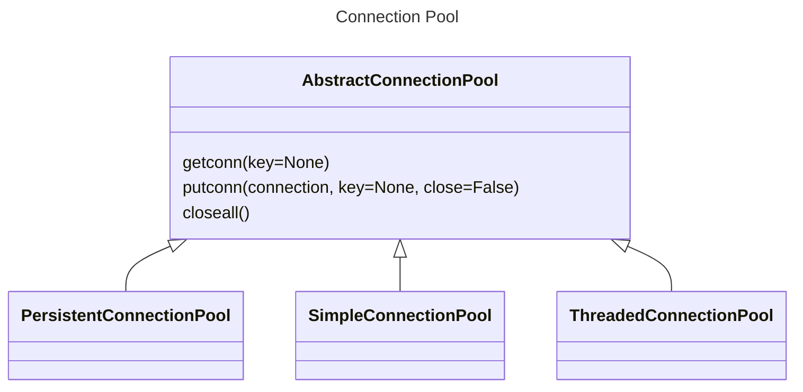

## The class diagram for connection pool

## Explaination
- **SimpleConnectionPool**: This class is suitable only for single-threaded applications. i.e., If we create a connection pool using this class, then we can’t share this across different threads. So use this class to manage the connection pool only when you have a single-threaded application.
- **ThreadedConnectionPool**: As the name suggests, this class used in a multithreaded environment. i.e., the connection pool created using this class can be shared between multiple threads.
- **PersistentConnectionPool**: This class is used in the multithread application, where a pool assigns persistent connections to different threads. As the name suggests, each thread gets a single connection from the pool, i.e., the thread can’t use more than one connection from the pool.


## Examples
::: code-tabs
@tab SimpleConnectionPool
``` python
import psycopg2
from psycopg2 import pool

try:
    postgreSQL_pool = psycopg2.pool.SimpleConnectionPool(1, 20, user="postgres",
                                                         password="pass@#29",
                                                         host="127.0.0.1",
                                                         port="5432",
                                                         database="postgres_db")
    if (postgreSQL_pool):
        print("Connection pool created successfully")

    # Use getconn() to Get Connection from connection pool
    ps_connection = postgreSQL_pool.getconn()

    if (ps_connection):
        print("successfully recived connection from connection pool ")
        ps_cursor = ps_connection.cursor()
        ps_cursor.execute("select * from mobile")
        mobile_records = ps_cursor.fetchall()

        print("Displaying rows from mobile table")
        for row in mobile_records:
            print(row)

        ps_cursor.close()

        # Use this method to release the connection object and send back to connection pool
        postgreSQL_pool.putconn(ps_connection)
        print("Put away a PostgreSQL connection")

except (Exception, psycopg2.DatabaseError) as error:
    print("Error while connecting to PostgreSQL", error)

finally:
    # closing database connection.
    # use closeall() method to close all the active connection if you want to turn of the application
    if postgreSQL_pool:
        postgreSQL_pool.closeall
    print("PostgreSQL connection pool is closed")
```

@tab ThreadedConnectionPool 
``` python
import psycopg2
from psycopg2 import pool

try:
    threaded_postgreSQL_pool = psycopg2.pool.ThreadedConnectionPool(5, 20, user="postgres",
                                                                    password="pass@#29",
                                                                    host="127.0.0.1",
                                                                    port="5432",
                                                                    database="postgres_db")
    if (threaded_postgreSQL_pool):
        print("Connection pool created successfully using ThreadedConnectionPool")

    # Use getconn() method to Get Connection from connection pool
    ps_connection = threaded_postgreSQL_pool.getconn()

    if (ps_connection):

        print("successfully recived connection from connection pool ")
        ps_cursor = ps_connection.cursor()
        ps_cursor.execute("select * from mobile")
        mobile_records = ps_cursor.fetchmany(2)

        print("Displaying rows from mobile table")
        for row in mobile_records:
            print(row)

        ps_cursor.close()

        # Use this method to release the connection object and send back ti connection pool
        threaded_postgreSQL_pool.putconn(ps_connection)
        print("Put away a PostgreSQL connection")

except (Exception, psycopg2.DatabaseError) as error:
    print("Error while connecting to PostgreSQL", error)

finally:
    # closing database connection.
    # use closeall() method to close all the active connection if you want to turn of the application
    if threaded_postgreSQL_pool:
        threaded_postgreSQL_pool.closeall
    print("Threaded PostgreSQL connection pool is closed")
```
:::


## References
https://pynative.com/psycopg2-python-postgresql-connection-pooling/
